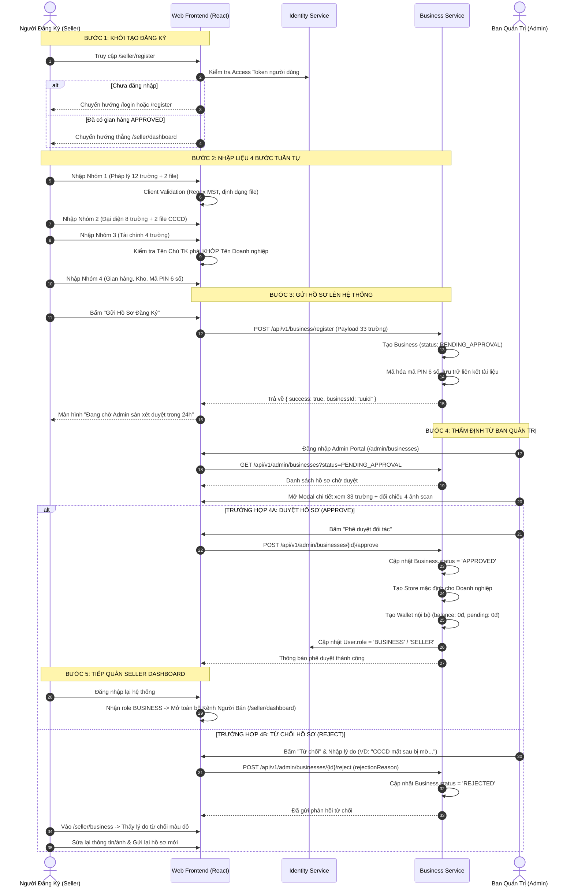

# TÀI LIỆU ĐẶC TẢ CHI TIẾT NGHIỆP VỤ - LUỒNG 1
## ĐĂNG KÝ & THẨM ĐỊNH HỒ SƠ DOANH NGHIỆP (SELLER ONBOARDING & KYC 33 TRƯỜNG)

---

## I. MỤC TIÊU & PHẠM VI NGHIỆP VỤ
* **Mục tiêu**: Thiết lập quy trình chuẩn hóa giúp các Nhà xuất bản (NXB), Công ty phát hành sách và Hộ kinh doanh đăng ký mở gian hàng chính thức trên sàn Huki Ebook; đồng thời cung cấp công cụ thẩm định pháp lý cho Ban quản trị Sàn (Admin) trước khi cấp quyền kinh doanh.
* **Các bên tham gia (Actors)**:
  1. **Người đăng ký (Seller / Business Applicant)**: Đại diện pháp lý hoặc quản trị viên được ủy quyền của doanh nghiệp.
  2. **Ban quản trị Sàn (Platform Admin)**: Chuyên viên thẩm định pháp lý và phê duyệt hồ sơ đối tác.
  3. **Hệ thống Backend (Microservices)**: `identity-service`, `business-service`, `commerce-service`.

---

## II. BẢNG CHI TIẾT 33 TRƯỜNG DỮ LIỆU ĐỊNH DANH (KYC DATA SCHEMA)

Hồ sơ đăng ký được phân chia nghiêm ngặt thành **4 nhóm thông tin** gồm **33 trường dữ liệu**:

```
                               HỒ SƠ KYC DOANH NGHIỆP (33 TRƯỜNG)
                                               │
      ┌────────────────────────┬───────────────┴────────────────┬────────────────────────┐
      ▼                        ▼                                ▼                        ▼
NHÓM 1: PHÁP LÝ          NHÓM 2: ĐẠI DIỆN                 NHÓM 3: TÀI CHÍNH        NHÓM 4: GIAN HÀNG & BẢO MẬT
 (12 trường + 2 file)     (8 trường + 2 file)              (4 trường)               (5 trường)
```

### 1. NHÓM 1: THÔNG TIN ĐỊNH DANH & PHÁP LÝ DOANH NGHIỆP (14 Mục)
| STT | Tên Trường Dữ Liệu | Mã Trường (Field Key) | Kiểu Dữ Liệu | Ràng Buộc (Validation Rules) | Ví Dụ Mẫu |
|:---:|---|---|---|---|---|
| 1 | Mã số thuế / MST | `tax_code` | String (10-13 số) | Bắt buộc, kiểm tra Regex MST Việt Nam | `0318926412` |
| 2 | Tên pháp nhân đầy đủ | `company_name` | String | Bắt buộc, in hoa theo Giấy phép ĐKKD | `CÔNG TY TNHH PHÁT HÀNH SÁCH VÀ NỘI DUNG SỐ TRÍ TUỆ VIỆT` |
| 3 | Tên quốc tế (Tiếng Anh) | `international_name` | String | Không bắt buộc, ký tự Latinh | `VIET INTELLECT DIGITAL CONTENT AND BOOK PUBLISHING CO., LTD` |
| 4 | Tên viết tắt thương hiệu | `short_name` | String | Không bắt buộc | `TRÍ TUỆ VIỆT BOOKS` |
| 5 | Số Giấy chứng nhận ĐKKD | `business_license_number` | String | Bắt buộc, thường trùng MST hoặc số GP | `0318926412` |
| 6 | Ngày cấp giấy phép | `issue_date` | Date (YYYY-MM-DD) | Bắt buộc, không được lớn hơn ngày hiện tại | `2021-04-15` |
| 7 | Nơi cấp / Cơ quan cấp | `issue_place` | String | Bắt buộc | `Sở Kế hoạch và Đầu tư TP. Hồ Chí Minh` |
| 8 | Loại hình doanh nghiệp | `business_type` | Enum | Bắt buộc (`LLC`, `CORPORATION`, `INDIVIDUAL`, `PARTNERSHIP`) | `LLC` (Công ty TNHH) |
| 9 | Địa chỉ trụ sở chính | `registered_address` | String | Bắt buộc, địa chỉ theo ĐKKD | `Tầng 6, Tòa nhà Văn phòng Tri Thức, 45 Lê Duẩn, Phường Bến Nghé, Quận 1, TP.HCM` |
| 10 | Email nhận thông báo thuế | `email` | String (Email) | Bắt buộc, đúng định dạng RFC 5322 | `contact@trituevietbooks.vn` |
| 11 | Hotline CSKH / Vận hành | `phone` | String (10 số) | Bắt buộc, đầu số viễn thông Việt Nam | `19008866` / `0908123456` |
| 12 | Website chính thức | `website` | String (URL) | Không bắt buộc | `https://trituevietbooks.vn` |
| 13 | File Giấy phép ĐKKD | `doc_business_license` | File (JPG/PNG/PDF) | Bắt buộc, dung lượng $\le 5\text{MB}$, ảnh rõ nét | File scan bản gốc |
| 14 | File Giấy phép Xuất bản | `doc_publishing_permit` | File (JPG/PNG/PDF) | Bắt buộc đối với NXB/Công ty phát hành sách | File scan giấy phép phát hành xuất bản phẩm |

---

### 2. NHÓM 2: NGƯỜI ĐẠI DIỆN THEO PHÁP LUẬT (10 Mục)
| STT | Tên Trường Dữ Liệu | Mã Trường (Field Key) | Kiểu Dữ Liệu | Ràng Buộc (Validation Rules) | Ví Dụ Mẫu |
|:---:|---|---|---|---|---|
| 15 | Họ và tên người đại diện | `rep_full_name` | String | Bắt buộc, in hoa không dấu hoặc có dấu chuẩn | `HUỲNH GIA HUY` |
| 16 | Chức vụ đảm nhiệm | `rep_position` | String | Bắt buộc (Giám đốc, Tổng giám đốc, Chủ hộ...) | `Giám Đốc Điều Hành` |
| 17 | Số CCCD / Hộ chiếu | `rep_id_card_number` | String (12 số) | Bắt buộc, chuẩn 12 số CCCD gắn chip | `079098012345` |
| 18 | Ngày cấp CCCD | `rep_id_card_issue_date` | Date (YYYY-MM-DD) | Bắt buộc | `2022-08-10` |
| 19 | Nơi cấp CCCD | `rep_id_card_issue_place`| String | Bắt buộc | `Cục Cảnh sát QLHC về TTXH` |
| 20 | Số điện thoại đại diện | `rep_phone` | String (10 số) | Bắt buộc | `0908123456` |
| 21 | Email cá nhân đại diện | `rep_email` | String (Email) | Bắt buộc | `rep.huy@trituevietbooks.vn` |
| 22 | Địa chỉ thường trú | `rep_permanent_address` | String | Bắt buộc theo nguyên quán CCCD | `Số 123 Đường Sách, Phường Bến Nghé, Quận 1, TP. Hồ Chí Minh` |
| 23 | File CCCD Mặt trước | `doc_cccd_front` | File (JPG/PNG) | Bắt buộc, thấy rõ 4 góc, rõ số & ảnh chân dung | File ảnh chụp mặt trước |
| 24 | File CCCD Mặt sau | `doc_cccd_back` | File (JPG/PNG) | Bắt buộc, thấy rõ vân tay & mã vạch MRZ | File ảnh chụp mặt sau |

---

### 3. NHÓM 3: THÔNG TIN TÀI CHÍNH & ĐỐI SOÁT DOANH THU (4 Mục)
| STT | Tên Trường Dữ Liệu | Mã Trường (Field Key) | Kiểu Dữ Liệu | Ràng Buộc (Validation Rules) | Ví Dụ Mẫu |
|:---:|---|---|---|---|---|
| 25 | Tên ngân hàng thụ hưởng | `bank_name` | String / Select | Bắt buộc, thuộc danh sách Napas Việt Nam | `Ngân hàng TMCP Ngoại Thương Việt Nam (Vietcombank)` |
| 26 | Chi nhánh ngân hàng | `bank_branch` | String | Bắt buộc | `Chi nhánh Sài Gòn - PGD Bến Nghé` |
| 27 | Số tài khoản ngân hàng | `bank_account_number` | String (8-16 số) | Bắt buộc, chỉ chứa số | `0071001234567` |
| 28 | Tên chủ tài khoản | `bank_account_holder_name` | String | **BẮT BUỘC TRÙNG 100% TÊN PHÁP NHÂN** tại mục 2 | `CONG TY TNHH PHAT HANH SACH VA NOI DUNG SO TRI TUE VIET` |

---

### 4. NHÓM 4: THIẾT LẬP GIAN HÀNG & BẢO MẬT GIAO DỊCH (5 Mục)
| STT | Tên Trường Dữ Liệu | Mã Trường (Field Key) | Kiểu Dữ Liệu | Ràng Buộc (Validation Rules) | Ví Dụ Mẫu |
|:---:|---|---|---|---|---|
| 29 | Tên gian hàng hiển thị | `store_name` | String | Bắt buộc, hiển thị trên Marketplace | `Gian hàng Sách Trí Tuệ Việt Chính Hãng` |
| 30 | Mô tả giới thiệu gian hàng | `store_description` | Text | Bắt buộc, tối thiểu 20 ký tự | `Chuyên phân phối các đầu sách kinh tế, kỹ năng và bản quyền số độc quyền.` |
| 31 | Logo gian hàng | `store_logo` | File (JPG/PNG) | Bắt buộc, tỷ lệ 1:1, dung lượng $\le 2\text{MB}$ | File ảnh avatar shop |
| 32 | Địa chỉ kho lấy hàng | `warehouse_address` | String | Bắt buộc (Số nhà, Phường/Xã, Quận/Huyện, Tỉnh/TP) | `Kho số 1, Cụm Kho Vận Bến Nghé, 45 Lê Duẩn, P. Bến Nghé, Q.1, TP.HCM` |
| 33 | Mã PIN rút tiền bảo mật | `withdrawal_pin` | String (6 số bí mật)| Bắt buộc, mã hóa 1 chiều (BCrypt/Argon2) | `123456` (dùng để xác nhận khi Payout ví) |

---

## III. QUY TRÌNH THỰC HIỆN CHI TIẾT TỪNG BƯỚC (STEP-BY-STEP WORKFLOW)



---

## IV. PHÂN RÃ CHI TIẾT TỪNG GIAI ĐOẠN

### GIAI ĐOẠN 1: KHỞI TẠO & ĐIỀU KIỆN TIÊN QUYẾT (PRE-CONDITIONS)
* **Bước 1.1**: Người dùng truy cập đường dẫn `/seller/register` hoặc bấm nút *"Trở thành Người bán"* trên thanh điều hướng Storefront.
* **Bước 1.2**: Hệ thống kiểm tra trạng thái xác thực:
  * Nếu chưa có tài khoản: Hiển thị form đăng ký tài khoản hoặc đăng nhập nhanh bằng Email/Mật khẩu.
  * Nếu tài khoản đã là `BUSINESS` và hồ sơ đã `APPROVED`: Chuyển hướng ngay sang `/seller/dashboard`.
  * Nếu tài khoản đã nộp hồ sơ và đang ở trạng thái `PENDING_APPROVAL`: Hiển thị màn hình thông báo chờ duyệt kèm nút *"Xem lại hồ sơ đã nộp"*.

---

### GIAI ĐOẠN 2: NHẬP LIỆU & KIỂM TRA TẠI CHỖ (CLIENT VALIDATION)
Quy trình nhập liệu diễn ra qua 4 bước (Step Wizard) trực quan:

#### Bước 2.1: Nhập Nhóm 1 - Thông Tin Doanh Nghiệp & Pháp Lý
* Người dùng điền MST (`tax_code`), Tên pháp nhân (`company_name`), Loại hình, Hotline, Email, Địa chỉ trụ sở.
* Đính kèm 2 tệp: Bản scan Giấy phép ĐKKD và Giấy phép hoạt động xuất bản.
* *Kiểm tra hợp lệ*:
  * MST phải có độ dài từ 10 đến 13 chữ số.
  * Email đúng cấu trúc `abc@domain.com`.
  * File đính kèm phải là định dạng `.png, .jpg, .jpeg, .pdf` và dung lượng $\le 5\text{MB}$.

#### Bước 2.2: Nhập Nhóm 2 - Người Đại Diện Theo Pháp Luật
* Điền Họ tên (`rep_full_name`), Chức vụ, Số CCCD 12 số, Ngày cấp, Nơi cấp, SĐT, Địa chỉ thường trú.
* Đính kèm 2 ảnh: CCCD Mặt trước và CCCD Mặt sau.
* *Kiểm tra hợp lệ*:
  * Số CCCD bắt buộc đúng 12 chữ số.
  * Ngày cấp không được lớn hơn ngày hiện tại.

#### Bước 2.3: Nhập Nhóm 3 - Thông Tin Ngân Hàng & Đối Soát
* Chọn Ngân hàng từ danh sách chọn (Select box), nhập Số tài khoản, Chi nhánh.
* Nhập Tên chủ tài khoản:
  * *Kiểm tra nghiệp vụ sống còn (Anti-Fraud Rule)*: Hệ thống so khớp chuỗi ký tự giữa `bank_account_holder_name` và `company_name`. Nếu tên chủ tài khoản là cá nhân trong khi đăng ký công ty TNHH/Cổ phần → Hệ thống cảnh báo đỏ và yêu cầu nhập tài khoản ngân hàng chính chủ của doanh nghiệp.

#### Bước 2.4: Nhập Nhóm 4 - Thiết Lập Gian Hàng & Mã PIN Rút Tiền
* Nhập Tên gian hàng (`store_name`), Mô tả giới thiệu, Tải lên Logo.
* Nhập Địa chỉ kho lấy hàng (`warehouse_address`): Địa chỉ cụ thể để Shipper đến nhận hàng.
* Thiết lập **Mã PIN bảo mật rút tiền (6 chữ số)**: Nhập 2 lần (Mã PIN và Xác nhận mã PIN) để đảm bảo không bị gõ nhầm.

---

### GIAI ĐOẠN 3: GỬI VÀ LƯU TRỮ HỒ SƠ (SUBMIT & PERSISTENCE)
* **Bước 3.1**: Người dùng bấm nút *"Gửi Hồ Sơ Đăng Ký"*.
* **Bước 3.2**: Frontend đóng gói 33 trường dữ liệu và gửi request `POST /api/v1/business/register` đến `business-service`.
* **Bước 3.3**: Backend thực hiện:
  1. Kiểm tra tính duy nhất (Unique check): `tax_code`, `email`, `phone` không được trùng với bất kỳ doanh nghiệp nào đã được duyệt trong hệ thống.
  2. Băm mật khẩu mã PIN 6 số bằng thuật toán BCrypt trước khi ghi vào Database.
  3. Tạo bản ghi mới trong bảng `businesses` với trạng thái `status = 'PENDING_APPROVAL'`.
  4. Ghi nhận thời gian gửi `createdAt` và khởi tạo lịch sử hồ sơ.
* **Bước 3.4**: Hệ thống hiển thị màn hình thông báo: *"Hồ sơ của bạn đã được gửi thành công và đang được Ban quản trị sàn thẩm định trong vòng 24 giờ làm việc."*

---

### GIAI ĐOẠN 4: BAN QUẢN TRỊ THẨM ĐỊNH (ADMIN REVIEW & VERIFICATION)
* **Bước 4.1**: Quản trị viên sàn đăng nhập tài khoản có role `PLATFORM_ADMIN`, truy cập menu **Xét Duyệt Đối Tác** → **Quản Lý & Duyệt Doanh Nghiệp** (`/admin/businesses`).
* **Bước 4.2**: Bấm vào tab *"Chờ Xét Duyệt (PENDING_APPROVAL)"* → Danh sách các hồ sơ mới hiển thị đầy đủ thời gian nộp, tên doanh nghiệp, MST.
* **Bước 4.3**: Bấm nút *"Xem Chi Tiết Hồ Sơ (33 Trường)"*:
  * Modal chi tiết mở lên, hiển thị toàn bộ 4 nhóm thông tin.
  * Admin bấm xem trực tiếp ảnh phóng to của Giấy phép ĐKKD, Giấy phép xuất bản và 2 mặt thẻ CCCD.
* **Bước 4.4**: Thực hiện quyết định thẩm định:

#### 🔹 TRƯỜNG HỢP 4A: PHÊ DUYỆT HỒ SƠ (APPROVE)
1. Admin bấm nút xanh **"Phê Duyệt Doanh Nghiệp"**.
2. Hệ thống thực hiện chuỗi giao dịch Database (Transaction):
   * Cập nhật `businesses.status = 'APPROVED'`.
   * Tạo tự động một bản ghi `stores` (Gian hàng mặc định) liên kết với `business_id` vừa tạo.
   * Tạo tự động một bản ghi `business_wallets` (Ví tài chính đối soát) với `available_balance = 0` và `pending_balance = 0`.
   * Gọi liên dịch vụ sang `identity-service` cập nhật `users.role = 'BUSINESS'` (hoặc `SELLER`).
3. Gửi thông báo thành công về màn hình Admin.

#### 🔸 TRƯỜNG HỢP 4B: TỪ CHỐI HỒ SƠ (REJECT)
1. Admin bấm nút đỏ **"Từ Chối Hồ Sơ"**.
2. Một hộp thoại popup mở ra, Admin bắt buộc phải nhập **Lý do từ chối cụ thể** (Ví dụ: *"Ảnh chụp CCCD mặt sau bị lóa sáng không đọc được mã vạch; Tên chủ tài khoản ngân hàng không trùng khớp với tên trên Giấy phép ĐKKD"*).
3. Bấm *"Xác nhận từ chối"*:
   * Hệ thống cập nhật `businesses.status = 'REJECTED'`.
   * Lưu lý do vào trường `rejection_reason`.
   * Gửi thông báo phản hồi về tài khoản người đăng ký.

---

### GIAI ĐOẠN 5: TIẾP QUẢN & BÀN GIAO KÊNH NGƯỜI BÁN (POST-ONBOARDING)
* **Bước 5.1 (Nếu được duyệt)**:
  * Người dùng đăng nhập vào hệ thống Huki Ebook.
  * Hệ thống nhận diện role `BUSINESS` → Tự động kích hoạt toàn bộ menu Kênh Người Bán trên Sidebar.
  * Người bán có toàn quyền truy cập: Bảng điều khiển (`/seller/dashboard`), Đăng bán sách (`/seller/products`), Hồ sơ doanh nghiệp (`/seller/business`), Ví tài chính (`/seller/finance`).
* **Bước 5.2 (Nếu bị từ chối)**:
  * Người dùng vào trang `/seller/business` → Nhận thông báo màu đỏ hiển thị rõ lý do từ chối từ Ban quản trị.
  * Người dùng bấm nút *"Chỉnh sửa & Nộp lại"* để bổ sung lại tài liệu/thông tin chuẩn xác và gửi lại quy trình thẩm định.

---

## V. MA TRẬN KIỂM THỬ NGHIỆP VỤ (TEST CASES MATRIX)

| Mã Test Case | Kịch Bản Kiểm Thử | Dữ Liệu Đầu Vào (Input Data) | Kết Quả Kỳ Vọng (Expected Result) | Trạng Thái |
|:---:|---|---|---|:---:|
| **TC_KYC_01** | Đăng ký thành công với đầy đủ 33 trường hợp lệ | MST: `0318926412`<br>Tên: `CÔNG TY TNHH PHÁT HÀNH SÁCH VÀ NỘI DUNG SỐ TRÍ TUỆ VIỆT`<br>Đầy đủ 4 ảnh scan rõ nét, STK chính chủ, PIN 6 số. | Hồ sơ tạo thành công, status `PENDING_APPROVAL`, hiển thị đúng trên trang Admin. | **PASS** |
| **TC_KYC_02** | Chặn đăng ký khi trùng MST đã có trên sàn | Nhập lại MST `0318926412` của doanh nghiệp đã được duyệt trước đó. | Báo lỗi: *"Mã số thuế này đã được đăng ký trên hệ thống."* Không cho submit. | **PASS** |
| **TC_KYC_03** | Chặn đăng ký khi tên chủ TK ngân hàng sai lệch | Doanh nghiệp: `CÔNG TY TNHH ABC`<br>Tên chủ TK nhập: `NGUYEN VAN A` (Cá nhân). | Hệ thống cảnh báo đỏ yêu cầu tên chủ tài khoản phải là tài khoản doanh nghiệp chính chủ. | **PASS** |
| **TC_KYC_04** | Kiểm tra Admin phê duyệt hồ sơ | Admin bấm nút *"Phê duyệt đối tác"* trên trang `/admin/businesses`. | DB đổi sang `APPROVED`, tự sinh Store, sinh Wallet 0đ, User được cấp quyền `BUSINESS`. | **PASS** |
| **TC_KYC_05** | Kiểm tra Admin từ chối hồ sơ kèm lý do | Admin bấm *"Từ chối"* và nhập: *"Giấy phép kinh doanh hết hạn"*. | Status thành `REJECTED`, Seller thấy thông báo lý do chính xác khi đăng nhập. | **PASS** |
| **TC_KYC_06** | Kiểm tra chặn quyền khi chưa được duyệt | Tài khoản đang ở trạng thái `PENDING_APPROVAL` hoặc `REJECTED` cố tình gõ link `/seller/products`. | Hệ thống chặn và chuyển hướng thông báo lỗi hoặc yêu cầu chờ duyệt. | **PASS** |

---

## VI. KẾT LUẬN & ĐIỀU KIỆN NGHIỆM THU (DEFINITION OF DONE)
Luồng 1 được nghiệm thu hoàn tất khi:
1. Giao diện Wizard 4 bước nhập liệu mượt mà, responsive tốt trên cả Desktop và Mobile.
2. Kiểm tra validation chặt chẽ 33 trường dữ liệu ngay tại Frontend và Backend.
3. Admin xem được chi tiết toàn bộ 33 trường và phóng to 4 ảnh tài liệu đối chiếu.
4. Quá trình Phê duyệt / Từ chối đồng bộ dữ liệu tức thì giữa CSDL PostgreSQL và giao diện người dùng.
