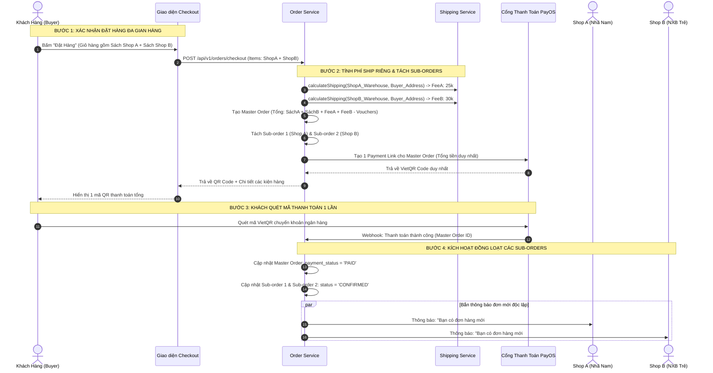

# TÀI LIỆU ĐẶC TẢ CHI TIẾT NGHIỆP VỤ - LUỒNG 10
## TÁCH ĐƠN HÀNG ĐA GIAN HÀNG (MULTI-VENDOR ORDER SPLITTING: MASTER ORDER & SUB-ORDERS)

---

## I. MỤC TIÊU & PHẠM VI NGHIỆP VỤ

* **Mục tiêu**: Xử lý tình huống khách hàng đặt mua nhiều cuốn sách thuộc các Nhà bán hàng (Seller/NXB) khác nhau trong cùng một lượt thanh toán. Đảm bảo trải nghiệm thanh toán 1 chạm duy nhất cho người mua (1 Master Order), sau đó hệ thống tự động phân tách thành các Đơn hàng con độc lập (Sub-orders) theo từng gian hàng. Mỗi đơn con sở hữu vòng đời, phí vận chuyển, mã vận đơn và tiến độ giao hàng riêng biệt mà không làm ảnh hưởng lẫn nhau.
* **Các bên tham gia (Actors)**:
  1. **Khách Hàng (Buyer)**: Đặt giỏ hàng chứa sách từ nhiều Shop, quét 1 mã PayOS QR Code duy nhất để thanh toán toàn bộ.
  2. **Các Nhà Bán Hàng (Sellers / NXB A, B, C)**: Nhận thông báo và chỉ xem/xử lý đơn hàng con thuộc quyền sở hữu của gian hàng mình.
  3. **Hệ thống Backend (Order & Fulfillment Services)**:
     * `order-service`: Tiếp nhận payload giỏ hàng, tạo Master Order, thực thi thuật toán phân tách Sub-orders.
     * `shipping-service`: Tính toán phí vận chuyển riêng lẻ cho từng gói hàng dựa trên địa chỉ kho của từng Shop.
     * `payment-service`: Quản lý 1 phiên thanh toán duy nhất với PayOS, tự động cập nhật trạng thái đồng loạt cho các Sub-orders khi nhận Webhook.

---

## II. MÔ HÌNH KIẾN TRÚC MASTER ORDER & SUB-ORDERS

```
                             MASTER ORDER (ĐƠN HÀNG TỔNG)
                        [Mã: ORD-889922 | Tổng Tiền: 450.000đ]
                        [1 Lần Thanh Toán Duy Nhất Qua PayOS QR]
                                         │
        ┌────────────────────────────────┼────────────────────────────────┐
        ▼                                ▼                                ▼
  SUB-ORDER 1 (Shop A)             SUB-ORDER 2 (Shop B)             SUB-ORDER 3 (Shop C - Ebook)
• Sách: Nhà Giả Kim (Giấy)       • Sách: Tuổi Trẻ Đáng Giá (Giấy) • Sách: Tâm Lý Học (Ebook)
• Shop: Nhã Nam Official         • Shop: NXB Trẻ                  • Shop: Alpha Books
• Phí ship: 25.000đ (Kho HN)     • Phí ship: 30.000đ (Kho HCM)    • Phí ship: 0đ (Giao qua mạng)
• Trạng thái: Đang đóng gói      • Trạng thái: Đã giao Shipper    • Trạng thái: ĐÃ MỞ KHÓA NGAY
• Vận đơn: GHN_998811            • Vận đơn: VIETTEL_776655        • Trực tuyến: Tủ sách cá nhân
```

### 1. Nguyên Tắc Vận Hành Đơn Hàng Con (Sub-order Isolation Rules)
1. **Thanh toán tập trung (Centralized Payment)**: Người mua chỉ thanh toán 1 lần tổng tiền (`Master Order Total`). Khi thanh toán thành công, toàn bộ các Sub-orders đồng loạt chuyển sang trạng thái `CONFIRMED` / `PROCESSING`.
2. **Vòng đời độc lập (Independent Lifecycle)**: Mỗi Shop tự xử lý đơn con của mình (Xác nhận → Đóng gói → Giao vận chuyển). Việc Shop A giao trước không phụ thuộc vào Shop B.
3. **Phân tách cước vận chuyển (Separate Shipping Calculation)**: Cước ship được tính toán độc lập từ địa chỉ kho của từng Shop đến địa chỉ nhận hàng của người mua.
4. **Hủy/Hoàn tiền cục bộ (Partial Cancellation & Refund)**: Khách hàng có thể yêu cầu hủy hoặc hoàn tiền cho riêng Sub-order 1 mà không làm gián đoạn hay ảnh hưởng đến Sub-order 2.

---

## III. BẢNG TRƯỜNG DỮ LIỆU & SCHEMA MASTER/SUB-ORDERS

Bảng `orders` (Master Order), `sub_orders` (Đơn con) và `order_items`:

### 1. Bảng `orders` (Master Order)
| Tên Cột | Kiểu Dữ Liệu | Ràng Buộc | Mô Tả |
|---|---|---|---|
| `id` | UUID | Primary Key | Mã định danh Master Order |
| `order_code` | String (Unique) | Bắt buộc | Mã hiển thị (VD: `HUKI-2026-8899`) |
| `user_id` | UUID | FK `users` | Khách hàng đặt mua |
| `total_items_amount` | Decimal | Bắt buộc | Tổng tiền sách toàn bộ các shop |
| `total_shipping_fee` | Decimal | Bắt buộc | Tổng cước vận chuyển của tất cả các gói |
| `total_platform_discount`| Decimal | Mặc định: 0 | Giảm giá từ mã toàn Sàn Huki |
| `total_freeship_discount`| Decimal | Mặc định: 0 | Giảm giá từ mã Freeship |
| `final_payment_amount` | Decimal | Bắt buộc | Tổng số tiền thực tế khách phải trả |
| `payment_status` | Enum | `PENDING`, `PAID`, `CANCELLED` | Trạng thái thanh toán của phiên |
| `payment_method` | Enum | `PAYOS_QR`, `COD`, `VNPAY` | Phương thức thanh toán |

### 2. Bảng `sub_orders` (Sub-order / Kiện Hàng Của Từng Shop)
| Tên Cột | Kiểu Dữ Liệu | Ràng Buộc | Mô Tả |
|---|---|---|---|
| `id` | UUID | Primary Key | Mã định danh Sub-order |
| `master_order_id` | UUID | FK `orders` | Liên kết Master Order cha |
| `sub_order_code` | String (Unique) | Bắt buộc | Mã đơn con (VD: `HUKI-2026-8899-S1`) |
| `business_id` | UUID | FK `businesses` | Gian hàng xử lý đơn này |
| `subtotal` | Decimal | Bắt buộc | Tiền sách của riêng Shop này |
| `shipping_fee` | Decimal | Bắt buộc | Cước vận chuyển của riêng Shop này |
| `shop_voucher_discount` | Decimal | Mặc định: 0 | Mức giảm từ Shop Voucher riêng của Shop |
| `allocated_platform_discount`| Decimal | Mặc định: 0 | Phần giảm giá Sàn phân bổ theo tỷ trọng |
| `seller_payout_amount` | Decimal | Bắt buộc | Doanh thu Shop thực nhận sau hoàn tất |
| `status` | Enum | `PENDING`, `CONFIRMED`, `SHIPPING`, `DELIVERED`, `CANCELLED` | Trạng thái xử lý của Shop |
| `tracking_code` | String (Nullable) | Mã vận đơn | Mã vận đơn của đơn vị vận chuyển (AWB) |
| `shipping_carrier` | String (Nullable) | Đơn vị vận chuyển | `Giao Hàng Nhanh`, `Viettel Post` |

### 3. Bảng `order_items`
| Tên Cột | Kiểu Dữ Liệu | Ràng Buộc | Mô Tả |
|---|---|---|---|
| `id` | UUID | Primary Key | Mã bản ghi |
| `sub_order_id` | UUID | FK `sub_orders` | Liên kết Sub-order chứa sản phẩm |
| `book_id` | UUID | FK `books` | Tựa sách |
| `format` | Enum | `PHYSICAL`, `EBOOK`, `HYBRID` | Định dạng xuất bản |
| `quantity` | Integer | Bắt buộc | Số lượng |
| `unit_price` | Decimal | Bắt buộc | Đơn giá tại thời điểm mua |

---

## IV. SƠ ĐỒ TRÌNH TỰ TÁCH ĐƠN HÀNG (SEQUENCE DIAGRAM)



---

## V. PHÂN RÃ CHI TIẾT TỪNG BƯỚC THỰC HIỆN

---

### BƯỚC 1: GOM NHÓM GIỎ HÀNG VÀ TÍNH PHÍ VẬN CHUYỂN ĐỘC LẬP

* **Bước 1.1: Gom nhóm sản phẩm theo `business_id`**:
  * Khi nhận danh sách mục thanh toán từ giỏ hàng:
  * Hệ thống sử dụng thuật toán gom nhóm:
    $$\text{Groups} = \text{groupBy}(\text{cart\_items}, \text{item} \rightarrow \text{item.business\_id})$$
* **Bước 1.2: Tính cước vận chuyển riêng từng kiện hàng**:
  * Với mỗi nhóm gian hàng $i$:
    * Tính tổng trọng lượng đóng gói: $\text{TotalWeight}_i = \sum (\text{weight\_in\_grams} \times \text{qty})$.
    * Gọi `shipping-service` tính cước từ địa chỉ kho xuất hàng của Shop $i$ đến địa chỉ người nhận.
    * *(Lưu ý: Nếu nhóm sản phẩm là thuần Ebook $\rightarrow \text{ShippingFee} = 0đ$).*

---

### BƯỚC 2: PHÂN BỔ VOUCHER SÀN VÀ TẠO MASTER/SUB-ORDERS TRANSACTION

* **Bước 2.1: Phân bổ mã giảm giá toàn Sàn (Platform Voucher Pro-rata)**:
  * Nếu đơn có áp dụng Platform Voucher giảm $D$ đồng:
  * Phân bổ $D$ cho từng Sub-order $i$ theo tỷ trọng tiền hàng:
    $$\text{AllocatedDiscount}_i = \text{round}\left(D \times \frac{\text{Subtotal}_i}{\text{TotalSubtotal}}\right)$$
* **Bước 2.2: Khởi tạo Database Transaction nguyên tử**:
  1. Tạo bản ghi Master Order trong bảng `orders`.
  2. Lặp qua từng nhóm gian hàng để tạo các bản ghi `sub_orders`:
     * Gán mã đơn con: `sub_order_code = '${master_code}-S${index}'`.
     * Gán `business_id` tương ứng.
  3. Tạo các dòng sản phẩm trong `order_items` liên kết với từng `sub_order_id`.

---

### BƯỚC 3: TẠO PHIÊN THANH TOÁN TẬP TRUNG (SINGLE PAYMENT SESSION)

* **Bước 3.1: Gọi cổng thanh toán PayOS**:
  * Gửi yêu cầu tạo liên kết thanh toán với `amount = MasterOrder.final_payment_amount`.
  * Nội dung chuyển khoản: `Mã Master Order` (VD: `HUKI8899`).
* **Bước 3.2: Hiển thị trang chờ thanh toán ngoài giao diện**:
  * Giao diện người mua hiển thị **1 mã VietQR duy nhất**.
  * Phía dưới hiển thị bảng tóm tắt:
    * 📦 **Kiện 1 (Nhã Nam)**: 2 cuốn - Tạm tính: 150k + Ship: 25k = 175k.
    * 📦 **Kiện 2 (NXB Trẻ)**: 1 cuốn - Tạm tính: 80k + Ship: 30k = 110k.
    * **Tổng thanh toán**: `285.000đ`.

---

### BƯỚC 4: TIẾP NHẬN WEBHOOK VÀ KÍCH HOẠT VÒNG ĐỜI CÁC SUB-ORDERS

* **Bước 4.1: Xử lý Webhook PayOS**:
  * Khi nhận Webhook xác nhận đã nhận đủ tiền:
  * Mở Transaction:
    * Cập nhật `orders.payment_status = 'PAID'`.
    * Cập nhật tất cả `sub_orders` thuộc Master Order:
      * Nếu Sub-order chỉ chứa Ebook: Chuyển thẳng sang `DELIVERED` & Mở khóa ngay trong Tủ sách cá nhân của người mua.
      * Nếu Sub-order chứa Sách giấy: Chuyển sang `CONFIRMED` (Chờ Shop chuẩn bị hàng).
* **Bước 4.2: Bắn thông báo Realtime đến từng Seller**:
  * Shop Nhã Nam nhận thông báo chỉ của đơn con #S1.
  * Shop NXB Trẻ nhận thông báo chỉ của đơn con #S2.

---

### BƯỚC 5: QUẢN LÝ VẬN HÀNH & THEO DÕI ĐƠN HÀNG ĐỘC LẬP

* **Bước 5.1: Màn hình Quản trị Người Bán ([`SellerOrdersPage.jsx`](file:///d:/doan_huki_ebook/huki-ebook/web/src/ui/pages/seller/SellerOrdersPage.jsx))**:
  * Seller chỉ nhìn thấy danh sách các Sub-orders thuộc `business_id` của mình.
  * Thao tác: Bấm *"Xác nhận đơn"* → In phiếu đóng gói → Bấm *"Giao cho ĐVVC"* → Nhập/Lấy mã vận đơn AWB.
* **Bước 5.2: Giao diện Theo Dõi Kiện Hàng Của Khách Hàng (`OrderDetailPage.jsx`)**:
  * Khách hàng vào chi tiết đơn hàng:
  * Hiển thị danh sách từng **Gói Hàng (Package 1, Package 2)** với thanh trạng thái giao hàng riêng biệt:
    * Gói 1: 🚚 *Đang giao hàng (Dự kiến giao ngày mai)*.
    * Gói 2: 📦 *Người bán đang chuẩn bị hàng*.

---

## VI. MA TRẬN KIỂM THỬ TÁCH ĐƠN HÀNG (TEST CASES MATRIX)

| Mã Test Case | Kịch Bản Kiểm Thử | Dữ Liệu Đầu Vào | Kết Quả Kỳ Vọng (Expected Result) | Đánh Giá |
|:---:|---|---|---|:---:|
| **TC_SPLIT_01** | Đặt hàng từ 2 Shop khác nhau | Giỏ gồm 1 sách Shop A + 1 sách Shop B. | Tạo đúng 1 Master Order và tách thành 2 Sub-orders (#S1, #S2) tương ứng. | **PASS** |
| **TC_SPLIT_02** | Tính phí ship riêng biệt theo địa chỉ kho | Shop A ở Hà Nội, Shop B ở TP.HCM. Khách ở Đà Nẵng. | Phí ship Kiện A tính theo HN-ĐN, Kiện B tính theo HCM-ĐN. Tổng ship = ShipA + ShipB. | **PASS** |
| **TC_SPLIT_03** | Thanh toán 1 lần kích hoạt đồng loạt Sub-orders | Quét 1 mã VietQR tổng. | Cả 2 đơn con #S1 và #S2 đều tự động chuyển sang `CONFIRMED`. | **PASS** |
| **TC_SPLIT_04** | Đơn hàng kết hợp Sách Giấy + Ebook | 1 sách giấy Shop A + 1 Ebook Shop B. | Sub-order Sách giấy chờ đóng gói; Sub-order Ebook mở khóa đọc ngay lập tức. | **PASS** |
| **TC_SPLIT_05** | Phân quyền bảo mật giữa các Seller | Seller A đăng nhập vào hệ thống. | Seller A chỉ nhìn thấy Sub-order #S1, tuyệt đối không nhìn thấy Sub-order #S2 của Shop B. | **PASS** |
| **TC_SPLIT_06** | Hủy 1 đơn con không ảnh hưởng đơn con còn lại | Khách yêu cầu hủy Sub-order #S1 trước khi Shop A đóng gói. | Sub-order #S1 chuyển `CANCELLED`; Sub-order #S2 vẫn tiếp tục giao bình thường. | **PASS** |

---

## VII. ĐIỀU KIỆN NGHIỆM THU HOÀN TẤT (DEFINITION OF DONE)

1. ✅ Thuật toán tách đơn hoạt động chính xác: 1 Master Order phân tách thành $N$ Sub-orders theo từng `business_id`.
2. ✅ Khách hàng chỉ phải thực hiện thanh toán 1 lần duy nhất cho toàn bộ đơn hàng.
3. ✅ Phí vận chuyển được tính độc lập và chính xác từ kho của từng Shop.
4. ✅ Bảo mật phân quyền dữ liệu tuyệt đối giữa các Seller (Data Isolation theo `business_id`).
5. ✅ Khách hàng theo dõi tiến độ từng kiện hàng sinh động trên giao diện Storefront.
