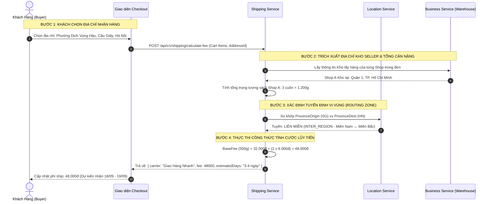

# TÀI LIỆU ĐẶC TẢ CHI TIẾT NGHIỆP VỤ - LUỒNG 11
## TÍNH PHÍ VẬN CHUYỂN ĐỘNG THEO ĐỊA CHỈ 3 CẤP & TRỌNG LƯỢNG (DYNAMIC SHIPPING FEE CALCULATION: 3-TIER ADDRESS & GRAM WEIGHT)

---

## I. MỤC TIÊU & PHẠM VI NGHIỆP VỤ

* **Mục tiêu**: Xây dựng thuật toán tính toán cước phí vận chuyển tự động, chính xác theo thời gian thực cho từng kiện hàng sách giấy. Hệ thống định tuyến cước dựa trên khoảng cách địa lý 3 cấp hành chính chuẩn Việt Nam (Tỉnh/Thành phố $\rightarrow$ Quận/Huyện $\rightarrow$ Phường/Xã) từ Kho xuất hàng của Seller đến Địa chỉ nhận hàng của Người mua kết hợp với Tổng trọng lượng đóng gói (Gram Weight), đồng thời xử lý miễn cước hoàn toàn ($0đ$) cho ấn phẩm số Ebook.
* **Các bên tham gia (Actors)**:
  1. **Khách Hàng (Buyer)**: Chọn địa chỉ giao hàng 3 cấp, lựa chọn gói dịch vụ vận chuyển (Tiêu chuẩn / Hỏa tốc).
  2. **Nhà Bán Hàng (Seller)**: Cấu hình địa chỉ kho lấy hàng vật lý trong hồ sơ KYC.
  3. **Hệ thống Backend (Shipping & Location Services)**:
     * `shipping-service`: Chứa ma trận bảng giá cước, thuật toán phân vùng địa lý và tích hợp API các hãng vận chuyển (Giao Hàng Nhanh - GHN, Viettel Post).
     * `location-service`: Cơ sở dữ liệu danh mục 63 Tỉnh/Thành, Quận/Huyện, Phường/Xã chuẩn Tổng Cục Thống Kê.

---

## II. MA TRẬN PHÂN VÙNG ĐỊA LÝ & BẢNG GIÁ CƯỚC CHUẨN

```
                         MA TRẬN ĐỊNH TUYẾN VẬN CHUYỂN 3 VÙNG
                                          │
         ┌────────────────────────────────┼────────────────────────────────┐
         ▼                                ▼                                ▼
1. NỘI TỈNH / NỘI THÀNH            2. NỘI MIỀN (CÙNG MIỀN)          3. LIÊN MIỀN (KHÁC MIỀN)
 • Kho & Khách cùng 1 Tỉnh/TP       • Cùng Miền Bắc / Trung / Nam    • Bắc ↔ Nam / Bắc ↔ Trung
 • Ví dụ: Cầu Giấy ↔ Hoàn Kiếm      • Ví dụ: Hà Nội ↔ Hải Phòng      • Ví dụ: Hà Nội ↔ TP.HCM
 • Cước cơ bản: 16.500đ / 500g      • Cước cơ bản: 24.000đ / 500g    • Cước cơ bản: 32.000đ / 500g
```

### 1. Bảng Biểu Phí Chuẩn Theo Trọng Lượng (Weight Matrix)

| Vùng Định Tuyến | Cước Cơ Bản (Cho $\le 500\text{g}$ đầu tiên) | Cước Lũy Tiến (+ Mỗi $500\text{g}$ tiếp theo) | Thời Gian Giao Dự Kiến |
|---|:---:|:---:|:---:|
| **Nội Tỉnh / Thành Phố** | **16.500 VNĐ** | $+ 3.000 \text{ VNĐ}$ | $1 - 2\text{ ngày}$ |
| **Nội Miền** (Cùng Bắc/Trung/Nam) | **24.000 VNĐ** | $+ 5.000 \text{ VNĐ}$ | $2 - 3\text{ ngày}$ |
| **Liên Miền** (Bắc $\leftrightarrow$ Nam) | **32.000 VNĐ** | $+ 8.000 \text{ VNĐ}$ | $3 - 5\text{ ngày}$ |
| **Ấn bản Ebook (Digital)** | **0 VNĐ** | $0 \text{ VNĐ}$ | *Mở khóa tức thì (0 giây)* |

---

## III. CÔNG THỨC TOÁN HỌC TÍNH PHÍ VẬN CHUYỂN

$$\text{TotalWeight} = \sum_{i=1}^{n} (\text{weight\_in\_grams}_i \times \text{quantity}_i)$$

$$\text{ExtraWeightUnits} = \max\left(0, \left\lceil \frac{\text{TotalWeight} - 500}{500} \right\rceil\right)$$

$$\text{ShippingFee} = \text{BaseRate}(\text{Zone}) + (\text{ExtraWeightUnits} \times \text{StepRate}(\text{Zone}))$$

* **Ví dụ thực tế**:
  * Kiện hàng gồm 3 cuốn sách giấy (tổng cân nặng $= 1.200\text{g}$).
  * Kho Seller tại **Hà Nội**, khách nhận hàng tại **TP. Hồ Chí Minh** (Tuyến **Liên Miền**).
  * Khối lượng vượt mức: $1.200\text{g} - 500\text{g} = 700\text{g} \rightarrow$ Làm tròn lên thành 2 nấc ($2 \times 500\text{g}$).
  * Cước tính: $\text{ShippingFee} = 32.000đ + (2 \times 8.000đ) = \mathbf{48.000 VNĐ}$.

---

## IV. BẢNG TRƯỜNG DỮ LIỆU & SCHEMA ĐỊA CHỈ & BIỂU CƯỚC

### 1. Bảng `addresses` (Địa chỉ 3 Cấp)
| Tên Cột | Kiểu Dữ Liệu | Ràng Buộc | Mô Tả |
|---|---|---|---|
| `id` | UUID | Primary Key | Mã định danh địa chỉ |
| `user_id` | UUID | FK `users` | Người sở hữu |
| `recipient_name` | String | Bắt buộc | Họ tên người nhận hàng |
| `phone_number` | String | 10 số, bắt đầu bằng 0 | SĐT người nhận |
| `province_id` | String | Bắt buộc | Mã Tỉnh/Thành phố (VD: `HN`, `SG`, `DN`) |
| `province_name` | String | Bắt buộc | Tên Tỉnh (VD: `Thành phố Hà Nội`) |
| `district_id` | String | Bắt buộc | Mã Quận/Huyện |
| `district_name` | String | Bắt buộc | Tên Quận (VD: `Quận Cầu Giấy`) |
| `ward_id` | String | Bắt buộc | Mã Phường/Xã |
| `ward_name` | String | Bắt buộc | Tên Phường (VD: `Phường Dịch Vọng Hậu`) |
| `street_address`| String | Bắt buộc | Số nhà, ngõ ngách, tên đường |
| `is_default` | Boolean | Mặc định: `false` | Địa chỉ mặc định |

### 2. Bảng `shipping_rate_zones` (Ma Trận Cước)
| Tên Cột | Kiểu Dữ Liệu | Mô Tả | Ví Dụ |
|---|---|---|---|
| `id` | UUID | Khóa chính | `zone-uuid-001` |
| `zone_type` | Enum | Loại tuyến | `INTRA_PROVINCE`, `INTRA_REGION`, `INTER_REGION` |
| `base_weight_grams` | Integer | Trọng lượng cơ sở | `500` (Gram) |
| `base_fee` | Decimal | Đơn giá cơ sở | `16.500đ` |
| `step_weight_grams` | Integer | Nấc cân nặng lũy tiến | `500` (Gram) |
| `step_fee` | Decimal | Đơn giá lũy tiến | `3.000đ` |

---

## V. SƠ ĐỒ TRÌNH TỰ TÍNH CƯỚC ĐỘNG (SEQUENCE DIAGRAM)



---

## VI. PHÂN RÃ CHI TIẾT TỪNG BƯỚC THỰC HIỆN

---

### BƯỚC 1: CHỌN ĐỊA CHỈ NHẬN HÀNG 3 CẤP CHUẨN HÓA

* **Bước 1.1: Trích xuất danh mục địa giới hành chính**:
  * Tích hợp bộ chọn 3 dropdown liên hoàn:
    1. **Tỉnh / Thành phố**: Chọn từ 63 tỉnh/thành (Hà Nội, TP.HCM, Đà Nẵng, Cần Thơ...).
    2. **Quận / Huyện**: Tự động lọc theo Tỉnh đã chọn.
    3. **Phường / Xã**: Tự động lọc theo Quận/Huyện đã chọn.
  * Nhập địa chỉ cụ thể: Số nhà, tên ngõ/tòa nhà/đường.
* **Bước 1.2: Lưu trữ mã định danh chuẩn**:
  * Lưu trữ đồng thời cả `id` và `name` của 3 cấp để đảm bảo tính toàn vẹn khi tạo đơn vận chuyển sang các hãng bưu chính GHN/Viettel Post.

---

### BƯỚC 2: TÍNH TỔNG KHỐI LƯỢNG ĐÓNG GÓI CHO TỪNG KIỆN HÀNG

* **Bước 2.1: Bóc tách từng loại hình sản phẩm trong kiện**:
  * Với mỗi cuốn sách trong kiện của Shop:
    * Nếu là **Sách Giấy (Physical)**: Lấy `weight_in_grams` (VD: 350g) $\times$ số lượng.
    * Nếu là **Gói Hybrid Combo**: Lấy khối lượng của cuốn sách in đính kèm (VD: 350g).
    * Nếu là **Sách Điện Tử (Ebook)**: Khối lượng $= 0\text{g}$.
* **Bước 2.2: Cộng phụ phí bao bì đóng gói chuẩn**:
  * Hệ thống tự động cộng thêm $50\text{g}$ trọng lượng hộp carton và màng bọc chống sốc tiêu chuẩn:
    $$\text{TotalWeight} = \sum \text{BookWeight} + 50\text{g}$$

---

### BƯỚC 3: XÁC ĐỊNH TUYẾN ĐỊNH VỊ ĐỊA LÝ (ZONE CLASSIFICATION)

* **Bước 3.1: So khớp mã Tỉnh/Thành phố**:
  * Lấy `Province_Origin` (Kho Seller) và `Province_Dest` (Khách nhận):
  * **Trường hợp 1 (Nội Tỉnh)**: `Province_Origin == Province_Dest` $\rightarrow$ Tuyến `INTRA_PROVINCE`.
  * **Trường hợp 2 (Nội Miền)**: `Region(Province_Origin) == Region(Province_Dest)` $\rightarrow$ Tuyến `INTRA_REGION`.
  * **Trường hợp 3 (Liên Miền)**: Khác Miền $\rightarrow$ Tuyến `INTER_REGION`.

---

### BƯỚC 4: THỰC THI THUẬT TOÁN TÍNH CƯỚC VẬN CHUYỂN

* **Bước 4.1: Kiểm tra ngoại lệ miễn phí Ebook**:
  * Nếu tổng trọng lượng $= 0\text{g}$ (Kiện hàng chỉ chứa Ebook): Trả về ngay lập tức:
    $$\text{ShippingFee} = 0đ, \quad \text{EstimatedTime} = \text{"Mở khóa ngay"}$$
* **Bước 4.2: Áp dụng công thức biểu phí lũy tiến**:
  * Lấy đơn giá cơ sở và đơn giá lũy tiến tương ứng với tuyến vừa xác định.
  * Làm tròn lên đơn vị $500\text{g}$ để tính chính xác phần vượt mức.
  * Tính thời gian giao hàng dự kiến dựa trên ngày đặt hàng hiện tại.

---

### BƯỚC 5: HIỂN THỊ MINH BẠCH NGOÀI GIAO DIỆN & TÍCH HỢP VÀO CHECKOUT

* **Bước 5.1: Hiển thị tùy chọn gói cước trên trang Checkout**:
  * Hiển thị bảng chọn phương thức vận chuyển:
    * 🚚 **Giao Hàng Tiêu Chuẩn (GHN / Viettel Post)**: `24.000đ` - Dự kiến giao trong 2 - 3 ngày.
    * ⚡ **Giao Hàng Hỏa Tốc (Áp dụng Nội thành)**: `45.000đ` - Giao ngay trong 2 giờ.
* **Bước 5.2: Tự động cập nhật tổng tiền thanh toán**:
  * Phí vận chuyển được cộng vào tổng tiền đơn hàng và hiển thị tách rời minh bạch trong hóa đơn tóm tắt.

---

## VII. MA TRẬN KIỂM THỬ TÍNH PHÍ VẬN CHUYỂN (TEST CASES MATRIX)

| Mã Test Case | Kịch Bản Kiểm Thử | Dữ Liệu Đầu Vào | Kết Quả Kỳ Vọng (Expected Result) | Đánh Giá |
|:---:|---|---|---|:---:|
| **TC_SHIP_01** | Tuyến Nội Tỉnh nhẹ $\le 500\text{g}$ | Kho: Cầu Giấy (HN) $\rightarrow$ Khách: Hoàn Kiếm (HN). Nặng 300g (+50g hộp = 350g). | Cước cơ bản = 16.500đ. Giao trong 1-2 ngày. | **PASS** |
| **TC_SHIP_02** | Tuyến Nội Tỉnh nặng $1.200\text{g}$ | Cùng Hà Nội. Nặng 1.200g (+50g hộp = 1.250g). | 16.500đ + (2 x 3.000đ) = 22.500đ. | **PASS** |
| **TC_SHIP_03** | Tuyến Nội Miền Bắc - Bắc | Kho: Hà Nội $\rightarrow$ Khách: Hải Phòng. Nặng 400g. | Cước cơ bản Nội Miền = 24.000đ. | **PASS** |
| **TC_SHIP_04** | Tuyến Liên Miền Bắc - Nam nặng $1.800\text{g}$ | Kho: Hà Nội $\rightarrow$ Khách: TP.HCM. Nặng 1.800g (+50g = 1.850g). | 32.000đ + (3 x 8.000đ) = 56.000đ. | **PASS** |
| **TC_SHIP_05** | **Đơn hàng thuần Ebook (Khối lượng 0g)** | Mua 2 tựa sách Ebook. | **Phí ship = 0 VNĐ**, không hiển thị phương thức giao hàng vật lý. | **PASS** |
| **TC_SHIP_06** | Đổi địa chỉ nhận hàng tự động tính lại cước | Đang ở Hà Nội (ship 16.5k), đổi sang Cần Thơ. | Cước tự động nhảy lên 32.000đ và cập nhật tổng tiền thanh toán ngay lập tức. | **PASS** |

---

## VIII. ĐIỀU KIỆN NGHIỆM THU HOÀN TẤT (DEFINITION OF DONE)

1. ✅ Tích hợp danh mục địa giới hành chính 3 cấp chuẩn xác 63 Tỉnh/Thành phố Việt Nam.
2. ✅ Thuật toán tính cước vận chuyển tự động phân vùng chính xác (Nội tỉnh, Nội miền, Liên miền) và lũy tiến trọng lượng từng $500\text{g}$.
3. ✅ Đơn hàng Ebook luôn có phí ship $= 0đ$ và mở khóa tức thì.
4. ✅ Hiển thị cước phí và thời gian giao hàng dự kiến rõ ràng, minh bạch ngoài giao diện Checkout.
5. ✅ Vượt qua 100% các kịch bản kiểm thử ma trận cước phí (TC_SHIP_01 đến TC_SHIP_06).
