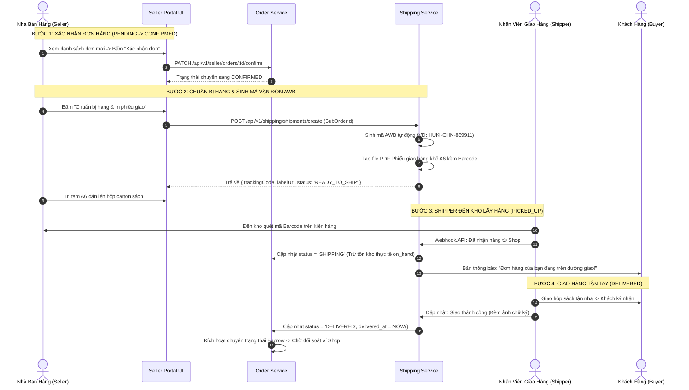

# TÀI LIỆU ĐẶC TẢ CHI TIẾT NGHIỆP VỤ - LUỒNG 12
## VÒNG ĐỜI XỬ LÝ ĐƠN & SINH MÃ VẬN ĐƠN TỰ ĐỘNG (AWB GENERATION & ORDER FULFILLMENT LIFECYCLE)

---

## I. MỤC TIÊU & PHẠM VI NGHIỆP VỤ

* **Mục tiêu**: Xây dựng quy trình xử lý đơn hàng và giao nhận sách giấy vật lý theo tiêu chuẩn thương mại điện tử chuyên nghiệp. Hệ thống quản trị vòng đời đơn hàng khép kín qua 5 giai đoạn tuần tự, tự động sinh mã vận đơn điện tử (Air Waybill - AWB), hỗ trợ xuất và in phiếu giao hàng (Shipping Label) có mã vạch Barcode/QR Code, đồng thời tích hợp đồng bộ trạng thái bưu cục với các đối tác giao vận hàng đầu (Giao Hàng Nhanh - GHN, Viettel Post, SPX Express).
* **Các bên tham gia (Actors)**:
  1. **Nhà Bán Hàng (Seller / Kho Vận)**: Tiếp nhận đơn, xác nhận, in phiếu đóng gói, bàn giao kiện hàng cho Shipper.
  2. **Nhân Viên Giao Hàng / Đối Tác Vận Chuyển (Shipper / Carrier Partner)**: Quét mã AWB lấy hàng, vận chuyển qua các trung tâm phân loại bưu cục và giao đến tay người nhận.
  3. **Khách Hàng (Buyer)**: Nhận kiện hàng, kiểm tra sách và ký nhận.
  4. **Hệ thống Backend (Fulfillment & Shipping Services)**:
     * `shipping-service`: Sinh mã AWB, tạo vận đơn bưu điện, tạo file in tem nhãn PDF.
     * `order-service`: Cập nhật trạng thái đơn con (`sub_orders`), trừ tồn kho thực tế (`on_hand_stock`) khi xuất kho.

---

## II. VÒNG ĐỜI 5 GIAI ĐOẠN XỬ LÝ ĐƠN HÀNG (FULFILLMENT STATE MACHINE)

```
[1. CHỜ XÁC NHẬN] ──► [2. ĐANG ĐÓNG GÓI] ──► [3. CHỜ BÀN GIAO] ──► [4. ĐANG GIAO] ──► [5. ĐÃ GIAO THÀNH CÔNG]
 (PENDING/CONFIRMED)     (PACKING)             (READY_TO_SHIP)        (SHIPPING)           (DELIVERED)
  • Đơn đã thanh toán     • In phiếu đóng gói   • Sinh mã AWB          • Shipper lấy hàng  • Khách nhận hàng
  • Shop bấm xác nhận     • Bọc chống sốc       • In tem dán bưu kiện  • Luân chuyển kho   • Kích hoạt tiền Escrow
                                                                             │
                                                                             ▼ (Nếu thất bại 3 lần)
                                                                   [GIAO THẤT BẠI / HOÀN HÀNG]
                                                                     (RETURN_TO_SENDER)
```

---

## III. QUY CHUẨN MÃ VẬN ĐƠN ĐIỆN TỬ (AWB SPECIFICATION)

### 1. Cấu Trúc Mã Vận Đơn Tự Động
Mã AWB được sinh theo quy tắc định danh duy nhất toàn hệ thống:
$$\text{AWB Code} = \text{PREFIX} + \text{CARRIER\_CODE} + \text{TIMESTAMP\_HEX} + \text{RANDOM\_DIGITS}$$
* **Ví dụ mẫu**:
  * Đơn vị Giao Hàng Nhanh: `HUKI-GHN-2609A8F1-77`
  * Đơn vị Viettel Post: `HUKI-VTP-2609B4C2-93`
  * Đơn vị Huki Express: `HUKI-EXP-2609E9D0-12`

### 2. Tiêu Chuẩn Phiếu Giao Hàng (Shipping Label - Khổ A6 / Decal Nhiệt $100 \times 150\text{mm}$)
* **Góc trên bên trái**: Logo sàn Huki Ebook + Tên đơn vị vận chuyển.
* **Mã vạch & QR Code**: Mã AWB dạng Code 128 và QR Code hỗ trợ máy quét cầm tay của Shipper.
* **Thông tin Người Gửi**: Tên Gian Hàng, SĐT Hotline Kho, Địa chỉ Kho lấy hàng.
* **Thông tin Người Nhận**: Họ tên, SĐT (che 3 số giữa để bảo mật `098***1234`), Địa chỉ nhận hàng 3 cấp chi tiết.
* **Danh mục hàng hóa**: Tên các tựa sách in, Số lượng, Tổng trọng lượng (Gram).
* **Chỉ dẫn giao hàng**: *"Cho xem hàng, không cho đọc thử"* / *"Hàng dễ gãy gập, xin nhẹ tay"*.

---

## IV. BẢNG TRƯỜNG DỮ LIỆU & SCHEMA VẬN ĐƠN (SHIPMENTS)

Bảng quản lý kiện hàng `shipments`:

| Tên Cột | Kiểu Dữ Liệu | Ràng Buộc | Mô Tả |
|---|---|---|---|
| `id` | UUID | Primary Key | Mã định danh kiện hàng |
| `sub_order_id` | UUID | Unique, FK `sub_orders` | Đơn hàng con tương ứng |
| `business_id` | UUID | FK `businesses` | Gian hàng xuất kho |
| `tracking_code` | String (Unique) | Bắt buộc, Index | Mã vận đơn AWB |
| `carrier_name` | String | Bắt buộc | Tên đơn vị vận chuyển (GHN, Viettel Post, SPX) |
| `service_type` | Enum | `STANDARD`, `EXPRESS` | Gói cước (Tiêu chuẩn / Hỏa tốc) |
| `weight_in_grams` | Integer | Bắt buộc | Tổng trọng lượng cân nặng thực tế |
| `shipping_label_url`| String | URL PDF / PNG | Đường dẫn tải tem nhãn in A6 |
| `status` | Enum | `READY_TO_SHIP`, `PICKED_UP`, `IN_TRANSIT`, `DELIVERED`, `FAILED`, `RETURNED` | Trạng thái bưu kiện |
| `pickup_at` | Timestamp | Nullable | Thời điểm Shipper nhận kiện |
| `delivered_at` | Timestamp | Nullable | Thời điểm giao thành công |
| `delivery_attempts`| Integer | Mặc định: `0` | Số lần Shipper đã thử giao |

---

## V. SƠ ĐỒ TRÌNH TỰ VẬN HÀNH ĐƠN HÀNG (SEQUENCE DIAGRAM)



---

## VI. PHÂN RÃ CHI TIẾT TỪNG BƯỚC THỰC HIỆN

---

### BƯỚC 1: TIẾP NHẬN & XÁC NHẬN ĐƠN HÀNG MỚI (ORDER CONFIRMATION)

* **Bước 1.1: Thông báo đơn hàng mới Realtime**:
  * Khi khách thanh toán thành công, Seller nhận thông báo chuông và thẻ đơn xuất hiện ở tab **"Chờ Xác Nhận"** trên [`SellerOrdersPage.jsx`](file:///d:/doan_huki_ebook/huki-ebook/web/src/ui/pages/seller/SellerOrdersPage.jsx).
* **Bước 1.2: Xác nhận đơn hàng**:
  * Seller bấm nút **"Xác nhận đơn"**:
  * Hệ thống kiểm tra lại kho một lần nữa và chuyển trạng thái đơn sang `CONFIRMED` / `PACKING`.

---

### BƯỚC 2: IN PHIẾU ĐÓNG GÓI & CHUẨN BỊ SÁCH VẬT LÝ

* **Bước 2.1: In Phiếu Soạn Hàng (Picking & Packing Slip)**:
  * Seller bấm nút **"In phiếu đóng gói"**:
  * Hệ thống mở bản in tóm tắt danh sách các cuốn sách cần lấy: Tên sách, Tác giả, Vị trí kệ, Số lượng.
* **Bước 2.2: Quy cách đóng gói tiêu chuẩn sách**:
  * Sách được bọc màng bọt khí chống sốc (Bubble wrap) tối thiểu 2 lớp để bảo vệ góc sách và gáy sách không bị gãy dập khi va đập.
  * Đặt vào hộp carton cứng cáp vừa vặn.

---

### BƯỚC 3: TỰ ĐỘNG SINH MÃ VẬN ĐƠN AWB & IN TEM GIAO HÀNG A6

* **Bước 3.1: Kích hoạt tạo vận đơn điện tử**:
  * Seller bấm nút **"Giao Hàng / Chuẩn bị hoàn tất"**:
  * Frontend gọi API `POST /api/v1/shipping/shipments/create`.
  * `shipping-service` thực thi:
    1. Tạo mã AWB duy nhất theo quy chuẩn: `HUKI-GHN-XXXXXXXX`.
    2. Render tem nhãn vận chuyển dạng file PDF khổ tiêu chuẩn A6 ($100 \times 150\text{mm}$) tích hợp mã Barcode 128 và thông tin che bảo mật SĐT người nhận.
    3. Cập nhật `sub_orders.tracking_code` và chuyển trạng thái sang `READY_TO_SHIP`.
* **Bước 3.2: Dán tem nhãn**:
  * Seller in tem qua máy in nhiệt và dán chắc chắn lên mặt trên của hộp hàng.

---

### BƯỚC 4: BÀN GIAO CHO SHIPPER & KHẤU TRỪ TỒN THỰC (SHIPPING STAGE)

* **Bước 4.1: Shipper tiếp nhận bưu kiện**:
  * Nhân viên bưu điện / Shipper đến kho lấy hàng, dùng máy quét laser quét mã vạch AWB.
  * Hệ thống bưu chính gửi webhook xác nhận kiện hàng đã rời kho (`PICKED_UP`).
* **Bước 4.2: Khấu trừ tồn kho thực tế (Deduct On-Hand)**:
  * `order-service` tự động thực thi khấu trừ vật lý:
    $$on\_hand\_stock = on\_hand\_stock - quantity$$
    $$reserved\_stock = reserved\_stock - quantity$$
  * Trạng thái đơn hàng con chuyển sang `SHIPPING` (Đang giao hàng).

---

### BƯỚC 5: GIAO HÀNG THÀNH CÔNG HOẶC XỬ LÝ SỰ CỐ HOÀN HÀNG

* **Bước 5.1: Giao Hàng Thành Công (`DELIVERED`)**:
  * Shipper giao tận tay độc giả → Chụp ảnh xác thực → Cập nhật `DELIVERED`.
  * Khách nhận thông báo trên ứng dụng: *"Đơn hàng #HUKI-8899 đã được giao thành công. Chúc bạn có những phút giây đọc sách thú vị!"*.
  * Kích hoạt đếm ngược 3 ngày hoàn tất đơn và mở khóa doanh thu ví Escrow cho Seller.
* **Bước 5.2: Xử lý Giao Hàng Thất Bại (`DELIVERY_FAILED` & `RETURN_TO_SENDER`)**:
  * Nếu không liên lạc được với khách: Shipper cập nhật lý do và thử giao lại tối đa **3 lần** trong 3 ngày liên tiếp.
  * Sau 3 lần thất bại: Đơn hàng chuyển sang trạng thái **Hoàn hàng về kho (Return to Sender)**.
  * Khi hàng quay về kho Seller: Seller bấm *"Xác nhận đã nhận lại hàng hoàn"* → Hệ thống cộng trả lại số sách đó vào `on_hand_stock`.

---

## VII. MA TRẬN KIỂM THỬ VÒNG ĐỜI VẬN ĐƠN (TEST CASES MATRIX)

| Mã Test Case | Kịch Bản Kiểm Thử | Dữ Liệu Đầu Vào | Kết Quả Kỳ Vọng (Expected Result) | Đánh Giá |
|:---:|---|---|---|:---:|
| **TC_AWB_01** | Sinh mã vận đơn AWB tự động thành công | Đơn hàng sách giấy ở trạng thái `CONFIRMED`. Bấm "Giao hàng". | Sinh mã AWB hợp lệ (VD: `HUKI-GHN-2609A8F1-77`), lưu đúng vào DB. | **PASS** |
| **TC_AWB_02** | Xuất phiếu in tem nhãn giao hàng khổ A6 | Bấm "In tem nhãn" của đơn có mã AWB. | Tạo file PDF/Canvas A6 có đầy đủ Barcode, che SĐT người nhận, địa chỉ rõ ràng. | **PASS** |
| **TC_AWB_03** | Khấu trừ tồn kho thực tế khi chuyển `SHIPPING` | Shipper quét mã lấy hàng (`PICKED_UP`). | `on_hand_stock` và `reserved_stock` cùng giảm đúng số lượng, `available` giữ nguyên. | **PASS** |
| **TC_AWB_04** | Hoàn tất giao hàng thành công | Shipper xác nhận giao thành công. | Đơn chuyển `DELIVERED`, ghi nhận `delivered_at = NOW()`, sẵn sàng đối soát ví. | **PASS** |
| **TC_AWB_05** | Tự động thử giao lại khi thất bại lần 1 | Shipper báo "Khách hẹn giao lại". | Đơn giữ trạng thái `SHIPPING`, `delivery_attempts` tăng từ 0 lên 1. | **PASS** |
| **TC_AWB_06** | Hoàn hàng về kho sau 3 lần giao thất bại | Thử giao 3 lần không thành công. | Đơn chuyển `RETURNED`, hàng trả về kho Seller xác nhận cộng lại kho `on_hand`. | **PASS** |

---

## VIII. ĐIỀU KIỆN NGHIỆM THU HOÀN TẤT (DEFINITION OF DONE)

1. ✅ Vòng đời đơn hàng tuân thủ nghiêm ngặt máy trạng thái 5 giai đoạn từ lúc tạo đơn đến khi giao thành công.
2. ✅ Thuật toán sinh mã vận đơn điện tử AWB tự động, duy nhất và chuẩn hóa mã vạch Barcode 128.
3. ✅ Tính năng in phiếu đóng gói và tem giao hàng A6 hoạt động trực tiếp trên trình duyệt.
4. ✅ Tồn kho thực tế (`on_hand_stock`) được khấu trừ chính xác tại thời điểm bàn giao cho Shipper.
5. ✅ Xử lý an toàn, tự động các kịch bản giao thất bại và hoàn trả hàng về kho Seller.
