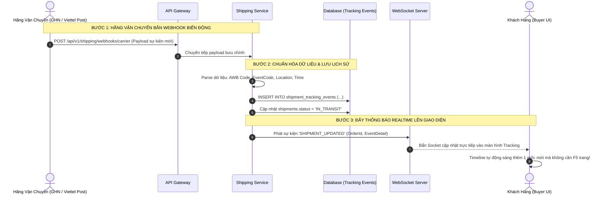

# TÀI LIỆU ĐẶC TẢ CHI TIẾT NGHIỆP VỤ - LUỒNG 13
## THEO DÕI HÀNH TRÌNH ĐƠN HÀNG TRỰC QUAN (REALTIME ORDER TIMELINE TRACKING UI)

---

## I. MỤC TIÊU & PHẠM VI NGHIỆP VỤ

* **Mục tiêu**: Xây dựng giao diện dòng thời gian trực quan (Realtime Order Timeline Tracking) cho phép khách hàng và nhà bán hàng theo dõi từng mốc biến động, vị trí bưu cục luân chuyển và trạng thái giao nhận của từng kiện hàng sách in theo thời gian thực. Tự động tiếp nhận Webhook từ các hãng vận chuyển (GHN, Viettel Post) để vẽ biểu đồ tiến độ (Timeline Stepper) sinh động, minh bạch, giảm thiểu tỷ lệ khách hàng gọi điện thắc mắc về tình trạng đơn hàng.
* **Các bên tham gia (Actors)**:
  1. **Khách Hàng (Buyer)**: Theo dõi tiến độ giao hàng, tra cứu mã vận đơn, xem thông tin Shipper đang phát hàng.
  2. **Nhà Bán Hàng (Seller)**: Theo dõi kiện hàng đã gửi đi, nắm bắt sớm các trường hợp giao hàng chậm trễ hoặc giao thất bại để kịp thời hỗ trợ độc giả.
  3. **Hệ thống Backend (Shipping & Tracking Webhook Services)**:
     * `shipping-service`: Tiếp nhận Webhook từ đối tác bưu chính, chuẩn hóa mã sự kiện và ghi vào bảng lịch sử `shipment_tracking_events`.
     * `WebSocket Gateway`: Bắn thông báo cập nhật mốc hành trình mới tức thì lên trình duyệt người dùng.

---

## II. KIẾN TRÚC DÒNG THỜI GIAN 7 MỐC CHUẨN (7-STAGE TIMELINE STEPPER)

```
[1. ĐẶT HÀNG] ──► [2. ĐÃ TRẢ TIỀN] ──► [3. ĐÃ ĐÓNG GÓI] ──► [4. ĐÃ LẤY HÀNG] ──► [5. TRUNG CHUYỂN] ──► [6. ĐANG PHÁT] ──► [7. ĐÃ NHẬN]
   (08:30)           (08:32)             (10:15)             (14:00)             (Ngày 2)           (08:00 Ngày 3)     (10:45 Ngày 3)
  • Khách tạo đơn   • PayOS VietQR      • Shop in tem A6    • Shipper lấy hàng  • Qua kho HN/HCM   • Shipper đang tới • Giao thành công
  • Khóa tạm kho    • Xác nhận tiền     • Bọc chống sốc     • Rời khỏi kho Shop • Luân chuyển xe   • Hotline Shipper  • Chụp ảnh ký nhận
```

### 1. Bảng Trạng Thái Biểu Tượng & Thị Giác (Visual Stepper Elements)
* 🟢 **Mốc Đã Hoàn Thành**: Vòng tròn xanh lá cây tích $\checkmark$, đường nối liền mạch màu xanh.
* 🔵 **Mốc Đang Diễn Ra (Active Node)**: Vòng tròn xanh dương nhấp nháy hiệu ứng sóng (Pulse Animation) kèm chữ nổi bật.
* ⚪ **Mốc Chưa Diễn Ra (Pending Node)**: Vòng tròn xám nhạt, đường nét đứt mờ.
* 🔴 **Mốc Cảnh Báo / Thất Bại (Alert Node)**: Đổi màu cam/đỏ kèm ghi chú lý do (VD: *"Không liên lạc được với người nhận"*).

---

## III. BẢNG TRƯỜNG DỮ LIỆU & SCHEMA LỊCH SỬ HÀNH TRÌNH

Bảng ghi vết sự kiện bưu chính `shipment_tracking_events`:

| Tên Cột | Kiểu Dữ Liệu | Ràng Buộc | Mô Tả | Ví Dụ |
|---|---|---|---|---|
| `id` | UUID | Primary Key | Mã định danh sự kiện | `evt-uuid-001` |
| `shipment_id` | UUID | FK `shipments` | Liên kết kiện hàng | `ship-uuid-123` |
| `tracking_code` | String | Bắt buộc, Index | Mã vận đơn AWB | `HUKI-GHN-889911` |
| `event_code` | Enum | Bắt buộc | Mã sự kiện chuẩn | `ORDER_PLACED`, `PAYMENT_CONFIRMED`, `PACKED`, `PICKED_UP`, `IN_TRANSIT`, `OUT_FOR_DELIVERY`, `DELIVERED`, `FAILED` |
| `title` | String | Bắt buộc | Tiêu đề ngắn gọn | `Đã xuất kho trung chuyển Hà Nội` |
| `description` | String | Bắt buộc | Chi tiết hành trình | `Kiện hàng đang trên xe luân chuyển đến bưu cục Cầu Giấy` |
| `location` | String | Nullable | Địa điểm bưu cục | `Kho Phân Loại Long Biên, Hà Nội` |
| `courier_name` | String | Nullable | Tên nhân viên phát hàng | `Nguyễn Văn A (SĐT: 0988.xxx.xxx)` |
| `event_time` | Timestamp | Bắt buộc | Thời điểm sự kiện diễn ra | `2026-09-15 14:30:00` |

---

## IV. SƠ ĐỒ TRÌNH TỰ ĐỒNG BỘ HÀNH TRÌNH (SEQUENCE DIAGRAM)



---

## V. PHÂN RÃ CHI TIẾT TỪNG BƯỚC THỰC HIỆN

---

### BƯỚC 1: TRUY CẬP TRANG THEO DÕI ĐƠN HÀNG (TIMELINE VIEW ACCESS)

* **Bước 1.1: Điều hướng từ Danh sách đơn hàng**:
  * Độc giả vào menu **Đơn Mua** (`/user/orders`) → Bấm nút màu xanh **"🚚 Theo dõi hành trình"** trên kiện hàng mong muốn.
  * Hoặc tra cứu nhanh bằng Mã vận đơn AWB tại trang công khai `/tracking?code=HUKI-GHN-889911`.
* **Bước 1.2: Hiển thị Khối Tổng Quan Kiện Hàng**:
  * Tên Nhà Bán Hàng: *Công Ty CP Sách Nhã Nam*.
  * Mã vận đơn AWB: `HUKI-GHN-889911` (Kèm nút Copy 1 chạm).
  * Đơn vị vận chuyển: *Giao Hàng Nhanh (GHN Express)*.
  * Thời gian giao dự kiến: *Dự kiến nhận hàng Thứ Năm, 18/09/2026*.

---

### BƯỚC 2: RENDER DÒNG THỜI GIAN THEO THỨ TỰ THỜI GIAN (VERTICAL TIMELINE)

* **Bước 2.1: Sắp xếp các mốc thời gian**:
  * Hệ thống tải danh sách `shipment_tracking_events` và sắp xếp theo thứ tự mới nhất ở trên cùng:
    * 🟢 **15/09 16:30**: 🚚 *Đang giao hàng* - Shipper Nguyễn Văn A (0988.xxx.xxx) đang trên đường giao sách đến bạn.
    * ⚪ **15/09 09:15**: 🏢 *Đã đến bưu cục Cầu Giấy* - Kiện hàng đã đến kho phát Cầu Giấy, Hà Nội.
    * ⚪ **14/09 21:00**: 🚛 *Đang luân chuyển* - Rời kho tổng Long Biên đến bưu cục Cầu Giấy.
    * ⚪ **14/09 14:00**: 📦 *Đã lấy hàng* - ĐVVC đã tiếp nhận kiện hàng từ kho Người Bán.
    * ⚪ **14/09 10:30**: 🏷 *Người bán đang chuẩn bị hàng* - Đã in tem giao hàng.
    * ⚪ **14/09 08:30**: 💳 *Đặt hàng thành công* - Đơn hàng đã được thanh toán qua PayOS.

---

### BƯỚC 3: XỬ LÝ TIẾP NHẬN WEBHOOK TỪ CÁC ĐỐI TÁC GIAO VẬN

* **Bước 3.1: Endpoint Tiếp nhận Webhook (`/api/v1/shipping/webhooks/carrier`)**:
  * Xác thực chữ ký bí mật (`Webhook-Signature`) từ GHN / Viettel Post để chống giả mạo request.
* **Bước 3.2: Chuẩn hóa mã trạng thái hãng thành mã nội bộ**:
  * Bảng chuyển dịch mã:
    * GHN `ready_to_pick` $\rightarrow$ Huki `READY_TO_SHIP`
    * GHN `picking` / `storing` $\rightarrow$ Huki `PICKED_UP` / `IN_TRANSIT`
    * GHN `delivering` $\rightarrow$ Huki `OUT_FOR_DELIVERY`
    * GHN `delivered` $\rightarrow$ Huki `DELIVERED`
    * GHN `delivery_fail` $\rightarrow$ Huki `FAILED`

---

### BƯỚC 4: BẬT THÔNG BÁO THỜI GIAN THỰC & SỰ CỐ GIAO HÀNG (ALERTS)

* **Bước 4.1: Bắn thông báo đẩy khi Shipper bắt đầu đi giao (`OUT_FOR_DELIVERY`)**:
  * Khi kiện hàng chuyển sang trạng thái đang phát: Gửi thông báo Web Push & SMS/Email đến khách hàng: *"Kiện sách của bạn đang được Shipper [Tên] giao, vui lòng chú ý điện thoại!"*.
* **Bước 4.2: Xử lý cảnh báo giao thất bại (Delivery Exception)**:
  * Nếu Shipper cập nhật giao không thành công (VD: Khách bận, không nghe máy):
  * Dòng timeline hiển thị khối cảnh báo màu cam:
    * ⚠️ *"Giao hàng không thành công lần 1: Người nhận hẹn giao lại vào ngày mai"*.
    * Kèm hướng dẫn: Khách có thể liên hệ trực tiếp số điện thoại Shipper hiển thị trên màn hình.

---

### BƯỚC 5: XÁC NHẬN HOÀN TẤT & ĐÁNH GIÁ TRẢI NGHIỆM GIAO HÀNG

* **Bước 5.1: Hiển thị mốc Hoàn Tất (`DELIVERED`)**:
  * Khi giao thành công:
  * Mốc cuối cùng sáng màu xanh rực rỡ: *"Giao hàng thành công vào lúc 10:45 ngày 15/09/2026"*.
* **Bước 5.2: Tích hợp nút hành động nhanh**:
  * Nút **"⭐ Đánh giá sản phẩm & Dịch vụ giao hàng"**.
  * Nút **"📦 Đã nhận được hàng (Xác nhận)"**.
  * Nút **"⚠️ Yêu cầu Trả hàng / Hoàn tiền"** (nếu sách bị rách, ướt, dập gáy do vận chuyển).

---

## VI. MA TRẬN KIỂM THỬ THEO DÕI HÀNH TRÌNH (TEST CASES MATRIX)

| Mã Test Case | Kịch Bản Kiểm Thử | Dữ Liệu Đầu Vào | Kết Quả Kỳ Vọng (Expected Result) | Đánh Giá |
|:---:|---|---|---|:---:|
| **TC_TRACK_01** | Hiển thị đầy đủ các mốc đơn hàng mới tạo | Đơn vừa thanh toán, chưa đóng gói. | Timeline hiển thị 2 mốc xanh (Đặt hàng + Thanh toán), các mốc sau màu xám. | **PASS** |
| **TC_TRACK_02** | Cập nhật Realtime qua Webhook GHN | Webhook GHN báo `delivering` kèm tên Shipper và SĐT. | Timeline tự động nhảy mốc "Đang giao", hiển thị Tên và SĐT Shipper ngay lập tức. | **PASS** |
| **TC_TRACK_03** | Hiển thị cảnh báo khi giao thất bại lần 1 | Webhook báo `delivery_fail` lý do: "Không nghe máy". | Mốc timeline chuyển sang màu cam, hiển thị đúng lý do và lịch hẹn giao lại. | **PASS** |
| **TC_TRACK_04** | Hoàn tất giao hàng hiển thị nút Đánh giá | Trạng thái chuyển sang `DELIVERED`. | Timeline hoàn tất 100%, xuất hiện nút "Đánh giá đơn hàng" và "Yêu cầu Trả hàng". | **PASS** |
| **TC_TRACK_05** | Tra cứu AWB công khai không cần đăng nhập | Truy cập `/tracking?code=HUKI-GHN-889911`. | Hiển thị chính xác timeline kiện hàng mà không lộ thông tin cá nhân nhạy cảm của khách. | **PASS** |
| **TC_TRACK_06** | Hủy đơn hàng timeline hiển thị mốc Đã Hủy | Khách hủy đơn trước khi đóng gói. | Timeline dừng lại, hiển thị mốc đỏ "Đơn hàng đã được hủy" kèm lý do hủy. | **PASS** |

---

## VII. ĐIỀU KIỆN NGHIỆM THU HOÀN TẤT (DEFINITION OF DONE)

1. ✅ Giao diện Timeline hiển thị trực quan, mượt mà, đầy đủ 7 mốc trạng thái với hiệu ứng thị giác rõ ràng.
2. ✅ Tích hợp Webhook tiếp nhận và chuẩn hóa sự kiện từ các đối tác vận chuyển GHN / Viettel Post.
3. ✅ Đẩy thông báo Realtime qua WebSocket cập nhật tiến độ tức thì không cần tải lại trang.
4. ✅ Hiển thị thông tin Shipper và cảnh báo rõ ràng khi xảy ra sự cố giao hàng không thành công.
5. ✅ Vượt qua 100% các kịch bản trong Ma trận kiểm thử theo dõi hành trình (TC_TRACK_01 đến TC_TRACK_06).
