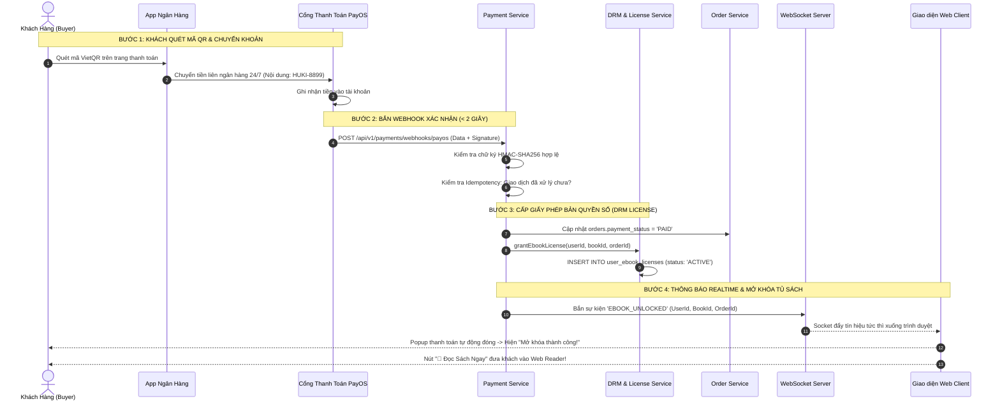

# TÀI LIỆU ĐẶC TẢ CHI TIẾT NGHIỆP VỤ - LUỒNG 14
## MUA & MỞ KHÓA EBOOK TỨC THÌ QUA PAYOS (INSTANT EBOOK UNLOCK & VIETQR WEBHOOK PROCESSING)

---

## I. MỤC TIÊU & PHẠM VI NGHIỆP VỤ

* **Mục tiêu**: Xây dựng quy trình thanh toán và cấp phép bản quyền sách điện tử (Ebook License) hoàn toàn tự động theo thời gian thực (Realtime Instant Delivery). Ngay khi khách hàng quét mã PayOS VietQR chuyển khoản thành công, hệ thống tiếp nhận Webhook bảo mật trong vòng $< 2\text{ giây}$, tự động cấp bản quyền đọc số vĩnh viễn vào Tủ sách cá nhân của độc giả và chuyển hướng trực tiếp sang Trình đọc sách Web Reader mà không cần bất kỳ sự can thiệp thủ công nào từ con người.
* **Các bên tham gia (Actors)**:
  1. **Khách Hàng / Độc Giả (Buyer / Reader)**: Quét mã VietQR trên App ngân hàng, nhận thông báo mở khóa và đọc sách tức thì.
  2. **Cổng Thanh Toán PayOS (VietQR Gateway)**: Nhận diện biến động số dư ngân hàng và bắn Webhook thông báo về máy chủ Huki Ebook.
  3. **Hệ thống Backend (Payment, Order & DRM Services)**:
     * `payment-service`: Xác thực chữ ký điện tử HMAC-SHA256 của Webhook, đảm bảo tính duy nhất (Idempotency).
     * `order-service`: Cập nhật trạng thái đơn hàng sang `PAID` và `DELIVERED` đối với gói Ebook.
     * `drm-service`: Cấp giấy phép bản quyền số `user_ebook_licenses`, liên kết tài khoản độc giả với tệp nội dung số mã hóa trong két an toàn.
     * `WebSocket Gateway`: Đẩy sự kiện thanh toán thành công tức thì ra trình duyệt người mua.

---

## II. QUY TRÌNH THANH TOÁN & CẤP PHÉP BẢN QUYỀN 4 BƯỚC

```
[1. QUÉT MÃ VIETQR] ──► [2. WEBHOOK PAYOS] ──► [3. CẤP BẢN QUYỀN SỐ] ──► [4. ĐỌC TỨC THÌ]
  • Khách quét mã QR      • Webhook về server    • Tạo user_ebook_licenses • Socket bắn về Web
  • Nội dung: HUKI8899    • Xác thực chữ ký      • Mở khóa vào "Tủ sách"   • Nút "Đọc Sách Ngay"
  • Độ trễ: 1-2s          • Đảm bảo Idempotency  • Kích hoạt DRM Security  • Chuyển sang Web Reader
```

---

## III. BẢNG TRƯỜNG DỮ LIỆU & SCHEMA BẢN QUYỀN EBOOK

Bảng quản lý giấy phép bản quyền số `user_ebook_licenses` và bảng giao dịch `payment_transactions`:

### 1. Bảng `user_ebook_licenses` (Giấy Phép Bản Quyền Độc Giả)
| Tên Cột | Kiểu Dữ Liệu | Ràng Buộc | Mô Tả |
|---|---|---|---|
| `id` | UUID | Primary Key | Mã định danh giấy phép |
| `user_id` | UUID | FK `users`, Index | Khách hàng sở hữu bản quyền |
| `book_id` | UUID | FK `books`, Index | Tựa sách được cấp phép |
| `order_id` | UUID | FK `orders` | Đơn hàng mua sách |
| `business_id` | UUID | FK `businesses` | Gian hàng / NXB sở hữu tác phẩm |
| `license_type` | Enum | `PERPETUAL` (Vĩnh viễn), `RENTAL` (Thuê có thời hạn) | Loại hình bản quyền |
| `status` | Enum | `ACTIVE`, `REVOKED` (Bị thu hồi khi hoàn tiền) | Trạng thái hiệu lực |
| `granted_at` | Timestamp | Bắt buộc | Thời điểm cấp phép |
| `last_read_at` | Timestamp | Nullable | Lần đọc gần nhất |
| Unique Index | `[user_id, book_id]` | Đảm bảo 1 user không bị trùng lặp bản quyền cùng 1 cuốn |

### 2. Bảng `payment_transactions` (Lịch Sử Webhook Thanh Toán)
| Tên Cột | Kiểu Dữ Liệu | Ràng Buộc | Mô Tả |
|---|---|---|---|
| `id` | UUID | Primary Key | Mã bản ghi giao dịch |
| `order_id` | UUID | FK `orders` | Đơn hàng liên kết |
| `payment_gateway`| String | Bắt buộc | `PAYOS` |
| `transaction_id` | String | Unique, Index | Mã giao dịch phía ngân hàng / PayOS |
| `amount` | Decimal | Bắt buộc | Số tiền thực nhận |
| `payload` | Json | Bắt buộc | Toàn bộ dữ liệu Webhook gốc để đối soát |
| `signature` | String | Bắt buộc | Chữ ký điện tử HMAC-SHA256 |
| `status` | Enum | `SUCCESS`, `DUPLICATE`, `FAILED` | Kết quả xử lý Webhook |

---

## IV. SƠ ĐỒ TRÌNH TỰ MỞ KHÓA TỨC THÌ (SEQUENCE DIAGRAM)



---

## V. PHÂN RÃ CHI TIẾT TỪNG BƯỚC THỰC HIỆN

---

### BƯỚC 1: TIẾP NHẬN & XÁC THỰC CHỮ KÝ WEBHOOK PAYOS (SECURITY CHECK)

* **Bước 1.1: Tiếp nhận Request Webhook**:
  * PayOS gửi HTTP POST request đến endpoint: `POST /api/v1/payments/webhooks/payos`.
  * Header bao gồm chữ ký xác thực: `x-payos-signature`.
* **Bước 1.2: Xác thực tính toàn vẹn và chống giả mạo**:
  * Backend tính toán mã băm HMAC-SHA256 từ `data` payload với khóa bí mật `PAYOS_CHECKSUM_KEY`.
  * So khớp: Nếu chữ ký không trùng khớp $\rightarrow$ Từ chối và trả về mã lỗi `400 Bad Request` ngay lập tức.

---

### BƯỚC 2: CƠ CHẾ CHỐNG XỬ LÝ TRÙNG LẶP (IDEMPOTENCY HANDLING)

* **Bước 2.1: Kiểm tra mã giao dịch duy nhất**:
  * Hệ thống kiểm tra `transaction_id` (hoặc `reference`) trong bảng `payment_transactions`.
* **Bước 2.2: Phân luồng xử lý an toàn**:
  * **Nếu giao dịch đã tồn tại và đã xử lý thành công**:
    * Không thực hiện trừ/cộng lại tiền và không tạo thêm bản quyền trùng lặp.
    * Trả về ngay `{ success: true, message: "Transaction already processed" }` với mã HTTP 200.
  * **Nếu giao dịch mới tinh**:
    * Mở Database Transaction để tiến hành cấp phép.

---

### BƯỚC 3: CẬP NHẬT ĐƠN HÀNG VÀ TỰ ĐỘNG CẤP BẢN QUYỀN SỐ (DRM LICENSE PROVISIONING)

* **Bước 3.1: Cập nhật trạng thái Đơn hàng**:
  * Cập nhật `orders.payment_status = 'PAID'`.
  * Cập nhật `sub_orders.status`:
    * Nếu đơn là thuần **Ebook**: Chuyển thẳng sang `DELIVERED` (Hoàn tất 100%).
    * Nếu đơn là gói **Hybrid Combo**: Chuyển sang `CONFIRMED` (Sách giấy chờ đóng gói, Ebook mở khóa ngay).
* **Bước 3.2: Ghi nhận bản quyền vào bảng `user_ebook_licenses`**:
  * Tạo bản ghi mới:
    * `user_id`: ID của độc giả mua sách.
    * `book_id`: ID tựa sách Ebook.
    * `order_id`: Mã đơn hàng.
    * `license_type`: `'PERPETUAL'` (Bản quyền đọc vĩnh viễn).
    * `status`: `'ACTIVE'`.
    * `granted_at`: `NOW()`.

---

### BƯỚC 4: ĐẨY TÍN HIỆU REALTIME & TỰ ĐỘNG CHUYỂN TRẠNG THÁI GIAO DIỆN

* **Bước 4.1: Bắn sự kiện qua WebSocket Gateway**:
  * Máy chủ gửi sự kiện `EBOOK_PAYMENT_SUCCESS` đến kênh kết nối của User (`user_room`).
* **Bước 4.2: Phản hồi thị giác trên trình duyệt người mua**:
  * Màn hình chờ quét mã VietQR tự động biến mất trong chớp mắt mà không cần khách bấm nút hay tải lại trang.
  * Hiển thị hiệu ứng pháo hoa chúc mừng 🎉:
    * *"Thanh toán thành công! Cuốn sách [Tên Sách] đã được thêm vào Tủ sách của bạn."*
    * Nút hành động nổi bật màu xanh lá: **"📖 Đọc Sách Ngay"** (chuyển thẳng tới trình đọc `/reader/:bookId`) và nút **"📚 Về Tủ Sách"** (`/user/my-library`).

---

### BƯỚC 5: ĐỒNG BỘ TỦ SÁCH CÁ NHÂN (MY LIBRARY SYNC)

* **Bước 5.1: Truy cập Tủ Sách Cá Nhân (`/user/my-library`)**:
  * Cuốn sách vừa mua xuất hiện ngay ở vị trí đầu tiên với nhãn **"MỚI MỞ KHÓA"**.
  * Thẻ sách hiển thị: Ảnh bìa, Tên sách, Tác giả, Thanh tiến độ đọc ($0\%$), Định dạng (`EPUB` / `PDF`), và Nút bấm **"Đọc tiếp"**.
* **Bước 5.2: Phân quyền truy cập đọc an toàn**:
  * Khi độc giả bấm "Đọc tiếp": `drm-service` kiểm tra bản ghi `user_ebook_licenses` có `status == 'ACTIVE'` mới cho phép giải mã và truyền tải nội dung số về trình đọc DRM Reader.

---

## VI. MA TRẬN KIỂM THỬ MỞ KHÓA EBOOK (TEST CASES MATRIX)

| Mã Test Case | Kịch Bản Kiểm Thử | Dữ Liệu Đầu Vào | Kết Quả Kỳ Vọng (Expected Result) | Đánh Giá |
|:---:|---|---|---|:---:|
| **TC_EBK_01** | Quét QR PayOS thanh toán Ebook thành công | Mua 1 cuốn Ebook giá 45k. Chuyển khoản đúng mã `HUKI8899`. | Webhook xử lý $< 2\text{s}$, Ebook xuất hiện ngay trong Tủ sách, UI chuyển sang chúc mừng. | **PASS** |
| **TC_EBK_02** | Mua gói Combo Hybrid mở khóa Ebook tức thì | Mua gói Hybrid 99k (Sách giấy + Ebook). | Ebook mở khóa đọc được ngay lập tức; Đơn sách giấy chuyển `CONFIRMED` chờ Shop đóng gói. | **PASS** |
| **TC_EBK_03** | Chặn Webhook giả mạo sai chữ ký | Gửi request Webhook với chữ ký signature không đúng. | Backend từ chối ngay với mã lỗi 400/401, không cấp bản quyền. | **PASS** |
| **TC_EBK_04** | Kiểm tra chống trùng lặp Webhook (Idempotency) | PayOS retry gửi lại cùng 1 Webhook 3 lần liên tiếp. | Chỉ xử lý 1 lần duy nhất, không tạo trùng bản ghi license, không lỗi hệ thống. | **PASS** |
| **TC_EBK_05** | Truy cập Web Reader sau khi mở khóa | Khách bấm nút "Đọc Sách Ngay". | Trình đọc Web DRM Reader mở ra mượt mà, đọc trọn vẹn $100\%$ cuốn sách. | **PASS** |
| **TC_EBK_06** | Chặn đọc lậu khi chưa mua sách | User chưa mua cố tình truy cập trực tiếp URL `/reader/:bookId`. | Hệ thống chặn lại, hiển thị thông báo: *"Bạn chưa sở hữu bản quyền tựa sách này"*. | **PASS** |

---

## VII. ĐIỀU KIỆN NGHIỆM THU HOÀN TẤT (DEFINITION OF DONE)

1. ✅ Tiếp nhận và xử lý Webhook PayOS tự động trong vòng $< 2\text{ giây}$ với độ tin cậy $100\%$.
2. ✅ Xác thực chữ ký HMAC-SHA256 bảo mật tuyệt đối và áp dụng cơ chế chống trùng lặp Idempotency.
3. ✅ Tự động cấp giấy phép bản quyền số vào bảng `user_ebook_licenses` ngay khi tiền vào tài khoản.
4. ✅ Giao diện người dùng tự động phản hồi Realtime qua WebSocket mà không cần người dùng thao tác F5 trang.
5. ✅ Tủ sách cá nhân (`/user/my-library`) đồng bộ tức thì, cho phép truy cập đọc sách bảo mật bản quyền.
