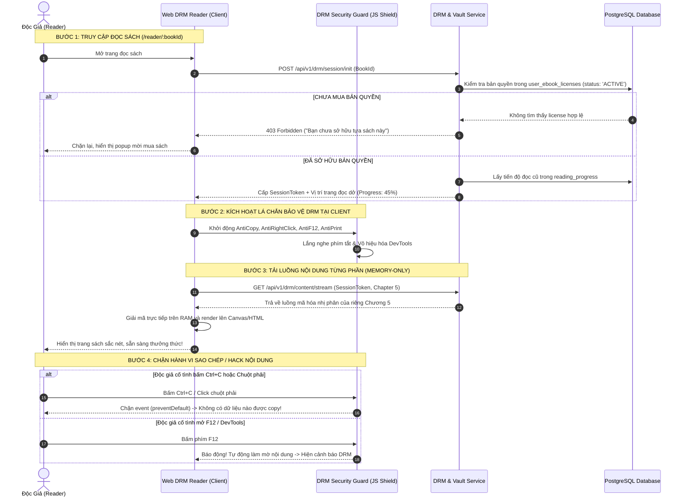

# TÀI LIỆU ĐẶC TẢ CHI TIẾT NGHIỆP VỤ - LUỒNG 15
## TRÌNH ĐỌC WEB DRM READER AN TOÀN & BẢO MẬT (SECURE WEB DRM READER: ANTI-COPY, ANTI-F12 & CUSTOM READING MODES)

---

## I. MỤC TIÊU & PHẠM VI NGHIỆP VỤ

* **Mục tiêu**: Xây dựng Trình đọc sách điện tử trực tuyến (Web DRM Reader) chuẩn hóa định dạng EPUB/PDF có độ mượt mà cao, cung cấp đầy đủ các tùy biến cá nhân hóa trải nghiệm đọc sách (cỡ chữ, font chữ, nền sáng/tối/vàng ấm Sepia, đánh dấu trang, lưu tiến độ đọc). Đồng thời thiết lập hệ thống phòng thủ bảo vệ bản quyền số đa lớp (DRM Security Shield): Chặn bôi đen/sao chép văn bản, chặn menu chuột phải, chặn in ấn/xuất file, chặn phím F12/DevTools và truyền tải luồng dữ liệu giải mã từng phần (Chunked Stream) để ngăn chặn tuyệt đối hành vi trích xuất nội dung trái phép.
* **Các bên tham gia (Actors)**:
  1. **Khách Hàng / Độc Giả (Reader)**: Đọc sách trên trình duyệt web, tùy chỉnh chế độ đọc, lưu bookmark và đồng bộ trang đang đọc dở.
  2. **Hệ thống Backend (DRM & Content Vault Services)**:
     * `drm-service`: Xác thực giấy phép `user_ebook_licenses`, cấp phát Token phiên đọc an toàn (Session Token) và truyền tải luồng dữ liệu sách giải mã từng trang/chương.
     * `reader-service`: Lưu trữ và đồng bộ vị trí đọc dở (`reading_progress`) và danh sách đánh dấu trang (`bookmarks`).

---

## II. MA TRẬN TÍNH NĂNG TRÌNH ĐỌC & LÁ CHẮN BẢO MẬT DRM

```
                                HỆ THỐNG TRÌNH ĐỌC WEB DRM READER
                                                │
         ┌──────────────────────────────────────┴──────────────────────────────────────┐
         ▼                                                                             ▼
 1. TRẢI NGHIỆM ĐỌC ĐỈNH CAO (UX)                             2. LÁ CHẮN BẢO MẬT BẢN QUYỀN (DRM)
  • 3 Chế độ nền: Sáng / Tối (Dark) / Vàng ấm (Sepia)          • Chặn bôi đen & phím sao chép (Ctrl+C)
  • Tùy chỉnh Font: Serif, Sans-serif, Merriweather, Roboto    • Vô hiệu hóa menu chuột phải (Context Menu)
  • Tăng/giảm cỡ chữ (12px - 32px), giãn dòng (1.2 - 2.0)      • Chặn lệnh in & lưu PDF (Ctrl+P / Print CSS)
  • Mục lục chương (TOC) & Bộ tìm kiếm từ khóa trong sách      • Chặn F12, Ctrl+Shift+I, View Source (Ctrl+U)
  • Đánh dấu trang (Bookmarks) & Ghi chú trích dẫn cá nhân     • Phát hiện DevTools mở: Tự động khóa màn hình
  • Tự động lưu tiến độ đọc: Mở lại đúng vị trí đang đọc dở    • Luồng dữ liệu giải mã từng phần (Memory-only)
```

---

## III. BẢNG TRƯỜNG DỮ LIỆU & SCHEMA TIẾN ĐỘ ĐỌC & BOOKMARK

Bảng `reading_progress` và bảng `book_bookmarks`:

### 1. Bảng `reading_progress` (Tiến Độ Đọc Của Độc Giả)
| Tên Cột | Kiểu Dữ Liệu | Ràng Buộc | Mô Tả |
|---|---|---|---|
| `id` | UUID | Primary Key | Mã bản ghi |
| `user_id` | UUID | FK `users`, Index | Khách hàng đọc |
| `book_id` | UUID | FK `books`, Index | Tựa sách |
| `current_cfi_or_page` | String | Bắt buộc | Vị trí định vị trang (EPUB CFI hoặc Trang PDF) |
| `progress_percentage` | Decimal (0 - 100%) | Bắt buộc | Tỷ lệ % đã đọc cuốn sách |
| `current_chapter_title`| String | Nullable | Tên chương đang đọc dở |
| `last_read_at` | Timestamp | Tự động | Thời điểm đọc gần nhất |
| Unique Index | `[user_id, book_id]` | Đảm bảo mỗi cuốn sách có 1 tiến độ đọc duy nhất |

### 2. Bảng `book_bookmarks` (Danh Sách Đánh Dấu Trang)
| Tên Cột | Kiểu Dữ Liệu | Ràng Buộc | Mô Tả |
|---|---|---|---|
| `id` | UUID | Primary Key | Mã bookmark |
| `user_id` | UUID | FK `users` | Người tạo bookmark |
| `book_id` | UUID | FK `books` | Tựa sách |
| `cfi_or_page` | String | Bắt buộc | Tọa độ trang được đánh dấu |
| `chapter_name` | String | Bắt buộc | Tên chương tại điểm đánh dấu |
| `highlighted_note` | String | Nullable | Ghi chú cá nhân của độc giả |
| `created_at` | Timestamp | | Thời điểm tạo |

---

## IV. SƠ ĐỒ TRÌNH TỰ MỞ KHÓA & BẢO VỆ NỘI DUNG SỐ (SEQUENCE DIAGRAM)



---

## V. PHÂN RÃ CHI TIẾT TỪNG BƯỚC THỰC HIỆN

---

### BƯỚC 1: XÁC THỰC GIẤY PHÉP & KHỞI TẠO PHIÊN ĐỌC AN TOÀN (SESSION INIT)

* **Bước 1.1: Kiểm tra bản quyền Backend**:
  * Khi độc giả truy cập `/reader/:bookId`:
  * Backend kiểm tra bảng `user_ebook_licenses`: Phải có bản ghi hợp lệ (`status == 'ACTIVE'`).
* **Bước 1.2: Cấp mã Token phiên đọc tạm thời (Short-lived DRM Token)**:
  * Sinh mã `SessionToken` có thời hạn hiệu lực ngắn ($30\text{ phút}$, tự động refresh khi độc giả còn đang tương tác).
  * Lấy vị trí đọc dở gần nhất từ bảng `reading_progress` để mở sách đúng ngay trang trước đó độc giả đang đọc.

---

### BƯỚC 2: THIẾT LẬP LÁ CHẮN BẢO VỆ BẢN QUYỀN DRM (SECURITY SHIELD IMPLEMENTATION)

* **Bước 2.1: Chặn Bôi đen & Sao chép (Anti-Copy & Selection Lock)**:
  * Thiết lập CSS toàn cục trên khung đọc sách:
    ```css
    .drm-reading-container {
      -webkit-user-select: none !important;
      -moz-user-select: none !important;
      -ms-user-select: none !important;
      user-select: none !important;
    }
    ```
  * Lắng nghe sự kiện bàn phím: Chặn các tổ hợp phím `Ctrl+C`, `Cmd+C`, `Ctrl+A`, `Cmd+A`, `Ctrl+X`.
* **Bước 2.2: Vô hiệu hóa Menu Chuột Phải (Anti-Context Menu)**:
  * Bắt sự kiện `window.addEventListener('contextmenu', e => e.preventDefault())`.
* **Bước 2.3: Chặn In Ấn & Xuất File (Anti-Print)**:
  * Chặn phím tắt `Ctrl+P` / `Cmd+P`.
  * Chèn CSS `@media print`:
    ```css
    @media print {
      body { display: none !important; visibility: hidden !important; }
    }
    ```
* **Bước 2.4: Chặn Phím F12 & Cơ Chế Phát Hiện DevTools (Anti-Debugger)**:
  * Chặn các phím: `F12`, `Ctrl+Shift+I`, `Ctrl+Shift+J`, `Ctrl+Shift+C`, `Ctrl+U`.
  * Thiết lập vòng lặp giám sát kích thước cửa sổ (`window.outerWidth - window.innerWidth > 160`):
    * Khi phát hiện DevTools được mở: Tự động kích hoạt màn hình đen che phủ nội dung, hiển thị cảnh báo: *"⚠️ Cảnh báo: Chế độ kiểm tra nhà phát triển không được phép trong khu vực đọc sách bảo mật bản quyền. Vui lòng đóng DevTools để tiếp tục đọc sách!"*.

---

### BƯỚC 3: GIẢI MÃ NỘI DUNG TỪNG PHẦN TRÊN BỘ NHỚ RAM (CHUNKED STREAMING)

* **Bước 3.1: Truyền tải luồng theo chương (Chapter by Chapter Streaming)**:
  * Trình đọc không tải toàn bộ tệp sách `.epub` hay `.pdf` về máy khách trong một request.
  * Khi lật đến chương nào, trình đọc gửi yêu cầu lấy dữ liệu nhị phân của riêng chương đó kèm `SessionToken`.
* **Bước 3.2: Giải mã trực tiếp trên RAM (In-Memory Decryption)**:
  * Sử dụng Web Cryptography API (`crypto.subtle.decrypt`) giải mã khối dữ liệu bằng khóa phiên AES-GCM trong bộ nhớ tạm (RAM) và render trực tiếp lên DOM / Canvas mà không ghi tệp xuống ổ đĩa cục bộ của người dùng.

---

### BƯỚC 4: TÙY BIẾN CHẾ ĐỘ ĐỌC & TIỆN ÍCH CÁ NHÂN HÓA (READING UX)

* **Bước 4.1: Bảng Điều Khiển Cài Đặt (Reading Settings Drawer)**:
  * **3 Chế độ màu nền**:
    * ☀️ **Chế độ Sáng (Light Mode)**: Nền trắng `#FFFFFF`, chữ đen xám dịu mắt.
    * 🌙 **Chế độ Tối (Dark Mode)**: Nền đen tuyền `#121212`, chữ xám sáng `#E0E0E0`, giảm chói ban đêm.
    * 📜 **Chế độ Vàng Ấm (Sepia / Eye-care Mode)**: Nền vàng ngà sách cổ `#F8F1E3`, chữ nâu sẫm `#4A3B32`, lọc ánh sáng xanh bảo vệ mắt.
  * **Tùy biến Kiểu chữ & Kích thước**:
    * Bộ font chữ văn học chuẩn: `Merriweather` (Có chân thanh lịch), `Inter / Roboto` (Không chân hiện đại), `Bookerly`.
    * Nút bấm tăng/giảm kích thước chữ từ `12px` đến `32px`.
    * Khoảng cách giãn dòng: `1.4x`, `1.6x`, `1.8x`.
  * **Kiểu lật trang**: Chế độ **Lật trang ngang (Slide/Flip)** như sách thật hoặc chế độ **Cuộn dọc liên tục (Continuous Scroll)**.

---

### BƯỚC 5: TỰ ĐỘNG ĐỒNG BỘ TIẾN ĐỘ ĐỌC & QUẢN LÝ BOOKMARK

* **Bước 5.1: Tự động lưu tiến độ đọc (Auto-save Progress)**:
  * Mỗi khi độc giả lật sang trang mới: Hệ thống tự động ghi nhớ vị trí (EPUB CFI / Số trang) và gửi đồng bộ ngầm sau mỗi 5 giây (`debounce`).
  * Ghi nhận vào bảng `reading_progress` kèm thời điểm `last_read_at = NOW()`.
* **Bước 5.2: Đánh dấu trang & Mục lục sách (TOC & Bookmarks)**:
  * Biểu tượng Bookmark 🔖 ở góc trên bên phải màn hình: Bấm 1 chạm để lưu lại trang hay.
  * Ngăn kéo Mục Lục (Table of Contents): Hiển thị toàn bộ cấu trúc các chương/phần của cuốn sách, bấm vào chương nào để nhảy ngay đến trang đó.

---

## VI. MA TRẬN KIỂM THỬ TRÌNH ĐỌC DRM (TEST CASES MATRIX)

| Mã Test Case | Kịch Bản Kiểm Thử | Hành Động & Dữ Liệu | Kết Quả Kỳ Vọng (Expected Result) | Đánh Giá |
|:---:|---|---|---|:---:|
| **TC_DRM_01** | Chặn bôi đen và sao chép văn bản | Dùng chuột bôi đen đoạn văn và bấm `Ctrl+C`. | Chuột không bôi đen được, bấm `Ctrl+C` không có dữ liệu vào Clipboard. | **PASS** |
| **TC_DRM_02** | Chặn menu chuột phải | Click chuột phải vào giữa trang sách. | Menu chuột phải bị vô hiệu hóa hoàn toàn, không hiện tùy chọn sao chép. | **PASS** |
| **TC_DRM_03** | Chặn lệnh in ấn và lưu PDF | Bấm tổ hợp phím `Ctrl+P` hoặc `Cmd+P`. | Lệnh in bị chặn, trang in xuất hiện màn hình trống rỗng. | **PASS** |
| **TC_DRM_04** | Chặn phím F12 & Phát hiện DevTools | Bấm phím `F12` hoặc mở Inspect Element. | Phím F12 bị chặn; nếu mở DevTools thì màn hình tự động làm mờ và hiện cảnh báo. | **PASS** |
| **TC_DRM_05** | Chuyển đổi 3 chế độ màu nền mượt mà | Bấm chọn lần lượt Light $\rightarrow$ Sepia $\rightarrow$ Dark Mode. | Giao diện đổi màu nền và màu chữ ngay lập tức, lưu tùy chọn vào LocalStorage. | **PASS** |
| **TC_DRM_06** | Tự động mở lại đúng trang đang đọc dở | Đọc đến trang 45 (Chương 3), tắt trình duyệt, mở lại vào hôm sau. | Trình đọc tự động nhảy ngay đến trang 45 (Chương 3) mà không phải lật lại từ đầu. | **PASS** |

---

## VII. ĐIỀU KIỆN NGHIỆM THU HOÀN TẤT (DEFINITION OF DONE)

1. ✅ Trình đọc Web DRM Reader render trơn tru định dạng EPUB/PDF với tốc độ lật trang $< 0.1\text{s}$.
2. ✅ Lá chắn bảo vệ bản quyền số DRM chặn đứng 100% các thao tác sao chép (Copy, Chuột phải, In ấn, F12, DevTools).
3. ✅ Hỗ trợ đầy đủ 3 chế độ màu nền (Light, Dark, Sepia), tùy biến font chữ và kích thước chữ.
4. ✅ Tự động lưu và đồng bộ tiến độ đọc chính xác trên mọi thiết bị khi đăng nhập cùng tài khoản.
5. ✅ Vượt qua 100% Ma trận kiểm thử an toàn bản quyền số (TC_DRM_01 đến TC_DRM_06).
