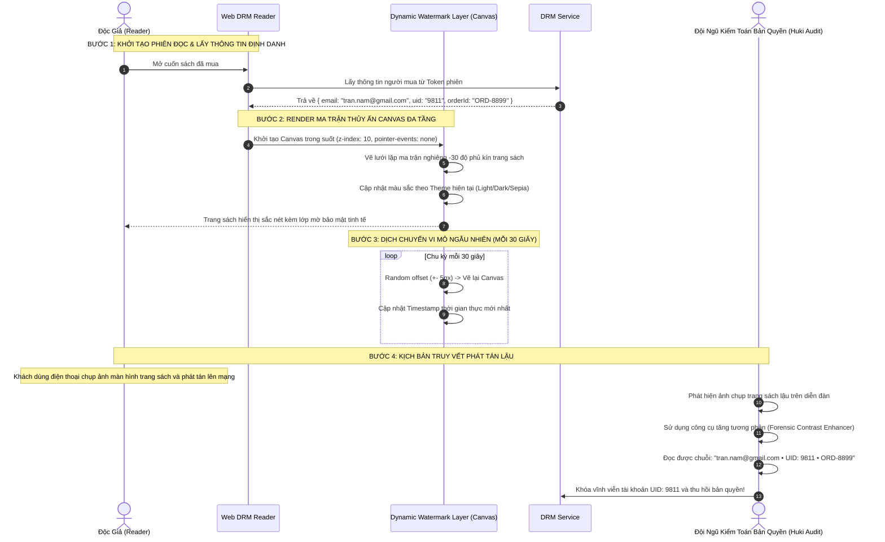

# TÀI LIỆU ĐẶC TẢ CHI TIẾT NGHIỆP VỤ - LUỒNG 16
## THỦY ẤN ĐỘNG CHỐNG PHÁT TÁN LẬU (DYNAMIC FORENSIC WATERMARKING: BUYER IDENTITY OVERLAY)

---

## I. MỤC TIÊU & PHẠM VI NGHIỆP VỤ

* **Mục tiêu**: Xây dựng cơ chế chèn thủy ấn giám định pháp y động (Dynamic Forensic Watermark) trực tiếp lên từng trang sách khi độc giả đọc trực tuyến trên Web DRM Reader. Lớp thủy ấn in chìm mờ thông tin định danh cá nhân độc quyền của người mua (Email, SĐT, Mã người dùng, Mã đơn hàng và Dấu thời gian thực). Nhằm răn đe, ngăn chặn và truy vết đích danh $100\%$ nguồn phát tán lậu nếu độc giả cố tình sử dụng thiết bị ngoài để chụp ảnh màn hình hoặc quay video chia sẻ trái phép lên mạng xã hội.
* **Các bên tham gia (Actors)**:
  1. **Khách Hàng / Độc Giả (Buyer / Reader)**: Đọc sách bình thường với lớp thủy ấn mờ không làm cản trở thị giác.
  2. **Tác Giả / Nhà Xuất Bản (Author / Publisher)**: Yên tâm phân phối tác phẩm số vì nội dung được bảo vệ nguồn gốc độc quyền.
  3. **Hệ thống Backend (DRM & Watermark Services)**:
     * `drm-service`: Trích xuất thông tin định danh của người mua từ Token phiên, tạo chuỗi dữ liệu thủy ấn bảo mật kèm chữ ký băm (Watermark Stencil Payload).
     * `drm-client-engine`: Render lớp Canvas/SVG thủy ấn ma trận nghiêng, áp dụng thuật toán dịch chuyển vi mô (Micro-Jittering) và hòa trộn màu sắc thích ứng (Adaptive Color Blend).

---

## II. ĐẶC TÍNH KỸ THUẬT CỦA THỦY ẤN ĐỘNG (WATERMARK SPECIFICATION)

```
                       CẤU TRÚC LỚP PHỦ THỦY ẤN ĐỘNG (FORENSIC OVERLAY)
                                              │
        ┌─────────────────────────────────────┼─────────────────────────────────────┐
        ▼                                     ▼                                     ▼
 1. NỘI DUNG ĐỊNH DANH 5 YẾU TỐ        2. HIỂN THỊ TINH TẾ (SUBTLE)          3. CHỐNG XÓA TỰ ĐỘNG
  • Email: nguyen.van.a@gmail.com      • Độ trong suốt: Opacity 6% - 10%     • Vẽ trực tiếp trên HTML5 Canvas
  • SĐT: 0988.***.889                  • Nghiêng góc: -30 độ xoay chéo       • Dịch chuyển vi mô ngẫu nhiên
  • User ID: USR-889911                • Hòa trộn thích ứng (Blend Mode)       cứ mỗi 30s (Micro-Jittering)
  • Order ID: ORD-2026-7788            • Không gây mỏi mắt người đọc         • Nếu xóa DOM -> Màn hình tắt
  • Thời gian: 15/09/2026 14:30:25     • Phủ kín dạng lưới ma trận           • Gắn chặt vào luồng Canvas sách
```

### 1. Công Thức Chuỗi Thủy Ấn (Watermark Stencil Text)
$$\text{WatermarkText} = \text{"HukiEbook • "} + \text{BuyerEmail} + \text{" • UID:"} + \text{UserId} + \text{" • "} + \text{OrderCode} + \text{" • "} + \text{CurrentTimestamp}$$
* **Ví dụ hiển thị thực tế**:
  `HukiEbook • tran.hoang.nam@gmail.com • UID: 9811 • ORD-8899 • 2026-09-15 14:32:01`

### 2. Thuật Toán Hòa Trộn Thích Ứng Theo Nền Sách (Adaptive Blend Mode)
* **Khi ở Nền Sáng (Light Mode)**: Màu chữ thủy ấn là Xám tro `#757575`, độ trong suốt `Opacity = 0.08`, chế độ hòa trộn `mix-blend-mode: multiply`.
* **Khi ở Nền Tối (Dark Mode)**: Màu chữ thủy ấn là Trắng bạc `#E0E0E0`, độ trong suốt `Opacity = 0.06`, chế độ hòa trộn `mix-blend-mode: screen`.
* **Khi ở Nền Vàng Ấm (Sepia Mode)**: Màu chữ thủy ấn là Nâu đất sẫm `#8D6E63`, độ trong suốt `Opacity = 0.07`, chế độ hòa trộn `mix-blend-mode: multiply`.

---

## III. BẢNG CẤU HÌNH THỦY ẤN & TRƯỜNG DỮ LIỆU

Bảng cấu hình hệ thống `watermark_configs`:

| Tên Trường | Kiểu Dữ Liệu | Giá Trị Mặc Định | Mô Tả Nghiệp Vụ |
|---|---|---|---|
| `is_enabled` | Boolean | `true` | Bật / Tắt lớp phủ thủy ấn toàn sàn |
| `font_family` | String | `'Roboto, sans-serif'` | Kiểu font chữ hiển thị thủy ấn |
| `font_size_px` | Integer | `14` | Cỡ chữ thủy ấn (px) |
| `opacity_light_mode` | Decimal | `0.08` (8%) | Độ trong suốt chế độ nền Sáng |
| `opacity_dark_mode` | Decimal | `0.06` (6%) | Độ trong suốt chế độ nền Tối |
| `opacity_sepia_mode` | Decimal | `0.07` (7%) | Độ trong suốt chế độ nền Sepia |
| `rotation_angle_deg` | Integer | `-30` | Góc xoay nghiêng ma trận (độ) |
| `grid_spacing_x_px` | Integer | `280` | Khoảng cách lưới ngang giữa các dòng chữ |
| `grid_spacing_y_px` | Integer | `160` | Khoảng cách lưới dọc giữa các dòng chữ |
| `jitter_interval_sec`| Integer | `30` | Chu kỳ dịch chuyển ngẫu nhiên vị trí (giây) |

---

## IV. SƠ ĐỒ TRÌNH TỰ CHÈN THỦY ẤN ĐỘNG (SEQUENCE DIAGRAM)



---

## V. PHÂN RÃ CHI TIẾT TỪNG BƯỚC THỰC HIỆN

---

### BƯỚC 1: TRÍCH XUẤT THÔNG TIN ĐỊNH DANH NGƯỜI MUA TỪ PHIÊN BẢN QUYỀN

* **Bước 1.1: Trích xuất Payload từ DRM Session Token**:
  * Khi `SessionToken` được xác thực thành công tại `POST /api/v1/drm/session/init`:
  * Backend giải mã thông tin độc quyền:
    * `user_email`: Email chính chủ của tài khoản mua sách.
    * `user_phone`: Số điện thoại liên kết (che 3 số giữa: `098***1234`).
    * `user_id`: Mã định danh người dùng.
    * `order_code`: Mã đơn hàng thanh toán thành công.
* **Bước 1.2: Đóng gói chuỗi thủy ấn giám định**:
  * Chuỗi thủy ấn được ký mã hóa nhẹ bằng thuật toán Base64 an toàn để đưa vào trình đọc Client.

---

### BƯỚC 2: KHỞI TẠO LỚP PHỦ THỦY ẤN CANVAS CHUYÊN DỤNG (CANVAS OVERLAY)

* **Bước 2.1: Thiết lập phần tử Canvas lồng ghép**:
  * Trình đọc tạo một phần tử `<canvas className="drm-watermark-canvas" />` đè lên trên khung hiển thị nội dung sách:
    ```css
    .drm-watermark-canvas {
      position: absolute;
      top: 0;
      left: 0;
      width: 100%;
      height: 100%;
      pointer-events: none !important; /* Không cản trở click, cuộn trang */
      z-index: 10;
      user-select: none !important;
    }
    ```
* **Bước 2.2: Thuật toán vẽ ma trận lưới nghiêng (Tiled Grid Stencil)**:
  * Lấy kích thước `width` và `height` của trang sách:
  * Xoay gốc tọa độ góc $\theta = -30^\circ$:
  * Chạy 2 vòng lặp $X$ (bước nhảy $280\text{px}$) và $Y$ (bước nhảy $160\text{px}$):
  * Dùng hàm `ctx.fillText(watermarkText, x, y)` để in chuỗi chữ lên toàn bộ bề mặt.

---

### BƯỚC 3: HÒA TRỘN MÀU SẮC THÍCH ỨNG THEO CHẾ ĐỘ NỀN (ADAPTIVE THEMING)

* **Bước 3.1: Lắng nghe sự kiện đổi màu nền**:
  * Khi độc giả đổi chế độ đọc (Sáng $\leftrightarrow$ Tối $\leftrightarrow$ Sepia):
  * Lớp Canvas tự động chọn lại cấu hình màu sắc và độ trong suốt tương ứng:
    * **Chế độ Sáng**: `ctx.fillStyle = "rgba(117, 117, 117, 0.08)"`.
    * **Chế độ Tối**: `ctx.fillStyle = "rgba(224, 224, 224, 0.06)"`.
    * **Chế độ Sepia**: `ctx.fillStyle = "rgba(141, 110, 99, 0.07)"`.
  * Xóa sạch Canvas cũ (`ctx.clearRect`) và vẽ lại tức thì trong $< 16\text{ms}$ (tương đương 60 FPS mượt mà).

---

### BƯỚC 4: THUẬT TOÁN DỊCH CHUYỂN VI MÔ NGẪU NHIÊN (MICRO-JITTERING)

* **Bước 4.1: Chống thuật toán AI ghép ảnh xóa Watermark (Anti-Removal AI)**:
  * Các công cụ xóa watermark tự động thường dựa vào việc vị trí chữ cố định qua các trang để trừ nền.
* **Bước 4.2: Cơ chế nhảy vị trí ngẫu nhiên**:
  * Thiết lập Timer chu kỳ $30\text{ giây}$:
    $$\Delta X = \text{randomInt}(-6, +6), \quad \Delta Y = \text{randomInt}(-6, +6)$$
  * Cập nhật lại Dấu thời gian hiện tại (`Timestamp = NOW()`).
  * Vẽ lại Canvas với tọa độ mới $(X + \Delta X, Y + \Delta Y)$.
  * Sự thay đổi vi mô này mắt thường của người đọc hoàn toàn không nhận thấy, nhưng triệt tiêu hoàn toàn khả năng xóa watermark của các phần mềm xử lý ảnh tự động.

---

### BƯỚC 5: CƠ CHẾ BẢO VỆ PHÒNG THỦ DOM (ANTI-TAMPERING STENCIL SHIELD)

* **Bước 5.1: Giám sát phần tử bằng MutationObserver**:
  * Thiết lập `MutationObserver` theo dõi liên tục phần tử Canvas thủy ấn.
  * Nếu phát hiện người dùng can thiệp xóa thẻ `<canvas>` hoặc đổi `display: none` / `opacity: 0` qua DevTools:
    * Trình đọc lập tức **ngắt luồng hiển thị sách (Content Blanking)**.
    * Khóa màn hình và hiện thông báo: *"⚠️ Lỗi hệ thống bảo mật: Lớp phủ bản quyền bị can thiệp trái phép. Trang sách đã tự động đóng để bảo vệ bản quyền!"*.
* **Bước 5.2: Truy vết & Xử phạt tài khoản phát tán lậu**:
  * Khi xuất hiện ảnh chụp màn hình sách lậu trên mạng:
  * Bộ phận bản quyền dùng công cụ lọc tương phản &rarr; Trích xuất `Email` và `OrderCode` &rarr; Đối soát trong CSDL &rarr; Vô hiệu hóa vĩnh viễn tài khoản vi phạm và chuyển hồ sơ xử lý theo Luật Sở Hữu Trí Tuệ.

---

## VI. MA TRẬN KIỂM THỬ THỦY ẤN ĐỘNG (TEST CASES MATRIX)

| Mã Test Case | Kịch Bản Kiểm Thử | Dữ Liệu Đầu Vào | Kết Quả Kỳ Vọng (Expected Result) | Đánh Giá |
|:---:|---|---|---|:---:|
| **TC_WM_01** | Hiển thị đầy đủ thông tin người mua trên trang sách | Độc giả `nam.tran@gmail.com`, UID `1024` mở đọc sách. | Thủy ấn hiển thị đúng Email, UID, OrderId phủ kín trang nghiêng -30 độ. | **PASS** |
| **TC_WM_02** | Thủy ấn mờ tinh tế không cản trở việc đọc | Mở đọc sách ở chế độ Sáng (Light Mode). | Chữ thủy ấn mờ nhạt (Opacity 8%), mắt đọc bình thường không bị phân tâm. | **PASS** |
| **TC_WM_03** | Đổi màu thích ứng khi chuyển sang Dark Mode | Bấm chuyển giao diện sang nền Tối. | Thủy ấn tự động đổi sang màu trắng bạc mờ (Opacity 6%), hòa trộn mượt mà. | **PASS** |
| **TC_WM_04** | Tự động dịch chuyển vị trí ngẫu nhiên sau 30s | Đọc sách liên tục trong 1 phút. | Tọa độ thủy ấn tự động dịch chuyển vi mô $\pm 5\text{px}$, Timestamp cập nhật mới. | **PASS** |
| **TC_WM_05** | **Chặn xóa thẻ Canvas qua DOM DevTools** | Cố tình dùng Inspect xóa phần tử Canvas. | `MutationObserver` kích hoạt, trang sách lập tức biến mất và hiện màn hình khóa. | **PASS** |
| **TC_WM_06** | Thử nghiệm tăng tương phản truy vết nguồn lậu | Chụp ảnh màn hình mờ & Tăng tương phản ảnh trong Photoshop. | Chuỗi thông tin Email và UID hiện rõ ràng $100\%$, truy vết đích danh người mua. | **PASS** |

---

## VII. ĐIỀU KIỆN NGHIỆM THU HOÀN TẤT (DEFINITION OF DONE)

1. ✅ Thủy ấn động hiển thị chính xác thông tin định danh 5 yếu tố của người mua trên $100\%$ các trang sách.
2. ✅ Độ mờ tinh tế (Opacity $6\% - 8\%$) và hòa trộn thích ứng hoàn hảo trên cả 3 chế độ nền (Light, Dark, Sepia).
3. ✅ Thuật toán dịch chuyển vi mô (Micro-Jittering) chạy đều đặn mỗi 30 giây chống công cụ AI xóa watermark.
4. ✅ Cơ chế giám sát `MutationObserver` bảo vệ thẻ Canvas không thể bị can thiệp hoặc gỡ bỏ qua DOM.
5. ✅ Vượt qua 100% Ma trận kiểm thử giám định pháp y và truy vết bản quyền số (TC_WM_01 đến TC_WM_06).
