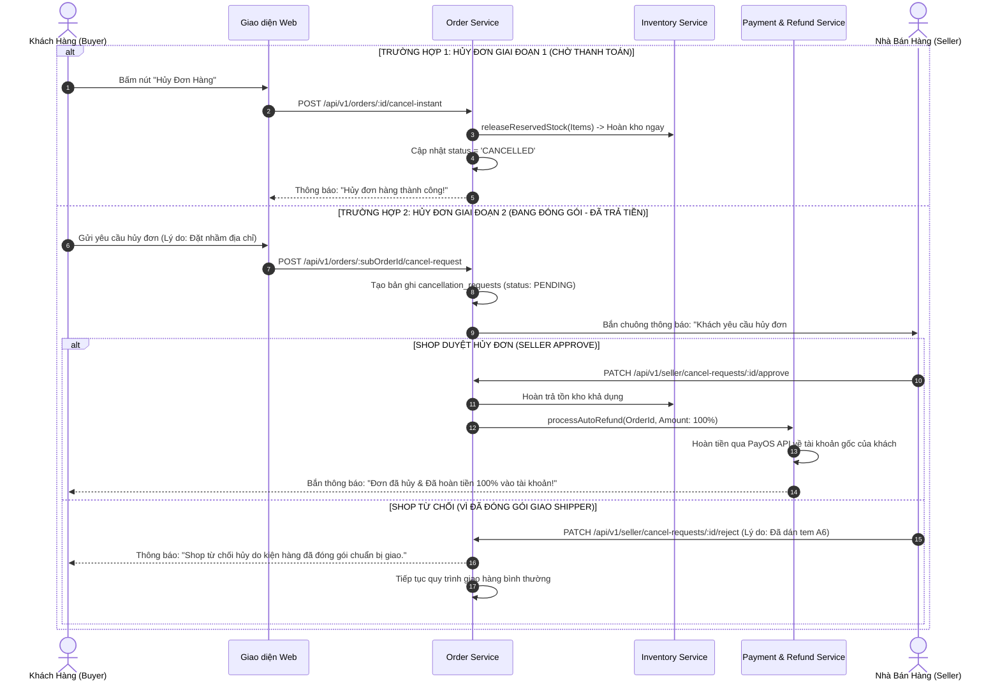

# TÀI LIỆU ĐẶC TẢ CHI TIẾT NGHIỆP VỤ - LUỒNG 17
## CHÍNH SÁCH HỦY ĐƠN HÀNG PHÂN CẤP & HOÀN TIỀN TỰ ĐỘNG (MULTI-STAGE ORDER CANCELLATION & AUTOMATED REFUND)

---

## I. MỤC TIÊU & PHẠM VI NGHIỆP VỤ

* **Mục tiêu**: Xây dựng chính sách hủy đơn hàng phân cấp đa tầng (Multi-Stage Cancellation Matrix) minh bạch, cân bằng quyền lợi giữa Khách mua và Nhà bán hàng. Quy định rõ ràng quyền tự hủy 1 chạm, quy trình gửi yêu cầu duyệt hủy khi Shop đang đóng gói, cơ chế khóa nút hủy khi hàng đã xuất kho cho Shipper, và hệ thống tự động hoàn tiền $100\%$ (Automated Refund) về tài khoản ngân hàng gốc của độc giả khi đơn hủy hợp lệ.
* **Các bên tham gia (Actors)**:
  1. **Khách Hàng (Buyer)**: Thực hiện tự hủy đơn hoặc gửi yêu cầu hủy kèm lý do chi tiết.
  2. **Nhà Bán Hàng (Seller)**: Tiếp nhận yêu cầu hủy, kiểm tra tiến độ kho (đã bọc gói/dán tem chưa) để duyệt hoặc từ chối.
  3. **Hệ thống Backend (Order, Inventory & Payment Services)**:
     * `order-service`: Điều phối máy trạng thái hủy đơn, xử lý timeout tự động duyệt hủy sau 24h.
     * `inventory-service`: Tự động hoàn trả tồn kho (`reserved_stock` hoặc `on_hand_stock`).
     * `payment-service`: Kích hoạt API hoàn tiền tự động qua cổng PayOS / Ngân hàng.

---

## II. MA TRẬN CHÍNH SÁCH HỦY ĐƠN THEO 4 GIAI ĐOẠN (CANCELLATION MATRIX)

```
                            MA TRẬN CHÍNH SÁCH HỦY ĐƠN PHÂN CẤP
                                             │
      ┌──────────────────────┬───────────────┴───────────────┬──────────────────────┐
      ▼                      ▼                               ▼                      ▼
 GIAI ĐOẠN 1            GIAI ĐOẠN 2                     GIAI ĐOẠN 3            GIAI ĐOẠN 4
(CHỜ THANH TOÁN)       (CHỜ ĐÓNG GÓI)                  (ĐANG GIAO HÀNG)       (ĐƠN HÀNG EBOOK)
 • Tự hủy 1 chạm        • Gửi yêu cầu duyệt hủy         • KHÓA NÚT HỦY         • Không áp dụng
 • Không cần Shop duyệt • Shop duyệt trong 24h          • Khách từ chối nhận     hủy tự do sau
 • Hoàn kho tức thì     • Quá 24h: Tự động duyệt          hàng khi Shipper đến   khi đã mở khóa
 • Hủy mã VietQR        • Hoàn tiền online 100%         • Hàng hoàn về kho       vào Tủ sách
```

### 1. Bảng Chi Tiết Chính Sách Hủy Đơn Theo Từng Giai Đoạn

| Giai Đoạn Đơn Hàng | Trạng Thái Đơn (`status`) | Quyền Hạn Của Khách Hàng | Phê Duyệt Của Seller | Cơ Chế Hoàn Tiền & Hoàn Kho |
|---|---|---|:---:|---|
| **Giai Đoạn 1: Đơn Mới Tạo** | `PENDING_PAYMENT` / `PENDING_CONFIRMATION` | **Tự do hủy ngay 1 chạm** | ❌ Không cần | Giải phóng kho tạm giữ ngay lập tức, hoàn lại lượt dùng Voucher. |
| **Giai Đoạn 2: Shop Chuẩn Bị** | `CONFIRMED` / `PACKING` | **Gửi yêu cầu hủy** (kèm lý do) | ✅ Bắt buộc (Có thời hạn 24h) | Nếu Shop duyệt: Hoàn tiền $100\%$ online trong 5-15p, nhả kho khả dụng. |
| **Giai Đoạn 3: Đã Bàn Giao** | `SHIPPING` / `IN_TRANSIT` | 🚫 **Bị khóa nút hủy** | ❌ Không áp dụng | Khách chỉ có thể từ chối nhận khi Shipper giao (Boom hàng/Hoàn hàng). |
| **Giai Đoạn 4: Ấn Bản Ebook** | `DELIVERED` (Ebook) | 🚫 **Không thể tự hủy** | ❌ Không áp dụng | Đã mở khóa nội dung số; chỉ xử lý tranh chấp khi tệp lỗi qua Luồng 18. |

---

## III. BẢNG TRƯỜNG DỮ LIỆU & SCHEMA YÊU CẦU HỦY ĐƠN

Bảng quản lý yêu cầu hủy đơn `cancellation_requests`:

| Tên Cột | Kiểu Dữ Liệu | Ràng Buộc | Mô Tả |
|---|---|---|---|
| `id` | UUID | Primary Key | Mã định danh yêu cầu hủy |
| `order_id` | UUID | FK `orders` | Đơn hàng tổng |
| `sub_order_id` | UUID | FK `sub_orders`, Index | Đơn con của Shop bị yêu cầu hủy |
| `user_id` | UUID | FK `users` | Khách hàng gửi yêu cầu |
| `business_id` | UUID | FK `businesses` | Gian hàng xử lý yêu cầu |
| `stage_at_cancel` | Enum | `STAGE_1_PENDING`, `STAGE_2_PACKING` | Giai đoạn lúc gửi yêu cầu |
| `reason_code` | Enum | `CHANGE_MIND`, `WRONG_ADDRESS`, `FOUND_CHEAPER`, `FORGOT_VOUCHER`, `OTHER` | Mã lý do hủy |
| `reason_detail` | String | Nullable | Mô tả chi tiết lý do |
| `status` | Enum | `PENDING_SELLER_APPROVAL`, `APPROVED`, `REJECTED`, `AUTO_APPROVED` | Trạng thái yêu cầu |
| `seller_reject_reason`| String | Nullable | Lý do Shop từ chối (VD: "Đã bọc chống sốc dán tem") |
| `refund_status` | Enum | `NOT_REQUIRED` (Chưa trả tiền), `PENDING_REFUND`, `REFUNDED` | Tiến độ hoàn tiền |
| `auto_approve_at` | Timestamp | `created_at + 24h` | Hạn chót Shop phải phản hồi |
| `resolved_at` | Timestamp | Nullable | Thời điểm xử lý xong |

---

## IV. SƠ ĐỒ TRÌNH TỰ XỬ LÝ HỦY ĐƠN & HOÀN TIỀN (SEQUENCE DIAGRAM)



---

## V. PHÂN RÃ CHI TIẾT TỪNG BƯỚC THỰC HIỆN

---

### BƯỚC 1: XỬ LÝ HỦY ĐƠN 1 CHẠM TỨC THÌ (INSTANT CANCELLATION - GIAI ĐOẠN 1)

* **Bước 1.1: Khách bấm "Hủy đơn hàng"**:
  * Khi đơn ở trạng thái `PENDING_PAYMENT` hoặc `PENDING_CONFIRMATION`:
  * Mở Modal chọn nhanh lý do hủy: *"Đổi ý không mua nữa"*, *"Muốn đổi địa chỉ nhận hàng"*, *"Quên áp mã voucher giảm giá"*.
* **Bước 1.2: Xử lý nguyên tử Backend**:
  * Chuyển trạng thái đơn sang `CANCELLED`.
  * Giải phóng số lượng sách đang tạm giữ: `reserved_stock = GREATEST(0, reserved_stock - qty)`.
  * Tăng lại bộ đếm kho Redis: `INCRBY stock:book:{id} qty`.
  * Hoàn trả lại lượt dùng mã Voucher cho khách hàng.

---

### BƯỚC 2: TIẾP NHẬN YÊU CẦU HỦY ĐƠN GIAI ĐOẠN ĐÓNG GÓI (GIAI ĐOẠN 2)

* **Bước 2.1: Gửi yêu cầu xét duyệt hủy**:
  * Khi đơn đã ở trạng thái `CONFIRMED` / `PACKING`:
  * Khách hàng bấm **"Yêu Cầu Hủy Đơn"** → Nhập lý do chi tiết.
  * Hệ thống tạo bản ghi trong `cancellation_requests` với `status = 'PENDING_SELLER_APPROVAL'`.
  * Thiết lập mốc tự động duyệt sau 24 giờ: `auto_approve_at = NOW() + INTERVAL '24 hours'`.
* **Bước 2.2: Thông báo khẩn đến Seller**:
  * Đơn hàng xuất hiện nhãn viền cam: ⚠️ **"Có yêu cầu hủy từ khách"**.
  * Bắn thông báo đẩy trên Seller Portal: *"Đơn hàng #S1 có yêu cầu hủy từ người mua. Vui lòng phản hồi trong vòng 24 giờ!"*.

---

### BƯỚC 3: QUY TRÌNH PHÊ DUYỆT CỦA SELLER & XỬ LÝ TIMEOUT 24H

* **Bước 3.1: Seller Phê Duyệt Hủy (`APPROVED`)**:
  * Nếu Shop chưa đóng gói hoặc đồng ý hỗ trợ khách:
  * Seller bấm **"Đồng ý hủy đơn"**:
    * Đơn hàng chuyển sang `CANCELLED`.
    * Kích hoạt luồng Hoàn tiền tự động $100\%$.
    * Hoàn trả số lượng sách về kho khả dụng.
* **Bước 3.2: Seller Từ Chối Hủy (`REJECTED`)**:
  * Nếu kiện hàng đã bọc chống sốc, đã in dán tem A6 và đang chờ Shipper đến bốc hàng:
  * Seller bấm **"Từ chối hủy"** kèm nhập lý do rõ ràng (VD: *"Sách đã được đóng gói hoàn tất và bàn giao bưu tá"*).
  * Đơn hàng tiếp tục quy trình giao vận bình thường.
* **Bước 3.3: Tự động Duyệt Hủy Khi Hết Hạn 24h (Auto-Approval Worker)**:
  * Nếu sau 24 giờ Seller không thực hiện bất kỳ thao tác duyệt hay từ chối nào:
  * Cron Job tự động chuyển yêu cầu sang `AUTO_APPROVED`, tự động hủy đơn và hoàn tiền cho khách nhằm bảo vệ quyền lợi người tiêu dùng.

---

### BƯỚC 4: THỰC THI HOÀN TIỀN TỰ ĐỘNG $100\%$ (AUTOMATED REFUND ENGINE)

* **Bước 4.1: Kiểm tra phương thức thanh toán ban đầu**:
  * Nếu đơn thanh toán **COD**: Không phát sinh dòng tiền hoàn trả.
  * Nếu đơn thanh toán online qua **PayOS VietQR / VNPAY**:
* **Bước 4.2: Gọi API Hoàn Tiền Tự Động**:
  * `payment-service` gửi lệnh hoàn tiền `POST /api/v1/payments/refund`:
    * Mã giao dịch gốc: `transaction_id`.
    * Số tiền hoàn: $100\%$ giá trị thanh toán thực tế của đơn con đó.
    * Lý do: *"Hoàn tiền đơn hàng hủy #HUKI-8899"*.
  * Tiền được chuyển trả thẳng về tài khoản ngân hàng / ví điện tử mà khách đã dùng để thanh toán trong vòng $5 - 15\text{ phút}$.
  * Cập nhật `refund_status = 'REFUNDED'` và gửi email biên lai hoàn tiền cho độc giả.

---

### BƯỚC 5: KHÓA HỦY ĐƠN ĐỐI VỚI GIAI ĐOẠN VẬN CHUYỂN & EBOOK

* **Bước 5.1: Khóa nút hủy khi đơn chuyển `SHIPPING`**:
  * Khi Shipper đã quét mã bốc hàng khỏi kho:
  * Nút "Hủy đơn" trên giao diện người mua tự động bị ẩn / vô hiệu hóa, thay thế bằng dòng thông điệp: *"Kiện hàng đã được bàn giao cho đơn vị vận chuyển và đang trên đường giao. Bạn có thể từ chối nhận hàng khi Shipper liên hệ giao hàng."*.
* **Bước 5.2: Ngoại lệ đối với Ebook bản quyền**:
  * Ấn phẩm Ebook mở khóa tức thì không áp dụng hủy đơn tùy ý để bảo vệ tác quyền tác giả (Chỉ xử lý hoàn tiền nếu tệp sách bị lỗi nội dung qua Luồng 18 Khiếu nại).

---

## VI. MA TRẬN KIỂM THỬ CHÍNH SÁCH HỦY ĐƠN (TEST CASES MATRIX)

| Mã Test Case | Kịch Bản Kiểm Thử | Giai Đoạn Đơn Hàng | Kết Quả Kỳ Vọng (Expected Result) | Đánh Giá |
|:---:|---|---|---|:---:|
| **TC_CAN_01** | Khách tự hủy đơn chờ thanh toán 1 chạm | Đơn `PENDING_PAYMENT` (Chưa trả tiền). | Đơn hủy ngay, kho tạm giữ giải phóng, mã QR hết hiệu lực. | **PASS** |
| **TC_CAN_02** | Khách gửi yêu cầu hủy đơn đang đóng gói | Đơn `CONFIRMED` (Đã trả PayOS 100k). | Tạo yêu cầu hủy, Shop nhận thông báo, hạn chót phản hồi 24h. | **PASS** |
| **TC_CAN_03** | Shop đồng ý duyệt hủy đơn | Shop bấm "Đồng ý hủy" đơn 100k. | Đơn hủy, kích hoạt hoàn tiền tự động 100k về tài khoản ngân hàng khách. | **PASS** |
| **TC_CAN_04** | Shop từ chối yêu cầu hủy | Shop bấm "Từ chối" do đã đóng gói. | Yêu cầu hủy bị từ chối, đơn tiếp tục giao bình thường, báo lý do cho khách. | **PASS** |
| **TC_CAN_05** | Tự động duyệt hủy sau 24h Shop không phản hồi | Quá 24h Shop không bấm duyệt/từ chối. | Hệ thống tự động duyệt `AUTO_APPROVED`, đơn hủy và tiền tự động hoàn trả. | **PASS** |
| **TC_CAN_06** | Khóa nút hủy khi đơn đang giao | Đơn hàng chuyển sang `SHIPPING`. | Giao diện ẩn nút Hủy đơn, chỉ cho phép Xem hành trình. | **PASS** |

---

## VII. ĐIỀU KIỆN NGHIỆM THU HOÀN TẤT (DEFINITION OF DONE)

1. ✅ Triển khai chính xác ma trận hủy đơn 4 giai đoạn theo đúng quy chuẩn nghiệp vụ.
2. ✅ Tính năng tự hủy 1 chạm ở Giai đoạn 1 giải phóng kho và hoàn voucher tức thì.
3. ✅ Quy trình gửi yêu cầu duyệt hủy ở Giai đoạn 2 hoạt động mượt mà với cơ chế tự động duyệt sau 24h.
4. ✅ Tích hợp hoàn tiền tự động $100\%$ qua cổng PayOS / Ngân hàng trong vòng $< 15\text{ phút}$.
5. ✅ Vượt qua 100% Ma trận kiểm thử hủy đơn và hoàn tiền (TC_CAN_01 đến TC_CAN_06).
