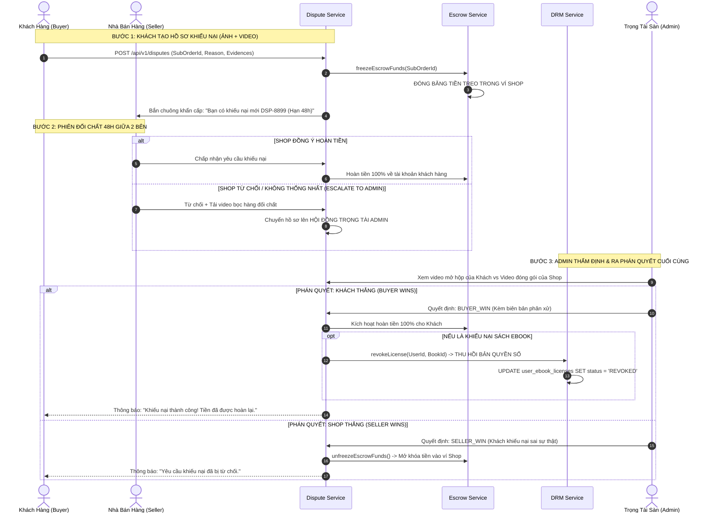

# TÀI LIỆU ĐẶC TẢ CHI TIẾT NGHIỆP VỤ - LUỒNG 18
## KHIẾU NẠI, TRẢ HÀNG & TRỌNG TÀI PHÂN XỬ CỦA ADMIN (RETURN/REFUND DISPUTES & ADMIN ARBITRATION)

---

## I. MỤC TIÊU & PHẠM VI NGHIỆP VỤ

* **Mục tiêu**: Xây dựng quy trình xử lý khiếu nại, trả hàng và hoàn tiền (Return & Dispute Management) minh bạch, công bằng giữa Người mua và Người bán. Ngay khi có khiếu nại phát sinh, hệ thống tự động **Đóng băng dòng tiền Escrow** của đơn hàng, mở phiên đối chất 2 chiều có giới hạn thời gian (48h). Trong trường hợp tranh chấp không thể tự hòa giải, Quản trị viên Sàn (Admin) đóng vai trò Trọng tài tối cao phân xử dựa trên chứng cứ khách quan, kích hoạt luồng hoàn tiền và thu hồi giấy phép bản quyền số (Ebook License Revocation) đối với các trường hợp vi phạm.
* **Các bên tham gia (Actors)**:
  1. **Khách Hàng (Buyer / Disputant)**: Tạo yêu cầu khiếu nại, tải lên ảnh/video bằng chứng mở hộp (Unboxing proof).
  2. **Nhà Bán Hàng (Seller / Respondent)**: Tiếp nhận khiếu nại, phản hồi chứng cứ đối chất (phiếu xuất kho, video đóng gói) hoặc chấp thuận đổi trả.
  3. **Quản Trị Viên Sàn (Admin / Arbitrator)**: Trọng tài thẩm định hồ sơ, đưa ra phán quyết cuối cùng có hiệu lực thi hành bắt buộc.
  4. **Hệ thống Backend (Dispute, Escrow & DRM Services)**:
     * `dispute-service`: Quản trị phòng đối chất, lịch sử tin nhắn và mốc thời gian hòa giải.
     * `escrow-service`: Đóng băng (`FROZEN`) hoặc Giải phóng tiền ví (`RELEASED`).
     * `drm-service`: Thu hồi bản quyền số (`REVOKED`) nếu khiếu nại Ebook thành công.

---

## II. QUY TRÌNH KHIẾU NẠI & PHÂN XỬ TRỌNG TÀI 4 BƯỚC

```
[1. KHÁCH MỞ KHIẾU NẠI] ──► [2. ĐÓNG BĂNG TIỀN ESCROW] ──► [3. ĐỐI CHẤT 48H] ──► [4. ADMIN PHÁN QUYẾT]
 • Chọn lý do (Hư hỏng/Sai)  • Số tiền bị khóa tạm thời     • Shop & Khách chat       • Thẩm định video/ảnh
 • Tải 2-5 ảnh + 1 video     • Tránh Shop rút tiền sớm      • Shop duyệt: Xong        • Phán quyết Khách/Shop
 • Hạn: 3 ngày sau nhận hàng • Gửi thông báo đến Shop       • Tranh chấp: Lên Admin   • Hoàn tiền / Thu hồi DRM
```

---

## III. BẢNG TRƯỜNG DỮ LIỆU & SCHEMA TRANH CHẤP (DISPUTES)

Bảng `disputes`, `dispute_evidences` và `dispute_messages`:

### 1. Bảng `disputes` (Hồ Sơ Khiếu Nại)
| Tên Cột | Kiểu Dữ Liệu | Ràng Buộc | Mô Tả |
|---|---|---|---|
| `id` | UUID | Primary Key | Mã định danh tranh chấp |
| `dispute_code` | String (Unique) | Bắt buộc | Mã hiển thị (VD: `DSP-2026-8899`) |
| `order_id` | UUID | FK `orders` | Đơn hàng tổng |
| `sub_order_id` | UUID | FK `sub_orders`, Index | Đơn con của Shop bị khiếu nại |
| `buyer_id` | UUID | FK `users` | Người mua khiếu nại |
| `business_id` | UUID | FK `businesses` | Gian hàng bị khiếu nại |
| `dispute_type` | Enum | `PHYSICAL_DAMAGED`, `WRONG_BOOK`, `MISSING_PAGES`, `EBOOK_FILE_CORRUPTED`, `OTHER` | Loại khiếu nại |
| `refund_amount` | Decimal | Bắt buộc | Số tiền yêu cầu hoàn lại |
| `status` | Enum | `OPENED`, `SELLER_NEGOTIATING`, `ESCALATED_TO_ADMIN`, `RESOLVED_REFUND_BUYER`, `RESOLVED_REJECTED`, `CLOSED` | Trạng thái hồ sơ |
| `escrow_frozen` | Boolean | Mặc định: `true` | Cờ đóng băng tiền ví Escrow |
| `admin_decision` | Enum | `BUYER_WIN`, `SELLER_WIN`, `PARTIAL_SPLIT` | Phán quyết của Admin |
| `admin_notes` | Text | Nullable | Biên bản lập luận phán quyết |
| `arbitrated_by` | UUID (Nullable) | FK `users` (Admin) | Trọng tài viên thụ lý |
| `negotiate_deadline`| Timestamp | `created_at + 48h` | Hạn chót 2 bên tự thương lượng |

### 2. Bảng `dispute_evidences` (Bằng Chứng Đính Kèm)
| Tên Cột | Kiểu Dữ Liệu | Ràng Buộc | Mô Tả |
|---|---|---|---|
| `id` | UUID | Primary Key | Mã bản ghi |
| `dispute_id` | UUID | FK `disputes` | Liên kết tranh chấp |
| `uploader_role` | Enum | `BUYER`, `SELLER`, `ADMIN` | Bên tải lên chứng cứ |
| `file_type` | Enum | `IMAGE`, `VIDEO` | Định dạng tệp |
| `file_url` | String | Bắt buộc | Đường dẫn ảnh/video lưu trên Storage |
| `description` | String | Nullable | Chú thích bằng chứng (VD: "Gáy sách bị rách nát") |

---

## IV. SƠ ĐỒ TRÌNH TỰ ĐỐI CHẤT & PHÂN XỬ (SEQUENCE DIAGRAM)



---

## V. PHÂN RÃ CHI TIẾT TỪNG BƯỚC THỰC HIỆN

---

### BƯỚC 1: KHÁCH HÀNG TẠO HỒ SƠ KHIẾU NẠI TRẢ HÀNG / HOÀN TIỀN

* **Bước 1.1: Điều kiện mở khiếu nại**:
  * Đơn hàng đã ở trạng thái `DELIVERED` và trong vòng **3 ngày (72 giờ)** kể từ lúc nhận hàng.
* **Bước 1.2: Thu thập thông tin và bằng chứng**:
  * Chọn loại lỗi:
    * 📦 *Sách giấy*: Rách bìa, gãy gáy, ướt nước, in thiếu trang, giao sai tựa sách.
    * 💻 *Sách Ebook*: Tệp sách bị lỗi font chữ không đọc được, thiếu chương, tệp bị hỏng.
  * Bắt buộc tải lên: Tối thiểu **2 ảnh chụp rõ nét điểm lỗi** và **1 video mở hộp (Unboxing video)** quay rõ mã vận đơn AWB.
  * Nhập mô tả chi tiết yêu cầu hoàn tiền ($100\%$ hoặc mức tiền đề xuất).

---

### BƯỚC 2: TỰ ĐỘNG ĐÓNG BĂNG TIỀN VÍ ESCROW (ESCROW FREEZE)

* **Bước 2.1: Khóa dòng tiền tức thì**:
  * Khi bản ghi `disputes` được tạo:
  * `escrow-service` cập nhật trạng thái tiền treo của đơn con: `escrow_status = 'FROZEN'`.
  * Khóa số dư này, tuyệt đối không cho phép chuyển vào `available_balance` và không cho Seller tạo lệnh rút tiền cho đến khi vụ việc có kết luận.
* **Bước 2.2: Kích hoạt đồng hồ đếm ngược hòa giải 48 giờ**:
  * Đặt hạn chót tự thương lượng: `negotiate_deadline = NOW() + INTERVAL '48 hours'`.

---

### BƯỚC 3: PHIÊN ĐỐI CHẤT TRỰC TUYẾN 2 CHIỀU (NEGOTIATION ROOM)

* **Bước 3.1: Khung Chat Đối Chất ([`DisputeChatRoom.jsx`](file:///d:/doan_huki_ebook/huki-ebook/web/src/ui/components/dispute/DisputeChatRoom.jsx))**:
  * Cung cấp phòng chat riêng tư giữa Khách hàng và Seller:
  * Cho phép 2 bên trao đổi, gửi thêm ảnh/video bổ sung, đề xuất phương án giải quyết (VD: Shop gửi bù cuốn sách mới miễn phí ship).
* **Bước 3.2: Các hành động xử lý của Seller**:
  * **Hành động 1 - Chấp nhận hoàn tiền**: Seller bấm *"Chấp thuận hoàn tiền"* → Tranh chấp kết thúc, tiền hoàn ngay cho khách.
  * **Hành động 2 - Từ chối & Chuyển lên Admin (Escalate)**: Seller bấm *"Từ chối khiếu nại"* kèm bằng chứng chứng minh giao đúng sách nguyên vẹn → Vụ việc tự động chuyển lên Hội đồng Trọng tài Admin.

---

### BƯỚC 4: HỘI ĐỒNG TRỌNG TÀI ADMIN THẨM ĐỊNH & RA PHÁN QUYẾT

* **Bước 4.1: Bảng điều khiển Trọng tài ([`AdminDisputesPage.jsx`](file:///d:/doan_huki_ebook/huki-ebook/web/src/ui/pages/admin/AdminDisputesPage.jsx))**:
  * Admin xem xét toàn diện hồ sơ:
    * Bằng chứng của Khách (Ảnh lỗi + Video mở hộp).
    * Bằng chứng của Shop (Video đóng gói + Phiếu xuất kho).
    * Lịch sử trao đổi trong phòng chat.
* **Bước 4.2: Ra phán quyết công bằng (Binding Decision)**:
  * **Trường hợp A (Khách thắng - `BUYER_WIN`)**:
    * Với Sách giấy: Khách gửi trả sách qua mã thu hồi → Hoàn tiền $100\%$ về tài khoản gốc của khách.
    * Với Ebook: Kích hoạt hoàn tiền và **Thu hồi giấy phép bản quyền số** (xem Bước 5).
  * **Trường hợp B (Shop thắng - `SELLER_WIN`)**:
    * Mở đóng băng tiền Escrow → Chuyển doanh thu vào ví Shop, đóng khiếu nại.

---

### BƯỚC 5: THU HỒI BẢN QUYỀN SỐ VÀ CẬP NHẬT TỦ SÁCH (LICENSE REVOCATION)

* **Bước 5.1: Thu hồi quyền đọc Ebook trong CSDL**:
  * Khi có phán quyết hoàn tiền đối với ấn bản Ebook:
  * `drm-service` thực thi cập nhật:
    ```sql
    UPDATE user_ebook_licenses
    SET status = 'REVOKED', updated_at = NOW()
    WHERE user_id = :buyerId AND book_id = :bookId;
    ```
* **Bước 5.2: Vô hiệu hóa truy cập đọc sách**:
  * Cuốn sách tự động bị xóa/làm mờ khỏi Tủ sách cá nhân (`/user/my-library`).
  * Nếu độc giả đang mở đọc dở trên Web DRM Reader: Phiên đọc bị ngắt kết nối ngay lập tức, hiển thị thông báo: *"Bản quyền tựa sách này đã bị thu hồi do hoàn tiền thành công."*.

---

## VI. MA TRẬN KIỂM THỬ TRANH CHẤP & TRỌNG TÀI (TEST CASES MATRIX)

| Mã Test Case | Kịch Bản Kiểm Thử | Dữ Liệu Đầu Vào | Kết Quả Kỳ Vọng (Expected Result) | Đánh Giá |
|:---:|---|---|---|:---:|
| **TC_DIS_01** | Khách mở khiếu nại sách rách thành công | Đơn vừa giao 1 ngày, tải 2 ảnh + 1 video rách gáy. | Tạo hồ sơ `DSP-8899`, tiền Escrow đóng băng ngay lập tức. | **PASS** |
| **TC_DIS_02** | Shop chấp nhận hoàn tiền tự nguyện | Shop xem video của khách & bấm "Chấp thuận". | Đơn chuyển sang `RESOLVED`, tiền hoàn 100% cho khách không cần Admin can thiệp. | **PASS** |
| **TC_DIS_03** | **Admin phán quyết Khách thắng (Buyer Win)** | Shop và Khách tranh cãi. Admin thẩm định thấy sách in lỗi thật. | Admin chọn `BUYER_WIN`: Tiền hoàn cho khách, phí phạt tính cho Shop vi phạm. | **PASS** |
| **TC_DIS_04** | **Admin phán quyết Shop thắng (Seller Win)** | Khách báo thiếu sách nhưng video Shop đóng gói đủ 100%. | Admin chọn `SELLER_WIN`: Mở đóng băng Escrow, tiền chuyển vào ví Shop. | **PASS** |
| **TC_DIS_05** | **Thu hồi bản quyền Ebook sau khi hoàn tiền** | Khiếu nại tệp Ebook hỏng được Admin duyệt hoàn tiền. | License chuyển sang `REVOKED`, sách biến mất khỏi Tủ sách cá nhân của khách. | **PASS** |
| **TC_DIS_06** | Chặn mở khiếu nại quá hạn 3 ngày | Đơn hàng đã giao được 5 ngày, khách bấm khiếu nại. | Hệ thống chặn lại: *"Đã quá thời hạn 3 ngày khiếu nại đổi trả theo quy định"*. | **PASS** |

---

## VII. ĐIỀU KIỆN NGHIỆM THU HOÀN TẤT (DEFINITION OF DONE)

1. ✅ Cơ chế Đóng băng dòng tiền Escrow (`FROZEN`) tự động kích hoạt ngay khi có khiếu nại.
2. ✅ Phòng đối chất trực tuyến 2 chiều hoạt động mượt mà với bộ đếm ngược 48 giờ.
3. ✅ Bảng điều khiển Trọng tài Admin cho phép xem xét video/ảnh bằng chứng và ra phán quyết ràng buộc.
4. ✅ Thu hồi giấy phép bản quyền số Ebook (`REVOKED`) ngay lập tức khi hoàn tiền bản quyền số.
5. ✅ Vượt qua 100% Ma trận kiểm thử tranh chấp và phân xử (TC_DIS_01 đến TC_DIS_06).
