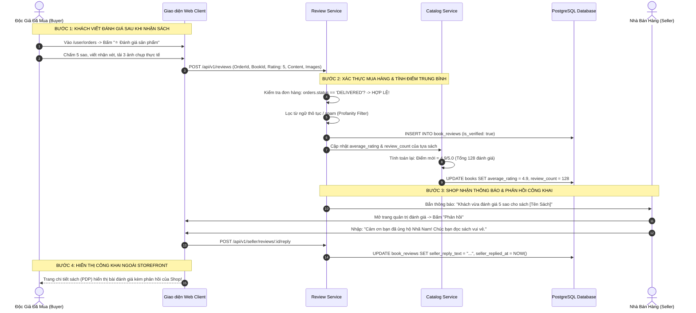

# TÀI LIỆU ĐẶC TẢ CHI TIẾT NGHIỆP VỤ - LUỒNG 19
## ĐÁNH GIÁ MUA HÀNG XÁC THỰC & PHẢN HỒI CỦA GIAN HÀNG (VERIFIED PURCHASE REVIEWS & SELLER REPLY)

---

## I. MỤC TIÊU & PHẠM VI NGHIỆP VỤ

* **Mục tiêu**: Xây dựng hệ thống đánh giá sản phẩm sách minh bạch, tin cậy $100\%$ và chống gian lận gieo mầm ảo (Anti-Spam & Anti-Fake Reviews). Chỉ những độc giả đã mua sách và đơn hàng đã hoàn tất giao nhận (`DELIVERED`) mới có quyền chấm điểm sao ($1 - 5\star$), đăng ảnh thực tế/video mở hộp và viết nhận xét có gắn huy hiệu chứng thực **"Đã Mua Hàng Xác Thực"**. Đồng thời cho phép Nhà bán hàng gửi phản hồi chính thức công khai (Official Seller Reply) nhằm nâng cao chất lượng chăm sóc khách hàng.
* **Các bên tham gia (Actors)**:
  1. **Khách Hàng (Buyer / Reviewer)**: Đã nhận sách thành công, thực hiện chấm điểm sao, tải ảnh/video và viết cảm nhận.
  2. **Nhà Bán Hàng (Seller / Publisher)**: Xem phản hồi của khách, gửi lời cảm ơn hoặc giải thích/hỗ trợ xử lý vấn đề.
  3. **Độc Giả Khác (Community Visitors)**: Tham khảo đánh giá khách quan, lọc xem ảnh thực tế và bấm bình chọn "Hữu ích".
  4. **Hệ thống Backend (Review & Catalog Services)**:
     * `review-service`: Xác thực quyền mua hàng (`order_id` hợp lệ), kiểm duyệt từ ngữ nhạy cảm (Profanity Filter), lưu trữ đánh giá.
     * `catalog-service`: Tự động tính toán lại điểm số sao trung bình (`average_rating`) và tổng số đánh giá (`review_count`) của cuốn sách.

---

## II. QUY CHUẨN ĐÁNH GIÁ XÁC THỰC & HUY HIỆU BẢO CHỨNG

```
                             HỆ THỐNG ĐÁNH GIÁ SÁCH XÁC THỰC
                                            │
        ┌───────────────────────────────────┼───────────────────────────────────┐
        ▼                                   ▼                                   ▼
 1. ĐIỀU KIỆN ĐÁNH GIÁ (VERIFIED)    2. CẤU TRÚC ĐÁNH GIÁ                3. PHẢN HỒI TỪ SHOP
  • Bắt buộc đã mua & nhận hàng       • Chấm sao: 1 ★ đến 5 ★             • Shop nhận thông báo đánh giá
  • Gắn huy hiệu "ĐÃ MUA HÀNG"        • Nhận xét chi tiết (>= 10 ký tự)   • 1 phản hồi chính thức công khai
  • Hiển thị định dạng đã mua:        • Đính kèm: 1-5 ảnh + 1 video       • Giải đáp thắc mắc / xin lỗi
    [Sách Giấy] | [Ebook] | [Hybrid]  • Tiêu chí: Đóng gói & Giao hàng    • Tạo uy tín thương hiệu
```

---

## III. BẢNG TRƯỜNG DỮ LIỆU & SCHEMA ĐÁNH GIÁ (REVIEWS)

Bảng `book_reviews` và bảng `review_helpful_votes`:

### 1. Bảng `book_reviews` (Đánh Giá Sản Phẩm)
| Tên Cột | Kiểu Dữ Liệu | Ràng Buộc | Mô Tả |
|---|---|---|---|
| `id` | UUID | Primary Key | Mã định danh đánh giá |
| `book_id` | UUID | FK `books`, Index | Tựa sách được đánh giá |
| `user_id` | UUID | FK `users`, Index | Khách hàng đánh giá |
| `order_id` | UUID | FK `orders`, Index | Đơn hàng mua sách xác thực |
| `business_id` | UUID | FK `businesses` | Gian hàng bán cuốn sách đó |
| `purchased_format` | Enum | `PHYSICAL`, `EBOOK`, `HYBRID` | Định dạng sách khách đã mua |
| `rating` | Integer | Bắt buộc, $1 \le \text{rating} \le 5$ | Số sao chấm điểm |
| `content` | Text | Bắt buộc, tối thiểu 10 ký tự | Nội dung bài nhận xét |
| `images` | Array String | Tối đa 5 ảnh (Text[]) | Danh sách URL ảnh thực tế |
| `video_url` | String | Nullable | URL video mở hộp ngắn ($\le 30\text{s}$) |
| `is_verified_purchase`| Boolean | Mặc định: `true` | Cờ chứng thực đã mua hàng |
| `seller_reply_text` | Text | Nullable | Nội dung phản hồi chính thức của Shop |
| `seller_replied_at` | Timestamp | Nullable | Thời điểm Shop phản hồi |
| `helpful_count` | Integer | Mặc định: `0` | Số lượt độc giả khác bấm "Hữu ích" |
| `status` | Enum | `PUBLISHED`, `HIDDEN_VIOLATION` | Trạng thái hiển thị |
| Unique Index | `[order_id, book_id]` | Mỗi cuốn sách trong 1 đơn chỉ đánh giá 1 lần |

### 2. Bảng `review_helpful_votes`
| Tên Cột | Kiểu Dữ Liệu | Mô Tả |
|---|---|---|
| `id` | UUID | Khóa chính |
| `review_id` | UUID | Đánh giá được vote |
| `user_id` | UUID | Người dùng bấm vote |
| `created_at` | Timestamp | Thời điểm vote |
| Unique Index | `[review_id, user_id]` | Mỗi người chỉ được vote hữu ích 1 lần |

---

## IV. SƠ ĐỒ TRÌNH TỰ ĐÁNH GIÁ & PHẢN HỒI (SEQUENCE DIAGRAM)



---

## V. PHÂN RÃ CHI TIẾT TỪNG BƯỚC THỰC HIỆN

---

### BƯỚC 1: TRUY CẬP TÍNH NĂNG ĐÁNH GIÁ & XÁC THỰC QUYỀN MUA HÀNG

* **Bước 1.1: Điều kiện hiển thị nút đánh giá**:
  * Tại trang **Đơn Mua** (`/user/orders`):
  * Chỉ những đơn hàng con ở trạng thái `DELIVERED` mới xuất hiện nút màu vàng: **"⭐ Viết Đánh Giá"**.
  * Nếu người dùng chưa từng mua cuốn sách hoặc đơn chưa giao: Nút đánh giá ngoài trang chi tiết sách bị khóa, hiển thị dòng gợi ý *"Chỉ khách hàng đã mua tác phẩm này mới có thể viết đánh giá"*.
* **Bước 1.2: Mở Form Đánh Giá Sản Phẩm ([`CreateReviewModal.jsx`](file:///d:/doan_huki_ebook/huki-ebook/web/src/ui/components/reviews/CreateReviewModal.jsx))**:
  * Hiển thị thông tin sách: Bìa sách, Tên sách, Phân loại đã mua (`[Sách Giấy Bìa Mềm]`).

---

### BƯỚC 2: NHẬP ĐÁNH GIÁ TOÀN DIỆN & TẢI ẢNH/VIDEO THỰC TẾ

* **Bước 2.1: Chấm điểm số sao ($1 - 5\star$)**:
  * $5\star$: Tuyệt vời / Rất hài lòng.
  * $4\star$: Hài lòng.
  * $3\star$: Bình thường.
  * $2\star$: Không hài lòng.
  * $1\star$: Rất tệ.
* **Bước 2.2: Tải lên hình ảnh & Video thực tế**:
  * Cho phép tải lên từ **1 đến 5 ảnh chụp thực tế** (bìa sách, độ dày giấy in, nét chữ, bao bì đóng gói).
  * Cho phép tải **1 video ngắn $\le 30\text{ giây}$** quay thực tế trải nghiệm lật trang hoặc unboxing.
* **Bước 2.3: Viết nhận xét & Kiểm duyệt tự động (Profanity Filter)**:
  * Nhập cảm nhận nội dung tác phẩm (tối thiểu 10 ký tự, tối đa 1.000 từ).
  * Bộ lọc tự động quét các từ khóa chửi bậy, thô tục, spam link quảng cáo hoặc xúc phạm → Yêu cầu chỉnh sửa trước khi gửi.

---

### BƯỚC 3: GHI NHẬN BẢO CHỨNG & CẬP NHẬT ĐIỂM SỐ TRUNG BÌNH SẢN PHẨM

* **Bước 3.1: Gắn huy hiệu xác thực**:
  * Bài đánh giá được tạo với cờ `is_verified_purchase = true`.
  * Hiển thị huy hiệu bảo chứng màu xanh lá: 🛡 **"ĐÃ MUA HÀNG"** kèm thông tin định dạng sách đã mua.
* **Bước 3.2: Thuật toán tính toán lại điểm số sao trung bình**:
  * `catalog-service` thực thi tính toán lại:
    $$\text{AverageRating} = \frac{\sum_{i=1}^{N} \text{rating}_i}{N}$$
    $$\text{ReviewCount} = N$$
  * Cập nhật ngay lập tức vào bảng `books` và làm mới bộ đếm sao hiển thị ngoài Storefront.

---

### BƯỚC 4: QUY TRÌNH PHẢN HỒI CHÍNH THỨC CỦA GIAN HÀNG (SELLER REPLY)

* **Bước 4.1: Thông báo đến Seller**:
  * Seller nhận thông báo chuông trên Seller Portal khi có đánh giá mới.
* **Bước 4.2: Phản hồi công khai ([`SellerReviewsPage.jsx`](file:///d:/doan_huki_ebook/huki-ebook/web/src/ui/pages/seller/SellerReviewsPage.jsx))**:
  * Seller vào mục **Đánh Giá Của Khách** → Bấm nút **"Phản Hồi"** dưới bài viết.
  * Nhập nội dung phản hồi chính thức (VD: *"Nhã Nam xin chân thành cảm ơn đánh giá của bạn!..."*).
  * Khung phản hồi hiển thị lùi vào 1 cấp dưới nhận xét của khách với huy hiệu: 🏪 **"Phản hồi của Người Bán"**.

---

### BƯỚC 5: TƯƠNG TÁC CỘNG ĐỒNG & BỘ LỌC ĐÁNH GIÁ NGOÀI STOREFRONT

* **Bước 5.1: Khối Đánh Giá Trên Trang Chi Tiết Tác Phẩm (`BookDetailPage.jsx`)**:
  * **Bảng tổng quan điểm số (Rating Summary)**:
    * Điểm trung bình: `4.9 / 5.0` (dựa trên 128 đánh giá).
    * Thanh tỷ lệ sao: 5 sao ($85\%$), 4 sao ($10\%$), 3 sao ($3\%$), 2 sao ($1\%$), 1 sao ($1\%$).
  * **Bộ lọc thông minh**:
    * Lọc theo số sao: `Tất Cả`, `5 Sao (105)`, `4 Sao (15)`, `Có Hình Ảnh/Video (68)`.
    * Lọc theo định dạng: `Sách Giấy`, `Ebook`, `Hybrid`.
* **Bước 5.2: Tính năng bình chọn "Hữu ích" (Helpful Vote)**:
  * Độc giả khác bấm nút **"👍 Hữu ích (X)"** nếu thấy bài nhận xét có giá trị.
  * Các bài đánh giá có nhiều lượt bình chọn hữu ích nhất sẽ tự động được đưa lên vị trí đầu trang (Top Reviews).

---

## VI. MA TRẬN KIỂM THỬ ĐÁNH GIÁ XÁC THỰC (TEST CASES MATRIX)

| Mã Test Case | Kịch Bản Kiểm Thử | Dữ Liệu Đầu Vào | Kết Quả Kỳ Vọng (Expected Result) | Đánh Giá |
|:---:|---|---|---|:---:|
| **TC_REV_01** | Đánh giá xác thực thành công sau khi nhận hàng | Đơn sách đã giao `DELIVERED`. Chấm 5 sao + viết cảm nhận + 2 ảnh. | Đánh giá tạo thành công, gắn huy hiệu "ĐÃ MUA HÀNG", điểm sao cập nhật ngay. | **PASS** |
| **TC_REV_02** | Chặn đánh giá khi chưa mua sách | User chưa mua sách bấm vào nút gửi đánh giá. | Hệ thống chặn và báo lỗi: *"Chỉ khách hàng đã mua sản phẩm mới được đánh giá"*. | **PASS** |
| **TC_REV_03** | Chặn đánh giá trùng lặp trong cùng 1 đơn | Khách cố tình gửi đánh giá lần 2 cho cùng 1 cuốn trong đơn đó. | Hệ thống chặn lại, chỉ cho phép chỉnh sửa bài đánh giá đã có. | **PASS** |
| **TC_REV_04** | Seller gửi phản hồi chính thức | Shop Nhã Nam nhập phản hồi cảm ơn khách. | Phản hồi hiển thị ngay dưới bài đánh giá ngoài trang chi tiết sách PDP. | **PASS** |
| **TC_REV_05** | Bình chọn "Hữu ích" không bị spam | 1 User bấm vote "Hữu ích" 2 lần liên tiếp. | Lượt vote tăng từ 0 lên 1 ở lần bấm đầu; lần bấm sau chuyển thành bỏ vote (toggle). | **PASS** |
| **TC_REV_06** | Bộ lọc chỉ xem đánh giá có hình ảnh/video | Bấm tab "Có hình ảnh / Video". | Danh sách tự động lọc chỉ hiển thị các bài viết có đính kèm ảnh thực tế. | **PASS** |

---

## VII. ĐIỀU KIỆN NGHIỆM THU HOÀN TẤT (DEFINITION OF DONE)

1. ✅ $100\%$ các bài đánh giá được xác thực nguồn gốc đơn hàng thành công (`is_verified_purchase = true`).
2. ✅ Chặn đứng hoàn toàn hành vi đánh giá ảo từ những tài khoản chưa từng mua tác phẩm.
3. ✅ Điểm số sao trung bình và số lượng đánh giá được tự động tính toán lại chính xác theo thời gian thực.
4. ✅ Seller có quyền gửi phản hồi chính thức hiển thị công khai dưới bài nhận xét của khách.
5. ✅ Bộ lọc đánh giá theo số sao, hình ảnh thực tế và nút bình chọn "Hữu ích" hoạt động mượt mà.
