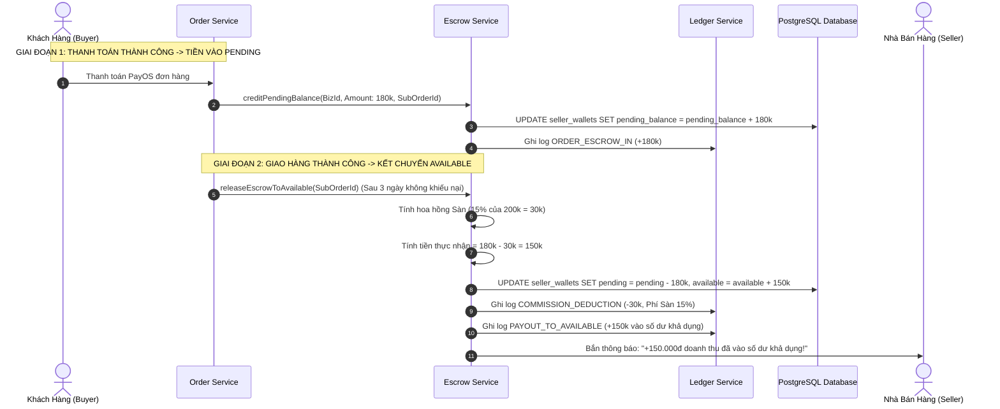

# TÀI LIỆU ĐẶC TẢ CHI TIẾT NGHIỆP VỤ - LUỒNG 20
## QUẢN LÝ DÒNG TIỀN ESCROW & SỔ CÁI PHÂN LẬP GIAN HÀNG (MULTI-TENANT ESCROW & LEDGER WALLET ACCOUNTING)

---

## I. MỤC TIÊU & PHẠM VI NGHIỆP VỤ

* **Mục tiêu**: Xây dựng hệ thống tài chính kế toán sổ cái kép (Double-Entry Ledger) và quản lý dòng tiền ký quỹ trung gian (Escrow Mechanism) phân lập tuyệt đối theo từng `business_id` (Gian hàng). Đảm bảo dòng tiền từ lúc khách thanh toán, vào số dư treo (`pending_balance`), tự động khấu trừ phí hoa hồng Sàn (15%), xử lý trợ giá khuyến mãi và kết chuyển sang số dư khả dụng (`available_balance`) của Seller diễn ra chính xác $100\%$, không bao giờ xảy ra tình trạng thất thoát hoặc nhầm lẫn giữa các gian hàng.
* **Các bên tham gia (Actors)**:
  1. **Nhà Bán Hàng (Seller / Tài Chính Shop)**: Theo dõi biến động số dư ví, doanh thu từng đơn, phí sàn và lịch sử sổ cái chi tiết.
  2. **Quản Trị Tài Chính Sàn (Admin / Platform Finance)**: Đối soát doanh thu hoa hồng Sàn, kiểm tra tổng số dư bảo chứng trong tài khoản Escrow tổng.
  3. **Hệ thống Backend (Escrow, Ledger & Payment Services)**:
     * `escrow-service`: Điều phối quy trình giam giữ và giải phóng dòng tiền theo vòng đời đơn hàng.
     * `ledger-service`: Ghi bút toán kế toán bất biến (Immutable Double-Entry Ledger) vào bảng `wallet_transactions`.
     * `order-service`: Kích hoạt các sự kiện thanh toán, giao hàng hoàn tất hoặc hoàn tiền.

---

## II. KIẾN TRÚC VÍ GIAN HÀNG 3 TẦNG SỐ DƯ (3-TIER WALLET BALANCES)

```
                            KIẾN TRÚC VÍ GIAN HÀNG (SELLER WALLET)
                                              │
         ┌────────────────────────────────────┼────────────────────────────────────┐
         ▼                                    ▼                                    ▼
1. PENDING BALANCE                   2. FROZEN BALANCE                    3. AVAILABLE BALANCE
 (Số Dư Treo Ký Quỹ Escrow)          (Số Dư Đang Bị Đóng Băng)           (Số Dư Khả Dụng Rút Tiền)
  • Tiền các đơn đang giao hàng        • Tiền của các đơn đang có          • Tiền thực nhận sau khi trừ
  • Tiền đơn mới thanh toán            khiếu nại, tranh chấp (L18)          hoa hồng sàn (15%) & hoàn tất
  • Chưa thể rút (Sàn giữ hộ)         • Tạm khóa cho đến khi Admin duyệt  • Có thể rút ngay về Ngân hàng
```

---

## III. CÔNG THỨC TOÁN HỌC KHẤU TRỪ HOA HỒNG & HẠCH TOÁN DOANH THU

$$\text{Subtotal} = \text{Tổng tiền sách của riêng Shop trong đơn hàng}$$

$$\text{ShopDiscount} = \text{Mức giảm từ Shop Voucher (Shop chịu)}$$

$$\text{PlatformCommission} = \text{Subtotal} \times 15\% \quad (\text{Hoa hồng Sàn thu 15\%)}$$

$$\text{PlatformSubsidy} = \text{Khoản Sàn tài trợ bù tiền (Mã Sàn / Freeship)}$$

$$\text{NetSellerPayout} = \text{Subtotal} - \text{ShopDiscount} - \text{PlatformCommission} + \text{PlatformSubsidy}$$

* **Ví dụ hạch toán thực tế**:
  * Đơn sách Nhã Nam: Tiền sách $\text{Subtotal} = 200.000đ$.
  * Shop giảm voucher riêng: $\text{ShopDiscount} = 20.000đ$.
  * Khách áp mã Sàn giảm thêm: $30.000đ$ (Sàn tài trợ $\rightarrow \text{PlatformSubsidy} = 30.000đ$).
  * Phí hoa hồng Sàn (15%): $\text{PlatformCommission} = 200.000đ \times 15\% = 30.000đ$.
  * **Doanh thu Shop thực nhận chuyển vào ví**:
    $$\text{NetSellerPayout} = 200.000đ - 20.000đ - 30.000đ = \mathbf{150.000 VNĐ}$$
  * *(Sàn thu $30.000đ$ tiền hoa hồng, Shop nhận đúng $150.000đ$ không bị hao hụt).*

---

## IV. BẢNG TRƯỜNG DỮ LIỆU & SCHEMA VÍ SỔ CÁI (LEDGER)

Bảng `seller_wallets` và bảng bút toán sổ cái `wallet_transactions`:

### 1. Bảng `seller_wallets` (Ví Doanh Nghiệp)
| Tên Cột | Kiểu Dữ Liệu | Ràng Buộc | Mô Tả |
|---|---|---|---|
| `id` | UUID | Primary Key | Mã định danh ví |
| `business_id` | UUID | Unique Index, FK `businesses` | Gian hàng sở hữu ví |
| `available_balance` | Decimal | Bắt buộc, $\ge 0$ (Default: 0) | Số dư khả dụng có thể rút |
| `pending_balance` | Decimal | Bắt buộc, $\ge 0$ (Default: 0) | Số dư treo chờ hoàn tất đơn |
| `frozen_balance` | Decimal | Bắt buộc, $\ge 0$ (Default: 0) | Số dư bị đóng băng do tranh chấp |
| `total_withdrawn` | Decimal | Mặc định: 0 | Tổng số tiền đã rút thành công |
| `currency` | String | Mặc định: `'VND'` | Đơn vị tiền tệ |
| `version` | BigInt | Mặc định: 1 | Optimistic Locking chống race condition |
| `updated_at` | Timestamp | | Thời gian cập nhật gần nhất |

### 2. Bảng `wallet_transactions` (Sổ Cái Bút Toán Kép - Audit Ledger)
| Tên Cột | Kiểu Dữ Liệu | Ràng Buộc | Mô Tả |
|---|---|---|---|
| `id` | UUID | Primary Key | Mã bút toán giao dịch |
| `wallet_id` | UUID | FK `seller_wallets` | Ví gian hàng |
| `business_id` | UUID | Index, FK `businesses` | Gian hàng phát sinh giao dịch |
| `sub_order_id` | UUID | Nullable, FK `sub_orders` | Đơn hàng con liên quan |
| `entry_type` | Enum | Bắt buộc | `ORDER_ESCROW_IN` (Tiền vào treo), `COMMISSION_DEDUCTION` (Trừ hoa hồng), `PAYOUT_TO_AVAILABLE` (Chuyển sang khả dụng), `FREEZE_DISPUTE` (Đóng băng), `UNFREEZE_DISPUTE` (Mở đóng băng), `REFUND_DEDUCTION` (Trừ tiền hoàn khách), `WITHDRAW_REQUEST` (Rút tiền) |
| `amount` | Decimal | Bắt buộc | Số tiền biến động ($+/-$) |
| `balance_before` | Decimal | Bắt buộc | Số dư trước biến động |
| `balance_after` | Decimal | Bắt buộc | Số dư sau biến động |
| `description` | String | Bắt buộc | Diễn giải kế toán chi tiết |
| `created_at` | Timestamp | Tự động | Thời điểm ghi sổ |

---

## V. SƠ ĐỒ TRÌNH TỰ VÒNG ĐỜI DÒNG TIỀN (SEQUENCE DIAGRAM)



---

## VI. PHÂN RÃ CHI TIẾT TỪNG BƯỚC THỰC HIỆN

---

### BƯỚC 1: TIẾP NHẬN THANH TOÁN & GHI NHẬN SỐ DƯ TREO (`PENDING_BALANCE`)

* **Bước 1.1: Tiếp nhận sự kiện thanh toán thành công**:
  * Khi đơn hàng con `sub_orders` chuyển sang trạng thái đã thanh toán:
  * Doanh thu tạm tính của Shop được ghi nhận:
    $$\text{PendingCredit} = \text{Subtotal} - \text{ShopVoucherDiscount}$$
* **Bước 1.2: Ghi nhận vào ví gian hàng**:
  * Cập nhật `seller_wallets`:
    ```sql
    UPDATE seller_wallets 
    SET pending_balance = pending_balance + :pendingCredit, updated_at = NOW()
    WHERE business_id = :businessId;
    ```
  * Ghi bản ghi vào `wallet_transactions` với `entry_type = 'ORDER_ESCROW_IN'`.

---

### BƯỚC 2: KHẤU TRỪ HOA HỒNG SÀN 15% & KẾT CHUYỂN SANG KHẢ DỤNG (`AVAILABLE_BALANCE`)

* **Bước 2.1: Điều kiện kết chuyển tự động**:
  * Đơn hàng đã ở trạng thái `DELIVERED` sau **3 ngày (72 giờ)** không có khiếu nại phát sinh, hoặc khách hàng chủ động bấm *"Đã nhận được hàng"*.
* **Bước 2.2: Thực thi bút toán kết chuyển kép (Atomic Double-Entry)**:
  * Mở Transaction:
    1. Giảm số dư treo: `pending_balance = pending_balance - :pendingCredit`.
    2. Tính phí hoa hồng Sàn: $\text{Commission} = \text{Subtotal} \times 15\%$.
    3. Tăng số dư khả dụng: `available_balance = available_balance + (:pendingCredit - :Commission)`.
    4. Ghi 2 dòng bút toán sổ cái trong `wallet_transactions`:
       * Bút toán 1: `COMMISSION_DEDUCTION` (Trừ tiền hoa hồng Sàn 15%).
       * Bút toán 2: `PAYOUT_TO_AVAILABLE` (Cộng tiền thực nhận vào ví khả dụng).

---

### BƯỚC 3: XỬ LÝ ĐÓNG BĂNG DÒNG TIỀN KHI PHÁT SINH KHIẾU NẠI (`FROZEN_BALANCE`)

* **Bước 3.1: Khi có khiếu nại Trả hàng / Hoàn tiền (Luồng 18)**:
  * Hệ thống tự động chuyển số tiền tương ứng từ `pending_balance` sang `frozen_balance`:
    ```sql
    UPDATE seller_wallets
    SET 
        pending_balance = pending_balance - :disputeAmount,
        frozen_balance = frozen_balance + :disputeAmount,
        updated_at = NOW()
    WHERE business_id = :businessId;
    ```
  * Ghi log `entry_type = 'FREEZE_DISPUTE'`.
* **Bước 3.2: Xử lý sau khi có Phán quyết Trọng tài**:
  * **Nếu Shop Thắng**: Chuyển từ `frozen_balance` sang `available_balance` (sau khi trừ phí hoa hồng).
  * **Nếu Khách Thắng**: Trừ `frozen_balance -= disputeAmount`, ghi log `REFUND_DEDUCTION` và hoàn tiền về cho khách.

---

### BƯỚC 4: BẢO VỆ DỮ LIỆU ĐA GIAN HÀNG (MULTI-TENANT DATA ISOLATION)

* **Bước 4.1: Kiểm soát quyền truy cập theo `business_id` (Row-Level Security)**:
  * Tất cả các truy vấn xem ví và lịch sử sổ cái bắt buộc phải đi qua middleware `SellerScopeGuard`:
    ```typescript
    // Backend tự động gắn điều kiện lọc theo ID gian hàng của tài khoản đang đăng nhập
    where: { business_id: req.user.business_id }
    ```
  * Đảm bảo tuyệt đối Seller A không thể truy vấn hoặc nhìn thấy số dư và giao dịch của Seller B.

---

### BƯỚC 5: GIAO DIỆN QUẢN TRỊ TÀI CHÍNH & SỔ CÁI MINH BẠCH

* **Bước 5.1: Màn hình Ví Doanh Nghiệp ([`SellerFinancePage.jsx`](file:///d:/doan_huki_ebook/huki-ebook/web/src/ui/pages/seller/SellerFinancePage.jsx))**:
  * **3 Thẻ số dư lớn trực quan**:
    * 🟢 **Số dư khả dụng**: `15.850.000 VNĐ` (Kèm nút màu xanh **"Rút Tiền"**).
    * ⏳ **Số dư chờ kết chuyển**: `3.420.000 VNĐ` (Các đơn đang giao).
    * 🔒 **Đang đóng băng**: `0 VNĐ` (Không có khiếu nại).
* **Bước 5.2: Bảng Sổ Cái Chi Tiết Từng Dòng (Ledger Statement Table)**:
  * Cột hiển thị: Ngày giờ, Mã đơn hàng, Loại biến động, Số tiền ($+/-$), Số dư trước, Số dư sau và Diễn giải chi tiết (rõ ràng khoản hoa hồng 15% bị trừ).

---

## VII. MA TRẬN KIỂM THỬ DÒNG TIỀN ESCROW (TEST CASES MATRIX)

| Mã Test Case | Kịch Bản Kiểm Thử | Dữ Liệu Đầu Vào | Kết Quả Kỳ Vọng (Expected Result) | Đánh Giá |
|:---:|---|---|---|:---:|
| **TC_ESC_01** | Thanh toán thành công tiền vào `pending_balance` | Đơn sách 200k thanh toán PayOS. | `pending_balance` tăng +200k, `available` = 0. Ghi log `ORDER_ESCROW_IN`. | **PASS** |
| **TC_ESC_02** | Đơn giao thành công trừ hoa hồng 15% vào `available` | Đơn 200k hoàn tất sau 3 ngày. | `pending` giảm 200k, hoa hồng sàn trừ 30k (15%), `available` tăng +170k. | **PASS** |
| **TC_ESC_03** | Khách khiếu nại tiền chuyển sang `frozen_balance` | Đơn 200k bị khiếu nại rách sách. | `pending` giảm 200k, `frozen_balance` tăng +200k. | **PASS** |
| **TC_ESC_04** | Trọng tài phán quyết Shop thắng mở khóa tiền | Admin duyệt `SELLER_WIN` đơn 200k. | `frozen` giảm 200k, hoa hồng trừ 30k, `available` tăng +170k. | **PASS** |
| **TC_ESC_05** | Phân lập dữ liệu ví giữa 2 Seller | Seller A và Seller B cùng đăng nhập. | Seller A chỉ xem đúng ví của Shop A, không thể truy cập ví Shop B. | **PASS** |
| **TC_ESC_06** | Chống âm tiền ví khả dụng | Ví có 50k, cố tình tạo lệnh rút 100k. | Hệ thống chặn lại: *"Số dư khả dụng không đủ để thực hiện giao dịch"*. | **PASS** |

---

## VIII. ĐIỀU KIỆN NGHIỆM THU HOÀN TẤT (DEFINITION OF DONE)

1. ✅ Triển khai đầy đủ cấu trúc ví 3 tầng (`available_balance`, `pending_balance`, `frozen_balance`).
2. ✅ Tự động khấu trừ chính xác phí hoa hồng Sàn 15% khi đơn hoàn tất giao nhận.
3. ✅ Bút toán sổ cái kép ghi nhận bất biến (Immutable Audit Trail) đầy đủ số dư trước và sau biến động.
4. ✅ Bảo mật phân quyền phân lập dữ liệu tuyệt đối giữa các Seller theo `business_id`.
5. ✅ Vượt qua 100% Ma trận kiểm thử dòng tiền Escrow (TC_ESC_01 đến TC_ESC_06).
