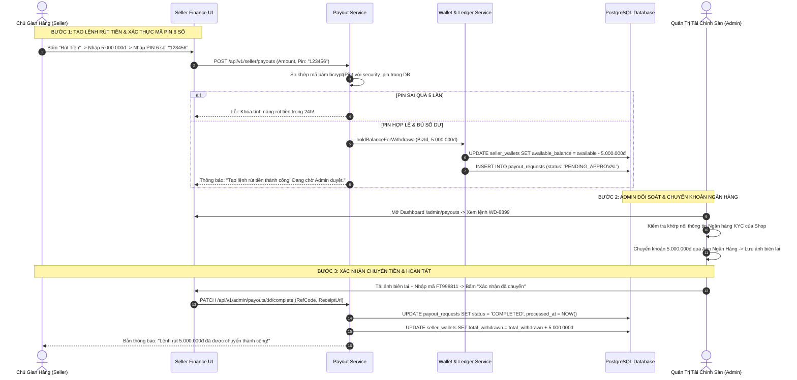

# TÀI LIỆU ĐẶC TẢ CHI TIẾT NGHIỆP VỤ - LUỒNG 21
## RÚT TIỀN DOANH NGHIỆP VỚI MÃ PIN 6 SỐ & ĐỐI SOÁT CHUYỂN KHOẢN (MANUAL PAYOUT WITH 6-DIGIT PIN & ADMIN RECONCILIATION)

---

## I. MỤC TIÊU & PHẠM VI NGHIỆP VỤ

* **Mục tiêu**: Xây dựng quy trình rút tiền doanh thu (Seller Payout / Withdrawal) bảo mật nghiêm ngặt và đối soát minh bạch. Yêu cầu xác thực bắt buộc bằng **Mã PIN bảo mật 6 số** (Security PIN) đã đăng ký trong hồ sơ KYC, kiểm soát hạn mức giao dịch, tạm giữ số dư khả dụng ngay khi tạo lệnh và quy trình Quản trị viên Sàn (Admin) đối soát tài khoản chính chủ trước khi chuyển khoản ngân hàng, lưu trữ biên lai giao dịch làm căn cứ pháp lý.
* **Các bên tham gia (Actors)**:
  1. **Chủ Gian Hàng / Kế Toán Trưởng (Seller Owner)**: Nhập số tiền muốn rút, nhập mã PIN 6 số và theo dõi tiến độ duyệt lệnh.
  2. **Quản Trị Viên Tài Chính Sàn (Admin / Finance Officer)**: Thẩm định lệnh rút, kiểm tra khớp nối số tài khoản KYC, thực hiện chuyển khoản ngân hàng và tải lên biên lai ủy nhiệm chi.
  3. **Hệ thống Backend (Payout, Wallet & Security Services)**:
     * `payout-service`: Kiểm tra số dư, xác thực mã băm PIN 6 số, khóa bảo vệ chống dò mã brute-force.
     * `ledger-service`: Khấu trừ tức thì số dư khả dụng và ghi bút toán sổ cái.
     * `notification-service`: Bắn thông báo Realtime trạng thái lệnh rút tiền.

---

## II. QUY CHUẨN RÚT TIỀN & XÁC THỰC MÃ PIN BẢO MẬT 6 SỐ

```
                         QUY TRÌNH RÚT TIỀN BẢO MẬT 4 BƯỚC
                                         │
        ┌────────────────────────────────┼────────────────────────────────┐
        ▼                                ▼                                ▼
 1. TẠO LỆNH & NHẬP PIN 6 SỐ      2. TẠM TRỪ VÍ KHẢ DỤNG           3. ADMIN ĐỐI SOÁT & CHUYỂN
  • Nhập số tiền (>= 100k)         • Trừ ngay available_balance     • So khớp số TK ngân hàng KYC
  • Nhập mã PIN bảo mật 6 số       • Tránh rút trùng lặp            • Chuyển tiền qua App Ngân hàng
  • Nhập sai 5 lần: Khóa 24h       • Tạo bản ghi PENDING_APPROVAL   • Tải lên ảnh Biên lai chuyển tiền
                                                                          │
                                                                          ▼
                                                            4. HOÀN TẤT & GHI SỔ CÁI
                                                             • Trạng thái: COMPLETED
                                                             • Tăng total_withdrawn
                                                             • Gửi Email biên lai cho Shop
```

---

## III. BẢNG TRƯỜNG DỮ LIỆU & SCHEMA YÊU CẦU RÚT TIỀN (PAYOUTS)

Bảng `payout_requests`:

| Tên Cột | Kiểu Dữ Liệu | Ràng Buộc | Mô Tả |
|---|---|---|---|
| `id` | UUID | Primary Key | Mã định danh yêu cầu rút tiền |
| `payout_code` | String (Unique) | Bắt buộc, Index | Mã hiển thị (VD: `WD-2026-8899`) |
| `business_id` | UUID | FK `businesses`, Index | Gian hàng yêu cầu rút |
| `wallet_id` | UUID | FK `seller_wallets` | Ví gian hàng |
| `amount` | Decimal | Bắt buộc, $\ge 100.000\text{đ}$ | Số tiền yêu cầu rút |
| `bank_name` | String | Bắt buộc | Tên ngân hàng nhận (VD: `Vietcombank`) |
| `bank_account_number` | String | Bắt buộc | Số tài khoản chính chủ |
| `bank_account_holder` | String | Bắt buộc | Tên chủ tài khoản (in hoa không dấu) |
| `status` | Enum | `PENDING_APPROVAL`, `PROCESSING`, `COMPLETED`, `REJECTED` | Trạng thái xử lý lệnh |
| `bank_reference_code` | String | Nullable | Mã giao dịch ngân hàng (Mã FT / Trace) |
| `receipt_image_url` | String | Nullable | URL ảnh chụp biên lai chuyển khoản |
| `admin_note` | String | Nullable | Ghi chú của Admin / Lý do từ chối |
| `processed_by` | UUID (Nullable) | FK `users` (Admin) | Admin thực hiện duyệt |
| `created_at` | Timestamp | | Thời điểm gửi yêu cầu |
| `processed_at` | Timestamp | Nullable | Thời điểm Admin xác nhận chuyển tiền |

---

## IV. SƠ ĐỒ TRÌNH TỰ RÚT TIỀN VÀ ĐỐI SOÁT (SEQUENCE DIAGRAM)



---

## V. PHÂN RÃ CHI TIẾT TỪNG BƯỚC THỰC HIỆN

---

### BƯỚC 1: KHỞI TẠO LỆNH RÚT TIỀN TRÊN GIAO DIỆN SELLER

* **Bước 1.1: Điều kiện mở Modal rút tiền**:
  * Seller truy cập trang **Tài Chính** (`/seller/finance`) → Bấm nút màu xanh **"Rút Tiền"**.
  * Kiểm tra số dư khả dụng: `available_balance >= 100.000 VNĐ`.
* **Bước 1.2: Form Rút Tiền ([`WithdrawModal.jsx`](file:///d:/doan_huki_ebook/huki-ebook/web/src/ui/components/finance/WithdrawModal.jsx))**:
  * Hiển thị thông tin tài khoản nhận tiền cố định đã duyệt trong KYC:
    * Ngân hàng: *Vietcombank - CN Hà Nội*.
    * Số tài khoản: `0011004328899` (Không cho phép tự ý đổi để chống hack đổi tài khoản rút trộm).
    * Chủ tài khoản: *CONG TY CO PHAN SACH NHA NAM*.
  * Ô nhập số tiền: Có các nút chọn nhanh `1.000.000đ`, `5.000.000đ`, `10.000.000đ`, `"Rút toàn bộ số dư"`.
  * **Ô nhập Mã PIN Bảo Mật 6 Số**: Dạng 6 ô tròn ẩn mật khẩu $(\bullet \bullet \bullet \bullet \bullet \bullet)$.

---

### BƯỚC 2: XÁC THỰC MÃ PIN BẢO MẬT & CHỐNG TẤN CÔNG DÒ MÃ (BRUTE-FORCE)

* **Bước 2.1: Xác thực mã PIN bằng `bcrypt`**:
  * Backend so sánh mã PIN người dùng vừa nhập với mã băm `security_pin` trong bảng `businesses`.
* **Bước 2.2: Cơ chế khóa bảo vệ khi nhập sai quá 5 lần**:
  * Sử dụng Redis Key `pin_attempts:biz:{id}` (TTL: 24 giờ):
    * Nếu nhập sai: Tăng bộ đếm `INCR pin_attempts:...`.
    * Nếu số lần sai $\ge 5$: Hệ thống lập tức khóa tính năng rút tiền trong 24 giờ và gửi email cảnh báo bảo mật khẩn cấp đến Chủ gian hàng: *"Tài khoản của bạn đã nhập sai mã PIN rút tiền 5 lần liên tiếp. Tính năng rút tiền đã bị tạm khóa 24h để bảo vệ tài sản!"*.

---

### BƯỚC 3: TẠM KHẤU TRỪ VÍ KHẢ DỤNG VÀ TẠO BẢN GHI `PENDING_APPROVAL`

* **Bước 3.1: Thực thi Atomic Transaction**:
  * Mở giao dịch CSDL:
    1. Kiểm tra lại điều kiện: `available_balance >= amount`.
    2. Trừ tức thì số tiền rút:
       ```sql
       UPDATE seller_wallets 
       SET available_balance = available_balance - :amount, updated_at = NOW()
       WHERE business_id = :bizId AND available_balance >= :amount;
       ```
    3. Tạo bản ghi mới trong bảng `payout_requests` với `status = 'PENDING_APPROVAL'`.
    4. Ghi bút toán sổ cái `wallet_transactions` với `entry_type = 'WITHDRAW_REQUEST'`.
* **Bước 3.2: Thông báo trạng thái**:
  * Màn hình hiển thị: *"Yêu cầu rút tiền mã #WD-8899 đã được gửi thành công. Admin sẽ đối soát và chuyển khoản trong vòng 24 giờ làm việc."*.

---

### BƯỚC 4: QUY TRÌNH ĐỐI SOÁT & CHUYỂN KHOẢN CỦA QUẢN TRỊ VIÊN SÀN

* **Bước 4.1: Bảng Quản Trị Rút Tiền ([`AdminPayoutsPage.jsx`](file:///d:/doan_huki_ebook/huki-ebook/web/src/ui/pages/admin/AdminPayoutsPage.jsx))**:
  * Admin tài chính xem danh sách các lệnh rút đang chờ:
  * Kiểm tra tính toàn vẹn: Tên tài khoản, Số tài khoản phải trùng khớp $100\%$ với hồ sơ đăng ký kinh doanh và giấy phép KYC.
* **Bước 4.2: Chuyển khoản thực tế qua Ngân Hàng**:
  * Admin đăng nhập ứng dụng Ngân hàng của Sàn Huki → Thực hiện lệnh chuyển khoản chính xác số tiền `amount` vào tài khoản ngân hàng của Seller.
  * Nhận Mã giao dịch ngân hàng (Mã FT / Trace Number) và tải ảnh chụp màn hình Biên lai chuyển tiền thành công.

---

### BƯỚC 5: XÁC NHẬN HOÀN TẤT HOẶC TỪ CHỐI RÚT TIỀN (RESOLVE PAYOUT)

* **Bước 5.1: Admin Xác Nhận Chuyển Tiền Thành Công (`COMPLETED`)**:
  * Admin nhập `bank_reference_code` (VD: `FT2609A8899`), đính kèm `receipt_image_url` và bấm **"Xác nhận đã chuyển tiền"**:
  * Cập nhật `payout_requests.status = 'COMPLETED'`, ghi nhận `processed_at = NOW()`.
  * Tăng chỉ số tích lũy: `seller_wallets.total_withdrawn += amount`.
  * Bắn thông báo và gửi email biên lai chuyển khoản thành công đến cho Seller.
* **Bước 5.2: Admin Từ Chối Lệnh Rút (`REJECTED`)**:
  * Nếu phát hiện tài khoản có dấu hiệu gian lận hoặc thông tin tài khoản bị ngân hàng từ chối:
  * Admin bấm **"Từ chối lệnh rút"** kèm nhập lý do chi tiết.
  * Hệ thống tự động **Hoàn trả số tiền rút lại vào `available_balance`** của Seller:
    ```sql
    UPDATE seller_wallets 
    SET available_balance = available_balance + :amount 
    WHERE business_id = :bizId;
    ```
  * Ghi bút toán hoàn trả vào sổ cái và thông báo lý do cho Seller.

---

## VI. MA TRẬN KIỂM THỬ RÚT TIỀN BẢO MẬT (TEST CASES MATRIX)

| Mã Test Case | Kịch Bản Kiểm Thử | Dữ Liệu Đầu Vào | Kết Quả Kỳ Vọng (Expected Result) | Đánh Giá |
|:---:|---|---|---|:---:|
| **TC_PAY_01** | Tạo lệnh rút tiền thành công với PIN đúng | Số dư 10tr, rút 5tr. Nhập đúng mã PIN 6 số. | Trừ `available_balance` 5tr, tạo lệnh `PENDING_APPROVAL`, ghi sổ cái. | **PASS** |
| **TC_PAY_02** | Báo lỗi khi nhập sai mã PIN | Nhập mã PIN sai lần 1. | Báo lỗi: *"Mã PIN không chính xác (Còn 4 lần thử)"*. | **PASS** |
| **TC_PAY_03** | Khóa rút tiền 24h khi nhập sai PIN 5 lần | Nhập sai mã PIN 5 lần liên tiếp. | Hệ thống khóa tính năng rút tiền trong 24h, gửi email cảnh báo bảo mật. | **PASS** |
| **TC_PAY_04** | Admin duyệt hoàn tất kèm tải biên lai | Admin kiểm tra đúng tài khoản KYC, chuyển tiền và up ảnh. | Lệnh chuyển `COMPLETED`, tăng `total_withdrawn`, gửi biên lai cho Shop. | **PASS** |
| **TC_PAY_05** | Admin từ chối lệnh rút tự động hoàn trả số dư | Admin từ chối vì ngân hàng bảo trì. | Lệnh chuyển `REJECTED`, 5tr được hoàn trả ngay lại vào `available_balance`. | **PASS** |
| **TC_PAY_06** | Chặn rút tiền vượt quá số dư khả dụng | Số dư khả dụng 2tr, cố tình nhập rút 3tr. | Hệ thống chặn ngay tại Client và Backend: *"Số dư khả dụng không đủ"*. | **PASS** |

---

## VII. ĐIỀU KIỆN NGHIỆM THU HOÀN TẤT (DEFINITION OF DONE)

1. ✅ Xác thực bắt buộc bằng Mã PIN bảo mật 6 số đã mã hóa trước khi tạo lệnh rút tiền.
2. ✅ Cơ chế khóa 24 giờ tự động kích hoạt khi nhập sai mã PIN 5 lần liên tiếp.
3. ✅ Số dư khả dụng bị khấu trừ tức thì ngay khi tạo lệnh thành công để chống rút trùng lặp.
4. ✅ Giao diện Admin quản trị đối soát thông tin tài khoản KYC và lưu vết biên lai chuyển khoản ngân hàng.
5. ✅ Tự động hoàn trả $100\%$ số tiền vào ví khả dụng nếu Admin từ chối lệnh rút tiền.
