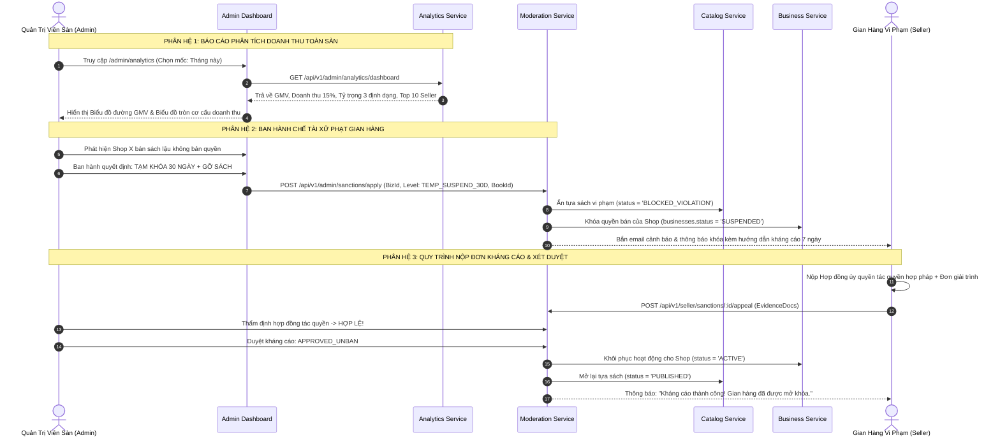

# TÀI LIỆU ĐẶC TẢ CHI TIẾT NGHIỆP VỤ - LUỒNG 22
## BÁO CÁO DOANH THU TOÀN SÀN & CHẾ TÀI XỬ PHẠT GIAN HÀNG (GMV ANALYTICS & STORE SANCTIONS / MODERATION)

---

## I. MỤC TIÊU & PHẠM VI NGHIỆP VỤ

* **Mục tiêu**: Xây dựng trung tâm dữ liệu thông minh (Business Intelligence & Analytics) tổng hợp toàn bộ các chỉ số thương mại cốt lõi của sàn Huki Ebook (GMV, Doanh thu hoa hồng thuần 15%, Tỷ trọng 3 định dạng xuất bản, Top Seller, Top Tựa sách bán chạy). Đồng thời thiết lập khung chế tài quản trị và xử phạt vi phạm (Store Sanctions & Moderation System) đa cấp độ (Gỡ sách vi phạm bản quyền, Tạm khóa gian hàng 7-30 ngày, Khóa vĩnh viễn) cùng quy trình khiếu nại/kháng cáo minh bạch cho đối tác.
* **Các bên tham gia (Actors)**:
  1. **Ban Quản Trị Sàn (Admin / Platform Executive)**: Theo dõi biểu đồ tăng trưởng doanh thu GMV, ban hành quyết định xử phạt gian hàng hoặc gỡ bỏ tác phẩm vi phạm pháp luật/bản quyền.
  2. **Nhà Bán Hàng (Seller / Publisher)**: Theo dõi báo cáo kinh doanh của gian hàng, nhận thông báo vi phạm và gửi đơn kháng cáo giải trình tác quyền.
  3. **Hệ thống Backend (Analytics, Sanctions & Catalog Services)**:
     * `analytics-service`: Thu thập dữ liệu giao dịch, tổng hợp số liệu thống kê định kỳ theo ngày/tháng (Daily Rollups).
     * `moderation-service`: Quản lý hồ sơ chế tài xử phạt `store_sanctions` và luồng kháng cáo `sanction_appeals`.
     * `catalog-service`: Cập nhật trạng thái hiển thị của tựa sách (`BLOCKED_VIOLATION`).

---

## II. MA TRẬN CHỈ SỐ DOANH THU & KHUNG CHẾ TÀI XỬ PHẠT

```
                                    HỆ THỐNG QUẢN TRỊ TOÀN SÀN
                                                │
         ┌──────────────────────────────────────┴──────────────────────────────────────┐
         ▼                                                                             ▼
 1. BÁO CÁO PHÂN TÍCH DOANH THU (GMV)                         2. KHUNG CHẾ TÀI XỬ PHẠT GIAN HÀNG
  • Tổng giá trị hàng hóa giao dịch (GMV)                      • Mức 1: Gỡ bỏ tựa sách vi phạm (Takedown)
  • Doanh thu hoa hồng thuần của Sàn (15%)                     • Mức 2: Tạm khóa gian hàng 7 - 30 ngày (Suspend)
  • Cơ cấu doanh số: Sách Giấy vs Ebook vs Hybrid              • Mức 3: Khóa vĩnh viễn & Hủy tư cách NXB (Ban)
  • Bảng xếp hạng Top 10 Gian Hàng & Top Sách Bán Chạy         • Quy trình nộp đơn kháng cáo giải trình (7 ngày)
```

---

## III. BẢNG TRƯỜNG DỮ LIỆU & SCHEMA BÁO CÁO & XỬ PHẠT

Bảng `platform_daily_stats`, `store_sanctions` và `sanction_appeals`:

### 1. Bảng `platform_daily_stats` (Thống Kê Tổng Hợp Hàng Ngày)
| Tên Cột | Kiểu Dữ Liệu | Ràng Buộc | Mô Tả |
|---|---|---|---|
| `id` | UUID | Primary Key | Mã bản ghi |
| `stat_date` | Date | Unique Index | Ngày thống kê (VD: `2026-09-15`) |
| `total_gmv` | Decimal | Bắt buộc | Tổng giá trị giao dịch phát sinh trong ngày |
| `platform_net_revenue`| Decimal | Bắt buộc | Doanh thu hoa hồng thực thu (15%) |
| `total_orders_count` | Integer | Bắt buộc | Tổng số đơn hàng tạo mới |
| `physical_revenue` | Decimal | Bắt buộc | Doanh số từ Sách Giấy in |
| `ebook_revenue` | Decimal | Bắt buộc | Doanh số từ Sách Điện Tử |
| `hybrid_revenue` | Decimal | Bắt buộc | Doanh số từ Gói Hybrid Combo |
| `active_sellers_count`| Integer | Bắt buộc | Số gian hàng có phát sinh giao dịch |

### 2. Bảng `store_sanctions` (Hồ Sơ Chế Tài Xử Phạt)
| Tên Cột | Kiểu Dữ Liệu | Ràng Buộc | Mô Tả |
|---|---|---|---|
| `id` | UUID | Primary Key | Mã quyết định xử phạt |
| `business_id` | UUID | FK `businesses`, Index | Gian hàng bị xử phạt |
| `sanction_level` | Enum | `WARNING_TAKEDOWN_BOOK`, `TEMP_SUSPEND_7D`, `TEMP_SUSPEND_30D`, `PERMANENT_BAN` | Mức độ chế tài |
| `reason_code` | Enum | `COPYRIGHT_INFRINGEMENT` (Vi phạm bản quyền), `PROHIBITED_CONTENT` (Nội dung cấm), `FAKE_ORDERS` (Đơn ảo), `HIGH_CANCEL_RATE` (Tỷ lệ hủy cao) | Lý do xử phạt |
| `violation_details` | Text | Bắt buộc | Mô tả chi tiết hành vi vi phạm |
| `targeted_book_id` | UUID (Nullable) | FK `books` | Tựa sách bị gỡ bỏ (nếu có) |
| `applied_by` | UUID | FK `users` (Admin) | Admin ban hành quyết định |
| `status` | Enum | `ACTIVE`, `APPEAL_PENDING`, `REVOKED` (Gỡ phạt sau kháng cáo), `EXPIRED` | Trạng thái chế tài |
| `start_at` | Timestamp | Bắt buộc | Thời điểm áp dụng |
| `end_at` | Timestamp | Nullable | Thời điểm hết hạn tạm khóa |

### 3. Bảng `sanction_appeals` (Đơn Kháng Cáo Giải Trình)
| Tên Cột | Kiểu Dữ Liệu | Ràng Buộc | Mô Tả |
|---|---|---|---|
| `id` | UUID | Primary Key | Mã đơn kháng cáo |
| `sanction_id` | UUID | FK `store_sanctions` | Quyết định bị kháng cáo |
| `business_id` | UUID | FK `businesses` | Gian hàng nộp đơn |
| `appeal_reason` | Text | Bắt buộc | Nội dung giải trình |
| `evidence_documents`| Array String | Text[] | Danh sách URL tài liệu bản quyền đính kèm |
| `status` | Enum | `PENDING_REVIEW`, `APPROVED_UNBAN`, `REJECTED` | Kết quả kháng cáo |
| `reviewed_by` | UUID (Nullable) | FK `users` (Admin) | Admin thẩm định đơn |
| `reviewed_at` | Timestamp | Nullable | Thời điểm kết luận kháng cáo |

---

## IV. SƠ ĐỒ TRÌNH TỰ THỐNG KÊ & CHẾ TÀI XỬ PHẠT (SEQUENCE DIAGRAM)



---

## V. PHÂN RÃ CHI TIẾT TỪNG BƯỚC THỰC HIỆN

---

### BƯỚC 1: TỔNG HỢP VÀ BÁO CÁO DOANH THU THƯƠNG MẠI TOÀN SÀN (GMV BI)

* **Bước 1.1: Trực quan hóa các chỉ số tài chính vĩ mô**:
  * Tại trang **Thống Kê Sàn** ([`AdminAnalyticsPage.jsx`](file:///d:/doan_huki_ebook/huki-ebook/web/src/ui/pages/admin/AdminAnalyticsPage.jsx)):
    * 📈 **Tổng GMV Toàn Sàn**: Tổng giá trị giao dịch đơn hàng phát sinh (kèm % tăng trưởng so với kỳ trước).
    * 💰 **Doanh Thu Hoa Hồng Thuần (15%)**: Phần tiền thực tế thuộc về doanh thu nền tảng Huki Ebook.
    * 📦 **Tổng Số Đơn Hàng & Lượng Sách Đã Bán**.
* **Bước 1.2: Phân tích tỷ trọng 3 hình thái sản phẩm**:
  * Biểu đồ tròn (Doughnut Chart):
    * 📖 Sách Giấy: Chiếm $55\%$ doanh số.
    * 💻 Ebook: Chiếm $30\%$ doanh số.
    * ⚡ Gói Hybrid Combo: Chiếm $15\%$ doanh số.
* **Bước 1.3: Bảng xếp hạng Top Đơn Vị Phát Hành & Best-Sellers**:
  * Top 10 Nhà Xuất Bản đạt doanh số cao nhất.
  * Top 10 Tác Phẩm bán chạy nhất (kèm số lượng cuốn đã tiêu thụ).

---

### BƯỚC 2: PHÁT HIỆN & TIẾP NHẬN BÁO CÁO VI PHẠM (VIOLATION DETECTION)

* **Bước 2.1: Các nguồn phát hiện vi phạm**:
  * Báo cáo vi phạm từ Độc giả hoặc Chủ sở hữu quyền tác giả bên ngoài (Copyright Takedown Notice).
  * Hệ thống phát hiện bất thường: Tỷ lệ hủy đơn hàng $> 30\%$, hoặc nghi vấn tạo đơn ảo gian lận khuyến mãi.
* **Bước 2.2: Lập hồ sơ kiểm duyệt**:
  * Admin vào mục **Kiểm Duyệt & Chế Tài** (`/admin/moderation`) để mở hồ sơ thẩm định đối tượng vi phạm.

---

### BƯỚC 3: THI HÀNH CÁC CẤP ĐỘ CHẾ TÀI XỬ PHẠT (SANCTION ENFORCEMENT)

* **Bước 3.1: Mức 1 - Cảnh Cáo & Gỡ Bỏ Tựa Sách Vi Phạm (`WARNING_TAKEDOWN_BOOK`)**:
  * Áp dụng khi: Tựa sách vi phạm bản quyền hoặc có nội dung không phù hợp.
  * Hành động: Chuyển trạng thái sách sang `BLOCKED_VIOLATION`, ẩn khỏi Storefront ngay lập tức.
* **Bước 3.2: Mức 2 - Tạm Khóa Gian Hàng Có Thời Hạn (`TEMP_SUSPEND_7D` / `30D`)**:
  * Áp dụng khi: Gian hàng tái diễn vi phạm hoặc gian lận đơn hàng.
  * Hành động:
    * Cập nhật `businesses.status = 'SUSPENDED'`.
    * Khóa quyền đăng bán sản phẩm mới, khóa tiếp nhận đơn mới, đóng băng số dư khả dụng trong thời gian phạt.
    * Bật thông báo trên trang gian hàng: *"Gian hàng đang tạm ngưng hoạt động do vi phạm chính sách của Sàn"*.
* **Bước 3.3: Mức 3 - Khóa Vĩnh Viễn & Chấm Dứt Hợp Đồng (`PERMANENT_BAN`)**:
  * Áp dụng khi: Gian hàng vi phạm pháp luật nghiêm trọng hoặc giả mạo pháp nhân NXB.
  * Hành động: Vô hiệu hóa vĩnh viễn tài khoản gian hàng, cấm MST này đăng ký lại trên sàn.

---

### BƯỚC 4: QUY TRÌNH NỘP ĐƠN KHÁNG CÁO GIẢI TRÌNH CỦA SELLER (APPEAL)

* **Bước 4.1: Tiếp nhận thông báo xử phạt**:
  * Seller nhận thông báo chi tiết qua Email và chuông thông báo: Nêu rõ mức phạt, lý do vi phạm, điều khoản vi phạm và hạn nộp đơn kháng cáo trong **7 ngày**.
* **Bước 4.2: Nộp đơn giải trình ([`SellerSanctionsPage.jsx`](file:///d:/doan_huki_ebook/huki-ebook/web/src/ui/pages/seller/SellerSanctionsPage.jsx))**:
  * Seller bấm **"Gửi Đơn Kháng Cáo"**:
  * Nhập lý do giải trình chi tiết và tải lên các tệp tài liệu chứng minh (Hợp đồng chuyển nhượng quyền tác giả, Giấy phép xuất bản của Cục Xuất Bản, Hóa đơn VAT nguồn gốc sách).

---

### BƯỚC 5: HỘI ĐỒNG ADMIN THẨM ĐỊNH KHÁNG CÁO & GỠ PHẠT (UNBAN / RESTORE)

* **Bước 5.1: Thẩm định hồ sơ giải trình**:
  * Admin kiểm tra tính xác thực của Giấy phép xuất bản và Hợp đồng bản quyền.
* **Bước 5.2: Kết luận xử lý kháng cáo**:
  * **Trường hợp Chấp thuận Kháng cáo (`APPROVED_UNBAN`)**:
    * Admin bấm **"Chấp thuận & Gỡ phạt"**:
    * Khôi phục trạng thái gian hàng về `businesses.status = 'ACTIVE'`.
    * Mở lại các tựa sách bị ẩn về trạng thái `PUBLISHED`.
    * Mở khóa ví tài chính và gửi email thông báo khôi phục cho Shop.
  * **Trường hợp Bác bỏ Kháng cáo (`REJECTED`)**:
    * Giữ nguyên quyết định xử phạt, đóng hồ sơ khiếu nại.

---

## VI. MA TRẬN KIỂM THỬ THỐNG KÊ & CHẾ TÀI (TEST CASES MATRIX)

| Mã Test Case | Kịch Bản Kiểm Thử | Dữ Liệu Đầu Vào | Kết Quả Kỳ Vọng (Expected Result) | Đánh Giá |
|:---:|---|---|---|:---:|
| **TC_MOD_01** | Báo cáo GMV và Doanh thu hoa hồng 15% chuẩn xác | Tổng đơn trong ngày = 100tr. | Dashboard hiển thị đúng GMV 100tr, Doanh thu sàn thu về đúng 15tr. | **PASS** |
| **TC_MOD_02** | Thống kê cơ cấu 3 định dạng sách | Doanh số: Giấy 60tr, Ebook 30tr, Hybrid 10tr. | Biểu đồ tròn hiển thị đúng tỷ lệ $60\% - 30\% - 10\%$. | **PASS** |
| **TC_MOD_03** | Admin gỡ tựa sách vi phạm bản quyền | Admin chọn tựa sách X & bấm "Gỡ sách vi phạm". | Sách X chuyển `BLOCKED_VIOLATION`, biến mất khỏi kết quả tìm kiếm sàn ngay. | **PASS** |
| **TC_MOD_04** | Tạm khóa Shop 30 ngày | Áp dụng mức phạt `TEMP_SUSPEND_30D` cho Shop Y. | Shop Y bị khóa quyền đăng sách, không nhận được đơn mới, hiện nhãn Suspended. | **PASS** |
| **TC_MOD_05** | Seller nộp đơn kháng cáo trong hạn 7 ngày | Shop Y tải hợp đồng tác quyền giải trình. | Tạo đơn kháng cáo `APPEAL_PENDING`, Admin nhận thông báo thẩm định. | **PASS** |
| **TC_MOD_06** | Admin duyệt kháng cáo gỡ phạt gian hàng | Admin kiểm tra hợp đồng hợp lệ & bấm "Gỡ phạt". | Gian hàng tự động mở khóa về `ACTIVE`, các tựa sách mở bán lại bình thường. | **PASS** |

---

## VII. ĐIỀU KIỆN NGHIỆM THU HOÀN TẤT (DEFINITION OF DONE)

1. ✅ Báo cáo phân tích kinh doanh (GMV Analytics) hiển thị chính xác, trực quan các chỉ số tài chính vĩ mô và cơ cấu 3 định dạng.
2. ✅ Khung chế tài xử phạt hoạt động nghiêm ngặt từ cấp độ gỡ sách vi phạm đến tạm khóa/khóa vĩnh viễn gian hàng.
3. ✅ Tựa sách bị gỡ vi phạm lập tức bị ẩn khỏi toàn bộ sàn thương mại điện tử.
4. ✅ Quy trình nộp đơn kháng cáo và thẩm định giải trình của Admin diễn ra công bằng, minh bạch.
5. ✅ Vượt qua 100% Ma trận kiểm thử quản trị và chế tài (TC_MOD_01 đến TC_MOD_06).
