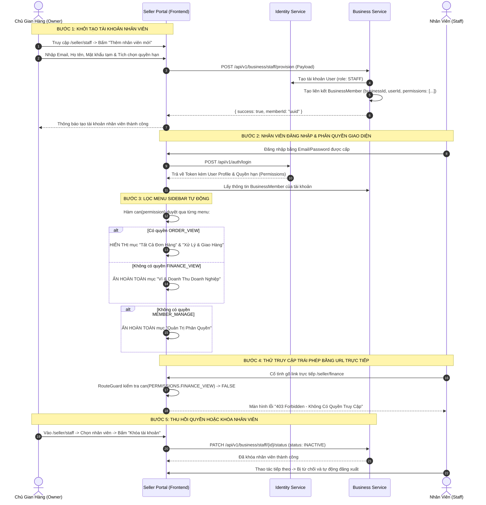

# TÀI LIỆU ĐẶC TẢ CHI TIẾT NGHIỆP VỤ - LUỒNG 3
## PHÂN QUYỀN & QUẢN TRỊ NHÂN SỰ GIAN HÀNG (STAFF RBAC & SUB-ACCOUNTS MANAGEMENT)

---

## I. MỤC TIÊU & PHẠM VI NGHIỆP VỤ

* **Mục tiêu**: Xây dựng cơ chế Quản trị phân quyền dựa trên vai trò (Role-Based Access Control - RBAC) nội bộ gian hàng. Cho phép Chủ doanh nghiệp (Owner) tạo tài khoản phụ cho nhân viên, phân chia quyền hạn theo từng nghiệp vụ chuyên môn (Kho hàng, Đơn hàng, CSKH) và **tuyệt đối bảo mật dữ liệu nhạy cảm (Ví tài chính, Rút tiền, Hồ sơ pháp lý)**.
* **Các bên tham gia (Actors)**:
  1. **Chủ Gian Hàng (Store Owner / Master Admin)**: Người đại diện pháp nhân, nắm toàn quyền (`OWNER`), quản lý tài chính và phân bổ nhân sự.
  2. **Nhân Viên Gian Hàng (Staff Members / Sub-accounts)**: Các tài khoản phụ được cấp quyền hạn giới hạn theo vị trí công việc.
  3. **Hệ thống Bảo Mật (Auth & Permission Guards)**: Bộ lọc phân quyền 3 lớp tại Sidebar, Route Guard và API Gateway.

---

## II. MA TRẬN PHÂN QUYỀN CHUẨN HÓA (PERMISSIONS MATRIX)

Hệ thống Huki Ebook định nghĩa **10 mã quyền nghiệp vụ chuẩn (`PERMISSIONS`)**:

| Mã Quyền (Permission Code) | Tên Quyền Nghiệp Vụ | Mô Tả Hành Động Được Phép | Vị Trí Áp Dụng |
|---|---|---|---|
| `DASHBOARD_VIEW` | Xem Bảng Điều Khiển | Xem các chỉ số tổng quan, thống kê doanh số chung | Bảng điều khiển (`/seller/dashboard`) |
| `ORDER_VIEW` | Xem Danh Sách Đơn Hàng | Xem thông tin chi tiết đơn hàng của gian hàng | Quản lý đơn (`/seller/orders`) |
| `ORDER_PROCESS` | Xử Lý & Giao Đơn Hàng | Xác nhận đơn, đóng gói, sinh mã AWB bàn giao ĐVVC | Xử lý đơn (`/seller/orders`) |
| `ORDER_CANCEL` | Hủy Đơn & Xử Lý Khiếu Nại | Duyệt hủy đơn, phản hồi yêu cầu trả hàng/hoàn tiền | Đơn hủy (`/seller/orders`) |
| `PRODUCT_VIEW` | Xem Danh Mục Sách | Xem danh sách sách giấy, ebook, combo hybrid | Kho sách (`/seller/products`) |
| `PRODUCT_CREATE` | Đăng Bán Sách Mới | Tạo mới sách giấy, tải file ebook, tạo combo hybrid | Đăng sách (`/seller/product/create-*`) |
| `PRODUCT_UPDATE` | Chỉnh Sửa Thông Tin Sách | Cập nhật giá bìa, % giảm giá, mô tả, ảnh bìa | Sửa sách (`/seller/product/correction`) |
| `INVENTORY_UPDATE` | Quản Lý Tồn Kho | Nhập thêm số lượng tồn kho sách giấy | Kho hàng (`/seller/product/create-physical`) |
| `STORE_VIEW` | Xem Hồ Sơ Gian Hàng | Xem thông tin pháp nhân, danh sách trụ sở | Hồ sơ (`/seller/business`) |
| `STORE_UPDATE` | Gửi Yêu Cầu Sửa Hồ Sơ | Bật chế độ sửa và gửi yêu cầu lên Admin sàn | Sửa hồ sơ (`/seller/business`) |
| `MEMBER_VIEW` | Xem Danh Sách Nhân Viên | Xem danh sách các tài khoản nhân sự nội bộ | Nhân sự (`/seller/staff`) |
| `MEMBER_MANAGE` | Quản Trị & Phân Quyền | Tạo nhân viên mới, cấp/thu hồi quyền, khóa tài khoản | Quản trị (`/seller/staff?action=provision`) |
| `FINANCE_VIEW` | Xem Ví & Rút Tiền | **Xem số dư khả dụng, tiền treo và tạo lệnh rút tiền (PIN 6 số)** | **Ví & Doanh thu (`/seller/finance`)** |

---

### BẢNG ĐỐI SOÁT QUYỀN HẠN THEO VAI TRÒ (ROLES MAPPING)

```
                            CẤU TRÚC PHÂN CẤP VAI TRÒ
                                       │
     ┌─────────────────────────────────┼─────────────────────────────────┐
     ▼                                 ▼                                 ▼
CHỦ GIAN HÀNG (OWNER)       NHÂN VIÊN ĐƠN HÀNG (ORDER)        NHÂN VIÊN KHO SÁCH (INVENTORY)
 • Toàn quyền 100%           • Xem & Xử lý đơn hàng            • Đăng sách & Nhập kho
 • Quản trị nhân viên        • Xử lý khiếu nại/Hủy             • Không xem được đơn hàng
 • Duy nhất được xem Ví      • KHÓA HOÀN TOÀN TRANG VÍ         • KHÓA HOÀN TOÀN TRANG VÍ
```

| Tính Năng / Màn Hình | CHỦ GIAN HÀNG (`OWNER`) | QUẢN LÝ SHOP (`MANAGER`) | NHÂN VIÊN ĐƠN (`ORDER_STAFF`) | NHÂN VIÊN KHO (`INVENTORY_STAFF`) |
|---|:---:|:---:|:---:|:---:|
| **Bảng Điều Khiển (Dashboard)** | ✅ Full | ✅ Full | ✅ Cơ bản | ✅ Cơ bản |
| **Xử Lý Đơn Hàng & In Vận Đơn** | ✅ Full | ✅ Full | ✅ **Chuyên trách** | ❌ Ẩn |
| **Đăng Sách & Cập Nhật Tồn Kho** | ✅ Full | ✅ Full | ❌ Ẩn | ✅ **Chuyên trách** |
| **Hồ Sơ Doanh Nghiệp & Trụ Sở** | ✅ Full | 👁️ Chỉ xem | ❌ Ẩn | ❌ Ẩn |
| **Danh Sách & Phân Quyền Nhân Sự** | ✅ Full | 👁️ Chỉ xem | ❌ Ẩn | ❌ Ẩn |
| **VÍ TÀI CHÍNH & RÚT TIỀN (PIN 6 SỐ)** | ✅ **ĐỘC QUYỀN** | ❌ **ẨN HOÀN TOÀN** | ❌ **ẨN HOÀN TOÀN** | ❌ **ẨN HOÀN TOÀN** |

---

## III. SƠ ĐỒ TRÌNH TỰ PHÂN QUYỀN & THỰC THI (SEQUENCE DIAGRAM)



---

## IV. PHÂN RÃ CHI TIẾT TỪNG BƯỚC THỰC HIỆN

---

### BƯỚC 1: CHỦ GIAN HÀNG KHỞI TẠO TÀI KHOẢN PHỤ (STAFF PROVISIONING)

* **Bước 1.1: Truy cập trang quản trị nhân sự**:
  * Chủ shop đăng nhập tài khoản `OWNER`, truy cập menu **Cửa Hàng & Nhân Sự** → **Danh Sách Nhân Viên** (`/seller/staff`).
  * Bấm nút màu xanh: **"+ Thêm nhân viên mới"** (hoặc truy cập `/seller/staff?action=provision`).
* **Bước 1.2: Nhập thông tin định danh nhân sự**:
  * Nhập Email công việc của nhân viên (ví dụ: `nv.donhang@trituevietbooks.vn`).
  * Nhập Họ và tên đầy đủ (ví dụ: `Nguyễn Văn Đạt`).
  * Nhập Số điện thoại liên lạc.
  * Thiết lập Mật khẩu khởi tạo (hoặc sinh mật khẩu ngẫu nhiên có độ dài tối thiểu 8 ký tự).
* **Bước 1.3: Cấu hình phân bổ quyền hạn (Permissions Checkboxes)**:
  * Hệ thống cung cấp 2 phương thức phân quyền:
    * **Cách 1: Chọn theo Nhóm vai trò mẫu (Role Presets)**:
      * *Nhân viên Đơn hàng*: Tự động tick `ORDER_VIEW`, `ORDER_PROCESS`, `ORDER_CANCEL`.
      * *Nhân viên Kho sách*: Tự động tick `PRODUCT_VIEW`, `PRODUCT_CREATE`, `PRODUCT_UPDATE`, `INVENTORY_UPDATE`.
      * *Quản lý Shop*: Tự động tick toàn bộ trừ `FINANCE_VIEW` và `MEMBER_MANAGE`.
    * **Cách 2: Tùy chỉnh chi tiết (Custom Granular Permissions)**: Chủ shop chủ động tick/bỏ tick từng quyền riêng biệt theo ý muốn.
* **Bước 1.4: Xác nhận tạo tài khoản**:
  * Chủ shop bấm nút **"Lưu & Cấp tài khoản"**.
  * Backend kiểm tra Email không được trùng với các tài khoản đang hoạt động khác.
  * Tạo bản ghi liên kết trong bảng `business_members` lưu trữ mảng quyền `permissions: ['ORDER_VIEW', 'ORDER_PROCESS']`.

---

### BƯỚC 2: NHÂN VIÊN ĐĂNG NHẬP & PHÂN TÁCH GIAO DIỆN (SIDEBAR FILTERING)

* **Bước 2.1: Đăng nhập hệ thống**:
  * Nhân viên dùng Email và Mật khẩu được cấp đăng nhập tại `/login`.
  * Sau khi xác thực thành công, hệ thống tải thông tin định danh kèm danh sách mã quyền được cấp (`user.permissions`).
* **Bước 2.2: Cơ chế lọc Sidebar tự động (`SellerSidebar.jsx`)**:
  * Khi hiển thị Sidebar, hệ thống duyệt qua từng mục menu bằng hàm kiểm tra:
    ```javascript
    const hasPerm = can(item.permission, currentBizId, user);
    if (!hasPerm) return false; // Không có quyền -> MẤT LUÔN KHỎI SIDEBAR
    ```
  * **Kết quả hiển thị đối với Nhân viên Đơn hàng**:
    * Nhóm *BÁN HÀNG & ĐƠN HÀNG*: Hiển thị đầy đủ (*Tất Cả Đơn Hàng*, *Xử Lý & Giao Hàng*, *Đơn Hủy*).
    * Nhóm *SẢN PHẨM & KHO HÀNG*: **Ẩn hoàn toàn**.
    * Nhóm *TÀI CHÍNH & DOANH THU*: **Ẩn hoàn toàn** (mục *Ví & Doanh Thu* biến mất).
    * Nhóm *CỬA HÀNG & NHÂN SỰ*: **Ẩn hoàn toàn** các mục chỉnh sửa hồ sơ và phân quyền.

---

### BƯỚC 3: CƠ CHẾ BẢO VỆ ĐA TẦNG (MULTI-LAYER DEFENSE)

Nếu nhân viên cố tình thao tác vượt quyền, hệ thống kích hoạt **3 lớp bảo vệ nghiêm ngặt**:

#### 🛡️ LỚP 1: ẨN TRIỆT ĐỂ TRÊN GIAO DIỆN (UI EXCLUSION)
* Các nút bấm hành động nhạy cảm (như nút *"Rút tiền"*, nút *"Xóa nhân viên"*, nút *"Cập nhật hồ sơ"*) **hoàn toàn không được render** trên giao diện của nhân viên không có quyền.

#### 🛡️ LỚP 2: BẢO VỆ ĐƯỜNG DẪN TRỰC TIẾP (PAGE-LEVEL ROUTE GUARD)
* Nếu nhân viên cố tình gõ đường link trực tiếp trên thanh địa chỉ trình duyệt (ví dụ: `http://localhost:3100/seller/finance`):
* Thành phần bảo vệ tại trang [`SellerBusinessProfilePage.jsx`](file:///d:/doan_huki_ebook/huki-ebook/web/src/ui/pages/seller/SellerBusinessProfilePage.jsx) hoặc [`SellerFinancePage.jsx`](file:///d:/doan_huki_ebook/huki-ebook/web/src/ui/pages/seller/SellerFinancePage.jsx) kiểm tra quyền:
  ```javascript
  const canViewFinance = can(PERMISSIONS.FINANCE_VIEW, currentBizId, user);
  if (!canViewFinance) {
    return (
      <div className="min-h-[70vh] flex flex-col items-center justify-center p-6 text-center">
        <div className="w-16 h-16 rounded-2xl bg-amber-500/10 text-amber-600 flex items-center justify-center mb-4 border border-amber-500/20">
          <span className="material-symbols-outlined text-3xl">lock</span>
        </div>
        <h2 className="text-xl font-bold font-editorial text-theme-on-surface mb-2">
          Không Có Quyền Truy Cập (403 Forbidden)
        </h2>
        <p className="text-xs sm:text-sm text-theme-on-surface-variant max-w-md mb-6">
          Tài khoản nhân viên của bạn chưa được cấp quyền xem Ví & Doanh Thu Doanh Nghiệp.
        </p>
        <Link to="/seller/dashboard" className="px-4 py-2.5 rounded-xl bg-theme-primary text-white text-xs font-bold">
          Quay lại Bảng Điều Khiển
        </Link>
      </div>
    );
  }
  ```

#### 🛡️ LỚP 3: BẢO VỆ TẠI BACKEND API (GATEWAY & SERVICE GUARDS)
* Ngay cả khi kẻ gian dùng Postman hoặc can thiệp mã JavaScript để gọi trực tiếp API rút tiền:
* Backend NestJS kích hoạt `@UseGuards(PermissionsGuard)` kiểm tra Header Token:
  * Nếu không có quyền `FINANCE_VIEW` &rarr; Chặn đứng và trả về mã lỗi HTTP `403 Forbidden` kèm thông điệp: `{"error": "Forbidden", "message": "Bạn không có quyền thực hiện giao dịch tài chính này"}`.

---

### BƯỚC 4: ĐIỀU CHỈNH QUYỀN HẠN & KHÓA TÀI KHOẢN (REVOCATION)

* **Bước 4.1: Thay đổi quyền hạn nhân viên**:
  * Chủ shop vào danh sách nhân viên, bấm nút **"Sửa quyền"** trên một nhân sự.
  * Tick bổ sung quyền hoặc bỏ bớt quyền &rarr; Bấm *"Cập nhật"*.
  * Quyền hạn mới có hiệu lực ngay lập tức trong phiên làm việc tiếp theo của nhân viên.
* **Bước 4.2: Tạm khóa / Khóa vĩnh viễn tài khoản nhân viên**:
  * Khi nhân viên nghỉ việc hoặc có hành vi gian lận:
  * Chủ shop bấm nút **"Khóa tài khoản"** (Deactivate).
  * Backend chuyển trạng thái `BusinessMember.status = 'INACTIVE'`.
  * Tài khoản đó lập tức bị thu hồi JWT Token và không thể đăng nhập vào Kênh Người Bán của doanh nghiệp.

---

## V. MA TRẬN KIỂM THỬ PHÂN QUYỀN (TEST CASES MATRIX)

| Mã Test Case | Kịch Bản Kiểm Thử | Dữ Liệu Thực Hiện | Kết Quả Kỳ Vọng (Expected Result) | Đánh Giá |
|:---:|---|---|---|:---:|
| **TC_RBAC_01** | Chủ shop tạo nhân viên Đơn hàng thành công | Email: `nv.donhang@gmail.com`<br>Quyền: `ORDER_VIEW`, `ORDER_PROCESS`. | Tài khoản tạo thành công, danh sách nhân sự xuất hiện nhân viên mới. | **PASS** |
| **TC_RBAC_02** | Nhân viên Đơn hàng đăng nhập & Lọc Sidebar | Đăng nhập bằng `nv.donhang@gmail.com`. | Thấy menu Đơn Hàng. Mục Ví Tài Chính và Quản Trị Nhân Sự **biến mất hoàn toàn**. | **PASS** |
| **TC_RBAC_03** | Chặn nhân viên gõ link trực tiếp vào trang Ví | Đăng nhập `nv.donhang` cố tình truy cập link `/seller/finance`. | Màn hình chặn lại, hiển thị thông báo **403 Forbidden** kèm icon ổ khóa. | **PASS** |
| **TC_RBAC_04** | Nhân viên Kho chỉ thao tác được Sản phẩm | Tài khoản có quyền `PRODUCT_CREATE`, `INVENTORY_UPDATE`. | Đăng được sách mới, sửa tồn kho. Không xem được đơn hàng và không xem được Ví. | **PASS** |
| **TC_RBAC_05** | Khóa tài khoản nhân viên đã nghỉ việc | Chủ shop bấm *"Khóa tài khoản"* của nhân viên. | Nhân viên bị đăng xuất ngay lập tức, đăng nhập lại báo lỗi tài khoản bị khóa. | **PASS** |
| **TC_RBAC_06** | Chủ shop (OWNER) có toàn quyền 100% | Đăng nhập tài khoản Chủ shop chính. | Thấy đầy đủ tất cả menu, xem ví, rút tiền mã PIN 6 số, tạo và sửa nhân viên. | **PASS** |

---

## VI. TIÊU CHÍ NGHIỆM THU HOÀN TẤT (DEFINITION OF DONE)

1. ✅ Chủ gian hàng có toàn quyền tạo mới, chỉnh sửa phân quyền và khóa tài khoản nhân viên.
2. ✅ Cơ chế lọc Sidebar tự động ẩn 100% các mục menu không có quyền (không hiển thị mờ, ẩn triệt để).
3. ✅ Cơ chế Route Guard chặn đứng các hành vi gõ link trực tiếp bằng màn hình 403 Forbidden trang trọng.
4. ✅ Backend API kiểm tra token và phân quyền 100% trước khi xử lý giao dịch.
5. ✅ Dữ liệu Ví tài chính và thao tác Rút tiền được bảo vệ độc quyền cho Chủ gian hàng (`OWNER`).
