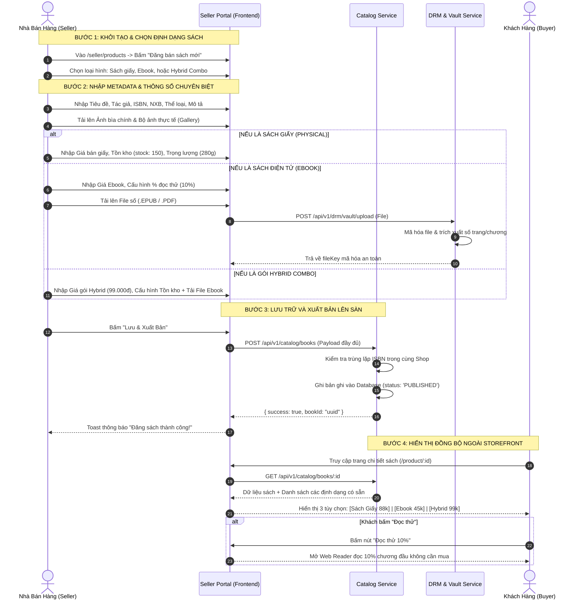

# TÀI LIỆU ĐẶC TẢ CHI TIẾT NGHIỆP VỤ - LUỒNG 4
## QUẢN LÝ CATALOG & ĐĂNG BÁN SÁCH ĐA HÌNH THÁI (MULTI-FORMAT PUBLISHING: PHYSICAL, EBOOK, HYBRID)

---

## I. MỤC TIÊU & PHẠM VI NGHIỆP VỤ

* **Mục tiêu**: Cung cấp công cụ xuất bản toàn diện cho Nhà xuất bản (NXB) và Nhà phát hành sách, hỗ trợ phân phối tác phẩm dưới **3 định dạng thương mại độc lập hoặc kết hợp**: Sách giấy truyền thống (Physical), Sách điện tử bảo mật bản quyền (Ebook) và Gói ấn bản tích hợp (Hybrid Edition). Đảm bảo tính toàn vẹn của dữ liệu catalog (ISBN, tác giả, danh mục) và đồng bộ mượt mà ra ngoài sàn giao dịch.
* **Các bên tham gia (Actors)**:
  1. **Nhà Bán Hàng / NXB (Seller / Publisher)**: Tạo mới, cập nhật thông tin sách, tải file số, cấu hình tồn kho và giá bán.
  2. **Khách Hàng / Độc Giả (Buyer / Reader)**: Tìm kiếm, xem chi tiết ấn phẩm (PDP), đọc thử mẫu chương và lựa chọn định dạng muốn mua.
  3. **Hệ thống Backend (Catalog & DRM Services)**: `catalog-service`, `drm-service`, hệ thống lưu trữ tệp số an toàn (Encrypted Storage).

---

## II. ĐẶC TẢ 3 ĐỊNH DẠNG XUẤT BẢN CỐT LÕI

```
                           HỆ THỐNG XUẤT BẢN ĐA HÌNH THÁI
                                         │
        ┌────────────────────────────────┼────────────────────────────────┐
        ▼                                ▼                                ▼
1. SÁCH GIẤY (PHYSICAL)          2. SÁCH ĐIỆN TỬ (EBOOK)          3. GÓI KẾT HỢP (HYBRID)
 • Quản lý tồn kho thực           • Tải file nguồn EPUB/PDF        • Mua combo giấy + Ebook
 • Trọng lượng, đóng gói          • Tỷ lệ đọc thử (10%)            • Đọc Ebook ngay trong khi
 • Cần giao nhận vận chuyển       • Mã hóa bản quyền số DRM          chờ giao sách giấy tận nhà
```

### 1. Sách Giấy Truyền Thống (Physical Book)
* **Đặc tính**: Ấn phẩm vật lý in ấn, yêu cầu quản lý số lượng tồn kho và đóng gói vận chuyển.
* **Dữ liệu chuyên biệt**:
  * `stock_quantity`: Số lượng sách thực tế trong kho.
  * `weight_in_grams`: Trọng lượng cuốn sách (Gram) để tính cước phí vận chuyển tự động.
  * `dimensions`: Kích thước đóng gói (Dài $\times$ Rộng $\times$ Dày cm).
  * `cover_type`: Loại bìa (`Bìa mềm`, `Bìa cứng`, `Bìa gập tay gấp`, `Bìa da đặc biệt`).

### 2. Sách Điện Tử (Ebook / Digital Publication)
* **Đặc tính**: Bản quyền nội dung số, không giới hạn số lượng tồn kho (`unlimited`), mở khóa tức thì sau khi thanh toán.
* **Dữ liệu chuyên biệt**:
  * `digital_price`: Giá bán bản quyền đọc số.
  * `file_url`: Tệp nội dung số nguồn (.EPUB hoặc .PDF) lưu trong két an toàn DRM Vault.
  * `sample_preview_percentage`: Tỷ lệ % số trang cho phép khách đọc thử miễn phí (mặc định 10% hoặc 3 chương đầu).
  * `drm_protected`: Cờ kích hoạt bảo mật bản quyền số (`true`), bật thủy ấn động (Dynamic Watermark).

### 3. Gói Ấn Bản Kết Hợp (Hybrid Edition Combo)
* **Đặc tính Độc Quyền của Huki Ebook**: Gói sản phẩm bao gồm cả bản in Sách giấy vật lý và bản quyền Sách điện tử Ebook với mức giá ưu đãi (rẻ hơn so với việc mua lẻ 2 lần).
* **Giá trị mang lại cho độc giả**:
  * Khi đặt mua và thanh toán đơn Hybrid thành công: Độc giả được **mở khóa ngay bản Ebook trong Tủ sách cá nhân** để đọc tức thì trên Web Reader mà không phải chờ đợi.
  * Song song đó, Shop tiến hành đóng gói và giao cuốn Sách giấy về tận nhà của độc giả.
* **Dữ liệu chuyên biệt**:
  * `hybrid_price`: Mức giá trọn gói combo ưu đãi.
  * `is_hybrid`: `true`.
  * Liên kết đồng thời thông số tồn kho sách giấy và tệp số Ebook.

---

## III. BẢNG TRƯỜNG DỮ LIỆU CATALOG CHUẨN (METADATA SCHEMA)

Bản ghi thông tin sách được lưu trữ trong bảng `books`:

| STT | Tên Trường Dữ Liệu | Mã Trường (Field Key) | Kiểu Dữ Liệu | Ràng Buộc (Validation Rules) | Mô Tả & Ví Dụ |
|:---:|---|---|---|---|---|
| 1 | Tiêu đề sách | `title` | String (Max 255) | Bắt buộc | `Nhà Giả Kim (Ấn Bản Kỷ Niệm 30 Năm)` |
| 2 | Tiêu đề phụ / Lời đề tựa | `subtitle` | String | Không bắt buộc | `Hành trình đi tìm vận mệnh cuộc đời` |
| 3 | Tác giả chính | `author_name` | String | Bắt buộc | `Paulo Coelho` |
| 4 | Người dịch | `translator_name` | String | Không bắt buộc | `Lê Chu Cầu` |
| 5 | Nhà xuất bản | `publisher` | String | Bắt buộc | `Nhà Xuất Bản Hội Nhà Văn` |
| 6 | Đơn vị phát hành | `distributor` | String | Bắt buộc | `Công Ty Cổ Phần Sách Nhã Nam` |
| 7 | Mã quốc tế ISBN-10/13 | `isbn` | String (10-13 số) | Bắt buộc, kiểm tra định dạng ISBN | `9786049897123` |
| 8 | Danh mục ngành sách | `category_id` | UUID (FK) | Bắt buộc liên kết bảng `categories` | `Văn Học Kinh Điển / Tiểu Thuyết` |
| 9 | Năm xuất bản | `publication_year` | Integer | Bắt buộc, $\le \text{Năm hiện tại}$ | `2023` |
| 10 | Số trang | `page_count` | Integer | Bắt buộc, $> 0$ | `228` |
| 11 | Ngôn ngữ | `language` | String | Mặc định `Tiếng Việt` (`vi`) | `vi` |
| 12 | Định dạng hỗ trợ | `formats` | Array Enum | `['PHYSICAL', 'EBOOK', 'HYBRID']` | Chọn 1, 2 hoặc cả 3 định dạng |
| 13 | Giá bìa niêm yết | `original_price` | Decimal | Bắt buộc, $> 0$ | `110.000đ` |
| 14 | Giá bán sách giấy | `physical_price` | Decimal | Bắt buộc nếu có bán sách giấy | `88.000đ` (Giảm 20%) |
| 15 | Giá bán Ebook | `ebook_price` | Decimal | Bắt buộc nếu có bán Ebook | `45.000đ` |
| 16 | Giá gói Hybrid | `hybrid_price` | Decimal | Bắt buộc nếu có gói Hybrid | `99.000đ` |
| 17 | Tồn kho sách giấy | `stock_quantity` | Integer | Bắt buộc nếu có bán sách giấy | `150` |
| 18 | Trọng lượng đóng gói | `weight_in_grams` | Integer | Bắt buộc nếu có bán sách giấy | `280` (Gram) |
| 19 | Tệp nội dung Ebook | `ebook_file_url` | String (URL Vault)| Bắt buộc nếu có bán Ebook | `vault/ebooks/nha-gia-kim-encrypted.epub` |
| 20 | % Đọc thử Ebook | `preview_percentage` | Integer (1 - 30%) | Mặc định `10%` | `10` |
| 21 | Ảnh bìa chính | `cover_image_url` | String (URL) | Bắt buộc, ảnh tỷ lệ 3:4 rõ nét | Ảnh bìa trước sản phẩm |
| 22 | Bộ sưu tập ảnh thực tế | `gallery_images` | Array String | Tối thiểu 2 ảnh thực tế/mục lục | `['img1.jpg', 'img2.jpg', 'img3.jpg']` |
| 23 | Mô tả nội dung tóm tắt | `description` | Text (Markdown) | Bắt buộc, tối thiểu 100 từ | Nội dung giới thiệu tóm tắt tác phẩm |
| 24 | Trạng thái hiển thị | `status` | Enum | `DRAFT`, `PUBLISHED`, `OUT_OF_STOCK`, `HIDDEN` | `PUBLISHED` (Đang mở bán công khai) |

---

## IV. SƠ ĐỒ TRÌNH TỰ XUẤT BẢN SÁCH (SEQUENCE DIAGRAM)



---

## V. PHÂN RÃ CHI TIẾT TỪNG BƯỚC THỰC HIỆN

---

### BƯỚC 1: TRUY CẬP & LỰA CHỌN ĐỊNH DẠNG XUẤT BẢN

* **Bước 1.1: Truy cập trang quản trị sản phẩm**:
  * Seller đăng nhập tài khoản đối tác, truy cập menu **Sản Phẩm & Kho Hàng** → **Danh Mục Sản Phẩm** (`/seller/products`).
  * Bấm nút màu xanh: **"+ Đăng bán sách mới"**.
* **Bước 1.2: Lựa chọn định dạng xuất bản mong muốn**:
  * Hệ thống hiển thị 3 thẻ định dạng trực quan:
    * 📦 **Sách Giấy (Physical Book)**: Dành cho ấn bản in bìa mềm/bìa cứng truyền thống.
    * 💻 **Sách Điện Tử (Ebook)**: Dành cho ấn bản số bản quyền đọc trên thiết bị.
    * ⚡ **Gói Ấn Bản Kết Hợp (Hybrid Combo)**: Dành cho gói combo giấy + đọc số tức thì.
  * Chuyển hướng sang màn hình khởi tạo tương ứng ([`SellerCreatePhysical.jsx`](file:///d:/doan_huki_ebook/huki-ebook/web/src/ui/pages/seller/SellerCreatePhysical.jsx), [`SellerCreateEbook.jsx`](file:///d:/doan_huki_ebook/huki-ebook/web/src/ui/pages/seller/SellerCreateEbook.jsx), hoặc [`SellerCreateHybrid.jsx`](file:///d:/doan_huki_ebook/huki-ebook/web/src/ui/pages/seller/SellerCreateHybrid.jsx)).

---

### BƯỚC 2: NHẬP DỮ LIỆU METADATA CHUNG (CHỈNH SỬA THÔNG TIN TÁC PHẨM)

* **Bước 2.1: Nhập thông tin định danh tác phẩm**:
  * *Tiêu đề sách* (`title`): Tên chuẩn của cuốn sách.
  * *Tác giả chính* (`author_name`): Tên tác giả (hỗ trợ chọn tác giả đã có hoặc thêm tác giả mới).
  * *Người dịch* (`translator_name`): Họ tên dịch giả (nếu là sách dịch).
  * *Nhà xuất bản & Công ty phát hành*: Đơn vị cấp phép và đơn vị liên kết xuất bản.
  * *Mã ISBN* (`isbn`): Nhập 10 hoặc 13 số ISBN chuẩn quốc tế.
  * *Danh mục / Thể loại*: Chọn danh mục phù hợp (VD: *Kinh tế - Khởi nghiệp*, *Văn học trong nước*, *Tâm lý học*).
  * *Năm xuất bản & Số trang*: Năm ấn bản và độ dày trang.
* **Bước 2.2: Tải lên hình ảnh sản phẩm**:
  * *Ảnh bìa chính (Cover Image)*: Tỷ lệ chuẩn 3:4, độ phân giải tối thiểu $600 \times 800\text{px}$, hiển thị nổi bật trên danh mục tìm kiếm.
  * *Bộ sưu tập ảnh thực tế (Gallery)*: Tải lên từ 2 - 5 ảnh chụp thực tế sách (mặt sau, gáy sách, trang mục lục, lời tựa).
* **Bước 2.3: Nhập nội dung tóm tắt & Giới thiệu sách**:
  * Sử dụng khung soạn thảo Rich Text / Markdown để nhập lời giới thiệu, trích đoạn đặc sắc và thông điệp tác phẩm.

---

### BƯỚC 3: CẤU HÌNH CHI TIẾT THEO ĐỊNH DẠNG ĐẶC THÙ

#### 🔹 NHÁNH 3A: CẤU HÌNH SÁCH GIẤY (`SellerCreatePhysical.jsx`)
1. **Giá bán & Chiết khấu**:
   * Nhập Giá bìa niêm yết (VD: `120.000đ`).
   * Nhập % giảm giá hoặc Giá bán thực tế (VD: `96.000đ` - Giảm 20%).
2. **Quản lý kho hàng & Vận chuyển**:
   * Nhập số lượng tồn kho ban đầu (`stock_quantity`: VD `200` cuốn).
   * Nhập trọng lượng đóng gói (`weight_in_grams`: VD `350` gram).
   * Chọn Loại bìa (`Bìa mềm` hoặc `Bìa cứng`) và Kích thước sách ($14 \times 20.5\text{ cm}$).

#### 🔹 NHÁNH 3B: CẤU HÌNH SÁCH ĐIỆN TỬ EBOOK (`SellerCreateEbook.jsx`)
1. **Giá bản quyền số**:
   * Nhập Giá bán Ebook (VD: `49.000đ`).
2. **Tải lên & Mã hóa tệp nội dung số**:
   * Bấm nút *"Tải lên tệp Ebook"* → Chọn file định dạng `.epub` hoặc `.pdf` (dung lượng $\le 50\text{MB}$).
   * Hệ thống đẩy file vào két an toàn `DRM Vault`, tiến hành băm mã hóa bảo mật chống sao chép trái phép.
3. **Cấu hình Đọc thử**:
   * Thiết lập tỷ lệ đọc thử miễn phí: Thanh trượt chọn từ `5%` đến `30%` tổng số trang (mặc định khuyến nghị `10%`).

#### 🔹 NHÁNH 3C: CẤU HÌNH GÓI HYBRID COMBO (`SellerCreateHybrid.jsx`)
1. **Cấu hình Giá gói ưu đãi**:
   * Giá bìa sách giấy: `120.000đ`.
   * Giá bán lẻ Ebook: `49.000đ` (Tổng giá trị lẻ $= 169.000đ$).
   * **Giá gói Combo Hybrid ưu đãi**: Thiết lập `109.000đ` (Tiết kiệm ngay 35% cho độc giả).
2. **Thiết lập đồng thời 2 luồng**:
   * Nhập tồn kho sách giấy (`stock: 100`) + Trọng lượng vận chuyển (`350g`).
   * Tải lên file Ebook số và cấu hình đọc thử 10%.

---

### BƯỚC 4: XÁC THỰC DỮ LIỆU & LƯU TRỮ XUẤT BẢN (PUBLISHING TRANSACTION)

* **Bước 4.1: Kiểm tra hợp lệ trước khi xuất bản (Pre-save Validation)**:
  * Kiểm tra đầy đủ các trường bắt buộc (Tiêu đề, Tác giả, ISBN, Giá bán, Tồn kho/File đọc).
  * Kiểm tra giá bán không được lớn hơn giá bìa gốc.
* **Bước 4.2: Gửi request lưu trữ**:
  * Seller bấm nút **"Lưu & Xuất Bản"** (hoặc nút *"Lưu bản nháp"* nếu chưa muốn mở bán ngay).
  * Frontend gửi `POST /api/v1/catalog/books` đến `catalog-service`.
* **Bước 4.3: Xử lý ghi nhận Backend**:
  * Kiểm tra trùng lặp ISBN.
  * Ghi bản ghi vào bảng `books` với trạng thái `status = 'PUBLISHED'`.
  * Tự động liên kết sách với `business_id` của Seller.
* **Bước 4.4: Thông báo thành công**:
  * Màn hình hiển thị thông báo: *"Xuất bản tựa sách thành công! Sản phẩm đã sẵn sàng mở bán trên sàn."*
  * Tự động điều hướng về danh sách sản phẩm (`/seller/products`).

---

### BƯỚC 5: HIỂN THỊ ĐỒNG BỘ TRÊN GIAO DIỆN STOREFRONT

* **Bước 5.1: Hiển thị trên Danh mục & Tìm kiếm (`/catalog`, `/books`)**:
  * Tựa sách xuất hiện ngay trên trang danh mục với ảnh bìa rõ nét, giá bán và nhãn phân loại (`[Sách Giấy]`, `[Ebook]`, `[Hybrid]`).
* **Bước 5.2: Giao diện Chi tiết Tác phẩm (Product Detail Page - PDP)**:
  * Khi độc giả bấm vào cuốn sách:
  * Giao diện hiển thị **Bộ chọn 3 định dạng tương tác**:
    * 🔘 **Sách Giấy**: Hiển thị giá `88.000đ`, tồn kho còn `150 cuốn`, phí vận chuyển tạm tính.
    * 🔘 **Ebook**: Hiển thị giá `45.000đ`, nút *"Đọc thử 10%"*, thông báo *"Đọc trực tuyến trên mọi thiết bị"*.
    * 🔘 **Gói Hybrid Combo**: Hiển thị giá `99.000đ`, nhãn *"Tiết kiệm 35% & Đọc Ebook ngay trong khi chờ giao sách giấy"*.
* **Bước 5.3: Trải nghiệm Đọc thử Miễn phí (Sample Preview)**:
  * Độc giả bấm nút **"Đọc thử 10%"** → Trình đọc Web Reader mở ra ngay lập tức, cho phép lật xem 10% số trang đầu của cuốn sách mà chưa cần đăng nhập hay thanh toán.

---

## VI. MA TRẬN KIỂM THỬ XUẤT BẢN CATALOG (TEST CASES MATRIX)

| Mã Test Case | Kịch Bản Kiểm Thử | Dữ Liệu Đầu Vào | Kết Quả Kỳ Vọng (Expected Result) | Đánh Giá |
|:---:|---|---|---|:---:|
| **TC_CAT_01** | Đăng bán Sách Giấy vật lý thành công | Tiêu đề: `Đắc Nhân Tâm`<br>Giá bìa: 100k, Bán: 80k, Tồn kho: 50, Cân nặng: 300g. | Sách tạo thành công, hiển thị đúng tồn kho 50 và giá 80k ngoài sàn. | **PASS** |
| **TC_CAT_02** | Đăng bán Ebook kèm tệp đọc số | Tiêu đề: `Tư Duy Nhanh Và Chậm`<br>Giá Ebook: 50k, Tải file `.epub`, Đọc thử 10%. | Tệp số được mã hóa vào DRM Vault, ngoài trang chi tiết có nút "Đọc thử 10%". | **PASS** |
| **TC_CAT_03** | Đăng bán gói Combo Hybrid kết hợp | Tiêu đề: `Nhà Giả Kim (Hybrid Edition)`<br>Giá gói: 99k, Tồn kho: 100 + Tệp Ebook. | Ngoài sàn hiển thị đủ 2 quyền lợi: Nhận sách giấy tận nhà + Mở khóa Ebook ngay. | **PASS** |
| **TC_CAT_04** | Chặn đăng sách khi giá bán lớn hơn giá bìa | Giá bìa: 100.000đ<br>Giá bán nhập: 120.000đ. | Hệ thống báo lỗi: *"Giá bán thực tế không được vượt quá giá bìa niêm yết."* | **PASS** |
| **TC_CAT_05** | Kiểm tra đọc thử 10% trên Storefront | Bấm nút "Đọc thử" cuốn Ebook có 200 trang. | Trình đọc mở ra và chặn lại ở đúng trang 20, hiện popup mời mua sách để đọc tiếp. | **PASS** |
| **TC_CAT_06** | Sửa giá và cập nhật tồn kho | Seller vào sửa giá từ 80k xuống 75k, tồn kho từ 50 lên 100. | Dữ liệu cập nhật ngay lập tức ngoài trang mua hàng không có độ trễ. | **PASS** |

---

## VII. ĐIỀU KIỆN NGHIỆM THU HOÀN TẤT (DEFINITION OF DONE)

1. ✅ Hỗ trợ đầy đủ, mượt mà cả 3 hình thái sản phẩm: Sách giấy, Ebook và Hybrid Combo.
2. ✅ Kiểm tra hợp lệ nghiêm ngặt thông tin Metadata, ISBN, hình ảnh và tệp dữ liệu số.
3. ✅ Tệp Ebook được tải lên và mã hóa an toàn trong két bảo mật DRM Vault.
4. ✅ Tính năng Đọc thử miễn phí 10% hoạt động mượt mà trực tiếp trên trình duyệt.
5. ✅ Trang Chi tiết sản phẩm (PDP) hiển thị bộ chọn định dạng thông minh, trực quan và tính toán giá chính xác.
