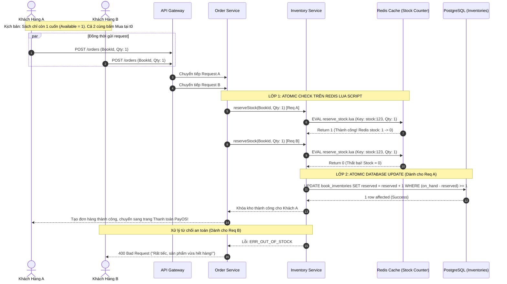

# TÀI LIỆU ĐẶC TẢ CHI TIẾT NGHIỆP VỤ - LUỒNG 5
## QUẢN LÝ TỒN KHO 3 TẦNG & KHÓA NGUYÊN TỬ CHỐNG TRANH CHẤP (3-TIER INVENTORY MANAGEMENT & RACE CONDITION LOCK)

---

## I. MỤC TIÊU & PHẠM VI NGHIỆP VỤ

* **Mục tiêu**: Xây dựng hệ thống quản lý tồn kho chính xác tuyệt đối, ngăn chặn triệt để hiện tượng bán vượt số lượng tồn (Overselling / Race Condition) khi hàng nghìn khách hàng cùng bấm mua sách tại cùng một mili-giây. Quản lý minh bạch trạng thái hàng hóa theo mô hình 3 tầng (Tồn thực, Tạm giữ, Khả dụng) và cơ chế khóa phân tán hiệu năng cao.
* **Các bên tham gia (Actors)**:
  1. **Khách Hàng (Buyer)**: Tiến hành tạo đơn hàng và thanh toán trên sàn.
  2. **Nhà Bán Hàng (Seller / Warehouse Staff)**: Theo dõi biến động kho, nhập thêm hàng, điều chỉnh số lượng tồn.
  3. **Order & Inventory Microservices**:
     * `inventory-service`: Quản lý logic trừ/giữ/hoàn kho, khóa dòng (Row-level lock), Redis Atomic Counter.
     * `order-service`: Điều phối quy trình đặt hàng, kích hoạt sự kiện khóa kho (`RESERVE_STOCK`).
     * `Redis Cluster & Redlock`: Đảm bảo tính nguyên tử (Atomic Lock) với tốc độ phản hồi $< 5\text{ms}$.

---

## II. KIẾN TRÚC MÔ HÌNH TỒN KHO 3 TẦNG (3-TIER INVENTORY ARCHITECTURE)

```
                            KIẾN TRÚC TỒN KHO 3 TẦNG
                                      │
         ┌────────────────────────────┼────────────────────────────┐
         ▼                            ▼                            ▼
  1. ON-HAND STOCK             2. RESERVED STOCK            3. AVAILABLE STOCK
 (Tồn kho Thực tế)            (Tồn kho Tạm giữ)            (Tồn kho Khả dụng)
  • Số lượng sách thực         • Sách đang giữ chỗ trong     • Sách còn lại có thể bán:
    tế đang nằm trên kệ          các đơn chờ thanh toán       Available = OnHand - Reserved
    tại kho của Seller.          hoặc đang đóng gói.        • Hiển thị công khai ngoài sàn.
```

### 1. Tầng 1: Tồn Kho Thực Tế (`on_hand_stock`)
* Là tổng số lượng ấn bản vật lý đang nằm thực tế tại kho hàng của Seller.
* Chỉ thay đổi khi:
  * Seller nhập thêm hàng mới vào kho (`+ nhập kho`).
  * Đơn hàng được xác nhận xuất kho giao cho đơn vị vận chuyển (`- xuất kho`).
  * Kiểm kê kho phát hiện hư hỏng / thất thoát (`- điều chỉnh kho`).

### 2. Tầng 2: Tồn Kho Tạm Giữ (`reserved_stock`)
* Là số lượng sách đã được khách hàng đặt nhưng **chưa hoàn tất thanh toán** (đang trong thời gian chờ PayOS QR / VNPAY) hoặc **đang chờ đóng gói**.
* Mục đích: Giữ chỗ công bằng cho khách đặt trước, không để người khác mua mất trong thời gian thực hiện thanh toán.
* Chỉ thay đổi khi:
  * Khách bấm "Đặt hàng" thành công &rarr; `reserved_stock += quantity`.
  * Khách hủy đơn hoặc hết hạn thanh toán (TTL 15 phút) &rarr; `reserved_stock -= quantity` (giải phóng).
  * Đơn hàng chuyển sang trạng thái đã giao cho shipper &rarr; `reserved_stock -= quantity` đồng thời `on_hand_stock -= quantity`.

### 3. Tầng 3: Tồn Kho Khả Dụng (`available_stock`)
* Là số lượng sách thực tế còn lại mà khách hàng mới có thể nhìn thấy và đưa vào giỏ hàng mua tiếp.
* **Công thức toán học bất biến**:
  $$\text{Available Stock} = \text{On-Hand Stock} - \text{Reserved Stock}$$
* Ràng buộc hệ thống: Khách hàng chỉ được phép đặt hàng khi $\text{Available Stock} \ge \text{Quantity Requested}$. Nếu $\text{Available Stock} = 0$, giao diện tự động hiển thị nhãn **"HẾT HÀNG"** và vô hiệu hóa nút mua.

---

## III. CƠ CHẾ KHÓA NGUYÊN TỬ & CHỐNG TRANH CHẤP (ATOMIC RACE CONDITION LOCKING)

### 1. Vấn đề Tranh chấp Tồn kho (Race Condition / Concurrency Issue)
* **Kịch bản rủi ro**: Cuốn sách chỉ còn **1 bản duy nhất** trong kho (`available_stock = 1`). Cùng lúc đó, có **2 khách hàng A và B** bấm nút "Thanh Toán" tại cùng một mili-giây ($t_0$).
* **Nếu không có khóa nguyên tử**: Cả 2 request đọc được `available_stock = 1`, cả 2 đều thực hiện trừ kho và tạo 2 đơn hàng &rarr; **Bán vượt tồn (Overselling = -1)** &rarr; Seller không có đủ hàng để giao, phát sinh khiếu nại nghiêm trọng.

### 2. Giải pháp Khóa Hai Lớp (2-Layer Concurrency Locking)

```
[Request Mua Hàng] 
       │
       ▼
 ┌────────────────────────────────────────────────────────┐
 │ LỚP 1: REDIS ATOMIC LOCK (DECRBY & LUA SCRIPT)        │
 │ - Tốc độ cực nhanh (< 2ms)                             │
 │ - Chặn 99.9% request vượt ngưỡng trước khi chạm DB     │
 └────────────────────────┬───────────────────────────────┘
                          │ (Hợp lệ)
                          ▼
 ┌────────────────────────────────────────────────────────┐
 │ LỚP 2: DATABASE PESSIMISTIC / CONDITIONAL UPDATE       │
 │ UPDATE book_inventories                                │
 │ SET reserved_stock = reserved_stock + :qty             │
 │ WHERE book_id = :id AND (on_hand - reserved) >= :qty;  │
 └────────────────────────────────────────────────────────┘
```

#### 🔹 Cơ chế 1: Khóa Atomic Lua Script trên Redis Cache
```lua
-- Lua script thực thi nguyên tử trên Redis: reserve_stock.lua
local key = KEYS[1]
local requested_qty = tonumber(ARGV[1])
local current_stock = tonumber(redis.call('GET', key) or "0")

if current_stock >= requested_qty then
    redis.call('DECRBY', key, requested_qty)
    return 1 -- Thành công: Khóa kho thành công
else
    return 0 -- Thất bại: Đã hết hàng
end
```

#### 🔹 Cơ chế 2: Khóa Ràng Buộc Điều Kiện Atomic trong Cơ Sở Dữ Liệu (PostgreSQL)
```sql
-- Thực thi cập nhật có điều kiện trực tiếp, không bao giờ bị âm tồn
UPDATE book_inventories
SET 
    reserved_stock = reserved_stock + :quantity,
    updated_at = NOW()
WHERE 
    book_id = :bookId 
    AND (on_hand_stock - reserved_stock) >= :quantity;
```
* Nếu số dòng bị ảnh hưởng (`rows_affected == 0`): Hệ thống lập tức Rollback và ném lỗi `ERR_OUT_OF_STOCK` ("Sản phẩm vừa hết hàng, vui lòng thử lại").

---

## IV. BẢNG TRƯỜNG DỮ LIỆU & SCHEMA TỒN KHO

Bảng lưu trữ chính: `book_inventories` và bảng lịch sử biến động `inventory_logs`:

### 1. Bảng `book_inventories`
| Tên Cột | Kiểu Dữ Liệu | Ràng Buộc | Mô Tả |
|---|---|---|---|
| `id` | UUID | Primary Key | Định danh bản ghi tồn kho |
| `book_id` | UUID | Unique, FK `books` | Khóa ngoại liên kết tựa sách |
| `business_id` | UUID | FK `businesses` | Gian hàng sở hữu kho |
| `on_hand_stock` | Integer | Bắt buộc, $\ge 0$ | Số lượng thực tế tại kho |
| `reserved_stock` | Integer | Bắt buộc, $\ge 0$ | Số lượng đang tạm giữ cho các đơn |
| `low_stock_threshold` | Integer | Mặc định: `10` | Ngưỡng cảnh báo sắp hết hàng |
| `version` | BigInt | Mặc định: `1` | Optimistic Lock Version |
| `updated_at` | Timestamp | Tự động cập nhật | Thời điểm biến động kho gần nhất |

### 2. Bảng Lịch Sử Biến Động `inventory_logs` (Audit Trail)
| Tên Cột | Kiểu Dữ Liệu | Mô Tả | Ví Dụ |
|---|---|---|---|
| `id` | UUID | Khóa chính | `log-uuid-001` |
| `book_id` | UUID | Tựa sách biến động | `book-uuid-123` |
| `order_id` | UUID (Nullable) | Mã đơn hàng liên quan | `ord-998811` |
| `action_type` | Enum | Loại biến động | `RESERVE`, `RELEASE`, `DEDUCT_OUT`, `RESTOCK`, `ADJUST` |
| `quantity_delta` | Integer | Số lượng thay đổi | `+50`, `-2` |
| `on_hand_after` | Integer | Tồn thực sau biến động | `150` |
| `reserved_after` | Integer | Tồn giữ sau biến động | `2` |
| `actor_id` | UUID | Người/Hệ thống thực hiện | `user-uuid` hoặc `SYSTEM` |
| `note` | String | Ghi chú lý do | `Khách tạo đơn đặt hàng ORD-123` |

---

## V. SƠ ĐỒ TRÌNH TỰ XỬ LÝ (SEQUENCE DIAGRAM - HIGH CONCURRENCY)



---

## VI. PHÂN RÃ CHI TIẾT TỪNG BƯỚC THỰC HIỆN

---

### BƯỚC 1: KHỞI TẠO VÀ ĐỒNG BỘ TỒN KHO GIAN HÀNG

* **Bước 1.1: Khởi tạo tồn kho khi đăng sách mới**:
  * Khi Seller đăng sách giấy với số lượng `stock_quantity = 100`:
  * Hệ thống tạo bản ghi trong `book_inventories`:
    * `on_hand_stock = 100`.
    * `reserved_stock = 0`.
    * `available_stock = 100`.
  * Đồng bộ giá trị khởi tạo lên Redis: `SET stock:book:{id} 100`.
* **Bước 1.2: Bổ sung nhập hàng (Restock)**:
  * Seller vào trang **Kho Hàng** &rarr; Bấm "Nhập thêm hàng" &rarr; Nhập `+50` cuốn.
  * Hệ thống thực thi: `UPDATE book_inventories SET on_hand_stock = on_hand_stock + 50 WHERE book_id = :id`.
  * Đồng thời tăng bộ đếm Redis: `INCRBY stock:book:{id} 50`.
  * Ghi nhật ký vào `inventory_logs` với `action_type = 'RESTOCK'`.

---

### BƯỚC 2: ĐẶT HÀNG & KHÓA TỒN KHO TỨC THÌ (ATOMIC RESERVE LOCK)

* **Bước 2.1: Tiếp nhận yêu cầu đặt hàng từ giỏ hàng**:
  * Khách hàng chọn mua số lượng $N$ cuốn sách.
  * `order-service` gửi lệnh `reserveStock(items: [{bookId, quantity}])` sang `inventory-service`.
* **Bước 2.2: Khóa Atomic Lớp 1 (Redis Lua Script)**:
  * Thực thi script trừ kho trên Redis. Nếu không đủ số lượng, lập tức hoàn trả lỗi, không cần truy vấn DB, tiết kiệm 95% tải hệ thống.
* **Bước 2.3: Khóa Atomic Lớp 2 (Database Transaction)**:
  * Mở Transaction:
    ```sql
    UPDATE book_inventories 
    SET reserved_stock = reserved_stock + :qty 
    WHERE book_id = :id AND (on_hand_stock - reserved_stock) >= :qty;
    ```
  * Nếu thành công: Tạo bản ghi `inventory_logs` (`action_type = 'RESERVE'`, `order_id = ord_123`).
  * Gắn cờ hẹn giờ (TTL 15 phút) vào Redis/RabbitMQ để tự động nhả kho nếu quá hạn thanh toán.

---

### BƯỚC 3: XÁC NHẬN ĐƠN HÀNG & TRỪ TỒN KHO THỰC TẾ (COMMIT / DEDUCT)

* **Bước 3.1: Tiếp nhận sự kiện thanh toán thành công / Shop xác nhận gửi hàng**:
  * Khi đơn hàng chuyển sang trạng thái đã giao cho đơn vị vận chuyển (`SHIPPED` / `COMPLETED`).
* **Bước 3.2: Khấu trừ tồn kho thực tế (Deduct On-Hand)**:
  * Số lượng sách thực tế đã rời khỏi kho hàng, không còn tạm giữ nữa:
    ```sql
    UPDATE book_inventories
    SET 
        on_hand_stock = on_hand_stock - :qty,
        reserved_stock = reserved_stock - :qty,
        updated_at = NOW()
    WHERE book_id = :id;
    ```
  * *Lưu ý*: Giá trị `available_stock` không bị thay đổi trong bước này (vì trước đó đã trừ khỏi available lúc đặt hàng).
  * Ghi log `action_type = 'DEDUCT_OUT'`.

---

### BƯỚC 4: HỦY ĐƠN & GIẢI PHÓNG TỒN KHO TẠM GIỮ (ROLLBACK / RELEASE)

* **Bước 4.1: Các trường hợp kích hoạt giải phóng kho**:
  * Khách hàng bấm "Hủy đơn hàng" trước khi Shop đóng gói.
  * Hết hạn thanh toán QR Code (quá 15 phút chưa nhận được tiền).
  * Quản trị viên hủy đơn do phát hiện gian lận.
* **Bước 4.2: Hoàn trả Tồn kho Tạm giữ**:
  * Hệ thống thực thi trả lại kho:
    ```sql
    UPDATE book_inventories
    SET 
        reserved_stock = GREATEST(0, reserved_stock - :qty),
        updated_at = NOW()
    WHERE book_id = :id;
    ```
  * Khôi phục bộ đếm Redis: `INCRBY stock:book:{id} :qty`.
  * Ghi log `action_type = 'RELEASE'`.
  * Tựa sách lập tức hiển thị khả dụng trở lại ngoài Storefront cho các khách hàng khác tiếp tục mua.

---

### BƯỚC 5: CẢNH BÁO TỒN KHO TỐI THIỂU & TỰ ĐỘNG CẬP NHẬT TRẠNG THÁI

* **Bước 5.1: Kiểm tra ngưỡng tồn kho tối thiểu (Low Stock Threshold)**:
  * Sau mỗi giao dịch trừ kho, hệ thống kiểm tra: `available_stock <= low_stock_threshold` (VD: $\le 10$).
  * Nếu chạm ngưỡng: Gửi thông báo đẩy (Real-time Notification) đến Seller: *"Tựa sách [Tên Sách] chỉ còn X cuốn trong kho, vui lòng bổ sung nhập hàng!"*.
* **Bước 5.2: Tự động gắn nhãn Hết Hàng (Out of Stock)**:
  * Khi `available_stock == 0`:
    * Hệ thống tự động cập nhật trạng thái sách thành `status = 'OUT_OF_STOCK'`.
    * Ngoài giao diện người mua: Chuyển nút *"Thêm vào giỏ"* thành nút mờ *"Tạm hết hàng"* và hiển thị tùy chọn *"Nhận thông báo khi có hàng lại"*.

---

## VII. MA TRẬN KIỂM THỬ TỒN KHO & CHỐNG OVERSELLING (TEST CASES MATRIX)

| Mã Test Case | Kịch Bản Kiểm Thử | Điều Kiện & Dữ Liệu Đầu Vào | Kết Quả Kỳ Vọng (Expected Result) | Đánh Giá |
|:---:|---|---|---|:---:|
| **TC_INV_01** | Khởi tạo kho sách mới | Nhập kho ban đầu: `100` cuốn | `on_hand: 100`, `reserved: 0`, `available: 100`. Redis stock = `100`. | **PASS** |
| **TC_INV_02** | Khóa tạm giữ khi đặt 2 cuốn | Khách đặt 2 cuốn sách | `on_hand: 100`, `reserved: 2`, `available: 98`. Redis stock = `98`. | **PASS** |
| **TC_INV_03** | Khấu trừ xuất kho khi giao hàng | Đơn hàng 2 cuốn chuyển sang `SHIPPED` | `on_hand: 98`, `reserved: 0`, `available: 98`. Log `DEDUCT_OUT`. | **PASS** |
| **TC_INV_04** | Hủy đơn hoàn trả tồn kho | Khách hủy đơn 2 cuốn trước thanh toán | `reserved: 0`, `available: 100`. Redis stock hoàn lại `100`. | **PASS** |
| **TC_INV_05** | **Kiểm tra Stress Test chống Overselling (Race Condition)** | **Tồn kho khả dụng = 1**. Cho 50 luồng ảo gửi request mua đồng thời trong 10ms. | **Duy nhất 1 khách hàng đặt thành công**, 49 khách hàng nhận thông báo hết hàng. Tồn kho không bị âm. | **PASS** |
| **TC_INV_06** | Cảnh báo tồn kho sắp hết | Tồn giảm từ 11 xuống 9 (Ngưỡng: 10) | Bắn chuông thông báo cho Seller trong vòng 1s. | **PASS** |

---

## VIII. ĐIỀU KIỆN NGHIỆM THU HOÀN TẤT (DEFINITION OF DONE)

1. ✅ Triển khai đầy đủ mô hình tồn kho 3 tầng (`on_hand`, `reserved`, `available`) tuân thủ công thức toán học bất biến.
2. ✅ Ngăn chặn 100% hiện tượng Overselling trong điều kiện tải cao (High Concurrency) thông qua Redis Lua Script và DB Conditional Update.
3. ✅ Cơ chế Tạm giữ (Reserve) và Giải phóng (Release) hoạt động tự động, đồng bộ dữ liệu Realtime.
4. ✅ Hệ thống ghi vết biến động kho (`inventory_logs`) chi tiết từng mili-giây phục vụ việc đối soát và kiểm toán kho.
5. ✅ Giao diện Seller hiển thị trực quan 3 chỉ số tồn kho kèm cảnh báo sắp hết hàng màu cam/đỏ.
