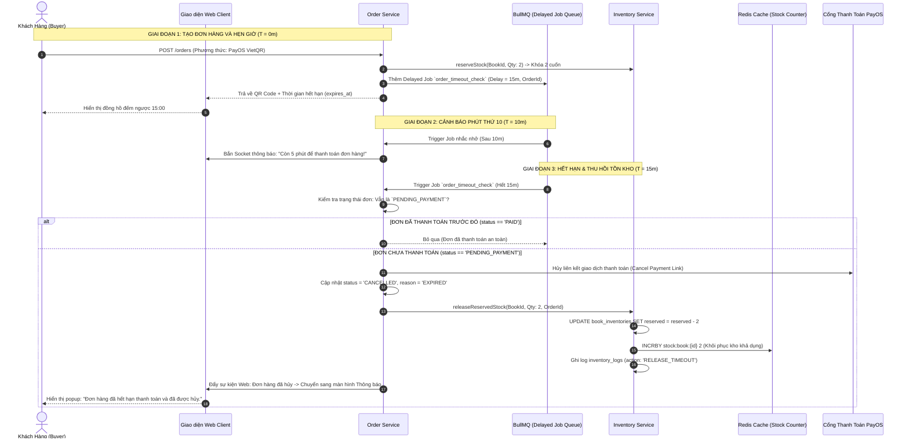

# TÀI LIỆU ĐẶC TẢ CHI TIẾT NGHIỆP VỤ - LUỒNG 6
## TỰ ĐỘNG THU HỒI TỒN KHO & XỬ LÝ ĐƠN HẾT HẠN THANH TOÁN (AUTOMATIC STOCK RECOVERY & RESERVATION TIMEOUT)

---

## I. MỤC TIÊU & PHẠM VI NGHIỆP VỤ

* **Mục tiêu**: Xây dựng cơ chế tự động hủy đơn hàng và hoàn trả tồn kho tạm giữ (Reserved Stock) khi khách hàng không hoàn tất thanh toán trong khung thời gian quy định (Time-To-Live - TTL: mặc định **15 phút** đối với PayOS VietQR / VNPAY). Ngăn chặn hành vi "giữ chỗ ảo" làm đóng băng kho hàng, đảm bảo tính quay vòng vốn cho Seller và tạo cơ hội mua hàng cho các độc giả khác.
* **Các bên tham gia (Actors)**:
  1. **Khách Hàng (Buyer)**: Đã tạo đơn hàng thành công nhưng chưa thanh toán hoặc quên thanh toán.
  2. **Hệ thống Lập lịch & Xử lý nền (Background Workers & Schedulers)**:
     * `BullMQ Delayed Jobs` / `Redis Keyspace Notifications`: Đếm ngược chính xác từng giây TTL của đơn hàng.
     * `order-service`: Tiếp nhận lệnh timeout, chuyển trạng thái đơn sang `CANCELLED_EXPIRED`.
     * `inventory-service`: Nhận sự kiện giải phóng kho, hoàn trả `reserved_stock` và cập nhật Redis Atomic Counter.
     * `notification-service`: Gửi thông báo nhắc nhở trước khi hết hạn (ở phút thứ 10) và thông báo hủy đơn khi hết hạn (ở phút thứ 15).

---

## II. QUY TẮC THỜI GIAN & VÒNG ĐỜI HẾT HẠN THANH TOÁN (TTL LIFECYCLE)

```
[00:00] ─── TẠO ĐƠN HÀNG (PENDING_PAYMENT)
  │          • Khóa tạm giữ tồn kho (Reserved +N)
  │          • Tạo PayOS VietQR Code (Thời hạn: 15:00)
  │
[10:00] ─── CẢNH BÁO NHẮC NHỞ THANH TOÁN (Sau 10 phút)
  │          • Gửi Web Push & Email: "Đơn hàng của bạn sẽ hết hạn sau 5 phút!"
  │          • Đếm ngược hiển thị đỏ trên trang thanh toán
  │
[15:00] ─── TIMEOUT - TỰ ĐỘNG THU HỒI KHO (Hết 15 phút)
  │          • Hủy đơn hàng: Trạng thái chuyển sang CANCELLED_EXPIRED
  │          • Vô hiệu hóa mã PayOS QR Code
  │          • Giải phóng kho: Reserved -N, Available +N
  │          • Gửi thông báo: "Đơn hàng đã bị hủy do hết hạn thanh toán"
```

### 1. Thời lượng đếm ngược (TTL Matrix)
* **Phương thức PayOS VietQR / VNPAY / MoMo**: Thời gian giữ kho tối đa là **15 phút** kể từ thời điểm bấm "Đặt Hàng".
* **Đơn hàng Flash Sale (Sản phẩm Giờ Vàng)**: Thời gian giữ kho rút ngắn còn **5 phút** để tăng tốc độ thanh toán.
* **Phương thức COD (Thanh toán khi nhận hàng)**: Không áp dụng đếm ngược thanh toán, chuyển thẳng sang trạng thái `PENDING_CONFIRMATION` và giữ kho cho đến khi giao hàng.

---

## III. BẢNG TRƯỜNG DỮ LIỆU & TRẠNG THÁI TIMEOUT

### 1. Bổ sung các trường dữ liệu trong bảng `orders`
| Tên Cột | Kiểu Dữ Liệu | Ràng Buộc | Mô Tả Nghiệp Vụ |
|---|---|---|---|
| `payment_status` | Enum | `PENDING`, `PAID`, `FAILED`, `EXPIRED` | Trạng thái thanh toán của đơn hàng |
| `order_status` | Enum | `PENDING_PAYMENT`, `CONFIRMED`, `CANCELLED` | Trạng thái tổng thể của đơn hàng |
| `expires_at` | Timestamp | Bắt buộc nếu là thanh toán online | Thời điểm chính xác đơn hàng hết hạn (`created_at + 15m`) |
| `cancel_reason` | String | Nullable | Lý do hủy: `"Hết hạn thanh toán (Auto Timeout 15m)"` |
| `cancelled_at` | Timestamp | Nullable | Thời điểm hệ thống kích hoạt tự động hủy |
| `stock_released` | Boolean | Mặc định: `false` | Cờ xác nhận kho đã được hoàn trả thành công |

---

## IV. SƠ ĐỒ TRÌNH TỰ TỰ ĐỘNG THU HỒI KHO (SEQUENCE DIAGRAM)



---

## V. PHÂN RÃ CHI TIẾT TỪNG BƯỚC THỰC HIỆN

---

### BƯỚC 1: KHỞI TẠO ĐƠN HÀNG & LẬP LỊCH ĐẾM NGƯỢC (JOB SCHEDULING)

* **Bước 1.1: Tạo đơn và tính toán mốc `expires_at`**:
  * Khi khách hàng chọn thanh toán trực tuyến (PayOS QR):
  * Hệ thống tính toán: `expires_at = NOW() + INTERVAL '15 minutes'`.
  * Khóa tạm giữ tồn kho trong bảng `book_inventories`: `reserved_stock += requested_qty`.
* **Bước 1.2: Đẩy Delayed Job vào hàng đợi xử lý nền**:
  * `order-service` đẩy 2 job vào BullMQ:
    1. `Job 1 (Reminder)`: Trì hoãn 10 phút (`delay = 600,000ms`).
    2. `Job 2 (AutoCancel)`: Trì hoãn 15 phút (`delay = 900,000ms`).
  * Dữ liệu payload của Job: `{ orderId: "ord_uuid", bookItems: [{bookId, qty}] }`.

---

### BƯỚC 2: ĐẾM NGƯỢC THỜI GIAN THỰC NGOÀI GIAO DIỆN (REALTIME COUNTDOWN UI)

* **Bước 2.1: Đồng hồ đếm ngược trên trang thanh toán (`PaymentWaitingPage.jsx`)**:
  * Nhận giá trị `expires_at` từ Backend và tính toán thời gian còn lại:
    $$\text{TimeLeft} = \text{expires\_at} - \text{CurrentTime}$$
  * Hiển thị dạng `MM:SS` (VD: `14:59` → `14:58`...).
* **Bước 2.2: Thay đổi trạng thái thị giác theo thời gian**:
  * Từ `15:00` đến `05:00`: Đồng hồ hiển thị màu Xanh lam trung tính.
  * Từ `05:00` đến `00:00`: Đồng hồ chuyển sang màu **Đỏ nhấp nháy** kèm thông điệp khẩn cấp *"Vui lòng quét mã thanh toán trước khi đơn bị hủy tự động!"*.

---

### BƯỚC 3: XỬ LÝ SỰ KIỆN HẾT HẠN THANH TOÁN (EXECUTE TIMEOUT TRANSACTION)

* **Bước 3.1: Bộ xử lý nền (Worker) tiếp nhận sự kiện sau 15 phút**:
  * Worker lấy thông tin đơn hàng từ Database và kiểm tra trạng thái hiện tại (`order_status`, `payment_status`).
* **Bước 3.2: Phân xử an toàn (Idempotency & Race Condition Handling)**:
  * **Trường hợp A (Khách đã trả tiền vào phút 14:55, Webhook đã xác nhận `PAID`)**:
    * Worker hủy bỏ job, không thực hiện hủy đơn và không nhả kho.
  * **Trường hợp B (Đơn vẫn ở trạng thái `PENDING_PAYMENT`)**:
    * Tiến hành mở Database Transaction thực hiện chuỗi hành động nguyên tử:
      1. Đóng mã thanh toán bên cổng PayOS (vô hiệu hóa mã QR để tránh khách quét muộn).
      2. Cập nhật đơn hàng:
         ```sql
         UPDATE orders 
         SET 
             order_status = 'CANCELLED',
             payment_status = 'EXPIRED',
             cancelled_at = NOW(),
             cancel_reason = 'Hết hạn thanh toán (Hệ thống tự động hủy sau 15 phút)'
         WHERE id = :orderId AND order_status = 'PENDING_PAYMENT';
         ```

---

### BƯỚC 4: THU HỒI VÀ HOÀN TRẢ TỒN KHO KHẢ DỤNG (STOCK ROLLBACK)

* **Bước 4.1: Giảm tồn kho tạm giữ trong PostgreSQL**:
  * `order-service` phát sự kiện nội bộ `ORDER_TIMEOUT_RELEASE` sang `inventory-service`.
  * `inventory-service` thực thi truy vấn hoàn kho:
    ```sql
    UPDATE book_inventories
    SET 
        reserved_stock = GREATEST(0, reserved_stock - :quantity),
        updated_at = NOW()
    WHERE book_id = :bookId;
    ```
* **Bước 4.2: Khôi phục bộ đếm trên Redis Atomic Cache**:
  * Thực thi: `INCRBY stock:book:{id} :quantity`.
  * Đảm bảo ngoài Storefront, tựa sách ngay lập tức tăng lại số lượng `available_stock` để người mua khác có thể thêm vào giỏ.
* **Bước 4.3: Ghi vết kiểm toán kho**:
  * Tạo bản ghi `inventory_logs`:
    * `action_type = 'RELEASE'`.
    * `order_id = :orderId`.
    * `note = 'Tự động hoàn trả tồn kho do đơn hàng hết hạn 15m'`.
    * `actor_id = 'SYSTEM_CRON_WORKER'`.

---

### BƯỚC 5: XỬ LÝ TRƯỜNG HỢP TRANH CHẤP GIÂY CUỐI (EDGE CASE: WEBHOOK VS TIMEOUT)

* **Kịch bản Tranh chấp**: Khách hàng chuyển khoản đúng giây thứ **14:59**. Webhook PayOS gửi về server chậm 3 giây (đến lúc 15:02, sau khi hệ thống đã chạy Timeout hủy đơn và nhả kho).
* **Quy trình Phân xử & Hoàn tiền Tự động (Dispute Resolution)**:
  1. Khi Webhook PayOS báo tiền đã vào tài khoản nhưng đơn hàng đã mang trạng thái `CANCELLED_EXPIRED`:
  2. Hệ thống kiểm tra xem kho sách đó có còn đủ hàng để khôi phục lại đơn hay không:
     * **Nếu còn hàng (`Available >= Qty`)**: Tự động khôi phục đơn sang trạng thái `PAID` và khóa kho lại. Gửi thông báo: *"Đơn hàng của bạn đã được thanh toán và khôi phục thành công!"*.
     * **Nếu đã bị người khác mua mất (`Available < Qty`)**: Chuyển giao dịch vào danh sách hoàn tiền tự động (`AUTO_REFUND_PENDING`), hoàn lại 100% số tiền vào tài khoản ngân hàng của khách trong vòng 5 phút và gửi email xin lỗi độc giả kèm Voucher ưu đãi.

---

## VI. MA TRẬN KIỂM THỬ THU HỒI TỒN KHO (TEST CASES MATRIX)

| Mã Test Case | Kịch Bản Kiểm Thử | Điều Kiện Đầu Vào | Kết Quả Kỳ Vọng (Expected Result) | Đánh Giá |
|:---:|---|---|---|:---:|
| **TC_TO_01** | Hết 15 phút không thanh toán | Đơn hàng 2 cuốn sách, không quét mã QR | Sau đúng 15 phút, đơn chuyển `CANCELLED`, tồn kho khả dụng tăng lại +2. | **PASS** |
| **TC_TO_02** | Khách thanh toán ở phút 14:30 | Quét QR và chuyển tiền thành công lúc 14:30 | Đơn chuyển sang `PAID`, Job 15m khi chạy đến sẽ bỏ qua, không hủy đơn. | **PASS** |
| **TC_TO_03** | Khách chủ động bấm "Hủy Đơn" | Bấm nút "Hủy đơn hàng" ở phút thứ 2 | Đơn hủy ngay lập tức, kho được nhả ngay ở phút thứ 2 không cần chờ hết 15m. | **PASS** |
| **TC_TO_04** | Nhắc nhở ở phút thứ 10 | Đơn tạo được 10 phút chưa thanh toán | Hệ thống gửi thông báo nhắc nhở "Còn 5 phút", đồng hồ đổi màu đỏ. | **PASS** |
| **TC_TO_05** | **Tranh chấp Webhook đến trễ (Edge Case)** | Tiền vào lúc 15:01 (sau khi đã hủy đơn). Kho còn hàng. | Hệ thống tự động kích hoạt khôi phục đơn sang `PAID` và khóa lại kho an toàn. | **PASS** |
| **TC_TO_06** | Tranh chấp khi kho đã hết hàng | Tiền vào lúc 15:01, kho đã hết sách. | Kích hoạt luồng hoàn tiền `AUTO_REFUND` 100% cho khách hàng, gửi email giải thích. | **PASS** |

---

## VII. ĐIỀU KIỆN NGHIỆM THU HOÀN TẤT (DEFINITION OF DONE)

1. ✅ Thiết lập chính xác cơ chế đếm ngược TTL 15 phút thông qua BullMQ Delayed Jobs và Redis.
2. ✅ Đảm bảo 100% đơn hàng quá hạn thanh toán được tự động chuyển sang trạng thái `CANCELLED` và nhả kho tạm giữ về trạng thái khả dụng.
3. ✅ Đồng bộ số lượng tồn kho tức thì lên cả Database PostgreSQL và Redis Atomic Cache.
4. ✅ Giao diện người mua hiển thị đồng hồ đếm ngược sinh động và thông báo rõ ràng khi đơn bị hủy.
5. ✅ Xử lý an toàn, tự động kịch bản tranh chấp Webhook thanh toán đến trễ sau khi đã timeout.
