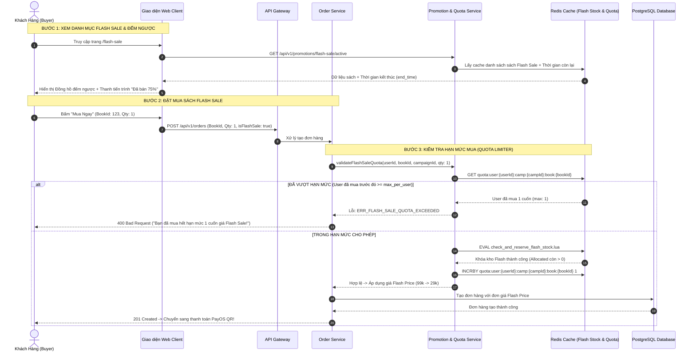

# TÀI LIỆU ĐẶC TẢ CHI TIẾT NGHIỆP VỤ - LUỒNG 7
## FLASH SALE ĐẾM NGƯỢC KHUNG GIỜ VÀNG & GIỚI HẠN HẠN MỨC MUA (FLASH SALE COUNTDOWN & PURCHASE QUOTA LIMITER)

---

## I. MỤC TIÊU & PHẠM VI NGHIỆP VỤ

* **Mục tiêu**: Xây dựng hệ thống khuyến mãi Flash Sale theo khung giờ vàng (Time-slot Campaigns), hỗ trợ giá bán giảm sốc trong thời gian giới hạn, thanh tiến trình "Đã bán X%", đồng hồ đếm ngược thời gian thực (Realtime Countdown) và cơ chế kiểm soát hạn mức mua trên mỗi khách hàng (Purchase Quota Limiter) nhằm ngăn chặn tình trạng đầu cơ, gom hàng bằng tài khoản ảo hoặc bot tự động.
* **Các bên tham gia (Actors)**:
  1. **Quản Trị Viên Sàn / Seller (Admin / Campaign Manager)**: Lập lịch khung giờ Flash Sale, duyệt sản phẩm đăng ký tham gia, phân bổ số lượng tồn kho khuyến mãi (`flash_stock`) và cấu hình hạn mức mua tối đa trên mỗi người dùng (`max_qty_per_user`).
  2. **Khách Hàng / Độc Giả (Buyer / Reader)**: Săn sách giá sốc trong khung giờ vàng, theo dõi tiến độ bán chạy và số lượng còn lại.
  3. **Promotion & Inventory Microservices**:
     * `promotion-service`: Quản lý chiến dịch, tính toán giá khuyến mãi, kiểm tra tính hợp lệ của khung giờ.
     * `Redis Cluster`: Lưu trữ danh sách sản phẩm Flash Sale đang hoạt động, bộ đếm số lượng đã bán (`flash_sold_counter`) và bộ kiểm soát hạn mức người dùng (`user_quota_limiter`).
     * `order-service`: Áp dụng giá Flash Sale khi tạo đơn và ghi nhận số lượng đã mua của user.

---

## II. CÁC QUY TẮC & CƠ CHẾ CỐT LÕI CỦA FLASH SALE

```
                             HỆ THỐNG FLASH SALE KHUNG GIỜ VÀNG
                                              │
         ┌────────────────────────────────────┼────────────────────────────────────┐
         ▼                                    ▼                                    ▼
1. KHUNG GIỜ VÀNG CỐ ĐỊNH             2. QUẢN LÝ TỒN KHO FLASH             3. GIỚI HẠN MUA (QUOTA)
 • 4 khung giờ vàng mỗi ngày:          • Số lượng tách biệt:                • Mỗi tài khoản chỉ được mua
   - 00:00 - 02:00 (Cú đêm)              flash_stock <= available             tối đa N cuốn (VD: 1 - 2 cuốn)
   - 09:00 - 12:00 (Sáng rực rỡ)       • Khi hết flash_stock:               • Quá hạn mức: tự động tính
   - 15:00 - 18:00 (Chiều hoàng kim)     tự động chuyển về giá gốc            theo giá bán thông thường
   - 20:00 - 23:59 (Tối săn sale)        hoặc báo hết hàng Flash.             hoặc chặn thêm vào giỏ.
```

### 1. Quy tắc Phân Bổ Tồn Kho Flash Sale
* Số lượng sách phân bổ cho Flash Sale (`flash_sale_stock`) được trích từ tồn kho khả dụng (`available_stock`) của Seller.
* Trong suốt thời gian diễn ra Flash Sale:
  * Số lượng bán với giá giảm sốc **không bao giờ vượt quá `flash_sale_stock`**.
  * Khi `flash_sale_sold == flash_sale_stock`: Thanh tiến trình đạt **100% (ĐÃ BÁN HẾT)**. Khách hàng tiếp theo sẽ phải mua với giá gốc thông thường nếu Seller vẫn còn tồn kho thông thường.

### 2. Cơ chế Giới Hạn Hạn Mức Mua (Purchase Quota Limiter)
* **Mục đích**: Đảm bảo ưu đãi đến tay nhiều độc giả nhất, chống tình trạng 1 tài khoản mua hết toàn bộ kho sale để bán lại kiếm lời.
* **Quy tắc**: Mỗi khách hàng (dựa trên `user_id`, địa chỉ IP và số điện thoại) chỉ được phép mua tối đa $M$ cuốn sách trong suốt 1 khung giờ Flash Sale (mặc định $M = 1$ hoặc $M = 2$ cuốn/tựa sách).
* **Xử lý vi phạm**: Nếu người dùng cố tình thêm số lượng $> M$, hệ thống tự động:
  * Hoặc báo lỗi: *"Mỗi khách hàng chỉ được mua tối đa M cuốn với giá Flash Sale"*.
  * Hoặc áp dụng giá Flash Sale cho $M$ cuốn đầu tiên, các cuốn vượt mức được tính theo giá bán lẻ thông thường.

---

## III. BẢNG TRƯỜNG DỮ LIỆU & SCHEMA FLASH SALE

### 1. Bảng Chiến Dịch Flash Sale `flash_sale_campaigns`
| Tên Cột | Kiểu Dữ Liệu | Ràng Buộc | Mô Tả |
|---|---|---|---|
| `id` | UUID | Primary Key | Mã chiến dịch Flash Sale |
| `title` | String | Bắt buộc | Tên chiến dịch (VD: *"Đại Tiệc Sách Trưa 12H"*) |
| `start_time` | Timestamp | Bắt buộc | Thời điểm bắt đầu khung giờ |
| `end_time` | Timestamp | Bắt buộc | Thời điểm kết thúc khung giờ |
| `status` | Enum | `UPCOMING`, `ACTIVE`, `ENDED` | Trạng thái chiến dịch |
| `banner_url` | String | URL hình ảnh | Banner hiển thị đầu trang Flash Sale |

### 2. Bảng Sản Phẩm Trong Flash Sale `flash_sale_items`
| Tên Cột | Kiểu Dữ Liệu | Ràng Buộc | Mô Tả |
|---|---|---|---|
| `id` | UUID | Primary Key | Mã bản ghi |
| `campaign_id` | UUID | FK `flash_sale_campaigns` | Liên kết chiến dịch |
| `book_id` | UUID | FK `books` | Tựa sách tham gia |
| `business_id` | UUID | FK `businesses` | Gian hàng sở hữu sách |
| `original_price` | Decimal | Bắt buộc | Giá niêm yết ban đầu |
| `flash_price` | Decimal | Bắt buộc, $< original\_price$ | Giá bán giảm sốc trong Flash Sale |
| `allocated_quantity` | Integer | Bắt buộc, $> 0$ | Số lượng sách dành riêng cho Flash Sale |
| `sold_quantity` | Integer | Mặc định: `0` | Số lượng đã bán thành công |
| `max_per_user` | Integer | Mặc định: `1` | Số lượng tối đa 1 người được mua giá Sale |

---

## IV. SƠ ĐỒ TRÌNH TỰ NGHIỆP VỤ FLASH SALE (SEQUENCE DIAGRAM)



---

## V. PHÂN RÃ CHI TIẾT TỪNG BƯỚC THỰC HIỆN

---

### BƯỚC 1: THIẾT LẬP VÀ DUYỆT CHIẾN DỊCH FLASH SALE

* **Bước 1.1: Quản trị viên khởi tạo khung giờ vàng**:
  * Admin tạo các phiên Flash Sale trong ngày (VD: Phiên 12:00 - 14:00).
  * Thiết lập trạng thái ban đầu: `UPCOMING` (Sắp diễn ra).
* **Bước 1.2: Seller đăng ký tham gia sản phẩm**:
  * Seller chọn tựa sách trong kho &rarr; Đăng ký số lượng `allocated_quantity = 50` cuốn.
  * Thiết lập giá Flash Sale giảm sốc: `flash_price = 29.000đ` (Giá gốc `110.000đ`, Giảm 74%).
  * Thiết lập hạn mức mua: `max_per_user = 1` cuốn/khách hàng.
* **Bước 1.3: Duyệt và Nạp trước Dữ liệu vào Redis (Warm-up Cache)**:
  * Trước khi diễn ra 15 phút, hệ thống tự động đồng bộ toàn bộ danh sách sản phẩm và số lượng kho vào Redis:
    * `SET flash:stock:{campId}:{bookId} 50`.
    * `SET flash:price:{campId}:{bookId} 29000`.

---

### BƯỚC 2: KÍCH HOẠT TỰ ĐỘNG KHUNG GIỜ VÀNG (CAMPAIGN ACTIVATION)

* **Bước 2.1: Chuyển trạng thái khi đúng giờ**:
  * Đúng 12:00:00, Cron Scheduler kích hoạt chuyển trạng thái chiến dịch từ `UPCOMING` &rarr; `ACTIVE`.
  * Bắn sự kiện WebSocket thông báo mở cổng Flash Sale toàn sàn.
* **Bước 2.2: Banner & Huy hiệu Flash Sale nổi bật**:
  * Tại trang chủ và trang chi tiết sách:
  * Xuất hiện huy hiệu rực rỡ: ⚡ **FLASH SALE GIỜ VÀNG**.
  * Hiển thị mức giảm giá nổi bật `-74%` và giá sốc màu đỏ `29.000đ`.

---

### BƯỚC 3: TRẢI NGHIỆM ĐẾM NGƯỢC & THANH TIẾN TRÌNH TRÊN GIAO DIỆN

* **Bước 3.1: Đồng hồ đếm ngược thời gian thực (Countdown Timer)**:
  * Hiển thị tại đầu trang `/flash-sale` và ngay trên thẻ sản phẩm:
    * Mẫu hiển thị: `KẾT THÚC TRONG 01:45:22` (Giờ : Phút : Giây).
    * Khi còn dưới 10 phút: Đồng hồ chuyển sang hiệu ứng nhấp nháy khẩn cấp.
* **Bước 3.2: Thanh tiến trình bán chạy (Progress Bar)**:
  * Công thức tính % đã bán:
    $$\% \text{ Đã bán} = \min\left(100, \text{round}\left(\frac{\text{sold\_quantity}}{\text{allocated\_quantity}} \times 100\right)\right)$$
  * Hiển thị theo 3 mức độ kích thích tâm lý người mua:
    * $\text{Đã bán} < 50\%$: Thanh màu cam kèm chữ *"Đã bán X cuốn"*.
    * $50\% \le \text{Đã bán} < 90\%$: Thanh màu đỏ kèm biểu tượng ngọn lửa 🔥 *"Đang bán rất chạy"*.
    * $\text{Đã bán} \ge 90\%$: Nhãn *"Sắp hết hàng - Còn lại Y cuốn"*.
    * $\text{Đã bán} = 100\%$: Thanh xám *"ĐÃ BÁN HẾT 100%"*.

---

### BƯỚC 4: KIỂM SOÁT HẠN MỨC MUA & KHÓA KHO KHUYẾN MÃI (QUOTA & ATOMIC LOCK)

* **Bước 4.1: Kiểm tra Hạn Mức Mua Của Người Dùng (Quota Limiter Check)**:
  * Khi nhận request mua hàng từ `userId`:
  * Hệ thống đọc Redis Key `quota:user:{userId}:camp:{campId}:book:{bookId}`:
  * Nếu tổng số lượng hiện tại $+ \text{requested\_qty} > \text{max\_per\_user}$:
    * Trả về thông báo lỗi: *"Bạn đã sử dụng hết quyền mua 1 cuốn giá Flash Sale cho tựa sách này. Hãy nhường cơ hội cho các độc giả khác!"*.
* **Bước 4.2: Khóa Tồn Kho Flash Sale Bằng Lua Script**:
  * Thực thi Atomic Lua Script kiểm tra `flash:stock` $> 0$.
  * Nếu thành công:
    * Giảm `flash:stock` trên Redis.
    * Tăng bộ đếm quota của User `INCRBY quota:user:... 1` (Thiết lập TTL bằng thời gian còn lại của chiến dịch).
    * Áp dụng `flash_price` vào đơn hàng.
* **Bước 4.3: Xử lý khi Đơn Hàng Bị Hủy**:
  * Nếu khách hàng tạo đơn Flash Sale nhưng không thanh toán (bị Timeout 15m):
  * Hệ thống tự động hoàn trả hạn mức: `DECRBY quota:user:... 1`.
  * Hoàn trả tồn kho Flash Sale: `INCRBY flash:stock:... 1` để người khác có thể săn tiếp.

---

### BƯỚC 5: KẾT THÚC KHUNG GIỜ VÀ TỰ ĐỘNG KHÔI PHỤC GIÁ GỐC

* **Bước 5.1: Chuyển trạng thái khi hết giờ (14:00:00)**:
  * Chiến dịch chuyển sang trạng thái `ENDED`.
  * Tự động vô hiệu hóa giá Flash Sale trên toàn bộ hệ thống.
* **Bước 5.2: Khôi phục hiển thị sản phẩm**:
  * Tất cả các tựa sách tự động quay về mức giá bán lẻ thông thường (`regular_price`).
  * Gỡ bỏ nhãn Flash Sale, chuyển đồng hồ đếm ngược sang thông báo *"Khung giờ Flash Sale tiếp theo sẽ bắt đầu lúc 15:00"*.

---

## VI. MA TRẬN KIỂM THỬ FLASH SALE & QUOTA LIMITER (TEST CASES MATRIX)

| Mã Test Case | Kịch Bản Kiểm Thử | Điều Kiện & Dữ Liệu Đầu Vào | Kết Quả Kỳ Vọng (Expected Result) | Đánh Giá |
|:---:|---|---|---|:---:|
| **TC_FS_01** | Hiển thị chính xác giá Flash Sale khi đang trong khung giờ | Sách giá gốc 100k, Flash Sale 30k. Khung giờ 12h-14h. Truy cập lúc 12h30. | Hiển thị giá 30k (-70%), có huy hiệu Flash Sale và đếm ngược còn 1h30p. | **PASS** |
| **TC_FS_02** | Mua trong hạn mức cho phép (`Quota = 1`) | Khách hàng A chưa mua lần nào, đặt mua 1 cuốn | Đặt hàng thành công với giá 30k. Quota của User A ghi nhận = 1. | **PASS** |
| **TC_FS_03** | **Chặn mua vượt hạn mức Quota (`Quota > 1`)** | Khách hàng A cố tình đặt thêm 1 cuốn nữa trong cùng phiên | Hệ thống chặn và báo lỗi: *"Bạn đã mua hết hạn mức 1 cuốn giá Flash Sale!"* | **PASS** |
| **TC_FS_04** | Tự động chuyển giá gốc khi hết số lượng Flash Sale | Phân bổ 10 cuốn, đã bán đủ 10 cuốn. Khách thứ 11 bấm mua. | Hiển thị thanh tiến trình "Đã bán hết 100%", giá tự động quay về giá thường 100k. | **PASS** |
| **TC_FS_05** | Hủy đơn hoàn lại hạn mức Quota cho User | Khách hàng A hủy đơn chưa thanh toán | Hạn mức của User A được hoàn về 0, kho Flash Sale tăng lại +1. | **PASS** |
| **TC_FS_06** | Tự động kết thúc khi hết khung giờ | Lúc 14:00:01 truy cập lại | Giá quay về 100k, biến mất đồng hồ đếm ngược, hiện thông báo phiên kế tiếp. | **PASS** |

---

## VII. ĐIỀU KIỆN NGHIỆM THU HOÀN TẤT (DEFINITION OF DONE)

1. ✅ Triển khai các khung giờ Flash Sale tự động kích hoạt và kết thúc chính xác theo từng giây.
2. ✅ Cơ chế Giới hạn Hạn Mức Mua (Quota Limiter) hoạt động chính xác 100%, ngăn chặn triệt để hành vi gom hàng.
3. ✅ Phân bổ và quản lý tồn kho Flash Sale riêng biệt, tự động khôi phục giá gốc khi hết hàng sale hoặc hết giờ.
4. ✅ Giao diện người dùng hiển thị sinh động đồng hồ đếm ngược, thanh tiến trình bán chạy và huy hiệu giảm giá.
5. ✅ Hệ thống hoàn trả hạn mức và tồn kho tức thì khi khách hàng hủy đơn hoặc quá hạn thanh toán.
