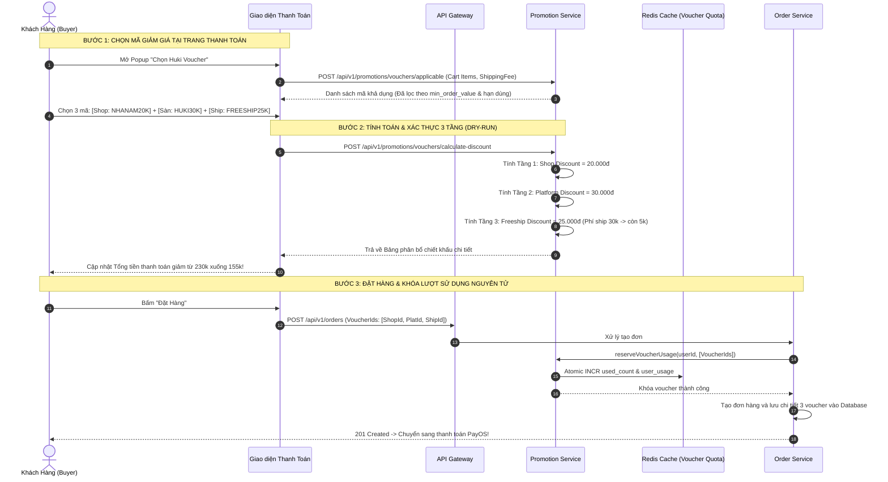

# TÀI LIỆU ĐẶC TẢ CHI TIẾT NGHIỆP VỤ - LUỒNG 8
## CHỒNG MÃ GIẢM GIÁ ĐA TẦNG (VOUCHER STACKING: SHOP VOUCHER + PLATFORM VOUCHER + FREESHIP VOUCHER)

---

## I. MỤC TIÊU & PHẠM VI NGHIỆP VỤ

* **Mục tiêu**: Xây dựng cơ chế cho phép khách hàng áp dụng đồng thời **3 tầng voucher độc lập** trong một lần thanh toán duy nhất (1 đơn hàng) gồm: Mã giảm giá Gian hàng (Shop Voucher), Mã giảm giá Sàn Huki (Platform Voucher) và Mã miễn phí vận chuyển (Freeship Voucher). Đảm bảo công thức tính toán giảm trừ chính xác, phân bổ nguồn kinh phí chiết khấu minh bạch giữa Sàn và Nhà bán hàng, loại bỏ hoàn toàn các lỗi xung đột hoặc lạm dụng khuyến mãi.
* **Các bên tham gia (Actors)**:
  1. **Khách Hàng (Buyer)**: Chọn và áp dụng các mã giảm giá phù hợp trong Giỏ hàng / Thanh toán.
  2. **Nhà Bán Hàng (Seller)**: Tạo các Shop Voucher riêng của gian hàng để kích cầu, tự chi trả chi phí giảm giá của Shop.
  3. **Quản Trị Sàn (Admin / Marketing Platform)**: Tạo Platform Vouchers và Freeship Vouchers toàn sàn, hệ thống Sàn chịu ngân sách tài trợ.
  4. **Hệ thống Backend**:
     * `promotion-service`: Xác thực điều kiện voucher, kiểm tra hạn mức sử dụng và tính toán số tiền giảm trừ 3 tầng.
     * `order-service`: Lưu vết các mã voucher đã dùng vào đơn hàng, trừ lượt sử dụng nguyên tử.
     * `escrow-service`: Phân bổ doanh thu thực nhận cho Seller và ghi nhận chi phí tài trợ của Sàn.

---

## II. KIẾN TRÚC MÔ HÌNH CHỒNG MÃ 3 TẦNG (3-TIER VOUCHER STACKING)

```
                       CƠ CHẾ CHỒNG MÃ GIẢM GIÁ ĐA TẦNG (1 ĐƠN HÀNG)
                                            │
        ┌───────────────────────────────────┼───────────────────────────────────┐
        ▼                                   ▼                                   ▼
 1. SHOP VOUCHER                    2. PLATFORM VOUCHER                 3. FREESHIP VOUCHER
 (Mã Giảm Giá Gian Hàng)            (Mã Giảm Giá Sàn Huki)              (Mã Giảm Phí Vận Chuyển)
  • Nguồn cấp: Do Seller tạo         • Nguồn cấp: Do Sàn Huki tạo        • Nguồn cấp: Do Sàn tài trợ
  • Phạm vi: Áp dụng trên tổng       • Phạm vi: Áp dụng trên tổng        • Phạm vi: Giảm trực tiếp vào
    tiền sách của chính Shop đó        đơn hàng sau khi trừ Shop code      phí vận chuyển giao hàng
  • Kinh phí: Seller tự chịu         • Kinh phí: Sàn Huki tài trợ        • Kinh phí: Sàn Huki tài trợ
```

---

## III. CÔNG THỨC TOÁN HỌC & THỨ TỰ TÍNH TOÁN (CALCULATION ORDER)

Hệ thống tính toán giảm trừ tuần tự theo 4 bước toán học bất biến:

```
[Tổng Tiền Sách Gốc (Subtotal)]
       │
       ▼  (Trừ Tầng 1: Shop Voucher)
[Tiền Hàng Sau Giảm Giá Shop] = Subtotal - Shop_Discount
       │
       ▼  (Trừ Tầng 2: Platform Voucher)
[Tiền Hàng Thực Trả] = MAX(0, [Tiền Hàng Sau Giảm Giá Shop] - Platform_Discount)
       │
       ▼  (Cộng Phí Vận Chuyển Sau Giảm Tầng 3: Freeship Voucher)
[Phí Vận Chuyển Thực Trả] = MAX(0, Original_Shipping_Fee - Freeship_Discount)
       │
       ▼
[TỔNG TIỀN KHÁCH THANH TOÁN (FINAL TOTAL)] = [Tiền Hàng Thực Trả] + [Phí Vận Chuyển Thực Trả]
```

### 1. Chi Tiết Phân Bổ Tài Chính Giữa Sàn & Seller (Escrow Settlement)
* **Số tiền khách hàng thực trả**: `Final_Total`.
* **Doanh thu Seller thực nhận (trước phí sàn)**:
  $$\text{Seller Payout} = \text{Subtotal} - \text{Shop\_Discount}$$
  *(Lưu ý: Doanh thu của Seller hoàn toàn KHÔNG bị giảm bởi Platform Voucher hay Freeship Voucher vì phần này do Sàn Huki bù tiền tài trợ).*

---

## IV. BẢNG TRƯỜNG DỮ LIỆU & SCHEMA VOUCHERS

Bảng `vouchers` và bảng lịch sử sử dụng `voucher_usages`:

### 1. Bảng `vouchers`
| Tên Cột | Kiểu Dữ Liệu | Ràng Buộc | Mô Tả |
|---|---|---|---|
| `id` | UUID | Primary Key | Định danh voucher |
| `code` | String (Unique) | Bắt buộc, chữ in hoa | Mã nhập (VD: `HUKINEW50`, `FREESHIP25`) |
| `voucher_type` | Enum | `SHOP_VOUCHER`, `PLATFORM_VOUCHER`, `FREESHIP_VOUCHER` | Loại voucher 3 tầng |
| `business_id` | UUID (Nullable) | Bắt buộc nếu là Shop Voucher | Gian hàng phát hành |
| `discount_type` | Enum | `PERCENT` (Theo %), `FIXED_AMOUNT` (Tiền cố định) | Hình thức giảm giá |
| `discount_value` | Decimal | Bắt buộc, $> 0$ | Giá trị giảm (VD: `20%` hoặc `30.000đ`) |
| `max_discount_amount` | Decimal (Nullable) | Áp dụng nếu là `PERCENT` | Mức giảm tối đa (VD: Tối đa `50.000đ`) |
| `min_order_value` | Decimal | Mặc định: `0` | Giá trị đơn tối thiểu để áp dụng |
| `total_usage_limit` | Integer | Bắt buộc, $> 0$ | Tổng số lượt dùng toàn hệ thống |
| `used_count` | Integer | Mặc định: `0` | Số lượt đã sử dụng |
| `per_user_limit` | Integer | Mặc định: `1` | Số lần tối đa 1 khách hàng được dùng |
| `valid_from` | Timestamp | Bắt buộc | Thời điểm bắt đầu có hiệu lực |
| `valid_to` | Timestamp | Bắt buộc | Thời điểm hết hạn |
| `is_active` | Boolean | Mặc định: `true` | Trạng thái kích hoạt |

### 2. Bảng `voucher_usages` (Audit Trail)
| Tên Cột | Kiểu Dữ Liệu | Mô Tả |
|---|---|---|
| `id` | UUID | Khóa chính |
| `voucher_id` | UUID | Liên kết mã voucher đã dùng |
| `user_id` | UUID | Khách hàng sử dụng |
| `order_id` | UUID | Đơn hàng áp dụng |
| `discount_amount` | Decimal | Số tiền thực tế được giảm trong đơn |
| `used_at` | Timestamp | Thời điểm sử dụng |

---

## V. SƠ ĐỒ TRÌNH TỰ ÁP DỤNG VOUCHER (SEQUENCE DIAGRAM)



---

## VI. PHÂN RÃ CHI TIẾT TỪNG BƯỚC THỰC HIỆN

---

### BƯỚC 1: TRUY CẬP VÀ MỞ BỘ CHỌN VOUCHER TỔNG HỢP

* **Bước 1.1: Hiển thị mục Voucher tại trang Giỏ Hàng & Checkout**:
  * Tại màn hình thanh toán (`CheckoutPage.jsx`), hiển thị ô tóm tắt:
    * 🎟 **Huki Voucher**: *"Chọn hoặc nhập mã giảm giá"* → Bấm nút **"Chọn Voucher"**.
* **Bước 1.2: Modal Lựa chọn Voucher 3 Tầng (`VoucherSelectionModal.jsx`)**:
  * Giao diện phân chia thành 3 tab / khối trực quan:
    1. 🏪 **Mã Giảm Giá Gian Hàng**: Hiển thị các mã do Shop đang có sách trong giỏ phát hành.
    2. 🌐 **Mã Giảm Giá Toàn Sàn Huki**: Hiển thị mã Sàn (giảm theo % hoặc tiền mặt).
    3. 🚚 **Mã Miễn Phí Vận Chuyển**: Hiển thị các mã Freeship 15k, 25k, 100%.
  * Mỗi thẻ voucher thể hiện rõ: Mức giảm, Giá trị đơn tối thiểu, Hạn sử dụng, Thanh tiến trình lượt dùng và Nút radio chọn.

---

### BƯỚC 2: XÁC THỰC ĐIỀU KIỆN ÁP DỤNG & TỰ ĐỘNG GỢI Ý MÃ TỐT NHẤT

* **Bước 2.1: Bộ lọc thông minh kiểm tra tính hợp lệ**:
  * Hệ thống tự động kiểm tra:
    * Đơn hàng đã đạt `min_order_value` chưa? (Nếu chưa, hiển thị dòng gợi ý: *"Mua thêm 35.000đ để dùng mã này"*).
    * Voucher còn trong thời hạn `valid_from` → `valid_to` không?
    * Khách hàng đã sử dụng hết lượt cá nhân `per_user_limit` chưa?
    * Tổng lượt dùng `used_count < total_usage_limit`?
* **Bước 2.2: Tính năng "Tự Động Áp Dụng Mã Tối Ưu Nhất" (Auto Best Match)**:
  * Hệ thống tự động tính toán tổ hợp 3 mã mang lại mức tiết kiệm cao nhất cho khách hàng và tick chọn sẵn.

---

### BƯỚC 3: THỰC THI CÔNG THỨC GIẢM TRỪ 3 TẦNG TRÊN BACKEND

* **Bước 3.1: Nhận payload từ giỏ hàng**:
  * Danh sách sản phẩm kèm `price`, `quantity`, `business_id` và mã 3 voucher đã chọn.
* **Bước 3.2: Thực hiện thuật toán giảm trừ 3 tầng**:
  1. **Tính Tầng 1 (Shop Voucher)**:
     * Tính tổng tiền hàng của riêng Shop đó: $\text{ShopSubtotal}$.
     * Nếu là giảm %: $\text{ShopDiscount} = \min(\text{ShopSubtotal} \times \%, \text{max\_discount})$.
  2. **Tính Tầng 2 (Platform Voucher)**:
     * Tính tiền hàng còn lại toàn đơn: $\text{RemainedSubtotal} = \text{TotalSubtotal} - \text{ShopDiscount}$.
     * $\text{PlatformDiscount} = \min(\text{RemainedSubtotal} \times \%, \text{max\_discount})$.
  3. **Tính Tầng 3 (Freeship Voucher)**:
     * $\text{ShippingDiscount} = \min(\text{OriginalShippingFee}, \text{FreeshipValue})$.
* **Bước 3.3: Tổng kết chi phí hiển thị minh bạch**:
  * Tổng tiền hàng: `300.000đ`.
  * Giảm giá Shop: `-30.000đ`.
  * Giảm giá Sàn: `-40.000đ`.
  * Phí vận chuyển: `35.000đ` (Đã giảm `-25.000đ` Freeship &rarr; còn `10.000đ`).
  * **Tổng thanh toán**: `240.000đ` (Tiết kiệm `95.000đ`).

---

### BƯỚC 4: KHÓA LƯỢT DÙNG VÀ GHI NHẬN ĐƠN HÀNG (ATOMIC VOUCHER LOCK)

* **Bước 4.1: Khóa lượt dùng trên Redis**:
  * Thực thi atomic: Tăng bộ đếm `used_count` và ghi nhận `user_id` đã sử dụng.
* **Bước 4.2: Ghi dữ liệu vào Database khi đơn tạo thành công**:
  * Lưu vào bảng `voucher_usages` để theo dõi kiểm toán.
  * Lưu các trường `shop_voucher_discount`, `platform_voucher_discount`, `shipping_discount` vào bảng `orders`.

---

### BƯỚC 5: XỬ LÝ KHI HỦY ĐƠN & HOÀN TRẢ LƯỢT DÙNG VOUCHER

* **Bước 5.1: Trường hợp đơn hàng bị hủy hoặc timeout 15 phút**:
  * Nếu khách hủy đơn hoặc đơn bị hủy do hết hạn thanh toán:
  * Hệ thống tự động hoàn trả lượt dùng cho khách hàng:
    * Giảm `used_count` trong bảng `vouchers`: `used_count = GREATEST(0, used_count - 1)`.
    * Xóa bản ghi trong `voucher_usages`.
    * Khách hàng có thể sử dụng lại mã voucher đó cho các đơn hàng tiếp theo ngay lập tức.

---

## VII. MA TRẬN KIỂM THỬ CHỒNG MÃ VOUCHER (TEST CASES MATRIX)

| Mã Test Case | Kịch Bản Kiểm Thử | Dữ Liệu Đầu Vào | Kết Quả Kỳ Vọng (Expected Result) | Đánh Giá |
|:---:|---|---|---|:---:|
| **TC_VOU_01** | Áp dụng đồng thời trọn bộ 3 voucher | Đơn 200k, Ship 30k. Áp dụng Shop 20k, Sàn 30k, Ship 25k. | Tổng thanh toán = (200k - 20k - 30k) + (30k - 25k) = 155k. Tiết kiệm 75k. | **PASS** |
| **TC_VOU_02** | Chặn áp dụng khi chưa đủ giá trị tối thiểu | Mã yêu cầu đơn tối thiểu 200k. Giỏ hàng hiện có 150k. | Không cho tick chọn, hiện thông báo "Mua thêm 50.000đ để sử dụng". | **PASS** |
| **TC_VOU_03** | Chặn áp dụng 2 mã cùng tầng (2 mã Shop) | Khách cố tình tick 2 mã Shop Voucher cùng lúc. | Radio button tự động uncheck mã trước, chỉ cho phép chọn 1 mã/tầng. | **PASS** |
| **TC_VOU_04** | Hạch toán Escrow đúng cho Seller | Đơn 200k, Shop giảm 20k, Sàn giảm 30k (Khách trả 150k). | Seller nhận đúng 180k (200k - 20k). Sàn bù 30k vào ví Escrow. | **PASS** |
| **TC_VOU_05** | Hủy đơn tự động hoàn lại lượt dùng voucher | Khách hủy đơn đã áp dụng mã giới hạn 1 lần dùng. | Lượt dùng của khách được hoàn về 0, mã hiển thị khả dụng trở lại. | **PASS** |
| **TC_VOU_06** | Tránh giảm giá âm tiền | Đơn 50k, mã Sàn giảm 70k. | Tiền hàng thực trả về đúng 0đ, không bao giờ bị âm tiền. | **PASS** |

---

## VIII. ĐIỀU KIỆN NGHIỆM THU HOÀN TẤT (DEFINITION OF DONE)

1. ✅ Hỗ trợ chồng đồng thời 3 tầng voucher độc lập (`Shop` + `Platform` + `Freeship`) trong 1 đơn hàng.
2. ✅ Thuật toán giảm trừ tính toán chính xác 100% không bao giờ xảy ra tình trạng âm tiền hoặc sai số thập phân.
3. ✅ Phân bổ tài chính minh bạch: Sàn bù phần mã Sàn/Freeship, Seller chỉ chịu phần mã Shop của mình.
4. ✅ Tự động hoàn trả lượt dùng voucher cho khách khi đơn hàng bị hủy.
5. ✅ Giao diện người dùng hiển thị bảng phân bổ chiết khấu chi tiết, rõ ràng từng khoản tiết kiệm.
