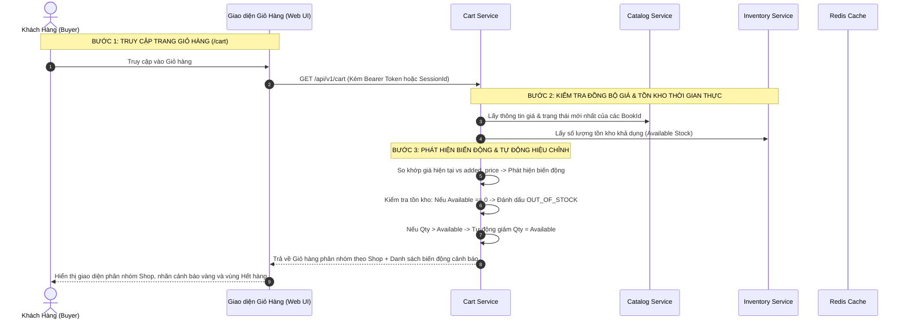

# TÀI LIỆU ĐẶC TẢ CHI TIẾT NGHIỆP VỤ - LUỒNG 9
## GIỎ HÀNG LƯU TRỮ ĐA THIẾT BỊ & XỬ LÝ SẢN PHẨM HẾT HÀNG (PERSISTENT CART & OUT-OF-STOCK ITEM HANDLING)

---

## I. MỤC TIÊU & PHẠM VI NGHIỆP VỤ

* **Mục tiêu**: Xây dựng hệ thống giỏ hàng bền bỉ (Persistent Cart) lưu trữ xuyên suốt trên nhiều thiết bị (Đồng bộ tức thì giữa Web Desktop và Mobile Web), hỗ trợ gộp giỏ hàng khách vãng lai (Guest Cart Merge) khi đăng nhập. Tự động phát hiện và xử lý mượt mà các biến động về tồn kho (sản phẩm bị hết hàng, số lượng khả dụng giảm) và biến động giá bán (tăng/giảm giá, hết hạn Flash Sale) mà không làm gián đoạn trải nghiệm mua sắm của người dùng.
* **Các bên tham gia (Actors)**:
  1. **Khách Hàng / Độc Giả (Buyer / Reader)**: Thêm sách vào giỏ, chọn từng shop để thanh toán, xem thông tin cảnh báo biến động.
  2. **Hệ thống Backend (Cart & Catalog Services)**:
     * `cart-service`: Quản lý thực thể giỏ hàng, đồng bộ Redis Cache và Database PostgreSQL.
     * `catalog-service`: Cung cấp thông tin giá bán và tồn kho khả dụng mới nhất theo thời gian thực.
     * `Redis Cache`: Lưu trữ trạng thái giỏ hàng tốc độ cao, hỗ trợ thao tác cập nhật số lượng $< 5\text{ms}$.

---

## II. KIẾN TRÚC & CÁC TRƯỜNG HỢP BIẾN ĐỘNG TRONG GIỎ HÀNG

```
                             KIẾN TRÚC GIỎ HÀNG THÔNG MINH
                                           │
         ┌─────────────────────────────────┼─────────────────────────────────┐
         ▼                                 ▼                                 ▼
1. ĐỒNG BỘ ĐA THIẾT BỊ             2. PHÂN NHÓM THEO SHOP            3. PHÁT HIỆN BIẾN ĐỘNG
 • Khách vãng lai: LocalStorage     • Tách biệt theo từng Seller       • Sản phẩm hết hàng (Out-of-Stock)
 • Đăng nhập: Merge tự động        • Checkbox "Chọn tất cả Shop"      • Biến động giá bán (Price Change)
 • Đồng bộ tức thì qua DB+Redis    • Tính tổng tiền riêng từng Shop   • Số lượng chọn > Tồn kho khả dụng
```

### 1. Phân Loại Trạng Thái Sản Phẩm Trong Giỏ Hàng (Item Statuses)
1. **Trạng thái Khả Dụng (Available - Active)**:
   * Sách đang mở bán (`status = 'PUBLISHED'`), tồn kho khả dụng $\text{Available} \ge \text{Quantity in Cart}$.
   * Người dùng có thể tick chọn để tiến hành đặt hàng.
2. **Trạng thái Giảm Số Lượng Khả Dụng (Partially Available)**:
   * Người dùng chọn 5 cuốn nhưng hiện tại kho chỉ còn 2 cuốn khả dụng.
   * Hệ thống tự động điều chỉnh số lượng trong giỏ về `2` và hiển thị cảnh báo: *"Kho của người bán chỉ còn 2 cuốn khả dụng"*.
3. **Trạng thái Hết Hàng / Ngừng Bán (Out of Stock / Inactive)**:
   * Sách đã hết hàng (`Available == 0`) hoặc người bán ẩn sách (`status = 'HIDDEN'`).
   * Tự động chuyển xuống khu vực **"Sản phẩm không khả dụng"**, làm mờ (gray out), bỏ chọn checkbox thanh toán, cung cấp nút *"Xóa"* hoặc *"Tìm sách tương tự"*.
4. **Trạng thái Biến Động Giá (Price Mutation)**:
   * Giá bán hiện tại khác với giá tại thời điểm thêm vào giỏ (VD: Hết Flash Sale giá từ 29k trở về 100k, hoặc Shop giảm giá từ 100k xuống 80k).
   * Tự động cập nhật theo giá mới nhất và hiển thị nhãn thông báo biến động màu vàng/xanh.

---

## III. BẢNG TRƯỜNG DỮ LIỆU & SCHEMA GIỎ HÀNG

Bảng `carts` và bảng `cart_items`:

### 1. Bảng `carts`
| Tên Cột | Kiểu Dữ Liệu | Ràng Buộc | Mô Tả |
|---|---|---|---|
| `id` | UUID | Primary Key | Mã giỏ hàng |
| `user_id` | UUID (Nullable) | Unique Index | Liên kết tài khoản khách hàng (nếu đã đăng nhập) |
| `session_token` | String (Nullable) | Index | Mã phiên định danh cho khách vãng lai (Guest) |
| `updated_at` | Timestamp | Tự động | Thời điểm thao tác giỏ hàng gần nhất |

### 2. Bảng `cart_items`
| Tên Cột | Kiểu Dữ Liệu | Ràng Buộc | Mô Tả |
|---|---|---|---|
| `id` | UUID | Primary Key | Mã bản ghi mục giỏ hàng |
| `cart_id` | UUID | FK `carts` | Liên kết giỏ hàng cha |
| `book_id` | UUID | FK `books` | Tựa sách được chọn |
| `business_id` | UUID | FK `businesses` | Gian hàng sở hữu sách |
| `format` | Enum | `PHYSICAL`, `EBOOK`, `HYBRID` | Định dạng sách chọn mua |
| `quantity` | Integer | Bắt buộc, $> 0$ | Số lượng đặt mua (Ebook mặc định = 1) |
| `added_price` | Decimal | Bắt buộc | Giá tại thời điểm thêm vào giỏ (để so sánh biến động) |
| `is_selected` | Boolean | Mặc định: `true` | Trạng thái checkbox chọn thanh toán |
| `created_at`, `updated_at` | Timestamp | | Thời gian tạo và sửa |

---

## IV. SƠ ĐỒ TRÌNH TỰ XỬ LÝ (SEQUENCE DIAGRAM - SYNC & VALIDATION)



---

## V. PHÂN RÃ CHI TIẾT TỪNG BƯỚC THỰC HIỆN

---

### BƯỚC 1: QUẢN LÝ GIỎ HÀNG KHÁCH VÃNG LAI & GỘP KHI ĐĂNG NHẬP (CART MERGE)

* **Bước 1.1: Trải nghiệm khách vãng lai (Guest Cart)**:
  * Khi khách chưa đăng nhập thêm sách vào giỏ: Lưu trong LocalStorage và gửi lên Server kèm `session_token` ẩn danh.
* **Bước 1.2: Tự động gộp giỏ hàng khi đăng nhập (Merge Logic)**:
  * Ngay khi khách hàng đăng nhập thành công vào tài khoản:
  * Hệ thống kiểm tra: Nếu tài khoản đã có sẵn giỏ hàng trong DB và đồng thời LocalStorage có các mục sách mới:
    * Với các tựa sách đã có trong DB: Cộng dồn số lượng `quantity = db_qty + guest_qty` (không vượt quá tồn kho tối đa).
    * Với các tựa sách mới: Thêm mới bản ghi vào giỏ hàng của User.
    * Xóa sạch dữ liệu giỏ tạm khách vãng lai trên LocalStorage.

---

### BƯỚC 2: PHÂN NHÓM THEO NHÀ BÁN HÀNG (GROUP BY SELLER/BUSINESS)

* **Bước 2.1: Cấu trúc hiển thị phân cấp**:
  * Danh sách sản phẩm trong giỏ được tự động gom nhóm theo từng `business_id` (Gian hàng).
  * Mỗi khối Gian hàng bao gồm:
    * **Header Shop**: Checkbox chọn toàn bộ sách của Shop, Logo, Tên Shop, Huy hiệu "Chính Hãng", Nút Chat với Shop.
    * **Danh sách sách của Shop**: Bìa sách, Tên sách, Phân loại (`[Sách Giấy]`, `[Ebook]`, `[Hybrid]`), Đơn giá hiện tại, Bộ tăng/giảm số lượng ($+ / -$), Thành tiền, Nút xóa.
    * **Footer Shop**: Tạm tính tiền hàng của riêng Shop, Mã giảm giá Shop khả dụng.
* **Bước 2.2: Tính năng Checkbox Đa Tầng**:
  * Checkbox **"Chọn tất cả"** toàn giỏ hàng.
  * Checkbox **"Chọn tất cả sản phẩm của Shop này"**.
  * Checkbox riêng từng tựa sách.

---

### BƯỚC 3: TỰ ĐỘNG PHÁT HIỆN & XỬ LÝ SẢN PHẨM HẾT HÀNG (OUT OF STOCK)

* **Bước 3.1: Kiểm tra tồn kho tại thời điểm xem giỏ**:
  * Mỗi khi mở trang `/cart`, Backend truy vấn `inventory-service` để lấy `available_stock`.
* **Bước 3.2: Tách biệt khu vực "Sản phẩm không khả dụng"**:
  * Nếu tựa sách có `available_stock == 0` hoặc bị Shop ẩn:
    * Tự động uncheck checkbox (không cho phép chọn thanh toán).
    * Di chuyển mục đó xuống khu vực cuối trang: **"Sản phẩm tạm thời không khả dụng (X món)"**.
    * Làm mờ hiệu ứng (Opacity 50%), hiển thị nhãn xám nổi bật: **"TẠM HẾT HÀNG"**.
    * Cung cấp nút: **"Xóa"** hoặc **"Tìm sách tương tự"** để gợi ý các tác phẩm cùng thể loại.

---

### BƯỚC 4: TỰ ĐỘNG CẬP NHẬT BIẾN ĐỘNG GIÁ (PRICE MUTATION HANDLING)

* **Bước 4.1: So khớp đơn giá**:
  * Backend so sánh đơn giá hiện tại (`current_price`) với giá tại thời điểm thêm (`added_price`).
* **Bước 4.2: Hiển thị cảnh báo trực quan cho độc giả**:
  * **Trường hợp Giá Giảm**: Hiển thị nhãn xanh lá: *"🎉 Giá sách đã giảm từ 100.000đ xuống 80.000đ"*.
  * **Trường hợp Giá Tăng / Hết Flash Sale**: Hiển thị nhãn vàng cam: *"⚠️ Giá sách đã cập nhật từ 29.000đ lên 100.000đ do hết khung giờ Flash Sale"*.
  * Giá thanh toán tạm tính được tự động cập nhật lại chính xác theo giá mới nhất để tránh khiếu nại.

---

### BƯỚC 5: ĐIỀU CHỈNH SỐ LƯỢNG KHO KHẢ DỤNG & TIẾP TỤC THANH TOÁN

* **Bước 5.1: Xử lý khi số lượng đặt lớn hơn tồn kho thực tế**:
  * Nếu khách hàng từng chọn `quantity = 5`, nhưng hiện tại kho chỉ còn `available_stock = 2`:
  * Hệ thống tự động đặt lại `quantity = 2`.
  * Hiển thị thông báo nhỏ ngay dưới ô số lượng: *"Rất tiếc, người bán chỉ còn 2 cuốn khả dụng. Số lượng đã được tự động điều chỉnh!"*.
* **Bước 5.2: Chuyển tiếp sang màn hình Thanh Toán (Checkout Navigation)**:
  * Khách hàng bấm **"Mua Hàng (X sản phẩm đã chọn)"**:
  * Hệ thống chỉ trích xuất các sản phẩm ở trạng thái khả dụng và đang được tick chọn để chuyển sang trang [`CheckoutPage.jsx`](file:///d:/doan_huki_ebook/huki-ebook/web/src/ui/pages/checkout/CheckoutPage.jsx).

---

## VI. MA TRẬN KIỂM THỬ GIỎ HÀNG & HÀNG HẾT (TEST CASES MATRIX)

| Mã Test Case | Kịch Bản Kiểm Thử | Dữ Liệu Đầu Vào | Kết Quả Kỳ Vọng (Expected Result) | Đánh Giá |
|:---:|---|---|---|:---:|
| **TC_CART_01** | Gộp giỏ hàng khách vãng lai khi đăng nhập | Khách vãng lai có Sách A (1 cuốn). Đăng nhập tài khoản đã có sẵn Sách B (1 cuốn). | Giỏ hàng sau đăng nhập có cả Sách A và Sách B. LocalStorage được dọn dẹp. | **PASS** |
| **TC_CART_02** | Phân nhóm theo Shop chính xác | Giỏ hàng có 2 sách của Shop Nhã Nam và 1 sách của Shop AlphaBooks. | Hiển thị thành 2 khối riêng biệt, checkbox "Chọn tất cả Shop Nhã Nam" hoạt động đúng. | **PASS** |
| **TC_CART_03** | Tự động xử lý sách hết hàng | Sách C trong giỏ bị người khác mua hết (`available = 0`). Khách mở lại giỏ hàng. | Sách C tự động bị uncheck, rơi xuống mục "Sản phẩm không khả dụng", hiện nhãn Hết Hàng. | **PASS** |
| **TC_CART_04** | Tự động hạ số lượng theo tồn kho khả dụng | Sách D chọn 5 cuốn, nhưng kho vừa giảm còn 2 cuốn khả dụng. | Số lượng tự động đổi thành 2, hiện dòng thông báo vàng nhắc nhở. | **PASS** |
| **TC_CART_05** | Cảnh báo cập nhật biến động giá | Sách Flash Sale 29k hết giờ quay về giá gốc 100k. | Hiển thị nhãn vàng báo giá đã đổi, tổng tiền cập nhật theo giá 100k mới. | **PASS** |
| **TC_CART_06** | Thao tác tăng giảm số lượng mượt mà | Bấm nút $[+]$ hoặc $[-]$ trên giao diện. | Số lượng cập nhật tức thì trên giao diện và đồng bộ lưu vào CSDL không có độ trễ. | **PASS** |

---

## VII. ĐIỀU KIỆN NGHIỆM THU HOÀN TẤT (DEFINITION OF DONE)

1. ✅ Giỏ hàng đồng bộ bền bỉ xuyên suốt trên mọi thiết bị và tự động gộp giỏ khách vãng lai khi đăng nhập.
2. ✅ Hiển thị phân nhóm trực quan theo từng Nhà Bán Hàng kèm checkbox đa tầng.
3. ✅ Tự động phát hiện và chuyển các sản phẩm hết hàng xuống khu vực không khả dụng, không cho phép thanh toán.
4. ✅ Tự động cảnh báo và điều chỉnh khi có biến động giá bán hoặc giảm tồn kho khả dụng.
5. ✅ Thao tác thêm, sửa, xóa, tick chọn sản phẩm phản hồi nhanh chóng và mượt mà.
