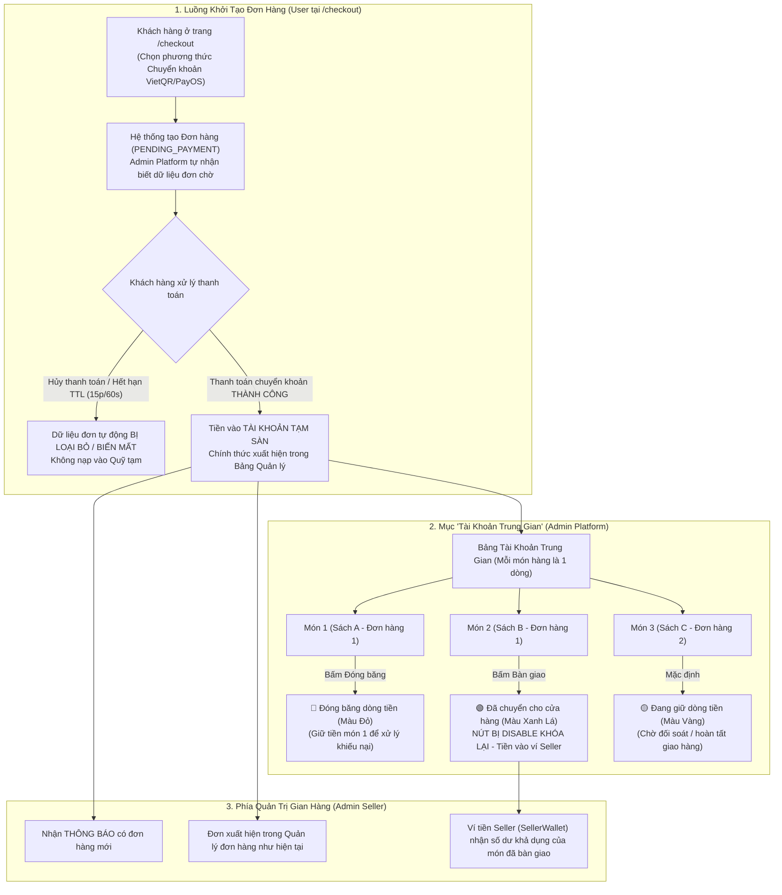

# ĐẶC TẢ TÍNH NĂNG: QUẢN LÝ TÀI KHOẢN TRUNG GIAN & THEO DÕI DÒNG TIỀN THANH TOÁN (INTERMEDIATE ESCROW ACCOUNT)

> **Tài liệu quy chuẩn yêu cầu & đặc tả kỹ thuật tính năng "Tài khoản trung gian & Quản lý dòng tiền từng món hàng"**  
> **Dự án:** HUKI EBOOK Platform  
> **Mã đặc tả:** `FIX_CHECKOUT_V1`  
> **Tệp quy chuẩn:** `platform/require_feature/fix_checkout_v1.md`  
> **Nguyên tắc bất di bất dịch:**  
> 1. **Tái sử dụng tối đa** các component, icon, bảng màu, Typography và Design Tokens sẵn có của dự án.  
> 2. **Code bám sát giao diện, style, theme và màu sắc hiện tại** của hệ thống Admin Platform và Web Client.  
> 3. **Phần nào chưa rõ hoặc còn phân vân phải hỏi lại người dùng**, tuyệt đối không tự dự đoán hoặc tự chế.  
> 4. **Tuyệt đối không làm ảnh hưởng** đến các giao diện, luồng xử lý và tính năng không liên quan khác.

---

## I. MỤC TIÊU & TỔNG QUAN TÍNH NĂNG

Hệ thống bổ sung mục **"Tài khoản trung gian"** (tài khoản tạm) trên trang quản trị **Admin Platform**, đóng vai trò là quỹ ký quỹ (Escrow) giữ các khoản tiền thanh toán trực tuyến (chuyển khoản / PayOS VietQR) từ khách hàng trước khi sàn tiến hành bàn giao giải ngân cho từng gian hàng/nhà xuất bản.

Đặc biệt, hệ thống quản lý trạng thái dòng tiền và các thao tác tài chính **hoàn toàn độc lập theo từng món hàng (mỗi sản phẩm là 1 hàng riêng biệt)**, không gộp chung cả đơn hàng, nhằm hỗ trợ trọn vẹn nghiệp vụ đổi trả/khiếu nại từng phần (Partial Dispute/RMA).

---

## II. ĐẶC TẢ CHI TIẾT TRANG "TÀI KHOẢN TRUNG GIAN" (ADMIN PLATFORM)

### 1. Vị trí điều hướng Menu Sidebar (`AdminLayout.tsx`)
* **Nhóm menu:** `TÀI CHÍNH & VẬN HÀNH`
* **Tên mục hiển thị:** **`Tài Khoản Trung Gian`**
* **Đường dẫn (Route):** `/admin/escrow` (hoặc `/admin/intermediate-accounts`)
* **Icon:** `account_balance_wallet` hoặc `savings` (Material Symbols chuẩn Admin).

---

### 2. Cấu trúc Bảng dữ liệu 12 Cột & Quy tắc hiển thị

Mỗi sản phẩm trong đơn hàng hiển thị là **1 hàng (`<tr>`) riêng biệt**. Bảng bao gồm 12 cột với đầy đủ các quy tắc hiển thị và tooltip như sau:

| STT | Tên cột | Quy tắc dữ liệu & Hiển thị | Quy tắc Rút gọn & Tooltip |
| :---: | :--- | :--- | :--- |
| **1** | **Mã cửa hàng** | Hiển thị mã định danh / ID của cửa hàng (`storeId` / `storeCode`). | Font monospace sắc nét, dễ nhìn. |
| **2** | **Tên cửa hàng** | Hiển thị tên gian hàng / NXB cung cấp cuốn sách. | **Hiển thị tối đa 10 ký tự**, nếu quá dài hiển thị `...`. Khi hover chuột vào sẽ hiện **Tooltip đầy đủ tên cửa hàng bên dưới**. |
| **3** | **Khách hàng thanh toán** | Hiển thị tên của khách hàng thanh toán (lấy từ `shippingAddress.recipientName` hoặc `UserProfile.fullName`). | **Hiển thị tối đa 10 ký tự**, nếu quá dài hiển thị `...`. Khi hover chuột vào sẽ hiện **Tooltip đầy đủ tên khách hàng bên dưới**. |
| **4** | **Số điện thoại khách** | Hiển thị số điện thoại liên hệ của khách hàng (`phone`). | Hiển thị đầy đủ số điện thoại rõ ràng. |
| **5** | **Mã đơn hàng** | Hiển thị mã đơn hàng (`orderCode` / `sellerOrderCode`). | Dạng badge font monospace có thể click xem chi tiết đơn. |
| **6** | **Mã sản phẩm** | Hiển thị mã của sản phẩm / sách (`bookId` / `bookIsbn`). | Font monospace, hỗ trợ sao chép nhanh. |
| **7** | **Số lượng sản phẩm** | Hiển thị số lượng mua của từng sản phẩm trong đơn (`quantity`). | Canh giữa (Center), font đậm. |
| **8** | **Tên sản phẩm** | Hiển thị tiêu đề cuốn sách / sản phẩm (`bookTitle`). | **Hiển thị tối đa 10 ký tự**, nếu quá dài hiển thị `...`. Khi hover chuột vào sẽ hiện **Tooltip đầy đủ tên sản phẩm bên dưới**. |
| **9** | **Đơn giá** | Hiển thị đơn giá của từng sản phẩm (`unitPrice`). | Định dạng tiền tệ VNĐ (vd: `120.000 đ`). |
| **10** | **Thành tiền** | Hiển thị giá thành tiền của sản phẩm đó (`subtotal = unitPrice * quantity`). | Định dạng tiền tệ VNĐ, màu xanh đậm nổi bật. |
| **11** | **Trạng thái** | Hiển thị trạng thái dòng tiền hiện tại của món hàng: • **Đang giữ dòng tiền** • **Đóng băng dòng tiền** • **Đã chuyển cho cửa hàng** | Badge trạng thái có màu nền và text đồng bộ với màu nút thao tác. |
| **12** | **Thao tác** | Nút chuyển đổi trạng thái dạng Dropdown menu 3 lựa chọn (Chi tiết tại Mục 3). | Dropdown tương tác mượt mà, đổi màu và vô hiệu hóa theo đúng quy chuẩn. |

---

### 3. Quy chuẩn Nút Thao Tác (Action Button Dropdown)

Nút Thao Tác tại Cột 12 hoạt động **hoàn toàn độc lập trên từng dòng sản phẩm**:

* **Trạng thái ban đầu (Mặc định khi thanh toán chuyển khoản thành công):**
  - Nút hiển thị chữ: **`Đang giữ`**
  - Màu sắc: **Màu Vàng ấm** (`bg-amber-500 hover:bg-amber-600 text-white` hoặc `bg-yellow-500 hover:bg-yellow-600 text-slate-900 font-semibold`).
  - Trạng thái dòng tiền tương ứng ở Cột 11: **`Đang giữ dòng tiền`**

* **Khi người dùng click vào nút:**
  - Mở ra menu Dropdown gồm 3 lựa chọn:
    1. **`Đang giữ`** (Badge icon 🟡 Vàng)
    2. **`Đóng băng`** (Badge icon 🔴 Đỏ)
    3. **`Bàn giao`** (Badge icon 🟢 Xanh lá)

* **Hành vi khi bấm vào từng lựa chọn:**
  - **Khi chọn "Đóng băng":**
    - Nút đổi thành chữ **`Đóng băng`** với **Màu Đỏ** (`bg-rose-600 hover:bg-rose-700 text-white`).
    - Trạng thái ở Cột 11 cập nhật tức thì thành **`Đóng băng dòng tiền`**.
    - Dòng tiền của món này bị giữ lại trên sàn để phục vụ xử lý khiếu nại/đổi trả, không cho phép giải ngân.
  - **Khi chọn "Đang giữ":**
    - Nút đổi thành chữ **`Đang giữ`** với **Màu Vàng**.
    - Trạng thái ở Cột 11 cập nhật thành **`Đang giữ dòng tiền`**.
  - **Khi chọn "Bàn giao":**
    - Nút đổi thành **Màu Xanh Lá Cây** (`bg-emerald-600 text-white`).
    - Trạng thái ở Cột 11 chuyển thành **`Đã chuyển cho cửa hàng`**.
    - **QUY TẮC KHÓA BẢO VỆ:** Ngay khi chuyển sang *Đã chuyển cho cửa hàng*, nút thao tác của dòng sản phẩm đó sẽ **BỊ DISABLE (VÔ HIỆU HÓA)** (`cursor-not-allowed opacity-60 pointer-events-none`), không cho phép người dùng click hoặc đổi ngược lại trạng thái nữa.
    - Hệ thống ghi nhận giải ngân số tiền của món đó vào ví của Seller sở hữu.

---

### 4. Quy chuẩn Nhóm Đơn & Dòng Phân Cách (Grouping & Separators)

1. **Nhóm các sản phẩm cùng 1 đơn hàng:**
   - Các sản phẩm thuộc cùng 1 đơn hàng sẽ được xếp liền kề nhau trên các hàng liên tiếp.
   - Các hàng thuộc cùng 1 đơn hàng sẽ có **cùng tông màu nền nhẹ** (ví dụ: Đơn chẵn nền trắng `#ffffff`, Đơn lẻ nền xanh/xám nhẹ `#f8fafc` hoặc `#f0fdf4`) để người xem dễ dàng nhận biết trọn bộ các món trong cùng 1 đơn.
2. **Dòng phân cách đơn hàng (Separator Row):**
   - Giữa các đơn hàng khác nhau được ngăn cách bởi 1 dòng tiêu đề phân cách dạng banner trải dài toàn bộ 12 cột:
   - **Nội dung dòng phân cách:** `[shopping_bag] ĐƠN HÀNG: #MÃ_ĐƠN_HÀNG — NGÀY TẠO: DD/MM/YYYY HH:MM`
   - **Giao diện dòng phân cách:** Nền xám nhạt cao cấp (`bg-slate-100 dark:bg-slate-800 text-slate-700 dark:text-slate-300 font-bold text-xs px-4 py-2 border-y border-slate-200`).

---

## III. LUỒNG XỬ LÝ THANH TOÁN & THEO DÕI TỪ TRANG CHECKOUT

### 1. Khi Khách hàng đang ở trang Checkout (`/checkout`)
- Khi người dùng ở trang `/checkout` và tiến hành tạo đơn chọn chuyển khoản PayOS/VietQR:
  - Hệ thống tạo bản ghi đơn hàng ở trạng thái `PENDING_PAYMENT` kèm hạn giờ thanh toán (TTL 15 phút với đơn thường, 60 giây với Flash Sale).
  - Phía Admin Platform tự nhận biết được thông tin đơn hàng này (gồm: các món hàng nào, thuộc cửa hàng nào, giá từng món là bao nhiêu).
- **Trường hợp Khách hàng HỦY hoặc HẾT HẠN THANH TOÁN:**
  - Bản ghi chờ thanh toán sẽ **tự động bị loại bỏ / biến mất**, không được ghi nhận vào Quỹ tài khoản tạm trung gian.
- **Trường hợp Khách hàng THANH TOÁN CHUYỂN KHOẢN THÀNH CÔNG:**
  - Cổng thanh toán PayOS gửi Webhook xác nhận giao dịch thành công.
  - Số tiền chuyển khoản chính thức vào tài khoản tạm của Admin Platform.
  - Toàn bộ danh sách các món hàng của đơn đó xuất hiện ngay lập tức trong bảng **Tài khoản trung gian** với trạng thái ban đầu là `Đang giữ dòng tiền` (Nút màu vàng).

### 2. Phía Quản trị Gian Hàng (Admin Seller)
- Khi thanh toán thành công, Admin Seller:
  - Tự động nhận được **Thông báo (Notification)** có đơn hàng mới cần xử lý.
  - Đơn hàng xuất hiện đầy đủ trong trang **Quản lý đơn hàng** của Seller như thiết kế hiện tại của dự án.
  - Tiền hàng của từng món sẽ được cộng vào **Ví tiền Seller (`SellerWallet`)** ngay khi Admin Platform thực hiện thao tác **"Bàn giao"** món hàng đó.

---

## IV. ĐẶC TẢ TÍNH ĐỘC LẬP TỪNG MÓN HÀNG (ITEM-LEVEL ESCROW)

> [!IMPORTANT]
> **Quy tắc cốt lõi:** Dòng tiền và quyền quyết định tài chính được quản lý chi tiết đến cấp độ từng món hàng (`OrderItem`), tuyệt đối **KHÔNG gộp chung** cả đơn hàng.

* **Kịch bản đổi trả / khiếu nại từng phần:**
  - Khách hàng đặt Đơn hàng `#DH-999` gồm 2 cuốn sách:
    - Cuốn 1: *Đắc Nhân Tâm* (Giá: 100.000 đ)
    - Cuốn 2: *Nhà Giả Kim* (Giá: 120.000 đ)
  - Khách hàng nhận sách nhưng cuốn 1 bị rách bìa nên mở khiếu nại đổi trả riêng cuốn 1. Cuốn 2 hoàn toàn bình thường.
  - **Thao tác của Admin:**
    - Tại dòng cuốn 1 (*Đắc Nhân Tâm*): Chọn **`Đóng băng`** (Nút chuyển sang Màu Đỏ, tiền 100.000 đ bị giữ lại sàn).
    - Tại dòng cuốn 2 (*Nhà Giả Kim*): Bấm **`Bàn giao`** (Nút chuyển sang Màu Xanh Lá và bị Disable, tiền 120.000 đ được giải ngân ngay cho gian hàng).
  - **Kết quả:** Cuốn 2 được thanh toán minh bạch cho Seller, trong khi cuốn 1 vẫn được sàn giữ tiền an toàn để giải quyết tranh chấp cho Buyer.

---

## V. CẤU TRÚC KỸ THUẬT & MÔ HÌNH DỮ LIỆU (BACKEND & FRONTEND)

### 1. Cơ sở dữ liệu (Commerce Database / Prisma)
Trường trạng thái dòng tiền và thời gian bàn giao được lưu trữ trực tiếp trên từng món hàng (`OrderItem`):
* `escrowStatus`: Enum (`HOLDING` - Đang giữ | `FROZEN` - Đóng băng | `RELEASED` - Đã chuyển cho cửa hàng).
* `releasedAt`: Thời điểm bấm bàn giao thành công.
* `frozenAt`: Thời điểm bị đóng băng dòng tiền.
* `frozenReason`: Ghi chú lý do đóng băng dòng tiền (nếu có khiếu nại).

### 2. Các API Endpoints phục vụ tính năng
1. `GET /admin/escrow/items`:
   - Lấy danh sách toàn bộ các món hàng trong tài khoản trung gian (hỗ trợ phân trang, lọc theo cửa hàng, mã đơn, trạng thái dòng tiền).
   - Trả về đầy đủ: `storeId`, `storeName`, `customerName`, `customerPhone`, `orderCode`, `bookId`, `bookTitle`, `quantity`, `unitPrice`, `subtotal`, `escrowStatus`, `createdAt`.
2. `PATCH /admin/escrow/items/:orderItemId/status`:
   - Payload: `{ status: 'HOLDING' | 'FROZEN' | 'RELEASED', reason?: string }`
   - Xử lý: Cập nhật trạng thái dòng tiền của riêng `orderItemId`. Nếu chuyển sang `RELEASED`, kích hoạt giải ngân số tiền `subtotal` của món đó vào ví của Seller tương ứng.
3. `GET /admin/escrow/pending-checkouts`:
   - Lấy danh sách các đơn hàng đang trong phiên checkout chờ thanh toán (tự động dọn dẹp khi hết hạn TTL).

### 3. Thành phần Giao diện Frontend (`web`)
* **Trang chính:** `web/src/app/admin/escrow/page.tsx`
* **Components tái sử dụng:**
  - `AdminLayout.tsx`: Sidebar menu chứa mục "Tài Khoản Trung Gian".
  - Component Tooltip sẵn có: Hiển thị tooltip bên dưới khi hover các cột bị rút gọn (Tên cửa hàng, Khách hàng, Tên sản phẩm).
  - Component Dropdown Button 3 màu: Quản lý trạng thái Đang giữ (Vàng), Đóng băng (Đỏ), Bàn giao (Xanh lá & Khóa Disable).

---

## VI. NGUYÊN TẮC THỰC HIỆN & TIÊU CHUẨN KIỂM THỬ

1. **Nguyên tắc thực hiện:**
   - Sử dụng đúng hệ màu sắc (Palette) hiện có của dự án Admin: Emerald Green (`#006953`), Amber/Yellow (`#f59e0b`), Rose/Red (`#e11d48`), Slate Neutral.
   - Giữ nguyên toàn bộ logic thông báo đơn hàng và quản lý đơn của Seller hiện tại.
   - Đảm bảo tính toán số tiền chính xác tuyệt đối, không làm tròn sai lệch đơn giá và thành tiền.
2. **Tiêu chuẩn kiểm thử:**
   - [ ] Hiển thị đầy đủ 12 cột đúng theo thứ tự và định dạng.
   - [ ] Cắt chuỗi 10 ký tự `...` và hover hiển thị tooltip chuẩn xác cho Tên cửa hàng, Khách hàng và Tên sản phẩm.
   - [ ] Đổi trạng thái và màu sắc nút mượt mà (Vàng $\rightarrow$ Đỏ $\rightarrow$ Xanh lá).
   - [ ] Khi chọn Bàn giao $\rightarrow$ Trạng thái chuyển thành "Đã chuyển cho cửa hàng" và Nút bị Disable hoàn toàn.
   - [ ] Kiểm tra tính độc lập: Đổi trạng thái món A không làm thay đổi trạng thái của món B trong cùng đơn hàng.
   - [ ] Các món chung đơn có cùng màu nền và có dòng phân cách banner `Mã đơn – Ngày giờ tạo`.
   - [ ] Đơn hủy/hết hạn tại checkout không bị lọt vào bảng Tài khoản trung gian.
