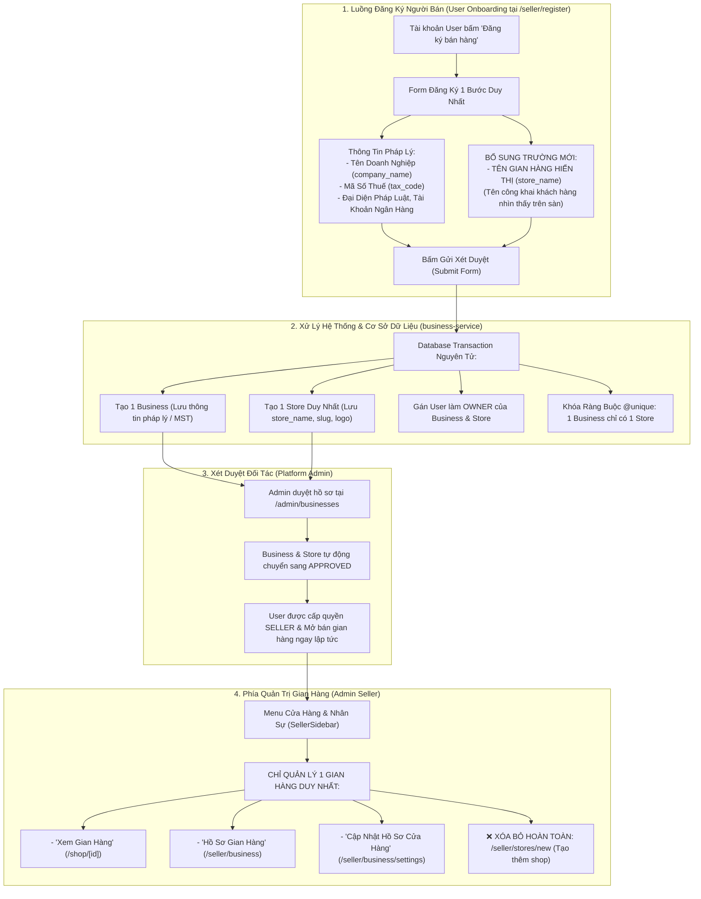

# ĐẶC TẢ TÍNH NĂNG: ĐỒNG NHẤT MÔ HÌNH ĐĂNG KÝ GIAN HÀNG & QUẢN TRỊ 1 SELLER - 1 STORE (FIX REGISTER STORE)

> **Tài liệu quy chuẩn yêu cầu & đặc tả kỹ thuật tính năng "Đồng Nhất Đăng Ký Doanh Nghiệp = Đăng Ký Gian Hàng & Khóa Đa Gian Hàng"**  
> **Dự án:** HUKI EBOOK Platform  
> **Mã đặc tả:** `FIX_REGISTER_STORE_V1`  
> **Tệp quy chuẩn:** `platform/require_feature/fix_register_store.md`  
> **Nguyên tắc bất di bất dịch:**  
> 1. **Tái sử dụng tối đa** các component, icon, màu sắc và Design Tokens sẵn có của dự án.  
> 2. **Code bám sát giao diện, theme, style và màu sắc hiện tại** của hệ thống Web Client, Seller Admin và Platform Admin.  
> 3. **Vấn đề nào chưa rõ hoặc còn phân vân bắt buộc phải hỏi lại người dùng**, tuyệt đối không tự ý suy đoán, tự chế hoặc tự quyết định.  
> 4. **Tuyệt đối không làm ảnh hưởng** đến các tính năng, luồng xử lý và giao diện không liên quan khác.  
> 5. **Đồng nhất dữ liệu hiện có** của các cửa hàng trong cơ sở dữ liệu theo đúng chuẩn mô hình 1 - 1.

---

## I. MỤC TIÊU & TỔNG QUAN QUY CHUẨN

Chuyển đổi toàn diện hệ sinh thái HUKI EBOOK sang mô hình **Định danh 1 - 1 - 1 Thống Nhất**:
$$\text{1 Tài Khoản User} \longleftrightarrow \text{1 Doanh Nghiệp Pháp Lý} \longleftrightarrow \text{1 Gian Hàng Duy Nhất}$$

1. **Đăng ký Doanh nghiệp = Đăng ký Cửa hàng:** Người dùng chỉ cần hoàn tất 1 quy trình đăng ký duy nhất tại `/seller/register` là hệ thống tự động tạo đồng thời hồ sơ Doanh nghiệp pháp lý và Gian hàng bán sách đi kèm.
2. **Bổ sung trường "Tên Gian Hàng Hiển Thị" (`store_name`):** Bổ sung trường nhập liệu riêng biệt để người bán chủ động đặt tên gian hàng hiển thị công khai cho độc giả/khách hàng nhìn thấy trên sàn (khác với tên pháp lý công ty trên giấy phép đăng ký kinh doanh).
3. **Khóa / Loại bỏ tính năng tạo nhiều gian hàng:** Mỗi tài khoản Admin Seller chỉ quản lý duy nhất 1 gian hàng của chính mình. Xóa bỏ hoàn toàn nút và trang "Tạo thêm gian hàng mới" để đồng nhất dữ liệu và chống spam shop ảo.
4. **Chuẩn hóa dữ liệu hiện có:** Rà soát và đồng nhất toàn bộ 19 cửa hàng hiện có trong Database theo quan hệ 1 Business $\leftrightarrow$ 1 Store.

---

## II. SƠ ĐỒ LUỒNG ĐĂNG KÝ & QUẢN LÝ GIAN HÀNG



---

## III. ĐẶC TẢ CHI TIẾT FORM ĐĂNG KÝ NGƯỜI BÁN (`/seller/register`)

### 1. Bổ sung trường "Tên Gian Hàng / Cửa Hàng" (`store_name`)
* **Vị trí hiển thị:** Đặt ngay trong **Bước 1 (Thông tin pháp lý & Nhận diện cơ bản)** của [`SellerRegisterView.tsx`](file:///d:/doan_huki_ebook/huki-ebook/web/src/ui/components/seller/SellerRegisterView.tsx), nằm liền kề bên dưới hoặc cạnh trường *Tên Doanh Nghiệp Pháp Lý (`company_name`)*.
* **Quy cách giao diện:**
  - **Nhãn (Label):** `Tên Gian Hàng / Cửa Hàng Hiển Thị *`
  - **Placeholder:** `Ví dụ: Nhà Sách FAHASA Official, Nhà Sách Tuổi Thơ, CÔNG TY TNHH KIEN SELLER 2...`
  - **Ghi chú hướng dẫn dưới ô input (Helper text):**  
    `ℹ️ Tên này sẽ là tên gian hàng chính thức hiển thị công khai cho độc giả và khách hàng nhìn thấy khi ghé thăm gian hàng hoặc mua sách trên sàn HUKI.`
  - **Icon nhận diện:** `storefront` (Material Symbols).

### 2. Quy tắc Xác thực (Validation Rules)
* **Bắt buộc nhập:** Không được để trống.
* **Độ dài hợp lệ:** Tối thiểu **3 ký tự**, tối đa **100 ký tự**.
* **Định dạng:** Cho phép chữ cái tiếng Việt có dấu, số, khoảng trắng và các ký tự an toàn (`-`, `&`, `.`).
* **Tính duy nhất (Unique slug):** Hệ thống tự động tạo URL slug từ tên gian hàng (ví dụ: `nha-sach-tuoi-tho`). Nếu trùng slug, tự động thêm hậu tố ngẫu nhiên để đảm bảo không bị xung đột.

### 3. Phân định rõ ràng 2 trường Tên trong Form:

| Tên trường | Tên biến dữ liệu | Mục đích sử dụng | Ví dụ thực tế |
| :--- | :--- | :--- | :--- |
| **Tên Doanh Nghiệp Pháp Lý** | `company_name` | Dùng cho hợp đồng, đối soát thuế, hóa đơn đỏ VAT và xác thực KYC. | `CÔNG TY TNHH PHÁT HÀNH SÁCH VÀ NỘI DUNG SỐ TRÍ TUỆ VIỆT` |
| **Tên Gian Hàng Hiển Thị** | **`store_name`** | Dùng làm tên Shop hiển thị công khai cho khách hàng và độc giả trên sàn HUKI. | **`Trí Tuệ Việt Books Official`** hoặc **`CÔNG TY TNHH KIEN SELLER 2`** |

---

## IV. ĐẶC TẢ LOẠI BỎ TÍNH NĂNG ĐA GIAN HÀNG (CHỈ 1 SELLER - 1 STORE)

### 1. Loại bỏ các Giao diện & Nút tạo thêm gian hàng (Frontend)
* **Xóa bỏ hoàn toàn route:** `/seller/stores/new` (Trang tạo thêm gian hàng).
* **Điều chỉnh trang danh sách cửa hàng (`/seller/stores`):**
  - Không còn hiển thị nút bấm `[add] Tạo cửa hàng mới`.
  - Trang chỉ hiển thị duy nhất **1 thẻ gian hàng của chính seller đó** kèm trạng thái hoạt động và nút *Chỉnh sửa thông tin gian hàng*.
* **Menu điều hướng ([`SellerSidebar.tsx`](file:///d:/doan_huki_ebook/huki-ebook/web/src/ui/components/layout/SellerSidebar.tsx)):**
  - Giữ lại các mục chuẩn hóa:
    - `Xem Gian Hàng` $\rightarrow$ dẫn thẳng tới trang Shop công khai `/shop/[slug_hoặc_id]`.
    - `Hồ Sơ Cửa Hàng & Doanh Nghiệp` $\rightarrow$ `/seller/business`.
    - `Cập Nhật Hồ Sơ Cửa Hàng` $\rightarrow$ `/seller/business/settings`.

### 2. Khóa Logic Chặn Tạo Thêm Gian Hàng (Backend)
* **Tại Service xử lý (`store.service.ts`):**
  - Thêm Guard kiểm tra trước khi tạo Store:
    ```typescript
    const existingStore = await this.prisma.store.findFirst({
      where: { businessId: business.id }
    });
    if (existingStore) {
      throwConflict('Mỗi tài khoản đối tác chỉ được phép sở hữu duy nhất 1 gian hàng trên sàn HUKI.');
    }
    ```
* **Tại Controller (`store.controller.ts`):**
  - Chặn hoặc vô hiệu hóa endpoint `POST /stores` tạo thêm store lẻ ngoài luồng đăng ký KYC.

---

## V. ĐỒNG NHẤT DỮ LIỆU HIỆN CÓ CỦA CÁC CỬA HÀNG TRONG DATABASE

### 1. Hiện trạng thực tế trong CSDL `huki_business`
Hệ thống hiện có 19 bản ghi `Store` tương ứng với 19 `Business`. Tất cả các bản ghi này đã có quan hệ 1-1 tương ứng.

### 2. Quy chuẩn đồng nhất dữ liệu:
* **Mỗi `Business` gắn chặt 1-1 với 1 `Store`:**
  - `store.business_id` liên kết trực tiếp với `business.id`.
  - Cập nhật trường `store.name` đảm bảo là tên gian hàng chính xác của từng đối tác (ví dụ: `CÔNG TY TNHH KIEN SELLER 1`, `CÔNG TY TNHH KIEN SELLER 2`, `CÔNG TY CỔ PHẦN SÁCH ALPHA`,...).
* **Đồng bộ với dữ liệu Sách & Đơn hàng (`commerce_db`):**
  - Toàn bộ sách trong bảng `books` thuộc quyền sở hữu của người bán nào thì trường `store_id` trỏ đúng vào mã `storeId` duy nhất của gian hàng đó.
  - Toàn bộ đơn hàng trong bảng `seller_orders` lưu đúng `storeId` duy nhất của gian hàng.

---

## VI. THIẾT KẾ KỸ THUẬT & CƠ SỞ DỮ LIỆU

### 1. Cơ sở dữ liệu (`business-service/prisma/schema.prisma`)
Cập nhật model `Store` để thiết lập quan hệ 1 - 1 bắt buộc ở tầng cơ sở dữ liệu:
```prisma
model Business {
  id        String   @id @default(uuid())
  name      String
  taxCode   String   @unique @map("tax_code")
  ...
  store     Store?   // Quan hệ 1 - 1 với Store duy nhất
}

model Store {
  id          String   @id @default(uuid())
  name        String   // Tên Gian Hàng hiển thị công khai (store_name)
  slug        String   @unique
  businessId  String   @unique @map("business_id") // BẮT BUỘC UNIQUE: 1 Business chỉ có 1 Store
  business    Business @relation(fields: [businessId], references: [id], onDelete: Cascade)
  ...
}
```

### 2. Payload Dữ liệu Đăng Ký (`CreateBusinessPayload`)
Cập nhật interface payload gửi từ Frontend lên Backend:
```typescript
export interface CreateBusinessPayload {
  // Thông tin pháp lý Doanh nghiệp
  company_name: string;
  tax_code: string;
  businessType: 'CORPORATION' | 'LLC' | 'INDIVIDUAL' | 'PARTNERSHIP';
  
  // Thông tin Gian hàng hiển thị (MỚI BỔ SUNG)
  store_name: string; // Tên gian hàng hiển thị với độc giả
  
  // Người đại diện, Ngân hàng, Kho hàng, Giấy phép
  rep_full_name: string;
  rep_id_card_number: string;
  account_holder_name: string;
  account_number: string;
  bank_name: string;
  warehouse_street: string;
  warehouse_province: string;
  ...
}
```

### 3. Logic Backend Transaction (`business.service.ts`)
Khi gọi `createBusiness(userId, payload)`:
```typescript
// 1. Tạo Business pháp lý
const business = await tx.business.create({
  data: {
    name: payload.company_name,
    taxCode: payload.tax_code,
    ...
  }
});

// 2. Tạo Store duy nhất với Tên Gian Hàng được người dùng nhập
await tx.store.create({
  data: {
    name: payload.store_name || payload.company_name, // Ưu tiên store_name người dùng đã nhập
    slug: generateSlug(payload.store_name || payload.company_name),
    businessId: business.id,
    status: StoreStatus.PENDING_APPROVAL,
    isActive: true,
  }
});
```

---

## VII. NGUYÊN TẮC THỰC HIỆN & TIÊU CHUẨN KIỂM THỬ

1. **Nguyên tắc thực hiện:**
   - Sử dụng đúng hệ màu sắc Emerald (`#006953`), Dark Slate và các Design Tokens sẵn có.
   - Giữ nguyên toàn bộ các bước xác thực thuế OCR tự động, tải tài liệu CCCD/GPKD hiện có của Form đăng ký.
   - Không làm thay đổi hay gián đoạn các luồng mua hàng, giỏ hàng, checkout của độc giả.
2. **Tiêu chuẩn kiểm thử (Acceptance Criteria):**
   - [ ] Form đăng ký `/seller/register` hiển thị rõ trường `Tên Gian Hàng / Cửa Hàng Hiển Thị` (`store_name`) kèm ghi chú hướng dẫn.
   - [ ] Người bán có thể nhập Tên Doanh Nghiệp (vd: `CÔNG TY TNHH ABC`) và Tên Gian Hàng (vd: `Hiệu Sách Tuổi Thơ`) hoàn toàn độc lập.
   - [ ] Đăng ký thành công tạo đồng thời 1 Business và 1 Store duy nhất trong CSDL.
   - [ ] Đã xóa bỏ/chặn hoàn toàn tính năng tạo thêm store `/seller/stores/new`.
   - [ ] Ràng buộc Database `@unique` đảm bảo không thể tạo store thứ 2 cho cùng 1 business.
   - [ ] Toàn bộ 19 cửa hàng hiện có trong Database được đồng nhất dữ liệu hoạt động ổn định.
