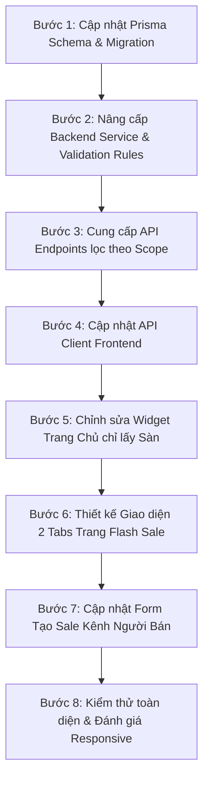

# ĐẶC TẢ TÍNH NĂNG & KẾ HOẠCH TRIỂN KHAI: TỐI ƯU HÓA PHÂN HỆ FLASH SALE V1 (HUKI & SHOPS FLASH SALE)

> **Tài liệu quy chuẩn yêu cầu, kiến trúc kỹ thuật và kế hoạch thực hiện tính năng Flash Sale**  
> **Dự án:** HUKI EBOOK Platform  
> **Vị trí tài liệu:** `platform/require_feature/flash_sale_v1.md`  
> **Trạng thái:** Đặc tả chuẩn & Kế hoạch chi tiết (Ready for Implementation)  

---

## I. TỔNG QUAN YÊU CẦU NGHIỆP VỤ (BUSINESS REQUIREMENTS)

### 1. Phân định nguồn gốc Flash Sale (Platform vs. Shop)
Hệ thống phân chia rõ ràng 2 phạm vi tổ chức Flash Sale:
* **Huki Flash Sale (Sàn tổ chức):** Các đợt khuyến mãi giờ vàng do ban quản trị sàn Huki-Ebook trực tiếp cấu hình và tài trợ/điều phối.
* **Shops Flash Sale (Cửa hàng tự tổ chức):** Các đợt Flash Sale do từng người bán/cửa hàng (Seller) tự tạo và quản lý trong phạm vi gian hàng của mình.

### 2. Trang chủ – Widget "HUKI DEAL HÔM NAY"
* **Quy tắc hiển thị:** Chỉ hiển thị duy nhất các sản phẩm thuộc đợt Flash Sale **do Sàn Huki tổ chức** (`scope = PLATFORM`) đang `ACTIVE`.
* **Tuyệt đối không hiển thị:** Sản phẩm từ các đợt Flash Sale riêng của các Cửa hàng tại widget trang chủ này.
* **Thời gian đếm ngược:** Đếm ngược theo phiên sale đang active của Sàn.

### 3. Trang Flash Sale (`/flash-sale` truy cập từ Sidebar/Header)
Giao diện được phân tách thành 2 phân mục / 2 Tab trực quan:
* **Tab 1: Huki Flash Sale (Sàn Huki):**
  * Hiển thị đợt Flash Sale đang `ACTIVE` của Sàn Huki.
  * Hiển thị đồng hồ đếm ngược phiên giờ vàng toàn sàn.
  * Lưới danh sách sách Flash Sale trợ giá từ sàn.
* **Tab 2: Shops Flash Sale (Cửa hàng):**
  * Hiển thị toàn bộ các đợt Flash Sale do các Cửa hàng tổ chức.
  * **Cơ chế hiển thị:** Phân chia, gom nhóm và sắp xếp rõ ràng **theo từng Cửa hàng (Shop)** và **theo từng đợt sale của shop đó**, tuyệt đối không trộn lẫn sản phẩm của các shop với nhau.
  * Mỗi khối shop gồm: Thông tin Shop (Avatar, Tên shop, Badge gian hàng, Nút xem shop), Khung giờ sale & Thời gian đếm ngược riêng của shop, Lưới sản phẩm sale của shop đó.

### 4. Quy tắc nghiệp vụ cho Flash Sale của Cửa hàng (Shop Constraints)
* **Thời gian bắt đầu hợp lệ:** `startsAt` không được nằm trong quá khứ (`startsAt >= now`).
* **Không trùng lặp / chồng lấn thời gian (No Overlapping):** Trong cùng một Cửa hàng, khoảng thời gian `[startsAt, endsAt]` của một đợt Flash Sale mới không được giao thoa hay trùng với bất kỳ đợt Flash Sale nào khác (chưa kết thúc) của chính Cửa hàng đó.
* **Giới hạn số lượng đợt (Quota Limit):** Mỗi Cửa hàng chỉ được tạo và duy trì tối đa **5 đợt Flash Sale** (tính tổng các đợt đang hoạt động `ACTIVE` và các đợt đã lên lịch `SCHEDULED`).

### 5. Quy tắc Độc quyền Sản phẩm (Conflict & Exclusivity Rules)
* **Quy tắc 1 (Sàn ưu tiên):** Trong thời gian một đợt Flash Sale của Sàn đang `ACTIVE`, sản phẩm (sách) đã tham gia vào Flash Sale của Sàn thì **KHÔNG** được tham gia vào Flash Sale của Shop.
* **Quy tắc 2 (Shop ưu tiên):** Sản phẩm (sách) đang nằm trong đợt Flash Sale của Shop (đang chạy hoặc có khung giờ trùng) thì **KHÔNG** được đưa vào đợt Flash Sale của Sàn.
* **Hành vi xử lý:** Hệ thống chặn ngay tại tầng Backend API khi thêm/đăng ký sách và hiển thị thông báo lỗi rõ ràng cho người dùng/người bán.

---

## II. ĐẶC TẢ KIẾN TRÚC & KỸ THUẬT (TECHNICAL SPECIFICATIONS)

### 1. Cơ sở dữ liệu (`promotion-service` – Prisma Schema)

Cập nhật `platform/apps/promotion-service/prisma/schema.prisma`:

```prisma
enum FlashSaleScope {
  PLATFORM
  SHOP
}

model FlashSale {
  id          String         @id @default(uuid())
  name        String
  description String?
  bannerUrl   String?        @map("banner_url")
  
  // Phân biệt Sàn hay Shop
  scope       FlashSaleScope @default(PLATFORM)
  storeId     String?        @map("store_id")

  startsAt    DateTime       @map("starts_at")
  endsAt      DateTime       @map("ends_at")
  status      FlashSaleStatus @default(SCHEDULED)

  createdAt   DateTime       @default(now()) @map("created_at")
  updatedAt   DateTime       @updatedAt @map("updated_at")

  items       FlashSaleItem[]

  @@index([scope, status])
  @@index([storeId, status])
  @@map("flash_sales")
}
```

---

### 2. Logic Backend (`promotion-service`)

#### A. Validation khi Seller tạo đợt Flash Sale (`create` / `createSlot`)
1. **Kiểm tra thời gian quá khứ:**
   ```typescript
   if (new Date(dto.startsAt) < new Date()) {
     throwBadRequest(ErrorCode.FLASH_SALE_INVALID_DATE, "Thời gian bắt đầu không được nằm trong quá khứ");
   }
   ```
2. **Kiểm tra giới hạn 5 đợt / Shop:**
   ```typescript
   const activeOrScheduledCount = await this.prisma.flashSale.count({
     where: {
       storeId: businessId,
       scope: FlashSaleScope.SHOP,
       status: { in: [FlashSaleStatus.ACTIVE, FlashSaleStatus.SCHEDULED] },
     },
   });
   if (activeOrScheduledCount >= 5) {
     throwBadRequest(
       ErrorCode.FLASH_SALE_LIMIT_EXCEEDED,
       "Cửa hàng đã đạt giới hạn tối đa 5 đợt Flash Sale đang hoạt động hoặc đã lên lịch"
     );
   }
   ```
3. **Kiểm tra trùng lặp thời gian trong cùng Shop:**
   ```typescript
   const overlapping = await this.prisma.flashSale.findFirst({
     where: {
       storeId: businessId,
       scope: FlashSaleScope.SHOP,
       status: { not: FlashSaleStatus.ENDED },
       startsAt: { lt: new Date(dto.endsAt) },
       endsAt: { gt: new Date(dto.startsAt) },
     },
   });
   if (overlapping) {
     throwBadRequest(
       ErrorCode.FLASH_SALE_OVERLAPPING_TIME,
       "Khoảng thời gian đợt Flash Sale bị trùng lặp với một đợt Flash Sale khác của cửa hàng"
     );
   }
   ```

#### B. Validation khi Đăng ký / Thêm sách vào Flash Sale (`registerItem` / `addItem`)
1. **Kiểm tra Độc quyền Sách giữa Sàn và Shop:**
   * **Nếu đăng ký vào Flash Sale của Shop:** Kiểm tra xem sách có đang nằm trong đợt Flash Sale nào của Sàn (`scope = PLATFORM`) có thời gian giao thoa hay không. Nếu có &rarr; Báo lỗi: *"Sách này đang tham gia đợt Flash Sale của Sàn Huki trong cùng khung giờ, không thể tham gia Flash Sale của Shop"*.
   * **Nếu Admin thêm sách vào Flash Sale của Sàn:** Kiểm tra xem sách có đang nằm trong đợt Flash Sale của Shop (`scope = SHOP`) có thời gian giao thoa hay không. Nếu có &rarr; Báo lỗi: *"Sách này đang nằm trong đợt Flash Sale của Cửa hàng trong cùng khung giờ, không thể đưa vào Flash Sale của Sàn"*.

#### C. Cung cấp API chuyên biệt
* `GET /api/v1/flash-sales/active?scope=PLATFORM`: Lấy đợt Flash Sale active của Sàn (phục vụ Trang chủ & Tab Huki Flash Sale).
* `GET /api/v1/flash-sales/active?scope=SHOP`: Lấy các đợt Flash Sale active của các Shop.
* `GET /api/v1/flash-sales/shops/grouped`: Trả về danh sách đợt sale đang active được gom nhóm theo từng Shop:
  ```json
  [
    {
      "storeId": "store-uuid-1",
      "storeName": "Alpha Books Official",
      "storeAvatar": "https://...",
      "campaigns": [
        {
          "id": "fs-1",
          "name": "Giờ Vàng Alpha Books",
          "startsAt": "...",
          "endsAt": "...",
          "remainingSeconds": 3600,
          "items": [...]
        }
      ]
    }
  ]
  ```

---

### 3. Giao diện Frontend (`web`)

#### A. Trang Chủ ([`web/src/app/page.tsx`](file:///d:/doan_huki_ebook/huki-ebook/web/src/app/page.tsx))
* Gọi API: `flashSaleApi.getActiveFlashSales({ scope: 'PLATFORM' })`.
* Khối **"HUKI DEAL HÔM NAY"** chỉ hiển thị khi có đợt Flash Sale Sàn hợp lệ.
* Sử dụng `BookCard` có sẵn (`variant="compact"`) với đầy đủ badge `⚡ FLASH SALE`, giá deal, giá gốc gạch ngang và nút "MUA NGAY".

#### B. Trang Flash Sale ([`web/src/app/flash-sale/page.tsx`](file:///d:/doan_huki_ebook/huki-ebook/web/src/app/flash-sale/page.tsx))
* Bố cục 2 Tabs rõ ràng ở đầu trang:
  1. **Tab 1: `⚡ Huki Flash Sale`** (Badge Sàn màu đỏ cam `#ac2c19`):
     * Banner chính của Sàn.
     * Bộ đếm ngược thời gian kết thúc của phiên Sàn.
     * Lưới sách Flash Sale dạng responsive grid (`grid-cols-2 sm:grid-cols-3 md:grid-cols-4 lg:grid-cols-6`).
  2. **Tab 2: `🏪 Shops Flash Sale`** (Badge Cửa hàng màu xanh rêu `#003B2B` / amber):
     * Danh sách các khối Shop.
     * Mỗi khối Shop có:
       * **Header khối Shop:** Avatar cửa hàng, Tên Shop, Badge `"Shop Official / Đối tác"`, Nút `"Xem Shop"`, Khung giờ sale của Shop và Đồng hồ đếm ngược riêng của shop đó.
       * **Lưới sản phẩm:** Grid sách Flash Sale của riêng shop đó.

#### C. Kênh Người Bán (Seller Marketing - Flash Sale)
* Form tạo Flash Sale của Seller:
  * Validate trực tiếp ngày giờ (không cho chọn quá khứ).
  * Hiển thị cảnh báo số lượng đợt: `Đã tạo: X/5 đợt khả dụng`.
  * Hiển thị lỗi rõ ràng nếu trùng lịch hoặc trùng sách với đợt sale của Sàn.

---

## III. NGUYÊN TẮC THIẾT KẾ & BẢO TOÀN HỆ THỐNG (STRICT CONSTRAINTS)

1. **Tái sử dụng Component có sẵn:**
   * Sử dụng [`BookCard.tsx`](file:///d:/doan_huki_ebook/huki-ebook/web/src/ui/components/common/BookCard.tsx), `BookCover.tsx`, `FlashSaleSection.tsx`.
   * Sử dụng hệ thống nút bấm, badge, icon Material Symbols và token màu sắc đã định hình của dự án (`#ac2c19`, `#003B2B`, `#FAF3EE`, `#EADBCE`,...).
2. **Không làm ảnh hưởng tính năng không liên quan:**
   * Giữ nguyên logic tính giá trong giỏ hàng (`CartContext`), luồng đặt hàng trực tiếp (`sessionStorage 'huki_direct_checkout_item'`), và hệ thống trừ tồn kho qua Redis.
3. **Đảm bảo Responsive & Thẩm mỹ cao:**
   * Dàn hàng mượt mà trên Mobile (2 cột), Tablet (3-4 cột) và Desktop (5-6 cột).
   * Khoảng cách padding, gap, border radius đồng bộ (`rounded-2xl`, `rounded-3xl`).
4. **Nguyên tắc giao tiếp:**
   * Nếu có bất kỳ điểm nào chưa rõ về mặt dữ liệu hoặc luồng hiển thị, **phải hỏi lại người dùng để làm rõ** thay vì tự ý suy đoán hoặc tự chế.

---

## IV. KẾ HOẠCH THỰC HIỆN TỪNG BƯỚC (IMPLEMENTATION PLAN)



### Bước 1: Database & Migration (`promotion-service`)
- [ ] Thêm enum `FlashSaleScope` (`PLATFORM`, `SHOP`) vào `schema.prisma`.
- [ ] Thêm trường `scope` và `storeId` vào model `FlashSale`.
- [ ] Chạy `prisma db push` / `prisma migrate` để đồng bộ cơ sở dữ liệu.

### Bước 2: Backend Validation & Business Logic (`promotion-service`)
- [ ] Viết hàm validate không quá khứ (`startsAt >= now`).
- [ ] Viết hàm validate giới hạn tối đa 5 đợt sale / Shop (`status in [ACTIVE, SCHEDULED]`).
- [ ] Viết hàm validate không trùng lặp khung giờ giữa các đợt sale của cùng một Shop.
- [ ] Viết hàm validate độc quyền sản phẩm giữa Flash Sale của Sàn và Flash Sale của Shop.

### Bước 3: Backend Controller & API Endpoints
- [ ] Cập nhật `getActiveFlashSales()` hỗ trợ query param `scope`.
- [ ] Viết endpoint `GET /api/v1/flash-sales/shops/grouped` gom nhóm theo Shop.
- [ ] Cập nhật controller của Seller để gán `scope = SHOP` và `storeId = businessId`.

### Bước 4: Frontend API Layer (`web/src/ui/api/flashSaleApi.ts`)
- [ ] Cập nhật kiểu dữ liệu TypeScript (`FlashSaleSlot`, `FlashSaleScope`, `ShopFlashSaleGroup`).
- [ ] Thêm method `getActivePlatformFlashSale()` và `getGroupedShopFlashSales()`.

### Bước 5: Trang Chủ ([`web/src/app/page.tsx`](file:///d:/doan_huki_ebook/huki-ebook/web/src/app/page.tsx))
- [ ] Đổi API gọi sang phiên sale của Sàn (`scope = PLATFORM`).
- [ ] Đảm bảo widget **HUKI DEAL HÔM NAY** chỉ hiển thị sản phẩm của Sàn HUKI.

### Bước 6: Trang Flash Sale ([`web/src/app/flash-sale/page.tsx`](file:///d:/doan_huki_ebook/huki-ebook/web/src/app/flash-sale/page.tsx))
- [ ] Triển khai Header chuyển Tab: `⚡ Huki Flash Sale` và `🏪 Shops Flash Sale`.
- [ ] Tab `Huki Flash Sale`: Render đợt sale của sàn với countdown và grid sản phẩm.
- [ ] Tab `Shops Flash Sale`: Render danh sách từng Shop riêng biệt (Header Shop + Countdown + Grid sản phẩm của shop).

### Bước 7: Kênh Người Bán (Seller Portal)
- [ ] Hiển thị số lượng đợt sale hiện có (ví dụ: `X/5 đợt`).
- [ ] Validate form tạo sale trực quan phía client trước khi submit.

### Bước 8: Kiểm thử & Nghiệm thu (Testing & QA)
- [ ] Kiểm tra tạo 6 đợt sale tại 1 shop &rarr; Hệ thống chặn ở đợt thứ 6.
- [ ] Kiểm tra tạo đợt sale trùng giờ tại 1 shop &rarr; Hệ thống chặn báo lỗi trùng lịch.
- [ ] Kiểm tra thêm cùng 1 cuốn sách vào cả sale của Sàn và sale của Shop &rarr; Hệ thống chặn báo lỗi độc quyền.
- [ ] Kiểm tra hiển thị trang chủ và trang `/flash-sale` trên Mobile, Tablet, Desktop.
