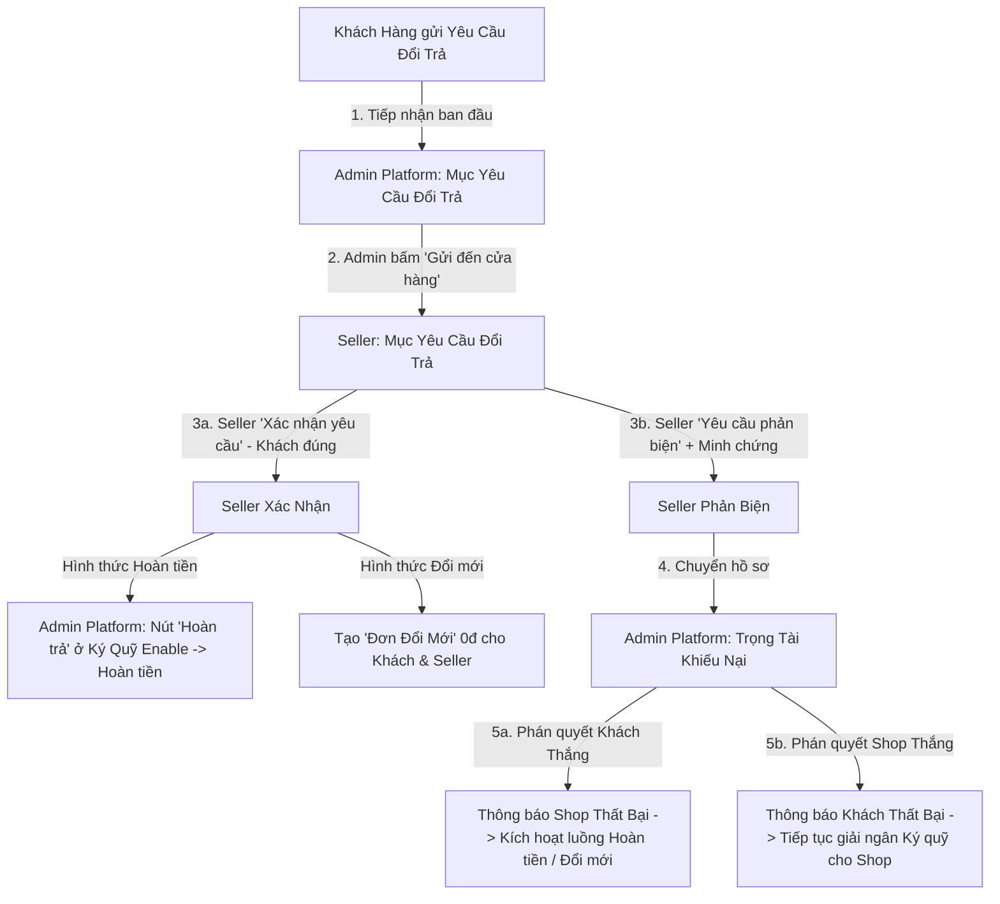
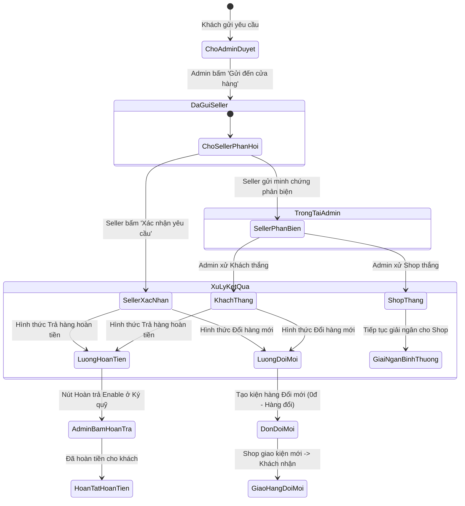

# TÀI LIỆU QUY CHUẨN KỸ THUẬT & QUY TRÌNH NGHIỆP VỤ ĐỔI TRẢ HÀNG (FLOW RETURN V1)
> **Dự án:** HUKI EBOOK PLATFORM  
> **Phiên bản:** v1.0.0  
> **Ngày tạo:** 2026-09-23  
> **Trạng thái:** Tài liệu đặc tả chuẩn (Standard Specification) - Căn cứ thực thi hệ thống  

---

## MỤC LỤC
1. [TỔNG QUAN & NGUYÊN TẮC THỰC THI](#1-tổng-quan--nguyên-tắc-thực-thi)
2. [YÊU CẦU NGHIỆP VỤ CHI TIẾT CỦA TỪNG PHÂN HỆ](#2-yêu-cầu-nghiệp-vụ-chi-tiết-của-từng-phân-hệ)
   - 2.1. Phân hệ Khách Hàng (Buyer - Order Details & Returns)
   - 2.2. Phân hệ Quản Trị Sàn (Admin Platform)
   - 2.3. Phân hệ Người Bán (Seller Portal)
   - 2.4. Phân hệ Trọng Tài Khiếu Nại (Arbitration Center)
   - 2.5. Phân luồng theo 2 Hình Thức Đổi Trả (Hoàn tiền vs Đổi mới)
3. [ĐẶC TẢ GIAO DIỆN, THEME, STYLE & TÁI SỬ DỤNG COMPONENT](#3-đặc-tả-giao-diện-theme-style--tái-sử-dụng-component)
4. [ĐẶC TẢ KIẾN TRÚC KỸ THUẬT & CƠ SỞ DỮ LIỆU (BACKEND & DATABASE)](#4-đặc-tả-kiến-trúc-kỹ-thuật--cơ-sở-dữ-liệu-backend--database)
5. [CÁC NGUYÊN TẮC RÀNG BUỘC KHI TRIỂN KHAI](#5-các-nguyên-tắc-ràng-buộc-khi-triển-khai)

---

## 1. TỔNG QUAN & NGUYÊN TẮC THỰC THI

### 1.1. Mục tiêu
Tài liệu này quy định chi tiết toàn bộ luồng nghiệp vụ, giao diện, cấu trúc dữ liệu và logic xử lý của tính năng **Yêu Cầu Đổi Trả Sản Phẩm** trên nền tảng thương mại điện tử HUKI EBOOK. Đây là tài liệu quy chuẩn duy nhất để đối chiếu và triển khai code cho cả Frontend (Next.js) và Backend (NestJS + Prisma `commerce_db`).

### 1.2. Nguyên tắc bất biến (Guiding Principles)
1. **Tuân thủ thiết kế hiện hữu:** Tái sử dụng tối đa các Component, Token màu, Typography, Layout và Style có sẵn trong hệ thống HUKI EBOOK. Không tự ý thêm thư viện CSS/UI lạ phá vỡ kiến trúc thiết kế chung.
2. **Tuyệt đối không tự suy diễn/tự chế:** Mọi trường dữ liệu, quy tắc chuyển trạng thái (State Machine), logic dòng tiền ký quỹ (Escrow) phải được định nghĩa rõ ràng. Những điểm chưa rõ bắt buộc phải hỏi lại người dùng trước khi code.
3. **Độc lập và an toàn:** Triển khai module mới không được làm hỏng, xung đột hoặc ảnh hưởng tiêu cực đến các tính năng và giao diện hiện có (quản lý đơn hàng, danh mục sản phẩm, duyệt doanh nghiệp, thanh toán PayOS/COD, ví người bán...).

---

## 2. YÊU CẦU NGHIỆP VỤ CHI TIẾT CỦA TỪNG PHÂN HỆ



---

### 2.1. Phân hệ Khách Hàng (Buyer - Order Details & Returns)

#### A. Điều kiện xuất hiện nút "Yêu cầu đổi trả":
- Đơn hàng đã đạt trạng thái giao hàng thành công (hoặc đã thanh toán đối với sản phẩm số/Ebook).
- Đơn hàng **còn trong thời hạn đổi trả** (đếm ngược 2 phút trong môi trường test/demo hoặc X ngày theo chính sách) **HOẶC** người dùng **chưa bấm nút "Đã nhận đủ hàng"**.
- Nút **`Yêu cầu đổi trả`** hiển thị trực tiếp trên **từng món hàng (OrderItem)** của đơn hàng, cho phép gửi khiếu nại/đổi trả độc lập cho từng món.

#### B. Popup Modal "Yêu Cầu Đổi Trả":
Khi người dùng bấm vào nút `Yêu cầu đổi trả` của sản phẩm nào, hệ thống mở Popup tương ứng với cấu trúc:
1. **Tiêu đề Popup:** Hiển thị rõ tiêu đề và thông tin sản phẩm/đơn hàng đang yêu cầu.
2. **Lý do đổi trả:** Cung cấp danh sách 3 lựa chọn (Radio / Select):
   - `Hàng không đúng mô tả`
   - `Hàng bị hỏng rách`
   - `Lý do khác` $\rightarrow$ Khi chọn mục này, bắt buộc xuất hiện một ô `textarea` để người dùng nhập lý do chi tiết. **Ràng buộc validation: Bắt buộc tối thiểu từ 6 ký tự trở lên (nhiều hơn 5 ký tự)**.
3. **Minh chứng đính kèm (Evidence):**
   - Cho phép tải lên tối đa **3 hình ảnh** (Dung lượng mỗi ảnh $< 5\text{MB}$).
   - Cho phép tải lên tối đa **2 video** (Thời lượng mỗi video $< 30\text{s}$).
   - Hiển thị văn bản hướng dẫn/cảnh báo rõ ràng cho người dùng về giới hạn dung lượng và thời lượng trước khi tải.
4. **Hình thức đổi trả (Resolution Type):** 2 lựa chọn:
   - `Trả hàng hoàn tiền`
   - `Đổi hàng mới`
5. **Các nút thao tác & Đóng modal:**
   - Nút **`Gửi yêu cầu`**: Gửi toàn bộ dữ liệu lên hệ thống sau khi đã kiểm tra tính hợp lệ.
   - Nút **`Hủy`**: Hủy thao tác và đóng popup.
   - Nút **`X`** ở góc trên cùng bên phải và click ra ngoài lớp **Overlay (Backdrop)**: Đóng popup an toàn.

---

### 2.2. Phân hệ Quản Trị Sàn (Admin Platform)

#### A. Mục "Tài Khoản Trung Gian" (`/admin/escrow`):
1. **Bổ sung lựa chọn thao tác:**
   - Trong cột **Thao tác** của bảng ký quỹ, thêm lựa chọn nút **`Hoàn trả`** với tone màu xanh dương (`bg-blue-600` / `text-blue-600`).
2. **Quy tắc kích hoạt (Enable/Disable):**
   - **Mặc định:** Nút `Hoàn trả` luôn ở trạng thái **Disabled**.
   - **Điều kiện Enable:** Chỉ được mở khóa khi:
     - Cửa hàng bấm **Xác nhận yêu cầu** (đồng ý khách đúng).
     - Hoặc Admin Sàn phân xử Trọng tài và phán quyết **Khách hàng thắng**.
3. **Hành vi sau khi bấm:**
   - Admin bấm `Hoàn trả` $\rightarrow$ Hệ thống kích hoạt giao dịch hoàn tiền cho món hàng đó về tài khoản/ví của khách hàng.
   - Ngay sau khi hoàn tiền thành công $\rightarrow$ Nút chuyển sang trạng thái đã hoàn trả và lập tức bị **Disabled** (tương tự như nút `Bàn giao` sau khi đã giải ngân).

#### B. Mục mới "Yêu Cầu Đổi Trả" (`/admin/return-requests`):
- Là nơi tiếp nhận đầu tiên ngay khi Khách hàng gửi yêu cầu đổi trả lên sàn.
- **Thông tin hiển thị chi tiết:**
  - Tên khách hàng đổi trả
  - Mã sản phẩm đổi trả
  - Tên và hình ảnh đại diện của sản phẩm
  - Mã đơn hàng chứa sản phẩm
  - Tên/Mã cửa hàng bán sản phẩm
  - Hình thức đổi trả (`Trả hàng hoàn tiền` / `Đổi hàng mới`)
  - Lý do đổi trả và toàn bộ tệp minh chứng (hình ảnh, video)
  - Trạng thái yêu cầu: `Đang duyệt`, `Đã gửi seller`, `Seller xác nhận`, `Seller phản biện`.
- **Nút "Gửi đến cửa hàng":**
  - Khi Admin Platform xem xét và bấm nút này $\rightarrow$ Toàn bộ thông tin yêu cầu được chuyển tiếp về mục *Yêu Cầu Đổi Trả* của Seller tương ứng.
  - Đồng thời, nút `Gửi đến cửa hàng` trên giao diện Admin Platform lập tức chuyển sang trạng thái **Disabled**.

---

### 2.3. Phân hệ Người Bán (Seller Portal)

#### A. Tách Menu Sidebar Người Bán:
Tách mục *"Đơn Hủy & Khiếu Nại"* hiện tại thành 2 menu độc lập:
1. **Đơn Hủy** (`/seller/orders?tab=CANCELLED`): Quản lý các đơn hàng bị hủy thông thường.
2. **Yêu Cầu Đổi Trả** (`/seller/returns` - đổi tên từ Khiếu nại): Quản lý các ca yêu cầu đổi trả do Admin Platform chuyển xuống.

#### B. Danh Sách "Yêu Cầu Đổi Trả":
- Tiếp nhận các yêu cầu được chuyển xuống từ Admin Platform.
- Các yêu cầu từ nhiều khách hàng/nhiều đơn hàng được chia thành **từng div/khối độc lập** để dễ quản lý.
- Cấu trúc Bảng hiển thị gồm các cột:
  1. **STT:** Số thứ tự.
  2. **Mã Đơn Hàng:** Mã đơn hàng chứa sản phẩm.
  3. **Mã Sản Phẩm:** Mã định danh món hàng.
  4. **Tên Sản Phẩm:** Hiển thị ảnh thumbnail + tên sản phẩm (Rút gọn tối đa **10 ký tự đầu + `...`**, khi rê chuột `hover` hiển thị tooltip đầy đủ tên).
  5. **Khách Hàng:** Tên khách hàng đổi trả (Rút gọn tối đa **10 ký tự đầu + `...`**, khi `hover` hiển thị tooltip đầy đủ).
  6. **Lý Do:** Nội dung lý do đổi trả (Rút gọn tối đa **15 ký tự đầu + `...`**, khi `hover` hiển thị tooltip đầy đủ).
  7. **Chi Tiết:** Nút `Xem chi tiết` dẫn đến Trang Chi Tiết Yêu Cầu Đổi Trả.

#### C. Trang Chi Tiết Yêu Cầu Đổi Trả (`/seller/returns/[id]`):
- Hiển thị toàn bộ thông tin yêu cầu đổi trả từ Admin gửi xuống, được chia thành các **div phân biệt rõ ràng, ngăn nắp**.
- Cung cấp **2 nút hành động chính:**
  1. **Nút "Xác nhận yêu cầu" (Khách hàng đúng):**
     - Trạng thái yêu cầu chuyển thành `Seller xác nhận`.
     - Ở Admin Platform mục Ký Quỹ, nút `Hoàn trả` được **Enable** để Admin bấm hoàn tiền.
  2. **Nút "Yêu cầu phản biện":**
     - Bấm nút $\rightarrow$ Mở Popup để Cửa hàng nhập minh chứng đối soát.
     - Giới hạn minh chứng: Tối đa **3 ảnh ($< 5\text{MB}$)** và **2 video (thời lượng $< 30\text{s}$/video)**.
     - Có nút `Hủy` (đóng popup) và nút `Gửi phản biện`.
     - Khi gửi thành công $\rightarrow$ Trạng thái đổi thành `Seller phản biện`, hồ sơ được chuyển lên mục Trọng Tài Khiếu Nại của Admin Platform.

---

### 2.4. Phân hệ Trọng Tài Khiếu Nại (Arbitration Center - `/admin/disputes`)

1. **Thời điểm tiếp nhận:** Mục Trọng Tài Khiếu Nại **chỉ tiếp nhận xử lý khi Seller bấm gửi phản biện**.
2. **Bố cục hiển thị:** Mỗi ca tranh chấp được gom chung trong **1 div/card độc lập**, hiển thị song song hoặc phân tách trực quan:
   - Phần thông tin + Minh chứng của Khách hàng.
   - Phần thông tin + Minh chứng phản biện của Cửa hàng.
3. **Quyền phán quyết của Admin Sàn (Trọng tài):**
   - **Trường hợp Khách Hàng thắng:**
     - Hệ thống gửi thông báo *"Phản biện thất bại"* kèm lý do phán quyết đến Cửa hàng.
     - Kích hoạt mở nút `Hoàn trả` ở mục Ký quỹ để Admin bấm hoàn tiền (nếu là hình thức hoàn tiền) hoặc chuyển tiếp sang luồng đổi hàng mới.
   - **Trường hợp Cửa Hàng thắng:**
     - Hệ thống gửi thông báo *"Yêu cầu đổi trả thất bại"* kèm lý do phán quyết đến Khách hàng.
     - Yêu cầu đổi trả kết thúc, tiền trong tài khoản trung gian tiếp tục luồng giải ngân bình thường cho Cửa hàng.

---

### 2.5. Phân Luồng Xử Lý Theo 2 Hình Thức Đổi Trả



#### A. Hình thức 1: Trả hàng hoàn tiền (Return & Refund)
- Khi Seller xác nhận (hoặc Khách hàng thắng trọng tài) $\rightarrow$ Nút **`Hoàn trả`** trong Ký Quỹ (`/admin/escrow`) sáng lên (Enable).
- Admin bấm `Hoàn trả` $\rightarrow$ Hoàn tiền về ví/tài khoản khách $\rightarrow$ Nút chuyển sang trạng thái đã hoàn trả và Disable.

#### B. Hình thức 2: Đổi hàng mới (Replacement)
- Các bước gửi yêu cầu, duyệt và phản biện diễn ra tương tự như hình thức hoàn tiền.
- **Khi Seller xác nhận (hoặc Khách hàng thắng trọng tài):**
  - **Phía Khách Hàng:** Trong trang *Đơn Hàng Của Tôi*, xuất hiện phần/tab **`Đơn Đổi Mới`** hiển thị tình trạng vận chuyển của sản phẩm đổi trả (Mã vận đơn, đơn vị vận chuyển, tiến trình giao tương tự đơn hàng chuẩn).
  - **Phía Người Bán (Admin Seller):** Xuất hiện phần/tab **`Đơn Đổi Mới`** dạng bảng để đóng gói và bàn giao cho bưu tá. **Đặc biệt: Cột Tổng Tiền và Thanh Toán ở bảng này bắt buộc hiển thị là `HÀNG ĐỔI` ($0đ$)**.
- Nếu Seller phản biện và Shop thắng $\rightarrow$ Thông báo từ chối đổi mới cho khách $\rightarrow$ Tiền đơn hàng cũ được giải ngân bình thường.

---

## 3. ĐẶC TẢ GIAO DIỆN, THEME, STYLE & TÁI SỬ DỤNG COMPONENT

### 3.1. Hệ thống Màu Sắc & Tokens (Theo Design System của HUKI EBOOK)
- **Primary / Action Buttons:** `#003B2B` (Emerald/Green thương hiệu HUKI).
- **Hoàn trả (Refund Action):** `bg-blue-600 hover:bg-blue-700 text-white` (Xanh dương theo yêu cầu).
- **Phản biện / Cảnh báo:** `bg-rose-500` / `bg-error` (Tone đỏ/hồng).
- **Badge Hàng Đổi:** `bg-purple-50 text-purple-700 border-purple-200` (Ebook) hoặc `bg-amber-50 text-amber-800 border-amber-200`.
- **Card / Div Container:** `bg-surface-container-lowest` hoặc `bg-white dark:bg-slate-800` với border `border-outline-variant dark:border-slate-700` bo góc `rounded-xl`.

### 3.2. Tái sử dụng Component có sẵn:
- **`TruncatedCellWithTooltip`:** Sử dụng component này cho các ô văn bản giới hạn ký tự (10 ký tự cho Tên SP, Tên khách; 15 ký tự cho Lý do), rê chuột `hover` hiển thị tooltip nền tối chữ trắng chuẩn.
- **Modal / Popup Wrapper:** Sử dụng cơ chế Modal có sẵn với `fixed inset-0 z-50 bg-black/60 backdrop-blur-xs flex items-center justify-center animate-scaleIn`.
- **Media Validator:** Xây dựng validator kiểm tra dung lượng ảnh ($< 5\text{MB}$) và thời lượng video ($< 30\text{s}$) bằng Web API trước khi upload.

### 3.3. Quy Chuẩn Bố Cục Bảng & Dàn Hàng Đơn Dòng (Single-Line Row & Table Layout Standard)
- **Dàn hàng đều đặn, thoáng mắt:** Thiết lập khoảng cách đệm (padding) các cột rộng rãi (`px-4` đến `px-6`, `py-3.5` đến `py-4.5`), tránh tuyệt đối tình trạng các cột dính sát nhau gây rối mắt.
- **Tuyệt đối không rớt dòng (`whitespace-nowrap`):** Mọi ô tiêu đề (`<th>`) và dữ liệu (`<td>`) trong cùng 1 hàng (`<tr>`) bắt buộc phải nằm trên **1 dòng ngang duy nhất**, không được ngắt dòng hay rớt xuống dòng làm xô lệch cấu trúc bảng.
- **Độ rộng tối thiểu & Cuộn ngang mượt mà:** Khai báo `min-w-[...]` thích hợp cho từng cột dữ liệu và bọc bảng bằng container `overflow-x-auto` để đảm bảo giao diện luôn ngay ngắn, chuyên nghiệp trên mọi độ phân giải màn hình.

---

## 4. ĐẶC TẢ KIẾN TRÚC KỸ THUẬT & CƠ SỞ DỮ LIỆU (BACKEND & DATABASE)

### 4.1. Cơ sở dữ liệu Prisma (`platform/apps/commerce-service/prisma/schema.prisma`)
Tạo model mới chuyên trách quản lý vòng đời đổi trả:

```prisma
enum ReturnType {
  REFUND    // Trả hàng hoàn tiền
  REPLACE   // Đổi hàng mới
}

enum ReturnReason {
  NOT_AS_DESCRIBED // Hàng không đúng mô tả
  DAMAGED          // Hàng bị hỏng rách
  OTHER            // Lý do khác
}

enum ReturnRequestStatus {
  PENDING_REVIEW        // Khách vừa gửi - Chờ Admin Platform duyệt
  FORWARDED_TO_SELLER   // Admin Platform đã gửi xuống cho Seller
  SELLER_ACCEPTED       // Seller đồng ý (Khách đúng)
  SELLER_DISPUTED       // Seller phản biện (Chuyển lên Trọng tài)
  ARBITRATED_BUYER_WINS // Trọng tài phán quyết Khách thắng
  ARBITRATED_SELLER_WINS// Trọng tài phán quyết Seller thắng
  REFUNDED              // Đã hoàn tiền xong
  REPLACED              // Đã đổi hàng mới xong
  REJECTED              // Yêu cầu bị bác bỏ
}

model ReturnRequest {
  id               String              @id @default(uuid())
  orderId          String              @map("order_id")
  sellerOrderId    String              @map("seller_order_id")
  orderItemId      String              @map("order_item_id")
  bookId           String              @map("book_id")
  storeId          String              @map("store_id")
  userId           String              @map("user_id")
  
  returnType       ReturnType          @map("return_type")
  reason           ReturnReason
  reasonDetail     String?             @map("reason_detail") // Textarea khi chọn OTHER (> 5 ký tự)
  
  customerEvidence Json                @map("customer_evidence") // { images: string[], videos: string[] } (max 3 ảnh, 2 video)
  sellerEvidence   Json?               @map("seller_evidence")   // { images: string[], videos: string[], note?: string }
  
  status           ReturnRequestStatus @default(PENDING_REVIEW)
  
  // Thông tin Trọng Tài (Arbitration)
  arbitrationRuling String?            @map("arbitration_ruling")
  arbitrationNotes  String?            @map("arbitration_notes")
  arbitratedBy      String?            @map("arbitrated_by")
  arbitratedAt      DateTime?          @map("arbitrated_at")
  
  // Thông tin Đơn Đổi Mới (Replacement)
  replacementCarrier      String?      @map("replacement_carrier")
  replacementTrackingCode String?      @map("replacement_tracking_code")
  replacementStatus       String?      @map("replacement_status")
  
  createdAt        DateTime            @default(now()) @map("created_at")
  updatedAt        DateTime            @updatedAt @map("updated_at")

  @@index([orderId])
  @@index([sellerOrderId])
  @@index([storeId])
  @@index([userId])
  @@index([status])
  @@map("return_requests")
}
```

### 4.2. Danh sách RESTful APIs (`commerce-service` - Orders & Return Module)

| STT | Phương thức | Endpoint | Phân quyền | Mô tả chức năng |
| :--- | :--- | :--- | :--- | :--- |
| 1 | `POST` | `/orders/:id/items/:orderItemId/return-request` | Buyer | Khách hàng gửi yêu cầu đổi trả cho 1 sản phẩm |
| 2 | `GET` | `/admin/return-requests` | Admin | Admin xem danh sách toàn bộ yêu cầu đổi trả |
| 3 | `POST` | `/admin/return-requests/:id/forward` | Admin | Admin bấm "Gửi đến cửa hàng" (Disable nút trên sàn) |
| 4 | `GET` | `/seller/return-requests` | Seller | Seller xem danh sách yêu cầu đổi trả của shop mình |
| 5 | `GET` | `/seller/return-requests/:id` | Seller | Seller xem trang chi tiết yêu cầu đổi trả |
| 6 | `POST` | `/seller/return-requests/:id/accept` | Seller | Seller bấm "Xác nhận yêu cầu" (Khách đúng) |
| 7 | `POST` | `/seller/return-requests/:id/dispute` | Seller | Seller gửi minh chứng phản biện lên Trọng tài |
| 8 | `GET` | `/admin/disputes` | Admin | Admin xem danh sách các ca tranh chấp (có phản biện) |
| 9 | `POST` | `/admin/disputes/:id/arbitrate` | Admin | Admin phân xử Trọng tài (`BUYER_WINS` / `SELLER_WINS`) |
| 10 | `POST` | `/admin/escrow/items/:orderItemId/refund` | Admin | Admin bấm "Hoàn trả" trong bảng Ký Quỹ |
| 11 | `POST` | `/seller/return-requests/:id/replacement-ship` | Seller | Seller cập nhật mã vận đơn cho kiện hàng đổi mới |
| 12 | `GET` | `/seller/replacement-orders` | Seller | Seller xem bảng các đơn đổi hàng mới (`HÀNG ĐỔI 0đ`) |
| 13 | `GET` | `/orders/replacements` | Buyer | Khách hàng xem danh sách đơn đổi mới đang vận chuyển |

---

## 5. CÁC NGUYÊN TẮC RÀNG BUỘC KHI TRIỂN KHAI

1. **Ràng buộc UI Tooltip & Truncate:**
   - Cột Tên sản phẩm: Ảnh + Tên rút gọn $\le 10$ ký tự + `...`, hover hiện đầy đủ.
   - Cột Khách hàng: Tên khách $\le 10$ ký tự + `...`, hover hiện đầy đủ.
   - Cột Lý do: Nội dung $\le 15$ ký tự + `...`, hover hiện đầy đủ.
2. **Ràng buộc Giao diện Bảng & Dàn hàng (Single-Line Table Rows):**
   - Mọi bảng dữ liệu (Bảng Ký quỹ, Bảng Yêu cầu đổi trả, Bảng Đơn đổi mới) phải được thiết lập độ rộng và padding phù hợp (`px-4` đến `px-6`).
   - Tất cả các nội dung trên cùng một hàng (`<tr>`) bắt buộc phải nằm trên **1 hàng ngang duy nhất (`whitespace-nowrap`)**, tuyệt đối không bị ngắt xuống dòng. Bảng có hỗ trợ thanh cuộn ngang `overflow-x-auto`.
3. **Ràng buộc Validation Form:**
   - Chọn "Lý do khác" $\rightarrow$ Textarea bắt buộc độ dài $> 5$ ký tự.
   - Upload ảnh $\le 3$ file, dung lượng mỗi file $\le 5\text{MB}$.
   - Upload video $\le 2$ file, thời lượng mỗi video $\le 30\text{s}$.
4. **Ràng buộc Dòng Tiền & Ký Quỹ:**
   - Nút `Hoàn trả` ở Ký Quỹ chỉ mở khóa khi trạng thái là `SELLER_ACCEPTED` hoặc `ARBITRATED_BUYER_WINS`.
   - Sau khi hoàn tiền xong $\rightarrow$ Khóa vĩnh viễn nút `Hoàn trả` đối với món hàng đó (Disabled).
5. **Ràng buộc Đơn Đổi Mới:**
   - Cột Tổng Tiền và Thanh Toán trên bảng của Seller bắt buộc hiển thị nhãn **`HÀNG ĐỔI`** kèm số tiền $0đ$.
6. **Quy tắc giải quyết nghi vấn:**
   - Trong quá trình triển khai, nếu phát sinh bất kỳ trường hợp ngoại lệ nào chưa được quy định trong tài liệu này, lập tức trao đổi với người dùng để thống nhất giải pháp, **tuyệt đối không tự ý quyết định**.

