# ĐẶC TẢ TÍNH NĂNG: THEO DÕI GIAN HÀNG & QUẢN LÝ NGƯỜI THEO DÕI (FOLLOW FAIR / STORE FOLLOWING)

> **Tài liệu quy chuẩn yêu cầu & đặc tả kỹ thuật tính năng "Theo Dõi Gian Hàng & Quản Lý Người Theo Dõi"**  
> **Dự án:** HUKI EBOOK Platform  
> **Trạng thái:** Đặc tả chuẩn để thực hiện (Specification & Implementation Standards)  
> **Nguyên tắc bất di bất dịch:**  
> 1. Tái sử dụng tối đa các component, icon, màu sắc và style design tokens có sẵn của dự án.  
> 2. Code bám sát cấu trúc hiện tại của dự án, tuyệt đối không tự chế giao diện hoặc phỏng đoán.  
> 3. Phần nào còn phân vân hoặc chưa rõ ràng thì bắt buộc phải hỏi lại người dùng, không tự ý đưa ra giả định.  
> 4. Tuyệt đối không làm ảnh hưởng đến các giao diện và tính năng không liên quan khác trong toàn bộ hệ thống.

---

## I. MỤC TIÊU & TỔNG QUAN Ý MUỐN CỦA NGƯỜI DÙNG

```mermaid
flowchart TD
    subgraph USER_FLOW["Phía Khách Hàng / Độc Giả (User)"]
        U1["Khám phá Sách hoặc Gian Hàng"] --> U2{"Trạng thái Theo dõi"}
        U2 -->|"Chưa theo dõi"| U3["Bấm 'Theo dõi gian hàng'"]
        U3 --> U4["Lưu vào CSDL & Thêm vào mục 'Đang theo dõi'<br/>Nút chuyển sang 'Đang theo dõi'"]
        U2 -->|"Đã theo dõi"| U5["Bấm vào nút 'Đang theo dõi'"]
        U5 --> U6["Mở Dropdown 2 lựa chọn:<br/>1. Nhắn tin (Tạm thời Disabled)<br/>2. Hủy theo dõi"]
        U6 -->|"Chọn 'Hủy theo dõi'"| U7["Mở Popup Modal Xác Nhận"]
        U7 --> U8["Nút 'Xác nhận' ĐẾM NGƯỢC 5 GIÂY<br/>(Hết 5s mới cho phép bấm)"]
        U8 -->|"Bấm Xác nhận"| U9["Gọi API Hủy Theo Dõi & Cập nhật State"]
        
        U10["Menu Sidebar User:<br/>SÀN THƯƠNG MẠI SÁCH"] --> U11["Mục 'Đang theo dõi' (/following)"]
        U11 --> U12["Danh sách các gian hàng đã follow của riêng User"]
    end

    subgraph SELLER_FLOW["Phía Quản Trị Gian Hàng (Admin Seller)"]
        S1["SellerSidebar Menu"] --> S2["Mục 'Người theo dõi' (/seller/followers)"]
        S2 --> S3["Giao diện Quản Lý Followers"]
        S3 --> S4["1. Thẻ Thống Kê Tổng Số Người Theo Dõi"]
        S3 --> S5["2. Thanh Tìm Kiếm (Cơ chế Debounce 2 giây)"]
        S3 --> S6["3. Bảng Danh Sách Phân Trang (Tối đa 10 người/trang)"]
        S6 --> S7["Cột: Mã KH | Tên (<=10 ký tự, hover tooltip) | SĐT | Trạng thái | Thao tác (Nhắn tin disabled)"]
    end
```



---

## II. CHI TIẾT TÍNH NĂNG PHÍA NGƯỜI DÙNG (USER)

### 1. Mục "Đang theo dõi" trong Menu Sidebar User (`HierarchicalSidebar.tsx`)
* **Vị trí**: Nằm trong nhóm lớn **`SÀN THƯƠNG MẠI SÁCH`** (group `store`).
* **Tên hiển thị**: **`Đang theo dõi`**.
* **Icon**: `favorite_border` hoặc `loyalty` (Material Symbols).
* **Đường dẫn**: `/following`.
* **Trang hiển thị (`/following`)**:
  - Hiển thị danh sách các gian hàng mà tài khoản người dùng hiện tại đang theo dõi.
  - Mỗi gian hàng trong danh sách gồm:
    - Ảnh đại diện (Avatar / Logo) của gian hàng.
    - Tên gian hàng (kèm badge *NXB Chính Hãng / Official*).
    - Thông tin ngắn gọn: Đánh giá sao, số lượng đầu sách.
    - Nút **"Xem Gian Hàng"** (chuyển tới `/shop/[slug_hoặc_id]`).
    - Nút **"Đang theo dõi"** (hỗ trợ hủy theo dõi trực tiếp với cùng popup đếm ngược 5s).
  - Có trạng thái Empty State nếu chưa theo dõi gian hàng nào (gợi ý người dùng khám phá các gian hàng chính hãng).

---

### 2. Nút Theo Dõi tại Trang Chi Tiết Sách (`/book/[id]`)
* **Đổi tên nút**: Đổi từ *"Theo dõi NXB"* thành **`Theo dõi gian hàng`**.
* **Loại bỏ**: Bỏ nút chat *"Chat — Sắp ra mắt"* ở bên ngoài.
* **Luồng hoạt động**:
  1. **Khi chưa theo dõi**:
     - Nút hiển thị: `[person_add] Theo dõi gian hàng` (viền xanh `#006953`, nền trong suốt).
     - Khi bấm: Gửi request gọi API Follow gian hàng $\rightarrow$ Lưu vào CSDL $\rightarrow$ Cập nhật tức thì thành `[check] Đang theo dõi` (nền xám/xanh nhẹ) $\rightarrow$ Gian hàng được thêm vào mục *"Đang theo dõi"* của user.
  2. **Khi đang ở trạng thái đã theo dõi**:
     - Bấm vào nút `Đang theo dõi` sẽ mở ra một **Menu Dropdown** gồm 2 lựa chọn:
       - **Lựa chọn 1: "Nhắn tin"** (`chat`): Tạm thời **disable** (không bấm được, có chú thích *"Sắp ra mắt"* để phát triển sau).
       - **Lựa chọn 2: "Hủy theo dõi"** (`person_remove`): Khi bấm sẽ mở Popup Modal xác nhận hủy theo dõi.
  3. **Popup Modal Xác Nhận Hủy Theo Dõi**:
     - **Lớp phủ Overlay**: Phủ kín 100% toàn màn hình (`z-[99999] bg-black/60 backdrop-blur-xs`), không bị hở bất kỳ khoảng trắng nào.
     - **Tiêu đề & Nội dung**:
       - Tiêu đề: *Xác nhận hủy theo dõi gian hàng*
       - Thông báo: *"Bạn có chắc chắn muốn hủy theo dõi gian hàng [Tên gian hàng] không? Bạn sẽ không còn nhận được các thông báo cập nhật sách mới và ưu đãi từ gian hàng này."*
     - **Nút "Hủy"**: Đóng modal, giữ nguyên trạng thái đang theo dõi.
     - **Nút "Xác nhận" (Đếm ngược 5 giây)**:
       - Khi popup vừa mở ra, nút xác nhận ở trạng thái **disabled** và hiển thị đếm ngược thời gian: `Xác nhận (5s)` $\rightarrow$ `Xác nhận (4s)` $\rightarrow$ `Xác nhận (3s)` $\rightarrow$ `Xác nhận (2s)` $\rightarrow$ `Xác nhận (1s)` $\rightarrow$ `Xác nhận`.
       - Trong suốt 5 giây đếm ngược, người dùng **không thể bấm** nút này.
       - Sau khi hết 5 giây, nút chuyển sang trạng thái kích hoạt (màu đỏ/xanh chuẩn báo nguy hoặc cảnh báo) cho phép người dùng click để hoàn tất hủy theo dõi.
       - Khi click xác nhận: Gọi API Unfollow $\rightarrow$ Cập nhật state về chưa theo dõi $\rightarrow$ Đóng popup $\rightarrow$ Hiển thị Toast thông báo thành công.

---

### 3. Nút Theo Dõi tại Trang Gian Hàng Phía User (`/shop/[id]`)
* **Đổi tên nút**: Đổi từ *"Theo dõi doanh nghiệp"* thành **`Theo dõi gian hàng`**.
* **Loại bỏ**: Bỏ nút chat *"Chat — Sắp ra mắt"* bên ngoài.
* **Đồng bộ tính năng**: Áp dụng 100% cơ chế giống như trang chi tiết sách:
  - Chưa theo dõi: Bấm để theo dõi.
  - Đã theo dõi: Bấm để mở Dropdown 2 lựa chọn (Nhắn tin [disabled] / Hủy theo dõi).
  - Chọn Hủy theo dõi: Mở Popup Modal với nút Xác nhận đếm ngược 5 giây.

---

## III. CHI TIẾT TÍNH NĂNG PHÍA QUẢN TRỊ GIAN HÀNG (SELLER ADMIN)

### 1. Menu Sidebar Admin Seller (`SellerSidebar.tsx`)
* **Vị trí**: Nằm trong nhóm **`CỬA HÀNG & NHÂN SỰ`** (hoặc nhóm quản trị liên quan).
* **Tên hiển thị**: **`Người theo dõi`**.
* **Icon**: `group` hoặc `person_heart` (Material Symbols).
* **Đường dẫn**: `/seller/followers`.

---

### 2. Trang Quản Lý Người Theo Dõi (`/seller/followers`)

#### A. Khối Thống Kê Tổng Quan (Stats Card)
* Hiển thị Card thống kê:
  - **Tổng số người theo dõi**: Số lượng tổng thể (ví dụ: `1,280 người theo dõi`).
  - Icon minh họa: `loyalty` hoặc `groups`.

#### B. Thanh Tìm Kiếm (Search Bar với Debounce 2 Giây)
* Ô tìm kiếm hỗ trợ tìm theo **Tên khách hàng** hoặc **Số điện thoại** hoặc **Mã khách hàng**.
* **Cơ chế Debounce 2 giây (2000ms)**:
  - Khi seller gõ vào ô tìm kiếm, hệ thống tạm hoãn 2 giây sau lần gõ phím cuối cùng mới kích hoạt gọi API tìm kiếm, tránh tình trạng spam request liên tục lên server.
  - Hiển thị spinner/icon loading tinh tế trong lúc đang debounce/tìm kiếm.

#### C. Bảng Dữ Liệu Quản Lý (Followers Data Table)
Bảng được trình bày gọn gàng, dãn hàng dãn cột đều đặn, khoảng cách dễ nhìn, các ô giữ trên 1 dòng duy nhất không xuống hàng (`whitespace-nowrap`), gồm đúng 5 cột sau:

| STT | Tên Cột | Chi Tiết Hiển Thị & Quy Cách Kỹ Thuật |
| :---: | :--- | :--- |
| **1** | **Mã khách hàng** | Hiển thị mã khách hàng hoặc ID (dạng rút gọn dễ nhìn, vd: `KH-8F4A12` hoặc 8 ký tự đầu của UUID). Font monospace gọn gàng. |
| **2** | **Tên khách hàng** | • Hiển thị Avatar tròn (ảnh đại diện người dùng hoặc chữ cái đầu nếu chưa có avatar).<br>• **Tên khách hàng**: Chỉ hiển thị tối đa **10 ký tự**. Nếu tên dài hơn 10 ký tự thì cắt ngắn và thêm dấu ba chấm `...` (vd: `Nguyễn Văn...`).<br>• **Tooltip khi hover**: Khi di chuột vào tên, hiển thị Tooltip nổi chứa đầy đủ họ và tên thật của khách hàng. |
| **3** | **Số điện thoại** | Hiển thị số điện thoại của khách hàng (vd: `0987***321` hoặc `0987654321`). Nếu khách hàng đăng ký bằng email chưa có SĐT thì hiển thị `Chưa cập nhật` (màu xám nhạt). |
| **4** | **Trạng thái** | Hiển thị Badge trạng thái hoạt động của tài khoản:<br>• **Hoạt động**: Badge nền xanh lá nhạt, chữ xanh đậm `Hoạt động`.<br>• **Không hoạt động**: Badge nền xám nhạt, chữ xám `Không hoạt động`. |
| **5** | **Thao tác** | Hiển thị nút **"Nhắn tin"** (`chat`): Nút hiện tại ở trạng thái **disabled** (màu xám, con trỏ not-allowed) kèm tooltip/badge *"Sắp ra mắt"* dành cho giai đoạn phát triển tính năng chat sau này. |

#### D. Phân Trang (Pagination)
* **Quy định số lượng**: Mỗi trang chứa **tối đa 10 người theo dõi** (`limit = 10`).
* Nút chuyển trang: `Trang trước`, `Trang sau`, hiển thị danh sách các số trang `1, 2, 3...` và tổng số trang.

---

## IV. ĐẶC TẢ KỸ THUẬT CƠ SỞ DỮ LIỆU & BACKEND APIS

### 1. Cơ Sở Dữ Liệu Thực Tế của Dự Án
1. **Bảng `BusinessFollower`** (CSDL `huki_business` - `platform/apps/business-service/prisma/schema.prisma`):
   ```prisma
   model BusinessFollower {
     id         String   @id @default(uuid())
     businessId String   @map("business_id")
     userId     String   @map("user_id")
     createdAt  DateTime @default(now()) @map("created_at")

     business   Business @relation(fields: [businessId], references: [id], onDelete: Cascade)

     @@unique([businessId, userId])
     @@index([userId])
     @@index([businessId])
     @@map("business_followers")
   }
   ```
2. **Bảng `User`** (CSDL `huki_identity` - `platform/apps/identity-service/prisma/schema.prisma`):
   - Chứa: `id`, `fullName`, `phone`, `avatar`, `status` (`ACTIVE`, `INACTIVE`, `SUSPENDED`).

### 2. Danh Sách API Cần Thiết

#### A. API Cho Phía Khách Hàng (User)
1. **Theo dõi Gian hàng**:
   - `POST /businesses/:id/follow` (Header `Authorization: Bearer <token>`)
   - Trả về: `{ success: true, data: { followed: true, totalFollowers: number } }`
2. **Hủy theo dõi Gian hàng**:
   - `DELETE /businesses/:id/follow` (Header `Authorization: Bearer <token>`)
   - Trả về: `{ success: true, data: { followed: false, totalFollowers: number } }`
3. **Lấy danh sách Gian hàng User đang theo dõi**:
   - `GET /businesses/following/my` (Header `Authorization: Bearer <token>`)
   - Trả về: Danh sách các Business / Store chi tiết (gồm `id`, `name`, `slug`, `logo`, `banner`, `description`, `rating`, `bookCount`).

#### B. API Cho Phía Quản Trị Gian Hàng (Seller)
1. **Lấy danh sách Người theo dõi gian hàng (Phân trang & Tìm kiếm)**:
   - `GET /businesses/:businessId/followers?page=1&limit=10&search=`
   - Middleware: Xác thực quyền Seller sở hữu `businessId`.
   - Logic Backend:
     - Truy vấn danh sách `BusinessFollower` theo `businessId`.
     - Kết nối sang `identity_db` lấy thông tin tương ứng của từng `userId`: `fullName`, `phone`, `avatar`, `status`.
     - Lọc kết quả theo từ khóa `search` (theo tên hoặc số điện thoại).
     - Trả về cấu trúc phân trang:
       ```json
       {
         "success": true,
         "data": {
           "items": [
             {
               "id": "follower-uuid",
               "userId": "user-uuid",
               "customerCode": "KH-8F4A12",
               "fullName": "Nguyễn Văn An",
               "avatar": "https://...",
               "phone": "0987654321",
               "status": "ACTIVE",
               "createdAt": "2026-09-21T..."
             }
           ],
           "total": 128,
           "page": 1,
           "limit": 10,
           "totalPages": 13
         }
       }
       ```

---

## V. KẾ HOẠCH TRIỂN KHAI & PHÂN CÔNG TỆP TIN

| Bước | Hạng Mục | Chi Tiết Thực Hiện | Tệp Tin Liên Quan |
| :---: | :--- | :--- | :--- |
| **1** | **Backend API** | • Hoàn thiện logic `GET /businesses/:id/followers` (join dữ liệu user từ `identity_db`, phân trang 10 items, lọc search).<br>• Hoàn thiện `GET /businesses/following/my` trả về chi tiết các shop đã follow. | `platform/apps/business-service/src/modules/business/business.service.ts`<br>`platform/apps/business-service/src/modules/business/business.controller.ts` |
| **2** | **Frontend API Client** | Khai báo các types và hàm API tương ứng trong `businessApi.ts`. | `web/src/ui/api/businessApi.ts` |
| **3** | **Menu User Sidebar** | Thêm mục **"Đang theo dõi"** (`/following`) vào nhóm `SÀN THƯƠNG MẠI SÁCH`. | `web/src/ui/components/layout/HierarchicalSidebar.tsx` |
| **4** | **Trang Đang Theo Dõi** | Tạo trang `/following` hiển thị danh sách các gian hàng đã follow của user. | `web/src/app/following/page.tsx` (Mới) |
| **5** | **Trang Chi Tiết Sách** | • Đổi nút thành "Theo dõi gian hàng".<br>• Thêm Dropdown 2 lựa chọn (Nhắn tin disabled / Hủy theo dõi).<br>• Thêm Modal Popup Xác nhận đếm ngược 5 giây.<br>• Bỏ nút chat cũ. | `web/src/app/book/[id]/page.tsx` |
| **6** | **Trang Gian Hàng Public** | Đồng bộ nút "Theo dõi gian hàng", dropdown và popup đếm ngược 5s. | `web/src/app/shop/[id]/page.tsx` |
| **7** | **Menu Seller Sidebar** | Thêm mục **"Người theo dõi"** (`/seller/followers`) vào menu Seller. | `web/src/ui/components/layout/SellerSidebar.tsx` |
| **8** | **Trang Seller Followers** | Xây dựng giao diện: Card thống kê, Ô tìm kiếm debounce 2s, Bảng 5 cột chuẩn quy cách, phân trang 10 dòng. | `web/src/app/seller/followers/page.tsx` (Mới) |
| **9** | **Kiểm Thử & Hoàn Thiện** | Chạy `tsc --noEmit`, kiểm tra build các services, test tương tác trên trình duyệt. | Toàn hệ thống |

---

## VI. CÁC QUY TẮC RÀNG BUỘC KHI THỰC HIỆN

1. **Tuân thủ thiết kế và Token chuẩn của dự án**:
   - Sử dụng bảng màu thương hiệu `#006953`, các component Modal/Button/Table hiện có.
   - Font chữ chuẩn `font-sans`, `font-editorial` và bộ icon `Material Symbols`.
2. **Không tự chế hoặc dự đoán**:
   - Mọi quy định về 10 ký tự tên khách hàng kèm tooltip hover, đếm ngược đúng 5 giây, debounce đúng 2 giây, phân trang đúng 10 dòng/trang phải được lập trình chính xác tuyệt đối.
   - Nếu có bất kỳ điểm nào chưa rõ phát sinh trong quá trình thực hiện, phải hỏi trực tiếp người dùng trước khi code.
3. **Bảo toàn các tính năng khác**:
   - Giữ nguyên toàn bộ logic giỏ hàng, đặt hàng, quản lý sách, tài chính, kho hàng hiện hữu.
