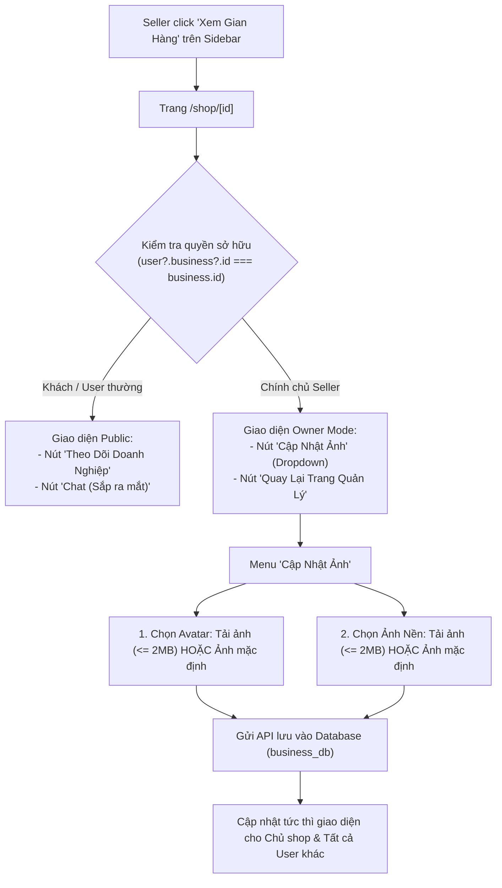

# ĐẶC TẢ TÍNH NĂNG: XEM GIAN HÀNG & QUẢN TRỊ BRANDING GIAN HÀNG CỦA SELLER (SEEN MY FAIR / MY STORE)

> **Tài liệu quy chuẩn yêu cầu & đặc tả kỹ thuật tính năng "Xem Gian Hàng"**  
> **Dự án:** HUKI EBOOK Platform  
> **Trạng thái:** Đặc tả chuẩn để thực hiện (Specification & Implementation Standards)  
> **Nguyên tắc bất di bất dịch:**  
> 1. Tái sử dụng tối đa component, icon, bảng màu và design tokens có sẵn của dự án.  
> 2. Code bám sát cấu trúc hiện tại của dự án, tuyệt đối không tự chế giao diện hoặc phỏng đoán.  
> 3. Phần nào còn phân vân hoặc chưa rõ ràng thì bắt buộc phải hỏi lại người dùng, không tự ý đưa ra giả định.  
> 4. Tuyệt đối không làm ảnh hưởng đến các giao diện và tính năng không liên quan khác trong toàn bộ hệ thống.

---

## I. MỤC TIÊU & TỔNG QUAN Ý MUỐN CỦA NGƯỜI DÙNG

1. **Admin Seller (Sidebar)**:
   - Thêm mục điều hướng có tên chính xác là **"Xem Gian Hàng"**.
   - Khi Seller bấm vào mục này, hệ thống sẽ lập tức chuyển hướng sang trang gian hàng công khai của chính seller đó: `http://localhost:3100/shop/[slug_hoặc_id_của_seller]`.

2. **Trang Gian Hàng (`/shop/[id]`) - Nhận diện & Chuyển đổi giao diện theo vai trò**:
   - **Khách hàng / User thông thường / Seller khác xem gian hàng**:
     - Giữ nguyên giao diện công khai hiện tại: Nút *Theo Dõi Doanh Nghiệp*, nút *Chat (Sắp ra mắt)*, danh mục sách và thông tin cửa hàng.
   - **Chính chủ Gian Hàng (Seller đang đăng nhập là chủ sở hữu của shop đó)**:
     - **Thứ nhất**: Thay thế 2 nút *"Theo dõi doanh nghiệp"* và *"Chat (Sắp ra mắt)"* bằng 2 nút quản trị:
       1. **Nút "Cập nhật ảnh"** (Có menu dropdown khi hover/click):
          - **Lựa chọn 1: Chọn Avatar (Logo gian hàng)**:
            - Cho phép seller đổi ảnh avatar bằng việc tải ảnh từ thiết bị cá nhân.
            - Ràng buộc kỹ thuật: **Dung lượng tối đa của tệp ảnh là 2MB** (Validate định dạng ảnh & kiểm tra kích thước $\le 2\text{MB}$, thông báo toast lỗi nếu vượt quá).
            - Cho phép chọn **"Ảnh mặc định"** nếu không muốn đặt ảnh avatar riêng.
          - **Lựa chọn 2: Chọn Ảnh nền (Banner gian hàng)**:
            - Cho phép seller đổi ảnh nền bằng việc tải ảnh từ thiết bị cá nhân.
            - Ràng buộc kỹ thuật: **Dung lượng tối đa của tệp ảnh là 2MB** (Validate định dạng ảnh & kiểm tra kích thước $\le 2\text{MB}$, thông báo toast lỗi nếu vượt quá).
            - Cho phép chọn **"Ảnh mặc định"** nếu không muốn đặt ảnh nền riêng.
       2. **Nút "Quay lại trang quản lý"**:
          - Bấm vào sẽ chuyển hướng quay trở lại trang quản trị Seller (`/seller/dashboard` hoặc `/seller/products`).
     - **Thứ hai**: **Bỏ phần "Voucher ưu đãi dành riêng cho bạn"** (khối dữ liệu mock) để trang gọn gàng, đúng thực tế dự án.
     - **Thứ ba (Đồng bộ dữ liệu thời gian thực & Lưu trữ DB)**:
       - Khi đổi ảnh avatar hoặc ảnh nền thành công, dữ liệu được cập nhật trực tiếp vào cơ sở dữ liệu Backend (`business_db` &rarr; bảng `Store` / `Business`).
       - Thay đổi lập tức được phản ánh trên giao diện của Seller và hiển thị đồng bộ cho toàn bộ người dùng, độc giả và các seller khác khi truy cập vào trang gian hàng đó.

---

## II. CHI TIẾT GIAO DIỆN & TRẢI NGHIỆM NGƯỜI DÙNG (UI/UX)



### 1. Menu Sidebar Admin Seller (`SellerSidebar.tsx`)
* **Vị trí**: Đặt trong nhóm **`CỬA HÀNG & NHÂN SỰ`** (hoặc vị trí liên quan đến cửa hàng).
* **Tên hiển thị**: **`Xem Gian Hàng`**.
* **Icon**: `storefront` (Material Symbols).
* **Đường dẫn đích**: `/shop/${currentBizSlug || currentBizId}` (tự động lấy slug hoặc ID từ `user?.business` hoặc `activeBusinessId`).
* **Hành vi**: Mở trang gian hàng của chính seller một cách mượt mà.

---

### 2. Header Gian Hàng Tại Trang `/shop/[id]` Phía Chủ Shop

#### A. Xác định vai trò chủ shop (`isOwner`)
* Logic so khớp:
  ```typescript
  const isOwner = Boolean(
    user && business && (
      user.business?.id === business.id ||
      user.business?.slug === businessSlugOrId ||
      business.ownerId === user.id ||
      activeBusinessId === business.id
    )
  );
  ```

#### B. Cụm nút hành động phía trên bên phải của Banner / Header
* **Khi `isOwner === false` (Khách / User khác)**:
  - Hiển thị nút: `[Theo Dõi Doanh Nghiệp]` và `[Chat — Sắp Ra Mắt]`.
* **Khi `isOwner === true` (Chính chủ Seller)**:
  - Ẩn hoàn toàn nút Theo Dõi và Chat.
  - Hiển thị 2 nút chuẩn phong cách HUKI:
    1. **Nút "Cập nhật ảnh"** (`photo_camera` hoặc `palette`):
       - Thiết kế: Nút có icon và mũi tên dropdown `expand_more`.
       - Khi hover (hoặc bấm): Mở menu dropdown nổi lên gồm 2 mục:
         - **Mục 1: "Ảnh Đại Diện (Logo)"**
           - Thao tác 1: `Tải ảnh từ máy...` (Mở hộp thoại chọn tệp).
           - Thao tác 2: `Dùng ảnh mặc định` (Khôi phục avatar mặc định).
         - **Mục 2: "Ảnh Bìa Gian Hàng (Banner)"**
           - Thao tác 1: `Tải ảnh từ máy...` (Mở hộp thoại chọn tệp).
           - Thao tác 2: `Dùng ảnh mặc định` (Khôi phục banner mặc định).
    2. **Nút "Quay lại trang quản lý"** (`dashboard` hoặc `arrow_back`):
       - Thiết kế: Nút bo tròn viền xám tinh tế, có icon và text rõ ràng.
       - Khi bấm: Điều hướng về `/seller/dashboard` hoặc `/seller/products`.

#### C. Validation & Xử lý Tệp Tải Lên
* **Định dạng cho phép**: Hình ảnh (`image/png`, `image/jpeg`, `image/webp`, `image/jpg`).
* **Kích thước tối đa**: **`2MB`** ($2 \times 1024 \times 1024$ bytes = $2,097,152$ bytes).
* **Xử lý lỗi**:
  - Nếu tệp vượt quá 2MB: Không gửi request, hiển thị thông báo lỗi `showToast('Dung lượng ảnh vượt quá giới hạn 2MB. Vui lòng chọn ảnh nhẹ hơn!', 'error')`.
  - Nếu tệp không phải định dạng ảnh hợp lệ: `showToast('Vui lòng chọn tệp hình ảnh hợp lệ (PNG, JPG, WEBP).', 'error')`.

---

### 3. Loại Bỏ Khối Voucher Mock
* **Xóa bỏ toàn bộ section `Store Vouchers Section`** (tiêu đề *"Voucher Ưu Đãi Dành Riêng Cho Bạn"* và 4 card voucher tĩnh) trong file `web/src/app/shop/[id]/page.tsx`.
* Giữ lại các khối nội dung thật: Banner, Logo, Tên doanh nghiệp, Đánh giá, Số đầu sách, Bộ lọc danh mục, Tabs sách và Danh sách thẻ sách (`BookCard`).

---

## III. ĐẶC TẢ KỸ THUẬT BACKEND & LƯU TRỮ DỮ LIỆU

### 1. Cơ Sở Dữ Liệu (`business_db` / Prisma Schema)
- Bảng **`Store`**:
  - `logo String?`: Lưu đường dẫn URL ảnh đại diện gian hàng.
  - `banner String?`: Lưu đường dẫn URL ảnh nền gian hàng.
- Bảng **`Business`**:
  - Lưu trữ thông tin pháp nhân và quan hệ `stores Store[]`.

### 2. API Endpoints
1. **Lấy thông tin Gian hàng**:
   - `GET /api/v1/businesses/slug/:slug` hoặc `GET /api/v1/businesses/:id` &rarr; Trả về dữ liệu `logo`, `banner` của doanh nghiệp/gian hàng.
2. **Cập nhật Ảnh Avatar / Banner (Seller)**:
   - Sử dụng endpoint cập nhật cửa hàng `PATCH /api/v1/stores/:id` hoặc `PATCH /api/v1/businesses/:id`:
     - Khi đổi sang ảnh mới: Cập nhật URL ảnh mới vào trường `logo` hoặc `banner`.
     - Khi chọn "Ảnh mặc định": Đặt giá trị trường `logo` hoặc `banner` về `null` (hoặc chuỗi rỗng / URL default của hệ thống).
3. **Lưu trữ Tệp (Storage)**:
   - Sử dụng kênh upload Cloudinary / Storage có sẵn của dự án hoặc Data URL / CDN chuẩn để đảm bảo ảnh được lưu trữ an toàn, truy cập vĩnh viễn và tải nhanh.

---

## IV. ĐỀ XUẤT THIẾT KẾ & QUY TRÌNH THỰC HIỆN

| Bước | Hạng Mục | Chi Tiết Thực Hiện | Tệp Tin Liên Quan |
| :---: | :--- | :--- | :--- |
| **1** | **Sidebar Seller** | Thêm menu item **"Xem Gian Hàng"** dẫn đến link `/shop/[slug]` của seller hiện tại. | `web/src/ui/components/layout/SellerSidebar.tsx` |
| **2** | **Loại Bỏ Mock** | Xóa bỏ khối section *"Voucher Ưu Đãi Dành Riêng Cho Bạn"* khỏi trang Shop. | `web/src/app/shop/[id]/page.tsx` |
| **3** | **Nhận Diện Chủ Shop** | Viết hook so khớp quyền `isOwner` từ `useAuth()`. | `web/src/app/shop/[id]/page.tsx` |
| **4** | **Nút Hành Động & Dropdown** | Tạo 2 nút *"Cập nhật ảnh"* (kèm dropdown đổi avatar / đổi banner $\le 2\text{MB}$ hoặc chọn ảnh mặc định) và *"Quay lại trang quản lý"*. | `web/src/app/shop/[id]/page.tsx` |
| **5** | **Xử Lý Upload & API** | Xử lý chọn tệp, validate dung lượng 2MB, gửi request cập nhật vào DB, cập nhật state tức thì. | `web/src/ui/api/businessApi.ts`, `platform/apps/business-service` |
| **6** | **Kiểm Thử Toàn Diện** | Chạy `npm run typecheck`, kiểm tra build backend, test tải ảnh $\le 2\text{MB}$, test chặn ảnh $> 2\text{MB}$, test nút mặc định, test đồng bộ giao diện cho cả seller và user. | Toàn hệ thống |

---

## V. CÁC ĐIỀU KHOẢN RÀNG BUỘC KHI TRIỂN KHAI

1. **Tuân thủ thiết kế hiện tại**:
   - Nút bấm, dropdown menu, icon, màu sắc và typography phải đồng bộ 100% với hệ thống Design System của HUKI (sử dụng icon Material Symbols, màu `#006953`, các class Tailwind có sẵn trong dự án).
2. **Không tự chế hoặc dự đoán**:
   - Nếu gặp bất kỳ trường hợp ngoại lệ nào (ví dụ seller chưa có slug, doanh nghiệp có nhiều hơn 1 store con...), phải trao đổi và hỏi ý kiến người dùng trước khi quyết định phương án xử lý.
3. **Bảo vệ tính toàn vẹn hệ thống**:
   - Tuyệt đối không thay đổi luồng mua hàng, giỏ hàng, chi tiết sách hay trang admin của sàn.
   - Giữ nguyên trạng thái hiển thị của các thành phần công khai khác.
