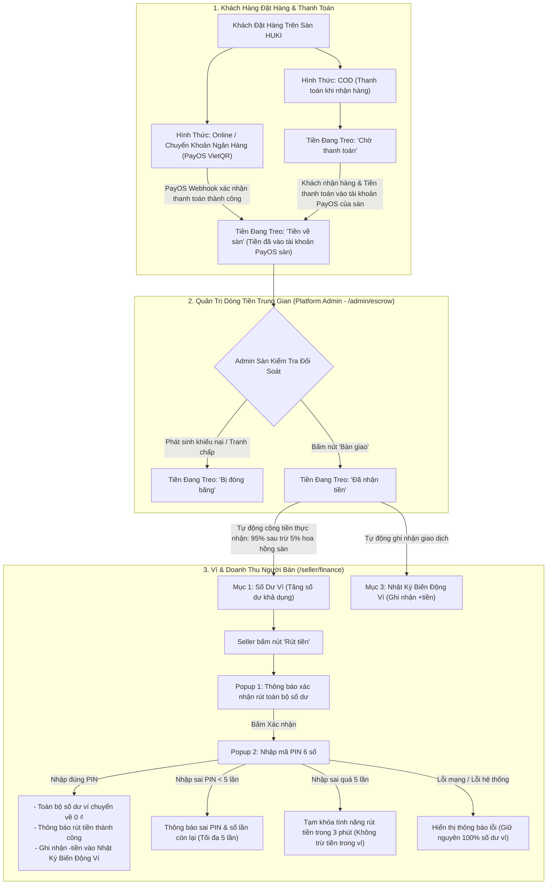
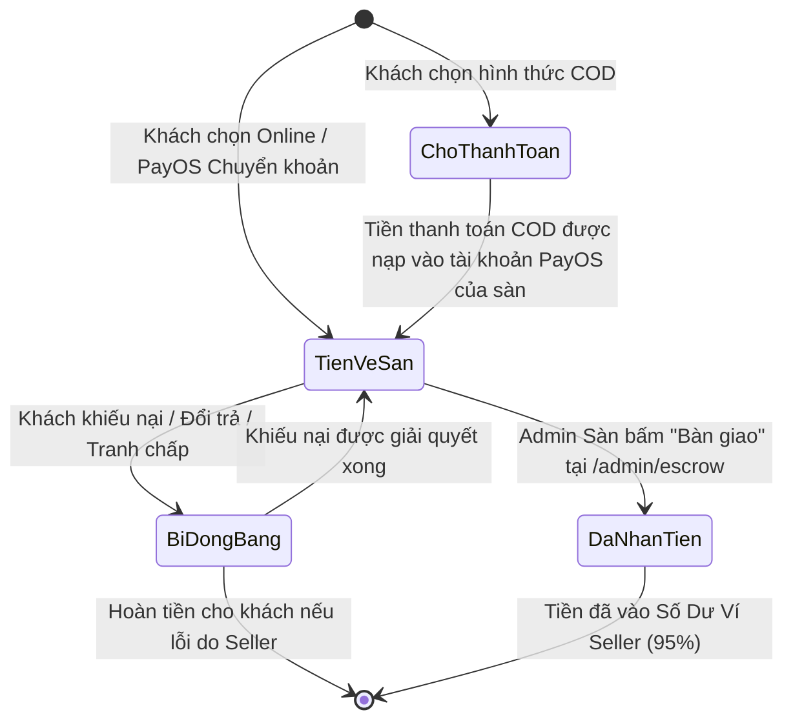

# ĐẶC TẢ TÍNH NĂNG: ĐỒNG NHẤT XỬ LÝ DÒNG TIỀN THANH TOÁN (PAYOS), TIỀN ĐANG TREO, VÍ GIAN HÀNG & BẢO MẬT MÃ PIN RÚT TIỀN

> **Tài liệu quy chuẩn yêu cầu & đặc tả kỹ thuật tính năng "Xử Lý Dòng Tiền Thanh Toán PayOS, Ký Quỹ Tiền Đang Treo & Rút Tiền Bảo Mật Gian Hàng"**  
> **Dự án:** HUKI EBOOK Platform  
> **Mã đặc tả:** `UPDATE_PROCEED_MONEY_FLOW_V1`  
> **Tệp quy chuẩn:** `platform/require_feature/update_proceed_money_flow_v1.md`  
> **Nguyên tắc bất di bất dịch:**  
> 1. **Tái sử dụng tối đa** các component, icon, màu sắc và Design Tokens sẵn có của dự án.  
> 2. **Code bám sát giao diện, theme, style và màu sắc hiện tại** (Emerald `#003b2b` / `#006953`, Dark Slate, các thẻ trạng thái bo tròn chuẩn hệ thống).  
> 3. **Vấn đề nào chưa rõ hoặc còn phân vân bắt buộc phải hỏi lại người dùng**, tuyệt đối không tự ý suy đoán, tự chế hoặc tự quyết định.  
> 4. **TUYỆT ĐỐI KHÔNG LÀM ẢNH HƯỞNG ĐẾN CÁC TÍNH NĂNG VÀ GIAO DIỆN KHÔNG LIÊN QUAN** (Đảm bảo giữ nguyên vẹn 100% hoạt động của các module khác như: Giỏ hàng, Quá trình đặt hàng / Checkout của khách hàng, Quản lý sách/sản phẩm, Quản lý danh mục, Quản lý tài khoản User, Trang chủ, v.v.).  
> 5. **Kiểm tra và xây dựng dựa trên dữ liệu thật, cổng thanh toán PayOS thật, cơ sở dữ liệu thật và tiến trình thật** của dự án.

---

## I. MỤC TIÊU & TỔNG QUAN HỆ THỐNG DÒNG TIỀN (PAYOS GATEWAY)

Chuyển đổi toàn diện cơ chế quản lý dòng tiền của Người Bán (**Admin Seller - `/seller/finance`**) sang mô hình **Quản lý dòng tiền minh bạch, tự động hóa và bảo đảm an toàn qua Cổng thanh toán PayOS & Quỹ ký quỹ sàn**:



---

## II. QUY TẮC DÒNG TIỀN VÀO TÀI KHOẢN PAYOS CỦA SÀN

### 1. Cổng thanh toán Online: PayOS & Chuyển khoản ngân hàng (VietQR)
* Dự án HUKI EBOOK hiện đang tích hợp trực tiếp cổng thanh toán **PayOS** (hỗ trợ chuyển khoản ngân hàng qua mã VietQR động 24/7).
* Khi khách thanh toán qua PayOS thành công $\rightarrow$ Webhook của PayOS xác nhận tiền đã vào tài khoản PayOS của sàn $\rightarrow$ Trạng thái của món hàng/đơn hàng trong mục **"Tiền Đang Treo"** lập tức chuyển thành **`Tiền về sàn`**.

### 2. Hình thức COD (Thanh toán khi nhận hàng):
* Về mặt nghiệp vụ: Shipper giao hàng và thu tiền mặt từ người mua.
* **Nguyên tắc kỹ thuật cốt lõi:** Việc đơn vị vận chuyển chuyển tiền cho sàn là quy trình hình thức; **chỉ cần dòng tiền từ thanh toán được ghi nhận nạp thành công vào tài khoản PayOS của sàn** thì hệ thống sẽ tự động chuyển trạng thái đơn hàng từ **`Chờ thanh toán`** sang **`Tiền về sàn`**.

---

## III. ĐẶC TẢ CHI TIẾT CÁC TAB TẠI TRANG QUẢN TRỊ TÀI CHÍNH (`/seller/finance`)

### 1. Tái cấu trúc thanh điều hướng Tab (Tabs Navigation)
* **Loại bỏ 2 tab cũ:** `Yêu Cầu Rút Tiền` và `Cơ Chế Quyết Toán`.
* **Cấu hình 3 tab chuẩn hóa:**
  1. **`Số Dư Ví` (Tab Mới):** Hiển thị tổng quan số dư ví, thông tin tài khoản ngân hàng thụ hưởng đã KYC và nút Rút Tiền.
  2. **`Tiền Đang Treo` (Tab Mới):** Bảng theo dõi chi tiết từng món hàng đang trong quỹ ký quỹ tạm giữ của sàn với 4 trạng thái dòng tiền.
  3. **`Nhật Ký Biến Động Ví`:** Lịch sử biến động cộng/trừ tiền theo thời gian thực chuẩn kế toán kép.

---

### 2. Tab 1: "Số Dư Ví" & Quy Trình Rút Tiền Bảo Mật

#### A. Giao diện hiển thị:
* **Card Số Dư Khả Dụng (Main Balance Card):**
  - Hiển thị số tiền hiện đang có trong ví (VD: `1.850.000 ₫`).
  - Màu sắc chủ đạo: Emerald/Green (`text-emerald-700`, `bg-white`, viền `border-emerald-300`).
* **Card Thông Tin Tài Khoản Thụ Hưởng (Đã Xác Thực KYC Doanh Nghiệp):**
  - Ngân hàng, Số tài khoản (đã mask hoặc hiển thị đầy đủ), Tên chủ tài khoản (đồng bộ theo Tên Pháp Nhân).
* **Nút Rút Tiền:**
  - Nhãn: `[Rút Tiền Về Ngân Hàng]`.
  - Icon: `outbox` hoặc `account_balance_wallet`.
  - Trạng thái disable nếu số dư ví bằng `0 ₫`.

#### B. Quy trình Popup Rút Tiền (2 Bước):
1. **Popup Bước 1 (Xác nhận rút tiền):**
   - Tiêu đề: `Xác Nhận Rút Tiền Về Tài Khoản Ngân Hàng`.
   - Nội dung: Hiển thị tổng số tiền sẽ rút (**toàn bộ số dư ví hiện có**) và thông tin tài khoản ngân hàng nhận tiền.
   - 2 Nút hành động: `Hủy` và `Xác Nhận Rút Tiền`.
2. **Popup Bước 2 (Nhập Mã PIN Bảo Mật 6 Số):**
   - Tiêu đề: `Nhập Mã PIN Giao Dịch Gian Hàng`.
   - Giao diện: 6 ô nhập số độc lập, tự động chuyển con trỏ khi gõ, hỗ trợ phím xóa lùi (Backspace).
   - Chú thích: *Nhập mã PIN 6 số của gian hàng để hoàn tất lệnh rút tiền.*

#### C. Xử lý các kịch bản Mã PIN & Rút tiền:
* **Kịch bản 1 - Nhập đúng mã PIN:**
  - Hệ thống thực hiện trừ toàn bộ số dư khả dụng trong ví về **`0 ₫`**.
  - Hiển thị thông báo thành công: *"Đã rút thành công [Số tiền] ₫ về tài khoản ngân hàng!"*.
  - Tự động ghi nhận 1 bản ghi giao dịch loại `DEBIT_AVAILABLE` (Khấu trừ rút tiền) trong tab **Nhật Ký Biến Động Ví**.
* **Kịch bản 2 - Nhập sai mã PIN (dưới 5 lần):**
  - Đếm số lần nhập sai liên tiếp.
  - Hiển thị thông báo lỗi màu đỏ: *"Mã PIN không chính xác. Bạn còn X lần thử lại (tối đa 5 lần)."*
  - Xóa 6 ô nhập và tự động focus lại ô đầu tiên.
* **Kịch bản 3 - Nhập sai mã PIN quá 5 lần liên tiếp:**
  - Hệ thống tự động **Tạm khóa tính năng rút tiền trong đúng 3 phút** (`180 giây`).
  - Hiển thị giao diện khóa bảo mật kèm đồng hồ đếm ngược thời gian mở khóa.
  - **Tuyệt đối không trừ bất kỳ khoản tiền nào trong ví.**
* **Kịch bản 4 - Lỗi hệ thống / Mất kết nối:**
  - Nếu xảy ra lỗi mạng hoặc máy chủ không phản hồi, hiển thị popup thông báo lỗi.
  - **Giữ nguyên 100% số dư trong ví, không được trừ tiền khi chưa hoàn tất giao dịch.**

---

### 3. Tab 2: "Tiền Đang Treo" (Seller Escrow Holding)

#### A. Mục đích & Nguyên tắc:
* Khi khách hàng mua sách và thanh toán, toàn bộ tiền thanh toán sẽ được lưu giữ tại **Tài khoản tạm PayOS** của sàn để bảo vệ giao dịch.
* **Phí hoa hồng của sàn:** Mặc định cố định là **`5%`** trên giá trị món hàng/đơn hàng.
* Doanh thu thực nhận của Người Bán sau khi sàn bàn giao:  
  $$\text{Doanh Thu Thực Nhận} = \text{Thành Tiền Món Hàng} \times (1 - 0.05) = 95\% \times \text{Thành Tiền}$$

#### B. Bảng hiển thị Tiền Đang Treo:
Hiển thị cấu trúc cột đồng nhất với bảng của trang Quản trị Escrow ([`AdminEscrowView.tsx`](file:///d:/doan_huki_ebook/huki-ebook/web/src/ui/components/admin/AdminEscrowView.tsx)):

| STT | Tên Cột | Kiểu Dữ Liệu | Diễn Giải & Quy Cách Hiển Thị |
| :---: | :--- | :--- | :--- |
| **1** | **Mã Đơn Hàng** | Text / Link | Mã đơn (VD: `DH-2026-9812`), bấm để xem chi tiết đơn. |
| **2** | **Ngày Giờ Tạo Đơn** | Date Time | Chuẩn Việt Nam `DD/MM/YYYY HH:mm` (GMT+7). |
| **3** | **Khách Hàng** | Text | Tên người nhận hàng / người mua (hỗ trợ hover tooltip). |
| **4** | **SĐT Khách** | Text / Mono | Số điện thoại liên hệ nhận hàng. |
| **5** | **Mã Sản Phẩm** | Text / Mono | Mã SKU/UUID của cuốn sách. |
| **6** | **Tên Sách** | Text | Tên ấn phẩm (sách giấy / ebook). |
| **7** | **Số Lượng** | Number | Số lượng cuốn mua trong đơn. |
| **8** | **Đơn Giá** | Currency | Giá bán niêm yết của 1 cuốn (₫). |
| **9** | **Thành Tiền** | Currency | Tổng giá trị món hàng = $\text{Số lượng} \times \text{Đơn giá}$ (₫). |
| **10** | **Phí Sàn (5%)** | Currency | Phí hoa hồng sàn thu = $5\% \times \text{Thành tiền}$ (₫). |
| **11** | **Thực Nhận (95%)** | Currency | Tiền Seller sẽ nhận được vào ví khi bàn giao (₫). |
| **12** | **Trạng Thái Dòng Tiền** | Badge | 1 trong 4 trạng thái quy chuẩn bên dưới. |

#### C. 4 Trạng Thái Quy Chuẩn Của Mục "Tiền Đang Treo":



1. **`Chờ thanh toán`** (Badge Vàng Cam - `bg-amber-100 text-amber-800`):
   - Kích hoạt khi khách đặt hàng bằng hình thức **COD** và tiền thanh toán chưa được ghi nhận vào tài khoản PayOS của sàn.
2. **`Tiền về sàn`** (Badge Xanh Dương - `bg-blue-100 text-blue-800`):
   - Kích hoạt ngay lập tức khi khách thanh toán thành công qua **Cổng thanh toán PayOS** (VietQR / Chuyển khoản ngân hàng).
   - HOẶC khi đơn hàng COD đã hoàn tất và tiền thanh toán đã được ghi nhận vào tài khoản PayOS của sàn.
3. **`Đã nhận tiền`** (Badge Xanh Lá Emerald - `bg-emerald-100 text-emerald-800`):
   - Kích hoạt khi Platform Admin bấm nút **"Bàn giao"** (Release) tại trang [`/admin/escrow`](file:///d:/doan_huki_ebook/huki-ebook/web/src/ui/components/admin/AdminEscrowView.tsx).
   - Lúc này: Dòng tiền được giải ngân, tự động cộng $95\%$ doanh thu vào **Số Dư Ví** của Seller và ghi nhận 1 dòng giao dịch trong **Nhật Ký Biến Động Ví**.
4. **`Bị đóng băng`** (Badge Đỏ Hồng - `bg-rose-100 text-rose-800`):
   - Kích hoạt khi đơn hàng phát sinh yêu cầu khiếu nại, khiếu kiện, yêu cầu trả hàng/hoàn tiền từ phía người mua để Ban quản trị sàn xử lý trọng tài.

---

### 4. Tab 3: "Nhật Ký Biến Động Ví" (Wallet Transaction Ledger)
* Hiển thị bảng lịch sử biến động số dư theo thứ tự thời gian mới nhất lên đầu.
* **Các loại giao dịch ghi nhận:**
  1. **Cộng tiền doanh thu bán hàng:** *"Sàn bàn giao tiền bán [Tên sách] - Đơn hàng #[Mã đơn] (+[Số tiền] ₫)"*.
  2. **Trừ tiền rút về ngân hàng:** *"Rút tiền về tài khoản ngân hàng [Tên NH] STK [Số TK] (-[Số tiền] ₫)"*.
* Hiển thị rõ: **Thời gian**, **Loại giao dịch**, **Số tiền biến động (+/-)**, **Số dư khả dụng Trước $\rightarrow$ Sau**.

---

## IV. QUY CHUẨN MÃ PIN GIAO DỊCH GIAN HÀNG

### 1. Phân định độc lập 2 loại mã trong hệ thống:
* **Mật khẩu / PIN tài khoản cá nhân User:** Dùng cho thao tác tài khoản cá nhân (đăng nhập, đổi thông tin cá nhân).
* **Mã PIN Rút Tiền Gian Hàng (Store Withdrawal PIN):** Gồm **6 chữ số** do Người bán thiết lập riêng cho gian hàng, dùng để bảo vệ tất cả các giao dịch rút tiền từ ví doanh nghiệp về tài khoản ngân hàng.

### 2. Quy chuẩn thiết lập Mã PIN:
* **Đối với các tài khoản/cửa hàng hiện đang có sẵn trong CSDL:**
  - Thiết lập mã PIN mặc định là: **`123456`** (được hash bảo mật bằng thuật toán `bcrypt` trong bảng `wallet_securities`).
* **Đối với các tài khoản đăng ký lên cửa hàng mới sau này:**
  - Bổ sung bước thiết lập mã PIN trong Form Đăng Ký Người Bán tại `/seller/register` (trong **Bước 3: Thông tin tài khoản ngân hàng & bảo mật đối soát**).
  - Gồm 2 ô: `Mã PIN rút tiền (6 số)` và `Xác nhận lại mã PIN (6 số)`.
  - Bắt buộc nhập đủ 6 ký tự số và 2 ô phải trùng khớp nhau $100\%$.
  - Khi hồ sơ được duyệt, hệ thống tự động lưu mã PIN này vào hồ sơ bảo mật ví của gian hàng mới.

---

## V. THIẾT KẾ KỸ THUẬT & CƠ SỞ DỮ LIỆU

### 1. Cơ sở dữ liệu (`commerce-service/prisma/schema.prisma`)
Tận dụng tối đa các bảng dữ liệu sẵn có trong hệ thống:

```prisma
model Wallet {
  id               String              @id @default(uuid())
  storeId          String              @unique @map("store_id")
  ownerUserId      String              @map("owner_user_id")
  availableBalance Decimal             @default(0) @map("available_balance") @db.Decimal(15, 2)
  pendingBalance   Decimal             @default(0) @map("pending_balance") @db.Decimal(15, 2)
  frozenBalance    Decimal             @default(0) @map("frozen_balance") @db.Decimal(15, 2)
  currency         String              @default("VND")
  ...
  transactions     WalletTransaction[]
  security         WalletSecurity?
}

model WalletSecurity {
  id             String    @id @default(uuid())
  walletId       String    @unique @map("wallet_id")
  storeId        String    @unique @map("store_id")
  pinHash        String?   @map("pin_hash")          // Hash bcrypt mã PIN 6 số
  failedAttempts Int       @default(0) @map("failed_attempts") // Số lần nhập sai liên tiếp
  lockedUntil    DateTime? @map("locked_until")      // Khóa 3 phút nếu sai quá 5 lần
  ...
}

model WalletTransaction {
  id              String                @id @default(uuid())
  walletId        String                @map("wallet_id")
  type            WalletTransactionType // CREDIT_AVAILABLE, DEBIT_AVAILABLE,...
  amount          Decimal               @db.Decimal(15, 2)
  availableBefore Decimal               @map("available_before") @db.Decimal(15, 2)
  availableAfter  Decimal               @map("available_after") @db.Decimal(15, 2)
  description     String?
  referenceType   String?               @map("reference_type") // 'ORDER_ESCROW_RELEASE', 'WALLET_WITHDRAWAL'
  referenceId     String?               @map("reference_id")
  createdAt       DateTime              @default(now()) @map("created_at")
}
```

### 2. Cấu hình Tham số Hệ thống (`platform/libs/shared/src/config/policy-config.defaults.ts`)
* Cập nhật tỷ lệ hoa hồng sàn chuẩn:
  ```typescript
  export const DEFAULT_POLICY_CONFIG: Readonly<IPolicyConfig> = {
    ...
    platformCommissionPercent: 5, // 5% phí hoa hồng sàn
    commissionCalculationBasis: 'NET_PAID',
    ...
  };
  ```

### 3. Backend Services & APIs Cần Triển Khai (`commerce-service`)

1. **API Lấy Tiền Đang Treo Của Gian Hàng:**
   - Endpoint: `GET /orders/seller/escrow/items`
   - Trả về danh sách từng món hàng thuộc quyền sở hữu của `storeId` đang đăng nhập kèm đầy đủ thông tin: Mã đơn, ngày tạo, khách hàng, SĐT, mã sách, tên sách, số lượng, đơn giá, thành tiền, phí sàn 5%, thực nhận 95%, và 4 trạng thái dòng tiền tiếng Việt (`Chờ thanh toán`, `Tiền về sàn`, `Đã nhận tiền`, `Bị đóng băng`).
2. **API Admin Bàn Giao Dòng Tiền & Tự Động Cộng Vào Ví:**
   - Endpoint: `PATCH /orders/admin/escrow/items/:orderItemId/status` với `{ status: 'RELEASED' }`.
   - Logic: Tự động tính tiền thực nhận ($95\%$), cộng vào `availableBalance` của `Wallet` tương ứng của Seller, tạo `WalletTransaction` ghi nhận cộng tiền.
3. **API Rút Toàn Bộ Tiền Với Mã PIN 6 Số:**
   - Endpoint: `POST /wallet/stores/:storeId/withdraw-all`
   - Payload: `{ pin: string }`
   - Logic:
     - Kiểm tra nếu `lockedUntil > now`: Chặn và trả về số giây còn lại cần chờ.
     - So khớp mã PIN bằng `bcrypt.compare`.
     - Nếu sai: Tăng `failedAttempts`. Nếu `failedAttempts >= 5` $\rightarrow$ Đặt `lockedUntil = now + 3 phút`.
     - Nếu đúng: Đặt lại `failedAttempts = 0`, lấy toàn bộ số dư khả dụng trừ về `0 ₫`, tạo bản ghi `DEBIT_AVAILABLE` và phản hồi thành công.

---

## VI. TIÊU CHUẨN KIỂM THỬ & TIÊU CHÍ NGHIỆM THU (ACCEPTANCE CRITERIA)

- [ ] **Giao diện Tab `/seller/finance`:** Đã xóa bỏ 2 mục *Yêu Cầu Rút Tiền* và *Cơ Chế Quyết Toán*; hiển thị rõ ràng 3 mục: **`Số Dư Ví`**, **`Tiền Đang Treo`**, **`Nhật Ký Biến Động Ví`**.
- [ ] **Xử lý PayOS & Tiền Đang Treo:** 
  - Khách thanh toán online qua PayOS (VietQR) $\rightarrow$ Trạng thái món hàng lập tức là **`Tiền về sàn`** (tiền đã vào tài khoản PayOS của sàn).
  - Khách chọn COD $\rightarrow$ Trạng thái là **`Chờ thanh toán`**; khi tiền thanh toán được ghi nhận vào tài khoản PayOS của sàn $\rightarrow$ Chuyển thành **`Tiền về sàn`**.
- [ ] **Tính đúng tỷ lệ hoa hồng:** Bảng hiển thị tự động tính đúng Phí sàn 5% và Thực nhận 95%.
- [ ] **Bàn giao tiền từ Admin Sàn:** Khi Platform Admin bấm "Bàn giao" tại `/admin/escrow`, trạng thái tiền chuyển sang `Đã nhận tiền`, số dư ví Seller tự động tăng thêm $95\%$ giá trị món hàng và tab Nhật ký ghi nhận giao dịch cộng tiền.
- [ ] **Rút tiền & Xác thực PIN 6 số:**
  - Bấm Rút tiền $\rightarrow$ Hiện Popup xác nhận $\rightarrow$ Hiện Popup nhập PIN 6 số.
  - Các tài khoản hiện tại nhập **`123456`** rút tiền thành công, số dư ví chuyển về `0 ₫`, tab Nhật ký ghi nhận giao dịch trừ tiền.
  - Nhập sai PIN hiển thị thông báo lỗi và số lần còn lại (tối đa 5 lần).
  - Nhập sai quá 5 lần: Khóa chức năng rút tiền trong **3 phút**, không bị trừ tiền trong ví.
  - Lỗi mạng/lỗi hệ thống: Hiển thị thông báo lỗi, giữ nguyên $100\%$ số dư ví.
- [ ] **Đăng ký gian hàng mới (`/seller/register`):** Bổ sung ô nhập và xác nhận Mã PIN rút tiền 6 số; gian hàng sau khi đăng ký sẽ dùng chính mã PIN này để rút tiền.
- [ ] **Bảo toàn toàn diện hệ thống (Regression Check):** Tuyệt đối không làm ảnh hưởng, biến đổi hay phát sinh lỗi tại bất kỳ tính năng và giao diện không liên quan nào (Giỏ hàng, Checkout thanh toán của khách hàng, Quản lý kho sách, Quản lý danh mục, Quản lý tài khoản User, Trang chủ, v.v.).
