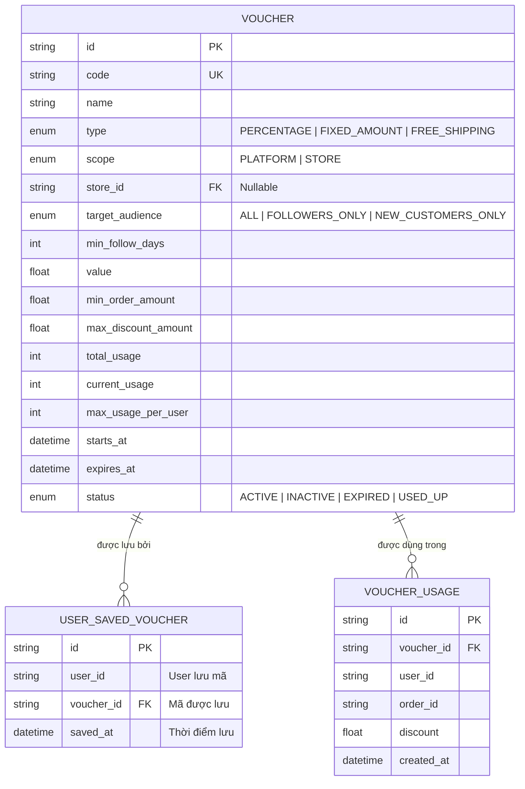

# ĐẶC TẢ TÍNH NĂNG & KẾ HOẠCH TRIỂN KHAI: NÂNG CẤP HỆ THỐNG VOUCHER V1 (HUKI VOUCHERS, SHOP VOUCHERS, VÍ VOUCHER & CHUẨN HÓA THANH TOÁN)

> **Tài liệu đặc tả yêu cầu nghiệp vụ, kiến trúc kỹ thuật và kế hoạch thực hiện chi tiết cho phân hệ Voucher V1**  
> **Dự án:** HUKI EBOOK Platform  
> **Vị trí tài liệu:** `platform/require_feature/update_voucher_v1.md`  
> **Trạng thái:** Kế hoạch thực hiện (Specification & Implementation Plan)  

---

## I. TỔNG QUAN YÊU CẦU NGHIỆP VỤ (BUSINESS REQUIREMENTS)

### 1. Mục "Voucher" Dành Riêng Cho Khách Hàng (Customer Voucher Center)
Khách hàng sẽ có một trang/mục chuyên biệt dành cho Voucher (truy cập tại `/vouchers` hoặc từ Menu Header/Tài khoản). Mục này được tổ chức thành **3 phân mục (Tab)** rõ ràng:

```
┌───────────────────────────────────────────────────────────────────────────────────┐
│                           TRANG MÃ GIẢM GIÁ & ƯU ĐÃI                              │
│                                                                                   │
│   [ TAB 1: HUKI VOUCHERS ]     [ TAB 2: SHOP VOUCHERS ]     [ TAB 3: VÍ VOUCHER ] │
└───────────────────────────────────────────────────────────────────────────────────┘
```

#### A. Tab 1: HUKI Vouchers (Voucher Do Sàn Huki Tạo - `scope = PLATFORM`)
* **Nguồn dữ liệu:** Chỉ hiển thị các voucher do Ban Quản Trị Sàn Huki tạo (`scope = PLATFORM`).
* **Quy tắc hiển thị & Quyền hạn (Eligibility):**
  * Hệ thống tự động kiểm tra điều kiện của người dùng đang đăng nhập (ví dụ: `ALL` - tất cả khách hàng, `NEW_CUSTOMERS_ONLY` - khách hàng mới chưa từng có đơn hàng thành công trên sàn).
  * **Chỉ những khách hàng ĐỦ ĐIỀU KIỆN mới được nhìn thấy, bấm "Lưu mã" và sử dụng các voucher này.**
  * Khách hàng không đủ điều kiện (hoặc chưa đăng nhập đối với mã yêu cầu điều kiện) sẽ không nhìn thấy mã đó.

#### B. Tab 2: Shop Vouchers (Voucher Do Các Gian Hàng Tạo - `scope = STORE`)
* **Nguồn dữ liệu:** Chỉ hiển thị các voucher do các Cửa hàng/Gian hàng tạo (`scope = STORE`).
* **Bố cục & Quy tắc nhóm (Group by Store):**
  * Các voucher được **sắp xếp, gom nhóm và phân chia rõ ràng theo từng Cửa hàng tương ứng**, tuyệt đối không gộp chung lộn xộn.
  * Mỗi Cửa hàng là một khối (Card/Section) có đầy đủ: Avatar Shop, Tên Shop, Huy hiệu theo dõi (nếu có), nút "Ghé Shop" và danh sách các mã giảm giá của riêng shop đó.
* **Quy tắc hiển thị & Quyền hạn (Eligibility):**
  * Chỉ khách hàng **đủ điều kiện** mới được nhìn thấy và bấm "Lưu mã".
  * Điều kiện bao gồm:
    * `ALL`: Mọi khách hàng.
    * `FOLLOWERS_ONLY`: Khách hàng đã nhấn Theo dõi Shop. Nếu có yêu cầu số ngày gắn bó (`minFollowDays`):
      * 0 ngày: Mọi người theo dõi (Fan Đồng).
      * 30 ngày+: Fan Bạc (Gắn bó từ 1 tháng).
      * 90 ngày+: Fan Vàng (Gắn bó từ 3 tháng).
      * 365 ngày+: Fan Kim Cương (Gắn bó từ 1 năm).
    * `NEW_CUSTOMERS_ONLY`: Khách hàng chưa từng có đơn mua thành công tại gian hàng đó.

#### C. Tab 3: Ví Voucher (Ví Của Tôi - My Voucher Wallet)
* **Nội dung:** Hiển thị toàn bộ các voucher mà khách hàng **đã nhấn "Lưu" (Claimed/Saved)** vào ví của tài khoản.
* **Điều kiện hiển thị trong Ví:**
  * Voucher **bắt buộc còn thời hạn sử dụng** (`startsAt <= now <= expiresAt`), trạng thái `ACTIVE`, chưa hết tổng lượt phát hành của mã (`currentUsage < totalUsage`) và chưa vượt quá số lần sử dụng cho phép của cá nhân user (`userUsage < maxUsagePerUser`).
* **Cấu trúc phân cấp & sắp xếp trong Ví:**
  * **Cấp 1 (Bên trên) - HUKI VOUCHER (Voucher Sàn):** Được chia tách làm 2 nhóm rõ rệt:
    1. 🚚 **Freeship (Miễn phí vận chuyển):** Các mã trợ giá / miễn phí ship toàn sàn (`type = FREE_SHIPPING`).
    2. 🏷️ **Discount (Giảm giá / Chiết khấu):** Các mã giảm giá tiền mặt hoặc theo phần trăm đơn hàng (`type = PERCENTAGE` hoặc `FIXED_AMOUNT`).
  * **Cấp 2 (Bên dưới) - SHOP VOUCHER (Voucher Cửa hàng):**
    * Gom nhóm theo từng Cửa hàng để người mua dễ dàng nhận biết mã của shop nào.

---

### 2. Cơ Chế Bắt Buộc "Lưu Vào Ví Mới Được Sử Dụng" (Mandatory Save to Wallet Rule)

1. **Hiển thị Voucher & Nút "Lưu":**
   * Khi Cửa hàng tạo voucher tại trang Quản lý Khuyến mãi Seller (`/seller/promotions/vouchers`):
     * Voucher đó sẽ xuất hiện tại mục **Shop Vouchers** trong Trang Voucher của khách hàng.
     * Voucher đó cũng sẽ hiển thị tại **Trang chi tiết gian hàng của Shop** (`/shop/[id]`).
     * Mỗi voucher luôn đi kèm nút **"Lưu mã"** (hoặc hiển thị **"Đã lưu"** nếu đã nằm trong ví).
2. **Hành vi khi bấm "Lưu":**
   * Hệ thống ghi nhận vào cơ sở dữ liệu `user_saved_vouchers` gắn chặt với `userId` của khách hàng.
   * Mã lập tức xuất hiện trong **Ví Voucher** của khách hàng.
3. **Ràng buộc an toàn cốt lõi khi thanh toán:**
   * 🔒 **CHỈ VOUCHER NÀO ĐÃ NẰM TRONG VÍ CỦA KHÁCH HÀNG MỚI ĐƯỢC PHÉP SỬ DỤNG TRONG LÚC THANH TOÁN.**
   * ❌ **Voucher chưa lưu (chưa nằm trong ví):** Dù khách hàng có biết mã code chính xác và tự tay gõ vào ô nhập mã tại trang thanh toán, hệ thống Backend **bắt buộc từ chối** và thông báo lỗi: *"Mã voucher này chưa được lưu vào Ví của bạn. Vui lòng lưu mã vào ví trước khi sử dụng!"*.

---

### 3. Quy Chuẩn Hiển Thị Voucher Tại Trang Chủ (`/`)

Tại khối **Mã Giảm Giá & Ưu Đãi** (`VouchersSection`) trên Trang chủ:
* Không hiển thị tràn lan toàn bộ voucher của tất cả các shop.
* **Chỉ hiển thị 2 nhóm voucher được cá nhân hóa theo người dùng:**
  1. Các voucher do **Sàn Huki tạo** (`scope = PLATFORM`) mà người dùng đó đủ điều kiện.
  2. Các voucher của **các Cửa hàng mà người dùng ĐÃ THEO DÕI (Following)** VÀ **ĐÃ ĐỦ ĐIỀU KIỆN** (ví dụ: đạt cấp bậc số ngày follow).
* Mỗi voucher trên Trang chủ đều có nút **"Lưu mã"** / **"Đã lưu"** trực tiếp.

---

### 4. Quy Chuẩn Áp Dụng Voucher Trong Lúc Thanh Toán (`/checkout`)

1. **Giao diện Drawer / Modal chọn Voucher tại Checkout:**
   * Thiết kế phân tầng đồng bộ **100% theo cấu trúc của Ví Voucher**:
     * **Khu vực trên - Huki Voucher:** Chia làm 2 nhóm lựa chọn: *Freeship* và *Discount*.
     * **Khu vực dưới - Shop Voucher:** Phân chia theo từng Shop có sản phẩm trong đơn hàng hiện tại.
2. **Quy tắc áp dụng tối đa trong 1 đơn hàng:**
   * Trong một lần thanh toán, khách hàng có thể áp dụng đồng thời:
     * ✅ Tối đa **1 Voucher Freeship Sàn** (`shippingVoucherCode`).
     * ✅ Tối đa **1 Voucher Discount Sàn** (`platformVoucherCode`).
     * ✅ Tối đa **1 Voucher của Shop** (`storeVoucherCodes[storeId]`) cho mỗi shop có sách trong đơn hàng.

---

## II. NGUYÊN TẮC THIẾT KẾ GIAO DIỆN & PHÁT TRIỂN (DESIGN & DEV CONSTRAINTS)

Để đảm bảo chất lượng, tính ổn định và tính đồng nhất cao nhất cho dự án:

1. **Tái sử dụng Component có sẵn:**
   - Tận dụng tối đa các thành phần UI đã được xây dựng sẵn trong dự án: Modal, Drawer, Toast (`useToast`), Badge xếp hạng Fan (`getFollowerBadge`), Tabs, Skeleton loaders, Pagination.
2. **Đồng bộ Style, Màu sắc & Bố cục:**
   - Tuân thủ bộ màu chuẩn của HUKI EBOOK: Tone màu chủ đạo Xanh rừng đậm (`#003B2B`, `#002f22`), màu điểm nhấn Emerald (`#10B981`), Amber (`#F59E0B`), Cyan (`#06B6D4`), Pink (`#EC4899`).
   - Sử dụng font chữ Google Fonts (Inter / Plus Jakarta Sans), icon Google Material Symbols (`material-symbols-outlined`).
3. **Bảo toàn giao diện & Tính năng không liên quan:**
   - **Tuyệt đối không thay đổi giao diện nếu không cần thiết.**
   - Không gây ảnh hưởng đến luồng thanh toán hiện có, giỏ hàng, flash sale hay quản lý đơn hàng.
4. **Quy tắc ứng xử kỹ thuật:**
   - **Phần nào không rõ hoặc còn phân vân thì hỏi lại người dùng chứ không tự ý suy đoán, tự chế hoặc tự quyết định.**
5. **Chuẩn Responsive & Thẩm mỹ:**
   - Đảm bảo hiển thị hoàn hảo trên Mobile, Tablet và Desktop.
   - Thẻ voucher sắp xếp dàn hàng dạng Grid/Flex cân đối, đường viền nét đứt (dashed border) chuẩn phong cách vé voucher, bố cục thoáng đãng, dễ nhìn và đẹp mắt.

---

## III. KIẾN TRÚC KỸ THUẬT & CƠ SỞ DỮ LIỆU (TECHNICAL SPECIFICATION)



### 1. Cập nhật Database Schema (`promotion-service/prisma/schema.prisma`)
Bổ sung bảng `UserSavedVoucher`:

```prisma
model UserSavedVoucher {
  id        String   @id @default(uuid())
  userId    String   @map("user_id")
  voucherId String   @map("voucher_id")
  voucher   Voucher  @relation(fields: [voucherId], references: [id], onDelete: Cascade)
  savedAt   DateTime @default(now()) @map("saved_at")

  @@unique([userId, voucherId])
  @@index([userId])
  @@index([voucherId])
  @@map("user_saved_vouchers")
}
```

### 2. Cập nhật Backend Promotion Service (`apps/promotion-service`)
* **Helper kiểm tra tính đủ điều kiện (`isUserEligible`)**:
  * Kiểm tra User với Voucher (Sàn hoặc Shop):
    * `NEW_CUSTOMERS_ONLY`: Kiểm tra trong DB `huki_commerce` xem User đã có đơn hàng hợp lệ nào chưa.
    * `FOLLOWERS_ONLY`: Kiểm tra trong DB `huki_business` xem User đã follow shop và `daysFollowed >= minFollowDays` chưa.
* **Danh sách Endpoints trong `vouchers.controller.ts`**:
  * `GET /vouchers/eligible-feed`: Trả về danh sách voucher Sàn và Shop mà User đủ điều kiện (kèm cờ `isSaved`).
  * `GET /vouchers/homepage-feed`: Trả về voucher Sàn + voucher các Shop User đang follow & đủ điều kiện.
  * `POST /vouchers/:id/save`: Lưu voucher vào ví (kiểm tra eligibility trước khi tạo `UserSavedVoucher`).
  * `DELETE /vouchers/:id/save`: Bỏ lưu voucher khỏi ví (tùy chọn).
  * `GET /vouchers/wallet`: Lấy toàn bộ voucher trong ví còn hiệu lực của User, phân cấp 2 tầng:
    * `platform`: `{ freeship: Voucher[], discount: Voucher[] }`
    * `stores`: `Record<storeId, { storeInfo: any, vouchers: Voucher[] }>`
  * `POST /vouchers/validate`:
    * **Bắt buộc kiểm tra:** `UserSavedVoucher` tồn tại cho `(userId, voucher.id)`. Nếu chưa lưu ➔ Trả về lỗi: *"Mã voucher này chưa được lưu vào Ví của bạn. Vui lòng lưu mã trước khi sử dụng!"*.

### 3. Cập nhật Backend Commerce Service (`apps/commerce-service`)
* **`VoucherClientService`**: Chuyển tiếp `userId` chính xác qua header `x-user-id`.
* **`PricingCalculatorService` & `CheckoutService`**:
  * Tái xác thực lại toàn bộ quy tắc ví và hạn mức khi xác nhận đặt hàng (`POST /cart/checkout/confirm`).

---

## IV. ĐẶC TẢ GIAO DIỆN FRONTEND CHI TIẾT

### 1. Trang Mới: `web/src/app/vouchers/page.tsx`
* **Tab Header:** Gồm 3 Tab có Icon và Badge số lượng (ví dụ: `Ví voucher (4)`).
* **Tab 1 - Huki Vouchers:** Lưới Card Voucher Sàn đủ điều kiện, nút `[Lưu Mã]` (Xanh đậm) / `[Đã Lưu]` (Xám).
* **Tab 2 - Shop Vouchers:** Danh sách các Shop Card. Mỗi Card có Header Shop (Avatar, Tên, Cấp Fan, nút "Xem Shop") và lưới Voucher của Shop đó.
* **Tab 3 - Ví Voucher:**
  * Phần 1: Banner Voucher Sàn (chia 2 cột/tab nhỏ: *Freeship Sàn* và *Giảm Giá Sàn*).
  * Phần 2: Voucher Gian Hàng theo từng Shop đã lưu. Có nút `[Dùng Ngay]` điều hướng đến giỏ hàng hoặc gian hàng tương ứng.

### 2. Trang Gian Hàng: `web/src/app/shop/[id]/page.tsx`
* Hiển thị Voucher Shop theo bộ lọc đủ điều kiện.
* Nút bấm:
  * Nếu chưa lưu: `[Lưu Mã]` (hoặc `[Theo dõi & Lưu]` nếu là mã Follower).
  * Nếu đã lưu: `[Đã Lưu Vào Ví]`.

### 3. Trang Chủ: `web/src/ui/components/sections/VouchersSection.tsx`
* Gọi API `getHomepageFeed()`.
* Hiển thị danh sách Voucher Sàn & Voucher của các Shop đang follow.
* Cho phép bấm `[Lưu mã]` trực tiếp.

### 4. Trang Thanh Toán: `web/src/app/checkout/page.tsx`
* Voucher Drawer đọc nguồn từ `getWalletVouchers()`.
* Phân chia thành 3 khu vực chọn độc lập:
  1. 🚚 **Chọn Voucher Freeship Sàn** (Radio / Tối đa 1).
  2. 🏷️ **Chọn Voucher Giảm Giá Sàn** (Radio / Tối đa 1).
  3. 🏪 **Chọn Voucher Shop** (Phân theo từng gian hàng có sản phẩm trong đơn, mỗi shop chọn tối đa 1).
* Ô nhập mã thủ công: Tự động kiểm tra tính tồn tại trong ví; nếu chưa lưu thì cảnh báo và dẫn link mở trang `/vouchers`.

---

## V. KẾ HOẠCH TRIỂN KHAI CHI TIẾT (IMPLEMENTATION ROADMAP)

```
[BƯỚC 1] Cập nhật Database & Migration
   ├── Thêm model UserSavedVoucher vào schema.prisma
   └── Chạy prisma migrate / prisma db push cho promotion_db
         │
[BƯỚC 2] Phát triển Backend Promotion Service
   ├── Viết hàm kiểm tra Eligibility (isUserEligible)
   ├── Viết API lưu / lấy ví voucher (save, wallet, eligible-feed, homepage-feed)
   └── Cập nhật validate API bắt buộc voucher phải có trong ví
         │
[BƯỚC 3] Tích hợp Backend Commerce Service
   ├── Cập nhật VoucherClientService
   └── Kiểm tra đồng bộ tính toán giỏ hàng tại PricingCalculatorService
         │
[BƯỚC 4] Phát triển Frontend API & Trang /vouchers
   ├── Thêm các hàm vào voucherApi.ts
   └── Xây dựng trang web/src/app/vouchers/page.tsx (3 Tab hoàn chỉnh)
         │
[BƯỚC 5] Cập nhật các điểm chạm Khách hàng (Shop, Home, Checkout)
   ├── Cập nhật Shop Page (/shop/[id])
   ├── Cập nhật VouchersSection tại Trang chủ
   ├── Cập nhật Voucher Drawer tại Checkout (/checkout)
   └── Thêm liên kết "Mã giảm giá" vào StoreHeader và AccountLayout
         │
[BƯỚC 6] Kiểm thử toàn diện & Hoàn thiện
   ├── Test luồng tạo voucher từ Seller/Admin
   ├── Test luồng hiển thị eligibility (Fan tier / Khách mới)
   ├── Test luồng lưu vào ví và chặn nhập mã khi chưa lưu
   └── Test checkout áp dụng 3 tầng voucher đồng thời (Freeship + Sàn + Shop)
```

---

## VI. QUY TRÌNH PHỐI HỢP & XÁC NHẬN

1. Mọi bước thực hiện sẽ tuân thủ nghiêm ngặt theo các nội dung đã thống nhất trong tài liệu này.
2. Bất kỳ điểm phát sinh ngoài đặc tả hoặc cần làm rõ thêm trong quá trình triển khai sẽ được chủ động trao đổi và xin ý kiến người dùng trước khi thực hiện.
