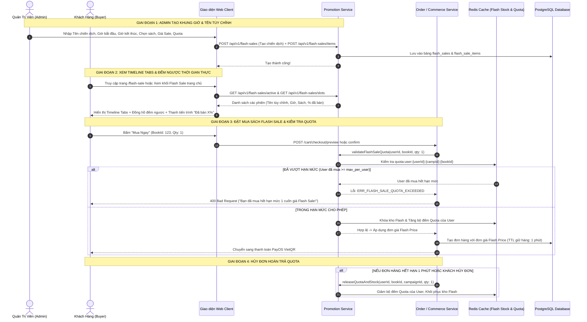

# TÀI LIỆU ĐẶC TẢ CHI TIẾT NGHIỆP VỤ - LUỒNG 7
## FLASH SALE ĐẾM NGƯỢC KHUNG GIỜ VÀNG & GIỚI HẠN HẠN MỨC MUA (FLASH SALE COUNTDOWN & PURCHASE QUOTA LIMITER)

---

## I. MỤC TIÊU & PHẠM VI NGHIỆP VỤ

* **Mục tiêu**: Xây dựng hệ thống khuyến mãi Flash Sale linh hoạt, hỗ trợ cả **các khung giờ vàng định kỳ** lẫn **các chiến dịch Flash Sale tùy chỉnh do Quản trị viên (Admin) tự đặt tên và tự chọn khung giờ** (Custom Campaign Names & Flexible Time-Slots). Tích hợp đồng hồ đếm ngược thời gian thực (Realtime Countdown), thanh tiến trình bán chạy ("Đã bán X%"), và cơ chế kiểm soát hạn mức mua trên mỗi khách hàng (Purchase Quota Limiter) nhằm ngăn chặn tình trạng đầu cơ, gom hàng bằng tài khoản ảo hoặc bot tự động.
* **Các bên tham gia (Actors)**:
  1. **Quản Trị Viên Sàn (Admin / Campaign Manager)**: 
     * Tự do tạo mới khung giờ Flash Sale với **Tên chiến dịch tùy biến** (VD: *"Flash Sale 9.9 - Đại Tiệc Tri Thức"*, *"Flash Sale Trưa Rực Rỡ 12H - 14H"*, *"Flash Sale Nửa Đêm Cú Đêm"*...).
     * Tự chọn **Thời điểm bắt đầu (`startsAt`)** và **Thời điểm kết thúc (`endsAt`)** linh hoạt.
     * Duyệt danh sách sách tham gia, phân bổ số lượng tồn kho khuyến mãi (`flash_stock`), cấu hình giá giảm sốc (`flash_price`) và hạn mức mua tối đa trên mỗi người dùng (`max_per_user`).
     * Quản lý bật/tắt hoặc xóa chiến dịch.
  2. **Người Bán (Seller)**: Đăng ký sách trong kho tham gia vào các phiên Flash Sale mở bán.
  3. **Khách Hàng / Độc Giả (Buyer / Reader)**: Săn sách giá sốc theo các mốc thời gian trên Timeline Tabs, theo dõi tiến độ bán chạy và số lượng còn lại.
  4. **Promotion, Inventory & Order Microservices**:
     * `promotion-service`: Quản lý chiến dịch, tính toán giá khuyến mãi, kiểm tra tính hợp lệ của khung giờ và bộ kiểm soát Quota Limiter.
     * `Redis Cluster`: Lưu trữ danh sách sản phẩm Flash Sale đang hoạt động, bộ đếm số lượng đã bán (`flash_sold_counter`) và bộ kiểm soát hạn mức người dùng (`quota:user:{userId}:{campId}:{bookId}`).
     * `order-service` / `commerce-service`: Áp dụng giá Flash Sale khi tạo đơn, kiểm tra hạn mức mua và hoàn trả quota khi đơn bị hủy hoặc quá hạn thanh toán.

---

## II. CÁC QUY TẮC & CƠ CHẾ CỐT LÕI CỦA FLASH SALE

```
                             HỆ THỐNG FLASH SALE KHUNG GIỜ VÀNG & TÙY CHỈNH
                                                  │
         ┌────────────────────────────────────────┼────────────────────────────────────────┐
         ▼                                        ▼                                        ▼
1. KHUNG GIỜ LINH HOẠT & TỰ ĐẶT TÊN      2. QUẢN LÝ TỒN KHO FLASH                 3. GIỚI HẠN MUA (QUOTA LIMITER)
 • Khung giờ mặc định & Custom Slots:     • Số lượng tách biệt:                    • Mỗi tài khoản chỉ được mua
   - Admin tự đặt tên chiến dịch            flash_stock <= available                 tối đa N cuốn (VD: 1 - 2 cuốn)
   - Tự chọn giờ bắt đầu & kết thúc       • Khi hết flash_stock:                   • Vượt hạn mức: báo lỗi hoặc
 • Tự động chuyển trạng thái:               tự động chuyển về giá gốc                tự động tính theo giá gốc
   - UPCOMING -> ACTIVE -> ENDED            hoặc hiển thị "ĐÃ BÁN HẾT 100%".         cho các cuốn vượt mức.
```

### 1. Quy tắc Thiết Lập Khung Giờ & Tên Chiến Dịch (Flexible Campaign Management)
* **Khung giờ mặc định**: 00:00 - 02:00 (Cú đêm), 09:00 - 12:00 (Sáng rực rỡ), 15:00 - 18:00 (Chiều hoàng kim), 20:00 - 23:59 (Tối săn sale).
* **Khung giờ tùy chỉnh (Custom Campaigns)**: Admin có thể tạo bất kỳ phiên đặc biệt nào trong ngày (VD: Phiên 13:00 - 15:00 "Flash Sale Độc Quyền", Phiên 19:00 - 21:00 "Giờ Vàng Sách Thiếu Nhi").
* Trên Storefront Timeline Tabs, toàn bộ các phiên được sắp xếp theo trình tự thời gian và tự động gắn nhãn: `Đã kết thúc`, `Đang diễn ra 🔥`, `Sắp mở bán`.

### 2. Quy tắc Phân Bổ Tồn Kho Flash Sale
* Số lượng sách phân bổ cho Flash Sale (`allocated_quantity`) được trích từ tồn kho khả dụng (`available_stock`) của Seller.
* Trong suốt thời gian diễn ra Flash Sale:
  * Số lượng bán với giá giảm sốc **không bao giờ vượt quá `allocated_quantity`**.
  * Khi `sold_quantity == allocated_quantity`: Thanh tiến trình đạt **100% (ĐÃ BÁN HẾT)**. Khách hàng tiếp theo sẽ mua với giá gốc thông thường nếu còn tồn kho.

### 3. Cơ chế Giới Hạn Hạn Mức Mua (Purchase Quota Limiter)
* **Mục đích**: Đảm bảo ưu đãi đến tay nhiều độc giả nhất, chống tình trạng 1 tài khoản mua hết toàn bộ kho sale để bán lại kiếm lời.
* **Quy tắc**: Mỗi khách hàng (dựa trên `user_id`) chỉ được phép mua tối đa $M$ cuốn sách trong suốt 1 phiên Flash Sale (mặc định $M = 1$ hoặc $M = 2$ cuốn/tựa sách).
* **Xử lý vi phạm**: Nếu người dùng cố tình thêm số lượng $> M$, hệ thống tự động:
  * Hoặc báo lỗi: *"Mỗi khách hàng chỉ được mua tối đa M cuốn với giá Flash Sale cho tựa sách này!"*.
  * Hoặc áp dụng giá Flash Sale cho $M$ cuốn đầu tiên, các cuốn vượt mức được tính theo giá bán lẻ thông thường.

---

## III. BẢNG TRƯỜNG DỮ LIỆU & SCHEMA FLASH SALE

### 1. Bảng Chiến Dịch Flash Sale `flash_sales`
| Tên Cột | Kiểu Dữ Liệu | Ràng Buộc | Mô Tả |
|---|---|---|---|
| `id` | UUID | Primary Key | Mã chiến dịch Flash Sale |
| `name` | String | Bắt buộc | Tên chiến dịch do Admin tự đặt (VD: *"Đại Tiệc Sách Trưa 12H"*) |
| `description` | String | Nullable | Mô tả chi tiết chiến dịch |
| `starts_at` | Timestamp | Bắt buộc | Thời điểm bắt đầu khung giờ do Admin chọn |
| `ends_at` | Timestamp | Bắt buộc | Thời điểm kết thúc khung giờ do Admin chọn |
| `status` | Enum | `SCHEDULED`, `ACTIVE`, `ENDED` | Trạng thái chiến dịch |
| `created_at` | Timestamp | Default NOW() | Thời gian tạo |
| `updated_at` | Timestamp | Default NOW() | Thời gian cập nhật |

### 2. Bảng Sản Phẩm Trong Flash Sale `flash_sale_items`
| Tên Cột | Kiểu Dữ Liệu | Ràng Buộc | Mô Tả |
|---|---|---|---|
| `id` | UUID | Primary Key | Mã bản ghi sản phẩm Flash Sale |
| `flash_sale_id` | UUID | FK `flash_sales` | Liên kết chiến dịch |
| `book_id` | UUID | FK `books` | Tựa sách tham gia |
| `original_price` | Float | Bắt buộc | Giá niêm yết ban đầu |
| `sale_price` | Float | Bắt buộc, $< original\_price$ | Giá bán giảm sốc trong Flash Sale |
| `stock` | Integer | Bắt buộc, $> 0$ | Số lượng sách phân bổ cho Flash Sale |
| `sold` | Integer | Mặc định: `0` | Số lượng đã bán thành công |
| `max_per_user` | Integer | Mặc định: `1` | Số lượng tối đa 1 người được mua giá Sale |
| `created_at` | Timestamp | Default NOW() | Thời gian thêm sản phẩm |

---

## IV. SƠ ĐỒ TRÌNH TỰ NGHIỆP VỤ FLASH SALE (SEQUENCE DIAGRAM)



---

## V. PHÂN RÃ CHI TIẾT TỪNG BƯỚC THỰC HIỆN

---

### BƯỚC 1: QUẢN TRỊ ADMIN - TẠO KHUNG GIỜ VÀ TÊN CHIẾN DỊCH TÙY CHỈNH

* **Bước 1.1: Quản trị viên khởi tạo chiến dịch Flash Sale**:
  * Tại trang `AdminMarketingPage.jsx` (Tab Flash Sale):
  * Admin bấm **"Tạo Khung Giờ Flash Sale Mới"**.
  * Nhập các thông tin:
    * **Tên chiến dịch**: Tùy biến (VD: *"Flash Sale Khai Giảng 9.9"*, *"Flash Sale Trưa 12H - 14H"*).
    * **Thời gian bắt đầu (`startsAt`)**: Chọn ngày & giờ cụ thể.
    * **Thời gian kết thúc (`endsAt`)**: Chọn ngày & giờ cụ thể.
    * **Mô tả & Banner tiếp thị**.
* **Bước 1.2: Thêm sản phẩm tham gia phiên**:
  * Chọn tựa sách trong hệ thống.
  * Nhập giá gốc (`originalPrice`), giá Flash Sale giảm sốc (`salePrice`).
  * Nhập số lượng phân bổ (`stock = 10` cuốn).
  * Nhập hạn mức mua trên mỗi khách hàng (`maxPerUser = 1` cuốn).
* **Bước 1.3: Quản lý danh sách phiên**:
  * Bảng điều khiển Admin hiển thị danh sách các phiên Flash Sale: Tên phiên, Khung giờ, Số lượng sách, Trạng thái (`SCHEDULED / ACTIVE / ENDED`), các nút Bật/Tắt trạng thái hoặc Xóa phiên.

---

### BƯỚC 2: TRẢI NGHIỆM TIMELINE TABS & ĐẾM NGƯỢC TRÊN STOREFRONT

* **Bước 2.1: Thanh điều hướng khung giờ động (Timeline Tabs)**:
  * Tại trang sự kiện `/flash-sale`:
  * Tự động hiển thị toàn bộ các phiên Flash Sale trong ngày (cả mặc định và custom):
    * Tab 1: `00:00 - 02:00: Flash Sale Đêm Khuya (Đã kết thúc)`.
    * Tab 2: `12:00 - 14:00: Flash Sale Trưa Rực Rỡ (Đang diễn ra 🔥)`.
    * Tab 3: `15:00 - 18:00: Flash Sale Chiều Vàng (Sắp mở bán)`.
  * Khách hàng có thể bấm chuyển giữa các Tab để xem trước sản phẩm sắp mở bán hoặc mua ngay sản phẩm đang sale.
* **Bước 2.2: Đồng hồ đếm ngược thời gian thực (Countdown Timer)**:
  * Hiển thị số lớn: `KẾT THÚC TRONG 01:24:35` (Giờ : Phút : Giây).
  * Tự động đếm lùi theo từng giây. Khi còn dưới 10 phút, đồng hồ chuyển sang màu đỏ nhấp nháy khẩn cấp.
* **Bước 2.3: Thanh tiến trình bán chạy (Progress Bar)**:
  * Công thức tính % đã bán:
    $$\% \text{ Đã bán} = \min\left(100, \text{round}\left(\frac{\text{sold}}{\text{stock}} \times 100\right)\right)$$
  * Hiển thị theo 3 cấp độ:
    * $\text{Đã bán} < 50\%$: Thanh cam *"Đã bán X cuốn"*.
    * $50\% \le \text{Đã bán} < 90\%$: Thanh đỏ rực kèm biểu tượng ngọn lửa 🔥 *"Đang bán rất chạy"*.
    * $\text{Đã bán} \ge 90\%$: Nhãn *"Sắp hết hàng - Còn lại Y cuốn"*.
    * $\text{Đã bán} = 100\%$: Thanh xám *"ĐÃ BÁN HẾT 100%"*.

---

### BƯỚC 3: KIỂM SOÁT HẠN MỨC MUA & ÁP DỤNG GIÁ FLASH SALE

* **Bước 3.1: Kiểm tra Hạn Mức Mua Của Người Dùng (Quota Limiter Check)**:
  * Khi User gửi yêu cầu mua sách:
  * Hệ thống kiểm tra: User đã mua bao nhiêu cuốn sách này trong phiên hiện tại.
  * Nếu tổng số lượng hiện tại $+ \text{requestedQty} > \text{maxPerUser}$:
    * Trả về thông báo lỗi: *"Mỗi khách hàng chỉ được mua tối đa 1 cuốn với giá Flash Sale cho tựa sách này!"*.
* **Bước 3.2: Áp dụng giá Flash Sale vào Đơn Hàng**:
  * Đơn vị tính giá áp dụng `salePrice` thay cho giá gốc.
  * Gắn cờ đơn hàng Flash Sale $\rightarrow$ Thời gian giữ hàng đếm ngược thanh toán của Luồng 6 được thiết lập **1 phút (60 giây)** để tối ưu quay vòng sản phẩm giờ vàng.
* **Bước 3.3: Tự động hoàn trả Quota khi Đơn Hàng Bị Hủy**:
  * Nếu đơn hàng Flash Sale bị hủy hoặc hết hạn thanh toán 1 phút $\rightarrow$ Hệ thống tự động giảm bộ đếm Quota của User và khôi phục lại kho Flash Sale.

---

### BƯỚC 4: KẾT THÚC KHUNG GIỜ VÀ TỰ ĐỘNG KHÔI PHỤC GIÁ GỐC

* Khi đồng hồ đếm ngược chạm mốc `00:00:00`:
  * Phiên Flash Sale tự động chuyển sang trạng thái `ENDED`.
  * Các tựa sách tự động quay về mức giá bán lẻ thông thường.
  * Timeline Tabs tự động chuyển tiêu điểm sang khung giờ Flash Sale kế tiếp.

---

## VI. MA TRẬN KIỂM THỬ FLASH SALE & QUOTA LIMITER (TEST CASES MATRIX)

| Mã Test Case | Kịch Bản Kiểm Thử | Điều Kiện & Dữ Liệu Đầu Vào | Kết Quả Kỳ Vọng (Expected Result) | Đánh Giá |
|:---:|---|---|---|:---:|
| **TC_FS_01** | Admin tạo phiên Flash Sale tùy chỉnh với Tên & Giờ tự đặt | Admin tạo phiên "Flash Sale 9.9 Siêu Rực Rỡ" từ 13h - 17h | Phiên được lưu thành công, xuất hiện trên Timeline Tabs của Storefront với đúng Tên & Giờ. | **PASS** |
| **TC_FS_02** | Hiển thị chính xác giá Flash Sale khi đang trong khung giờ | Sách giá gốc 249k, Flash Sale 79k. Truy cập đúng giờ diễn ra. | Hiển thị giá 79k (-68%), có huy hiệu Flash Sale, đồng hồ đếm ngược thời gian thực. | **PASS** |
| **TC_FS_03** | Mua trong hạn mức cho phép (`Quota = 1`) | Khách hàng A chưa mua, đặt mua 1 cuốn | Đặt hàng thành công với giá Flash Sale 79k. Quota của User A ghi nhận = 1. | **PASS** |
| **TC_FS_04** | **Chặn mua vượt hạn mức Quota (`Quota > 1`)** | Khách hàng A cố tình đặt thêm 1 cuốn nữa trong cùng phiên | Hệ thống chặn và báo lỗi: *"Bạn đã mua hết hạn mức 1 cuốn giá Flash Sale!"* | **PASS** |
| **TC_FS_05** | Tự động chuyển giá gốc khi hết số lượng Flash Sale | Phân bổ 5 cuốn, đã bán đủ 5 cuốn. Khách thứ 6 bấm mua. | Hiển thị thanh tiến trình "Đã bán hết 100%", giá tự động quay về giá gốc 249k. | **PASS** |
| **TC_FS_06** | Hủy đơn hoàn lại hạn mức Quota cho User | Khách hàng A hủy đơn Flash Sale chưa thanh toán | Hạn mức của User A được hoàn về 0, kho Flash Sale tăng lại +1. | **PASS** |
| **TC_FS_07** | Tự động kết thúc khi hết khung giờ | Hết giờ của phiên Flash Sale | Giá quay về giá gốc, đồng hồ chuyển sang thông báo phiên kế tiếp. | **PASS** |

---

## VII. ĐIỀU KIỆN NGHIỆM THU HOÀN TẤT (DEFINITION OF DONE)

1. ✅ Admin có thể tự do đặt tên và tự chọn khung giờ bắt đầu/kết thúc cho các phiên Flash Sale.
2. ✅ Cơ chế Giới hạn Hạn Mức Mua (Quota Limiter) hoạt động chính xác 100%, chặn gom hàng.
3. ✅ Phân bổ và quản lý tồn kho Flash Sale riêng biệt, tự động khôi phục giá gốc khi hết hàng hoặc hết giờ.
4. ✅ Giao diện Storefront hiển thị sinh động Timeline Tabs các khung giờ, đồng hồ đếm ngược số lớn và thanh tiến trình bán chạy.
5. ✅ Tích hợp quy trình Checkout áp dụng giá Flash Sale và tự động hoàn trả quota khi hủy đơn.
